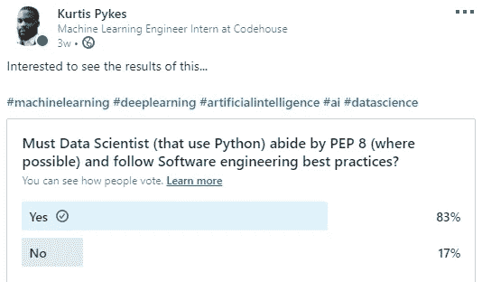
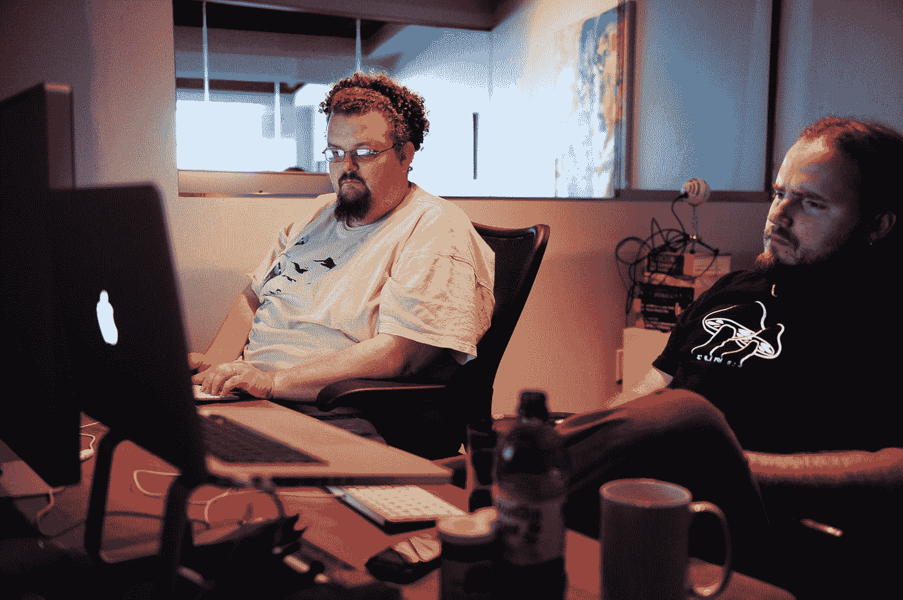

# 数据科学家应该知道软件工程的最佳实践

> 原文：<https://towardsdatascience.com/data-scientist-should-know-software-engineering-best-practices-f964ec44cada?source=collection_archive---------23----------------------->

## 意见

## 成为不可或缺的数据科学家

在 [Unsplash](https://unsplash.com?utm_source=medium&utm_medium=referral) 上拍摄的 [ThisisEngineering RAEng](https://unsplash.com/@thisisengineering?utm_source=medium&utm_medium=referral)

## 介绍

我一直在急切地研究、与朋友交谈并测试一些新的想法，这些想法将有助于使我成为一名更不可或缺的数据科学家——当然，如果不与帮助我取得进展的人分享，我就无法尝试在职业生涯中取得进展(如果你不知道，那就是你们！)

最近，我在我的 [LinkedIn](https://www.linkedin.com/posts/kurtispykes_machinelearning-deeplearning-artificialintelligence-activity-6701596141789831168-qFxe) 个人资料上进行了一项民意调查，我惊讶地发现，有这么多的人认为数据科学家必须了解编程标准并遵循工程最佳实践。

图 1:投票结果

统计学家经常对许多数据科学家(包括我自己)缺乏基本的统计知识感到失望。数学家认为，在应用之前，必须对各种情况下应用的原理有一个坚实的理解，我承认我没有。软件工程师希望数据科学家在遵循基本编程原则的同时进行他们的实验。

最刺痛我的是，每个“是”投票者目前都是数据科学家，他们中的许多人(在投票时)担任领导职务——包括 4x Kaggle 特级大师 Abhishek Thakur 这样的人。好吧，我承认，你想要的角色决定了需要对统计学和概率、线性代数、微积分等其他数学概念有多深的理解——虽然基础是绝对必要的——但是软件工程实践呢？

我曾经是数据科学家之一，认为我们仅仅是数据科学家，而不是软件工程师，因此我们的责任是从数据中提取有价值的见解，这仍然是一个事实，但是这次调查打破了我的思维模式，让我陷入了深刻的思考…

> 当职位名称是数据科学家时，为什么我必须知道软件工程的基础知识？

我记得自己的目标——成为一名不可或缺的数据科学家。我是不是在说，如果我不知道/不学习软件工程的基础，我就不是不可或缺的？ **嗯，嗯。基本上** —注意，这种说法是假设的，例如你是一名数据科学家，正在编写最有可能投入生产的代码。

在这一点上，我已经策划了一个软件工程的基本原则，应该适用于数据科学家的事情列表。由于没有软件工程背景，我咨询了许多软件工程师朋友来帮助我列出清单，并教我如何编写更好的产品代码。

以下是数据科学家应该知道的一些最佳实践:

## 干净的代码

[疾控中心](https://unsplash.com/@cdc?utm_source=medium&utm_medium=referral)在 [Unsplash](https://unsplash.com?utm_source=medium&utm_medium=referral) 拍摄的照片

> **注意**:我想首先向 **R** 用户道歉，因为我没有对 **R** 中的编码做太多研究，因此许多干净的代码技巧主要是 Python 用户提供的。

我学习的第一门编程语言是 Python，因为我英语说得很流利，对我来说 Python 和英语非常相似。从技术上来说，这指的是 Python 编程语言的高可读性，这是 Python 的设计者在认识到代码被读的次数比被写的次数多之后有意实现的。

> 当一个经验丰富的 Python 开发人员(Pythonista)称部分代码不是“Python 化的”时，他们通常意味着这些代码行没有遵循通用的准则，并且没有以被认为是最好的(听起来:最可读的)方式表达其意图。—[Python 的搭便车指南](https://docs.python-guide.org/writing/style/)

我将列出一些构成干净代码的因素，但我不打算说得太详细，因为我相信有许多很好的资源比我更好地涵盖了这些主题，例如 [PEP8](https://www.python.org/dev/peps/pep-0008/) 和[Python 中的干净代码](https://github.com/zedr/clean-code-python):

*   有意义和可发音的命名约定
*   清晰胜过一致
*   可搜索的名称
*   让你的代码易于阅读！

记住，不仅别人会阅读你的代码，你也会，如果你不记得什么意思，那么想象一下别人会有什么希望。

## 模块性

沃洛季米尔·赫里先科在 [Unsplash](https://unsplash.com?utm_source=medium&utm_medium=referral) 上拍摄的照片

这可以部分归咎于我们学习数据科学的方式。如果一个数据科学家不能旋转 Jupyter 笔记本并开始做一些探索，我会感到惊讶。但这就是 Jupyter 笔记本的全部用途，**实验！**不幸的是，许多关于学习数据科学的课程并没有很好地将我们从 Jupyter 笔记本转移到脚本，而脚本对于生产环境来说要有效得多。

当我们谈到模块化代码时，我们指的是被分成独立模块的代码。有效地执行，模块化允许包装，测试和可维护的代码，可重复使用。

在下面链接的视频中，Abhishek Thakur 为 Kaggle 比赛制造了一台[机器学习包](https://www.youtube.com/redirect?q=https%3A%2F%2Fgithub.com%2Fabhishekkrthakur%2Fmlframework&redir_token=QUFFLUhqbFA1V25FYy1fZ1V4ZVFZTm1sekltTE01dzBKd3xBQ3Jtc0tsR3VsZnotUHJkZWJFYjAwcU5pYmhGSU5PWG0wVHY3LTR6YUxHdC0zNHRLYjNmb1ZuYjY1MnpxcFhlTDdDcndhYmVOc2VuNlo1NWpCUUtjak80MnRtZG1ZcVhGcC1uYjFGdlpqTnkxVjVqenhNVlFEMA%3D%3D&v=ArygUBY0QXw&event=video_description)，这是我第一次接触模块化。过去，我也曾听 Abhishek 提到，他学习模块化和软件工程最佳实践的方法是通读 Github 上的 Scikit Learn 代码。

有助于编写好的模块化代码的其他一些东西是:

*   **D**on t**R**EPE at**Y**yourself(DRY)——不要重复你自己(DRY，或者有时不要重复你自己)是软件开发的一个原则，旨在减少软件模式的重复，用抽象代替它或者使用数据规范化来避免冗余。(来源:[维基百科](https://en.wikipedia.org/wiki/Don%27t_repeat_yourself))
*   单一责任原则(SRP)——单一责任原则(SRP)是一项计算机编程原则，它规定计算机程序中的每个模块、类或函数都应该对程序功能的一个部分负责，它应该封装这个部分。(来源:[维基百科](https://en.wikipedia.org/wiki/Single-responsibility_principle#:~:text=The%20single%2Dresponsibility%20principle%20(SRP,functionality%2C%20which%20it%20should%20encapsulate.))
*   开闭原则——在面向对象编程中，开闭原则陈述“软件实体(类、模块、函数等)”。)应该对扩展开放，但对修改关闭”；也就是说，这样的实体可以允许其行为被扩展，而无需修改其源代码。(来源:[维基百科](https://en.wikipedia.org/wiki/Open%E2%80%93closed_principle))

## 重构

代码重构可以被定义为在运行时不改变代码的外部行为的情况下，重构现有的**代码的过程。**

[基里安·塞勒](https://unsplash.com/@kilianfoto?utm_source=medium&utm_medium=referral)在 [Unsplash](https://unsplash.com?utm_source=medium&utm_medium=referral) 拍摄的照片

> 重构旨在改进软件的设计、结构和/或实现(其*非功能性*属性)，同时保留其功能性。— [维基百科](https://en.wikipedia.org/wiki/Code_refactoring#:~:text=Refactoring%20is%20intended%20to%20improve,)%2C%20while%20preserving%20its%20functionality.&text=By%20continuously%20improving%20the%20design,and%20easier%20to%20work%20with.)

重构我们的代码有许多优势，例如，提高我们代码的可读性和降低复杂性，这反过来导致我们的源代码更容易维护，并且我们配备了内部架构，提高了我们编写的代码的可扩展性。

此外，我们不能在不谈论提高性能的情况下谈论代码重构。我们的目标是编写一个执行速度更快、占用内存更少的程序，尤其是当我们有一个终端用户要执行某个任务时。

有关 Python 中重构的更多信息，请参见下面的链接！

 [## 为简单性重构 Python 应用程序——真正的 Python

### 你想要更简单的 Python 代码吗？你总是带着最好的意图、干净的代码库和漂亮的…

realpython.com](https://realpython.com/python-refactoring/) 

## 测试

照片由 [Antoine Dautry](https://unsplash.com/@antoine1003?utm_source=medium&utm_medium=referral) 在 [Unsplash](https://unsplash.com?utm_source=medium&utm_medium=referral) 上拍摄

> **注意**:在[部署机器学习模型](https://www.udemy.com/course/deployment-of-machine-learning-models/) udemy 课程中，我简要了解了测试(以及这篇文章中涉及的大多数其他想法)。

数据科学是一个有趣的领域，从某种意义上说，即使我们的代码中有错误，我们的代码仍然可以运行，而在软件相关的项目中，代码会抛出一个错误。因此，我们最终会得到误导性的见解(也可能没有工作)。因此，测试是必要，如果你知道如何做，你的价格就会上涨。

以下是我们进行测试的一些原因:

*   确保我们获得正确的输出
*   更容易更新代码
*   防止将损坏的代码投入生产

我相信还有更多原因，但现在我就说到这里。查看下面的链接，了解更多关于测试的信息。

 [## Python 测试入门——真正的 Python

### 在这篇深入的教程中，您将看到如何创建 Python 单元测试，执行它们，并在您…

realpython.com](https://realpython.com/python-testing/) 

## 代码审查

奥比·费尔南德斯在 [Unsplash](https://unsplash.com?utm_source=medium&utm_medium=referral) 上的照片

代码评审的目的是通过推广最佳编程实践来提高代码质量，从而使代码为生产做好准备。此外，这对每个人都有好处，因为它往往会对团队和公司文化产生积极影响。

代码审查的主要原因是捕捉错误，尽管审查对于提高可读性以及确保符合编码标准非常有用。

一篇更深入的真正伟大的文章链接如下…

 [## 代码评审最佳实践

### 互联网提供了大量关于代码评审的材料:关于代码评审对公司文化的影响，关于正式的…

medium.com](https://medium.com/palantir/code-review-best-practices-19e02780015f) 

## 包裹

公平地说，这肯定是一大堆要学的东西，但出于同样的原因，它增加了数据科学从业者的价值。能够快速制作一台 Jupyter 笔记本已经不足以让你成为一名数据科学家，因为每个人都可以做到这一点。如果你想高于平均水平，你必须做高于平均水平的事情，在这种情况下，可能需要学习软件工程的最佳实践。

让我们继续 LinkedIn 上的对话…

 [## Kurtis Pykes -人工智能作家-走向数据科学| LinkedIn

### 在世界上最大的职业社区 LinkedIn 上查看 Kurtis Pykes 的个人资料。Kurtis 有两个工作列在他们的…

www.linkedin.com](https://www.linkedin.com/in/kurtispykes/?originalSubdomain=uk)