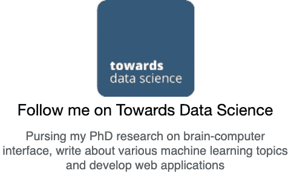

# 数据科学家:21 世纪最肮脏的工作

> 原文：<https://towardsdatascience.com/data-scientist-the-dirtiest-job-of-the-21st-century-7f0c8215e845?source=collection_archive---------4----------------------->

## 40%是吸尘器，40%是清洁工，20%是算命师

[Icons8 团队](https://unsplash.com/@icons8?utm_source=medium&utm_medium=referral)在 [Unsplash](https://unsplash.com?utm_source=medium&utm_medium=referral) 上的照片

根据[哈佛商业评论](https://hbr.org/2012/10/data-scientist-the-sexiest-job-of-the-21st-century/)，数据科学家拥有 21 世纪最性感的工作。在大数据的世界里，他们采用人工智能/深度学习方法，发现无价的商业见解。

对我来说，拥有“*数据科学家*的头衔已经五年了，我仍然没有完全弄清楚我的哪一部分是性感的。除了可能是我新烫的头发让我看起来像个韩国 Oppa ( *通常用来指韩剧男主角*)。

事实上，云的出现和企业向互联网的转移导致了数据的爆炸。这推动了一些行业对数据科学家的需求和短缺。

但是数据科学家的工作每天都需要做些什么呢？

我们可以通过分析 LinkedIn 上的招聘信息来找到这个问题的答案。我给你总结一下比较受欢迎的:

*   了解业务和客户，验证假设
*   建立预测模型和机器学习管道，执行 A/B 测试
*   对业务利益相关者进行概念化分析
*   开发算法以支持商业决策
*   试验和研究新技术和方法，以提高技术能力

这些听起来很性感，不是吗？

除非你的工作包括处理 Kaggle 数据集，否则这些工作描述只是数据科学家的一小部分。

CrowdFlower 的以下调查结果总结了数据科学家典型的一天:

数据科学家花最多时间做的事。【摘自[众筹](https://visit.figure-eight.com/rs/416-ZBE-142/images/CrowdFlower_DataScienceReport_2016.pdf)

从上面的图表中可以看出，数据科学家的大部分时间都花在了收集数据集、清理和组织数据上。

# 21 世纪的高性能数据真空

数据湖是存储公司所有数据的集中存储库。它们使组织能够使用这些数据来建立机器学习模型和仪表板。不幸的是，有些人认为数据湖是数据转储场，或者是一个超级大的硬盘驱动器。

许多组织在不清楚如何处理收集的数据的情况下开始实施数据湖。“让我们收集所有的东西吧，”他们说。虽然数据湖的目的是将公司的所有数据放在一个地方，但根据具体项目需求设计数据湖仍然是**至关重要的**。不做计划几乎就像创建一个新的“*无标题文件夹*，然后将公司的全部数据复制粘贴到那里。

当您将桌面视为数据转储地时

从历史上看，糟糕的规划导致很少甚至没有定义良好的元数据，这使得任何人都难以搜索(和找到)他们需要的数据。数据科学家经常发现自己为了数据联系不同的部门。他们可能需要从各种数据所有者那里寻找有关数据的信息。仅仅存储数据而不进行分类是一个很大的错误。拥有一个有用的数据湖的关键是确保元数据定义良好。

由于数据治理或数据所有者的繁忙，他们通常是来自不同部门的利益相关者，可能需要数周时间才能获得重要数据。等待游戏结束后，数据科学家可能会发现数据是不相关的，或者有严重的质量问题。

当数据科学家最终获得数据时，他们需要花费大量时间来探索和熟悉它。他们必须将杂乱的数据重新组织成新的表格，以符合他们的项目需求。

Oleksii Hlembotskyi 在 [Unsplash](https://unsplash.com?utm_source=medium&utm_medium=referral) 上拍摄的照片

# 21 世纪的高需求数据看门人

每个和数据打交道的人都应该听说过“*脏数据”*这个术语。**脏数据破坏了数据集的完整性**。脏数据的一些特征是**不完整**、**不准确**、**不一致**和**重复**数据。

**数据不全**是一些本质特征为空的时候。比如说你的任务是[预测房价](https://www.kaggle.com/c/house-prices-advanced-regression-techniques)。让我们假设房子的*区域对于做出一个好的预测是至关重要的，但是它不见了。这对你来说可能很有挑战性，你的模型可能表现不好。*

**不准确和不一致的数据**是指这些值在技术上是正确的，但在上下文中是错误的。例如，当一个雇员改变了他的地址，它没有更新。或者有许多数据副本，而数据科学家得到的是一个过时的版本。

照片由[杰米街](https://unsplash.com/@jamie452?utm_source=medium&utm_medium=referral)在 [Unsplash](https://unsplash.com?utm_source=medium&utm_medium=referral) 拍摄

**重复数据**是常见问题。给大家分享一个我在电商公司工作时发生在自己身上的故事。根据设计，当访问者点击“*领取优惠券*”按钮时，网站会向服务器发送响应。这使我们能够衡量收集优惠券的用户数量。

这个网站运行得很好，直到有一天发生了变化，而我对此一无所知。前端开发人员增加了另一个当有人成功收集凭证时的响应。理由是一些代金券可能缺货。他们想跟踪点击按钮的访问者和收集优惠券的人。

此时，两个响应被发送到同一个日志表。看着我的报告工具，收集的凭证数量似乎在一夜之间翻了一番！由于我在前一天已经部署了一个模型，所以我认为我的新模型就是那么令人印象深刻。我记得给了我的小模型一个精神上的起立鼓掌，但后来，我意识到这只是重复计算。

照片由[马太·亨利](https://unsplash.com/@matthewhenry?utm_source=medium&utm_medium=referral)在 [Unsplash](https://unsplash.com?utm_source=medium&utm_medium=referral) 上拍摄

此外，在过去五年作为一名数据科学家，我收到的一些数据是由公司员工手工输入的。这些数据在 Excel 电子表格中；许多是不准确、不完整和不一致的。

无论数据来自人工输入还是机器日志，**数据争论是现实世界中发生的很大一部分**。数据科学家必须处理它。为了让监督学习发挥作用，我们需要可靠的、有标签的数据。除非数据被正确标注，否则无法建立预测模型。但是没有人喜欢给数据贴标签。

许多人将此描述为 80/20 法则。数据科学家只花 20%的时间建立模型，其余 80%的时间收集、分析、清理和重组数据。脏数据是典型数据科学家工作中最耗时的方面。

需要指出的是**数据清理非常重要**；杂乱的数据不会产生好的结果。你可能听说过这样一句话，“垃圾进*，垃圾出*”。

数据科学家在数据中游泳时确实会有所发现，但在数据科学家开始训练任何模型之前，他们必须首先成为数据管理员。数据需要清理，数据需要标记。

奥利弗·黑尔在 [Unsplash](https://unsplash.com?utm_source=medium&utm_medium=referral) 上拍摄的照片

# 我是一名数据科学家…

我不觉得我的工作性感。我 40%是吸尘器，另外 40%是看门人。
还有最后的 20%……一个算命的。

 [## 7 个必不可少的人工智能 YouTube 频道

### 如何跟上最新最酷的机器学习进展

towardsdatascience.com](/7-essential-ai-youtube-channels-d545ab401c4)  [## 如何用机器学习改善假期行程

### 用这个超棒的策略完善你的旅行计划——省时、省力、省钱！

towardsdatascience.com](/how-to-improve-holiday-itinerary-with-machine-learning-6b3cd3c79d1) 