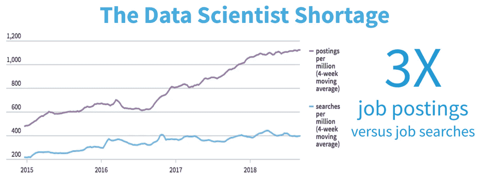
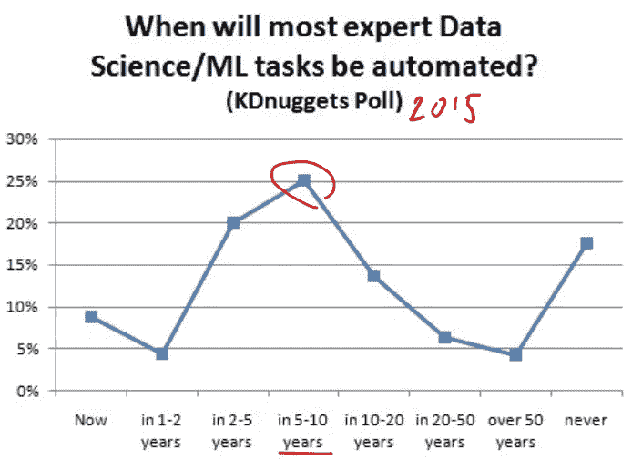
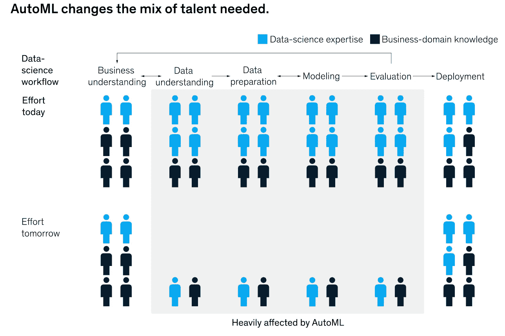

# 数据科学家:适应或死亡！

> 原文：<https://towardsdatascience.com/data-scientists-adapt-or-die-2f009ebe4935?source=collection_archive---------47----------------------->

## AutoML 会帮助我们还是杀死我们？

在 [Unsplash](https://unsplash.com?utm_source=medium&utm_medium=referral) 上由 [Steve Knutson](https://unsplash.com/@sknutson?utm_source=medium&utm_medium=referral) 拍摄的前数据科学家的照片

**哈佛商业评论**在他们 2012 年的著名文章[“数据科学家:最性感的工作”](https://hbr.org/2012/10/data-scientist-the-sexiest-job-of-the-21st-century)中标志着数据科学家的繁荣，随后是过去十年难以维持的需求。[3]

> "..需求超过了供给。事实上，数据科学家的短缺正在成为一些行业的严重制约因素。”

**麦肯锡公司&刚刚发表了一篇文章(2020 年 8 月),建议我们根据更新的自动化技术(AutoML)重新思考我们到底需要多少数据科学家。[4]**

> “从长远来看，仍然需要纯粹的技术数据科学家，但数量远低于大多数人目前的预测。”

这描述了我们已经走了多远[https://quanthub.com/data-scientist-shortage-2020/](https://quanthub.com/data-scientist-shortage-2020/)

在每一个繁荣周期中，你都会遇到人才短缺、冒名顶替者或资质较差的人涌入的情况(例如，dot.com y2k，如果你会拼写 Java，说明你是一名软件工程师)。随着领域的成熟，工具和自动化淘汰了那些不真正合格或者没有做高价值工作的人。数据科学也不例外。

# 肮脏的秘密

由 [Kristina Flour](https://unsplash.com/@tinaflour?utm_source=medium&utm_medium=referral) 在 [Unsplash](https://unsplash.com?utm_source=medium&utm_medium=referral) 上拍摄的照片

*不幸的是，数据科学秘密并不像名人性秘密那样令人兴奋。*在这份“性感”工作的背后，是数据科学 ***项目*** 所需的大量繁重工作——其中包括:

*   数据来源、验证和清理
*   尝试功能组合和工程功能
*   测试不同的模型和模型参数

大多数人认为，数据准备工作是任何 ML/DS 项目的 80 %[ 1 ],这导致了数据工程专业[2]。剩下的时间花在尝试特性和测试模型上，以挤出百分之几的准确度。这仅仅需要 ***大量时间——***虽然经验、直觉和运气允许科学家缩小场景范围，**有时**最佳解决方案需要尝试许多额外的非典型(几乎是随机的)场景。一种解决方案是自动化，并使用名为 AutoML 的新型工具来利用强力计算周期。

# AutoML——它像天网吗？

自动机器学习(AutoML)是一种软件，它以一种有组织的方式为你自动化重复的工作。(获取 H2O 或 DataRobot 的演示，亲自体验一下)。给它输入数据，设定目标，并在它反复研究特性、模型和参数时小睡一会儿。虽然它缺乏领域专业知识和精确性，但它用蛮力和高超的簿记/报告(当然还有一些逻辑和启发)弥补了这一点。

它何时以及是否会取代科学家是 5 年前在 KDNuggets 上进行的民意调查——最近的想法是，对我们中的一些人来说，时间很快。

[https://www . kdnugges . com/2020/03/poll-automl-replace-data-scientists-results . html](https://www.kdnuggets.com/2020/03/poll-automl-replace-data-scientists-results.html)

当然，不是每个人都同意。

> [*快速的雷切尔·托马斯。AI:*](https://www.fast.ai/2018/07/12/auto-ml-1/)***"**关于机器学习人才的**稀缺**以及声称其产品自动化机器学习并完全消除对人工智能专业知识的需求的公司**的承诺，媒体标题经常出现。[7]***

*托马斯博士似乎觉得 AutoML 是被误解的和相当数量的炒作。她提出了令人信服的观点来帮助我们理解整个 ML 循环，以及什么是 AutoML **什么不是**。它不会取代专家的工作，但它确实大大增加了他们的工作——还不是天网，但给它一些时间...*

# *那我的工作要被解雇了吗？*

*谷歌大脑的联合创始人吴恩达经常表示担心人工智能和人工智能导致的迫在眉睫的失业[5]——然而大多数分析都集中在运营和蓝领工作上。我们轻松的数据科学工作怎么办？[麦肯锡](https://www.mckinsey.com/business-functions/mckinsey-analytics/our-insights/rethinking-ai-talent-strategy-as-automated-machine-learning-comes-of-age?cid=other-eml-alt-mip-mck&hlkid=16e1ccda088c4061938cbb51f973d214&hctky=11853309&hdpid=9fee72b5-745e-4899-a6b0-fad315c62056)描述了等待我们的可能未来:*

**

*麦肯锡在线[反思人工智能人才](https://www.mckinsey.com/business-functions/mckinsey-analytics/our-insights/rethinking-ai-talent-strategy-as-automated-machine-learning-comes-of-age?cid=other-eml-alt-mip-mck&hlkid=16e1ccda088c4061938cbb51f973d214&hctky=11853309&hdpid=9fee72b5-745e-4899-a6b0-fad315c62056)*

*好的一面是，数据科学家没有被完全取代(图表显示 29%……)—但让我们关注麦肯锡的观点，重新思考所需科学家的数量和技能。当你把 AutoML 加入你的团队时，每个项目的科学家数量可能会下降(像 TARS、R2D2 或 HAL 这样的机器人)，但大多数研究仍然表明，对人类(科学家)的总需求至少在未来 5 年以上将继续增加。*

*大量在线文章[9]清楚地表明，数据科学家并没有死。但大多数人认为 AutoML 已经成熟，甚至在今天也在改变项目和人员的构成。我们都需要发展，作为一名数据科学家，你需要学会利用 AutoML 和相关的技术进步，否则就有落后的风险。*

*自动化是一件好事——我们可以专注于更高价值的工作，消除无聊和重复的任务(尽管无聊和重复的工作报酬很高……)。我认为我们知道这是有道理的，当他们可以支付一个更便宜的机器人时，为什么要支付我们呢？因此，下次你在做一个项目时，问问自己，我是在做专家数据科学家的工作，还是我的日子屈指可数了？*

> *“请真正的数据科学家站起来好吗？”*

*净外卖——DS/ML 的**未来是光明的**,但你需要拥抱变化，否则你将从数据科学家变成 ***死亡的*** 科学家。“反抗是徒劳的”——但在这种情况下，同化会有回报。*

# *参考和启示*

*[1] Ruiz，“80/20 数据科学困境”——https://www . infoworld . com/article/3228245/The-80-20-data-science-dilemma . html*

*[2] [安杰洛夫](https://towardsdatascience.com/@boyanangelov?source=post_page-----2402abd62866----------------------)，《数据工程师的崛起》——[https://towards Data science . com/the-Rise-of-the-Data-strategister-2402 Abd 62866？_ branch _ match _ id = 764068755630717009](/the-rise-of-the-data-strategist-2402abd62866?_branch_match_id=764068755630717009)*

*[3] HBR 最性感的工作文章——[https://HBR . org/2012/10/data-scientist——21 世纪最性感的工作](https://hbr.org/2012/10/data-scientist-the-sexiest-job-of-the-21st-century)*

*[4]麦肯锡关于人工智能人才的再思考—[https://www . McKinsey . com/business-functions/McKinsey-analytics/our-insights/re thinking-AI-Talent-strategy-as-automated-machine-learning-comes-age](https://www.mckinsey.com/business-functions/mckinsey-analytics/our-insights/rethinking-ai-talent-strategy-as-automated-machine-learning-comes-of-age?cid=other-eml-alt-mip-mck&hlkid=16e1ccda088c4061938cbb51f973d214&hctky=11853309&hdpid=9fee72b5-745e-4899-a6b0-fad315c62056)*

*[5]https://www.youtube.com/watch?v=aU4RQD-莱克吴恩达对乔布斯和艾的看法*

*[6]回顾 2015 年 AutoML 上的民意调查—[https://www . kdnugges . com/2020/03/Poll-AutoML-replace-data-scientists-results . html](https://www.kdnuggets.com/2020/03/poll-automl-replace-data-scientists-results.html)*

*[7] FastAI 的 Rachel Thomas 谈到了 AutoML 的宣传，ML 科学家做了什么以及 AutoML 能做什么—[https://www.fast.ai/2018/07/12/auto-ml-1/](https://www.fast.ai/2018/07/12/auto-ml-1/)*

*[8]对科幻人工智能/机器人的各种引用——星际争霸中的 TARS，2001 年的 HAL，星际迷航中的 Borg 同化，当然还有终结者的天网。*

*[9]关于汽车与人类的各种文章 [KDNuggets](https://www.kdnuggets.com/2019/03/why-automl-wont-replace-data-scientists.html) 、 [Wired](https://www.wired.com/story/googles-ai-experts-try-automate-themselves/) 和 [Medium](/automl-faceoff-2-machines-vs-15-humans-bfc9d03e590f) 。*