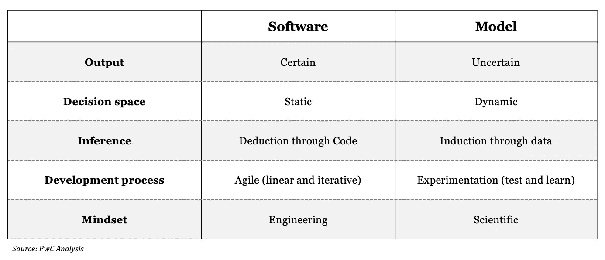
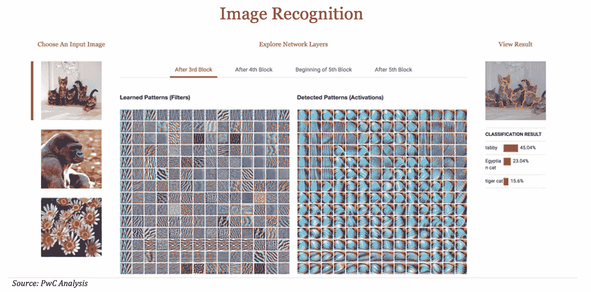
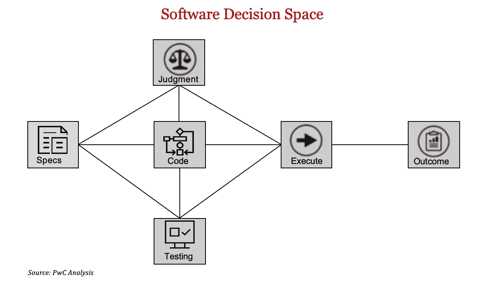
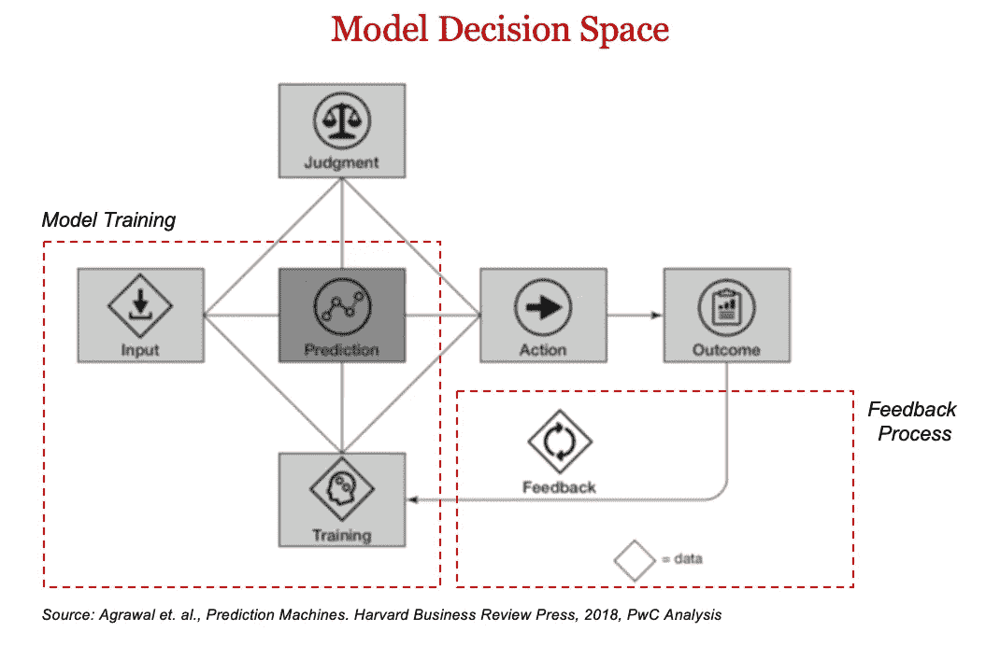
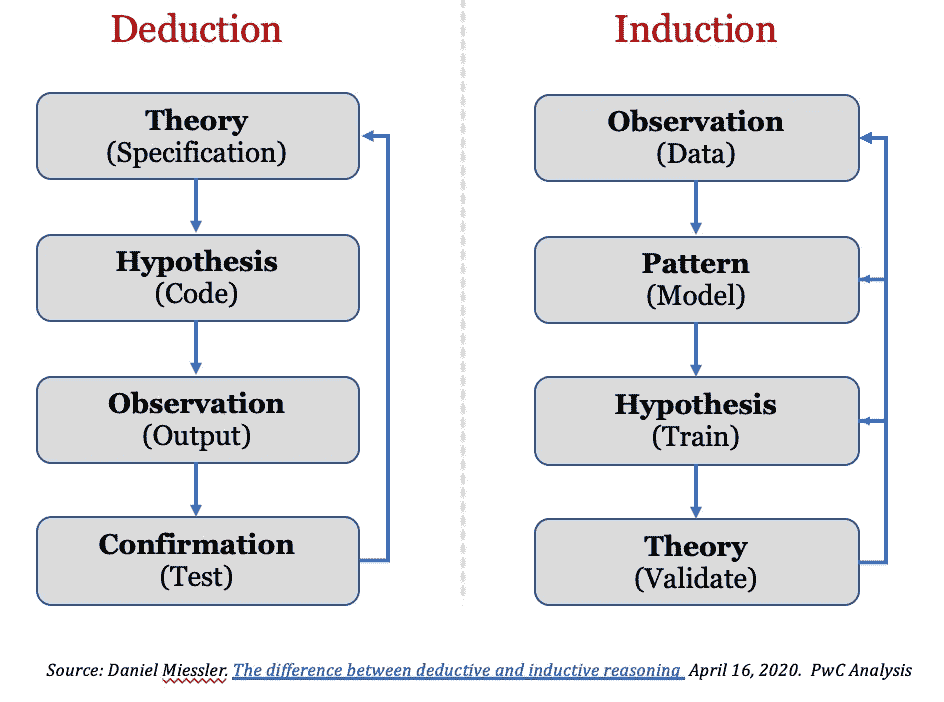

# 数据科学家来自火星，软件开发人员来自金星(上)

> 原文：<https://towardsdatascience.com/data-scientists-are-from-mars-and-software-developers-are-from-venus-part-1-8dde19fb2eef?source=collection_archive---------24----------------------->

## [数据科学家来自火星，软件开发人员来自金星(上)](https://towardsdatascience.com/tagged/model)

## 软件与模型

图 1:数据科学家来自火星，软件开发人员来自金星

火星和金星是非常不同的行星。火星的大气层非常稀薄，会变得非常冷；而金星的大气层非常厚，会变得非常热——热到足以熔化铅！。然而它们是离我们最近的姐妹行星。他们也有许多相似之处。两者的大气中都有高浓度的二氧化碳，并且暴露在没有保护磁场的太阳辐射下。

软件工程师和数据科学家来自两个不同的世界——一个来自金星，另一个来自火星。他们有不同的背景和思维方式，处理不同的问题。他们也有许多共同之处。在这篇和随后的博客中，我们将着眼于它们之间的主要区别(和相似之处)以及为什么这些区别存在，以及我们需要在它们之间建立什么样的桥梁。在这篇博客中，我们探索了软件和模型之间的根本区别。

# 软件与模型

在传统的程序设计中，人们为计算机提供逐行指令(通常称为算法)来处理输入数据，以产生与给定软件规范相匹配的期望输出。逐行指令可以是许多计算机语言中的一种，例如 Lisp、Prolog、C++、Java、Python、Julia 等。

在数据科学中，提供输入数据，并且在某些情况下(例如，受监督的机器学习)提供输出数据的样本，以构建能够识别输入数据中的模式的模型。与传统编程不同，数据科学模型通过提供输入数据(或输入和输出数据)来进行*训练*，以识别模式或做出推断。经过充分的训练、验证和测试后，他们对新数据进行*预测*或*推理。*

模型是一种正式的数学表示，可以应用或校准以适应数据。Scott Page 提供了许多模型的例子，以及如何用它们来做决策。模型可以是机器学习模型、系统动态模型、基于代理的模型、离散事件模型或许多其他不同类型的数学表示。在本文中，我们将主要关注机器学习(ML)模型。

图 2:软件和模型定义

软件和模型在五个关键方面有所不同。这些尺寸如图 3 所示。

图 3:软件和模型之间差异的五个关键维度

## 输出

软件的输出是*确定的*。例如，考虑一种用于对数字数组进行排序的算法(例如，bubblesort)。bubblesort 算法将一个数字数组作为输入，通过一系列步骤迭代产生一个按升序或降序排序的输出数组。对于任何给定的数组，bubblesort 算法都会产生一个排序后的数组作为输出。其输出不存在不确定性。如果程序已经被正确测试，算法*将总是*产生结果，并且结果将是 100%准确的。

相比之下，以一个已经在大量图像上训练过的深度学习模型为例，它能够识别不同品种的猫。当模型被提供作为猫图像的输入时，它使用该模型来预测猫的品种。然而，它可能不总是提供 100%准确的答案——事实上，准确性往往低于 100%。图 3 说明了深度学习模型的输入、深度学习网络层和输出。该模型预测图像包含一只虎斑猫，准确率为 45%，可能是一只埃及猫，准确率为 23%。换句话说，来自模型的预测通常是*不确定的。*这种预测的不确定性对于企业来说是一个难以把握的概念。我们将在随后的博客中回到这个维度对模型开发的影响。

图 3:深度学习图像识别模型

## 决策空间

软件和模型之间的第二个区别是决策空间。我们所说的*决策空间*是指软件或模型用于决策的环境。当我们构建软件时，我们通常有一个被编码为算法的规范或用户需求。软件经过测试，完全测试后即可使用。软件被执行以产生结果。这个决策空间是固定的或者是静态的。如果用户的需求改变，算法必须被修改或重建和测试。没有算法学习或修改自身的承诺。图 4 展示了软件如何被使用的背景(改编自关于[预测机器](https://www.amazon.com/dp/B075GXJPFS/ref=dp-kindle-redirect?_encoding=UTF8&btkr=1)的书中的模型使用方式)

图 4:软件决策空间

说到模型，决策空间更加动态。考虑一个基于机器学习的聊天机器人，它已经被训练为提供与智能手机相关的查询的初级支持。当模型被训练时，它将被训练有关于不同智能手机的品牌、型号、配件的历史数据。一旦部署，聊天机器人将能够在市场上的所有智能手机上回答客户的查询。让我们假设，当聊天机器人无法回答超过一定准确度的查询时，它会将查询发送给人工客户服务代理。这种聊天机器人在几个月内可以正常工作，但当市场上推出新的型号和配件时，聊天机器人将无法响应客户的查询，并将越来越多的呼叫逐步转移到人工代理，最终使聊天机器人变得无用。

模型依赖于历史数据，当历史数据不再相关时，需要用更新的数据来刷新它们。这使得模型运行的环境更加动态。虽然用户需求或软件规格也可能发生变化，但它们发生的频率较低。此外，当规范改变时，也不期望软件能继续运行。在模型的情况下，有一个明确的预期，即当模型的性能恶化时，至少我们会得到这种恶化的警告(通常称为模型漂移)，或者最好的结果和新数据被用于持续改进模型(我们将在后续的博客中回到这个持续改进的问题)。图 5 展示了如何使用模型的背景。注意从结果到训练的反馈循环(红色虚线是从[预测机器](https://www.amazon.com/dp/B075GXJPFS/ref=dp-kindle-redirect?_encoding=UTF8&btkr=1)的原始图表中添加的，以示强调)。正是这种反馈过程使得模型的决策空间更加动态。

图 5:模型决策空间

## 推理

传统软件通常使用演绎推理机制，而机器学习模型基于归纳推理。如图 6 所示，软件规范作为开发代码的理论。代码可以被看作是假设，需要用基于观察的理论来证实。观察只是代码产生的输出，需要根据规范重复测试。

模型是从观察数据中得出的模式。初始模型的作用类似于假设，需要迭代地改进以确保模型与观察数据最匹配。经过验证的训练模型捕获了数据背后的理论。需要足够小心以确保模型不会[过度拟合或](https://medium.com/analytics-vidhya/over-fitting-and-under-fitting-explained-b73313eec6f3)欠拟合数据。

由软件完成的从理论到观察的转变可以说比由模型完成的从观察到理论的转变更容易。这也突出了围绕第一个维度中讨论的输出的确定性/不确定性的挑战。

图 6:软件和模型中的推理

## 显色法

软件开发的过程也从根本上不同于典型的模型开发方式。软件开发通常遵循[瀑布](https://www.tutorialspoint.com/sdlc/sdlc_waterfall_model.htm)方法或者[敏捷](https://www.agilealliance.org/agile101/)方法。瀑布方法经历了从规范到设计到编码到测试和部署的一系列步骤。在敏捷方法的情况下，软件开发过程是迭代的，并且通常包含一套以用户需求和自组织、跨职能团队为中心的原则。软件开发通常需要一到四周的冲刺。每一个连续的 sprint 编码附加的功能，导致发布给用户的最小可行产品。

模型开发过程*需要*遵循稍微不同的方法。数据的可用性、质量和标签，以及估计所需精度或更一般的算法性能的难度，意味着模型开发需要采用组合方法。数据科学家需要开发大量模型，这些模型的子集可能符合性能标准。因此，模型开发过程需要遵循更科学的实验、测试过程，并从这些实验中学习，以完善下一组实验。这种假设-测试-学习的过程并不适合敏捷软件开发生命周期。在随后的博客中，我们将重新审视模型开发过程，以及它如何与敏捷方法集成。

## 心态

到目前为止，我们提到的四个维度清楚地将构建软件的人和构建模型的人的思维模式分开。软件开发人员通常有一种*工程*思维模式——他们致力于架构蓝图、不同组件之间的连接，并且通常负责生产软件。软件工程师通常具有计算机科学、信息技术或计算机工程背景或教育背景。他们开发创建数据的软件产品。

另一方面，模型开发人员有更多的*科学*思维——他们从事实验，更擅长处理模糊性，通常对创新而不是生产模型感兴趣。一个*数据科学家*是一个用编程来分析数据和开发数学模型来增强他们的数学和统计学背景的人。他们使用数据来获得洞察力并影响结果。

在随后的博客中，我们将看到这些差异在软件和模型如何在组织中开发的含义。我们还将详细研究模型开发过程，它们如何与敏捷软件开发相集成，以及像 ModelOps 和 MLEngineers 这样的新角色的出现。

**作者:** [阿南德·s·拉奥](https://www.linkedin.com/in/anandsrao/)和[约瑟夫·沃利斯](https://www.linkedin.com/in/joseph-voyles/)