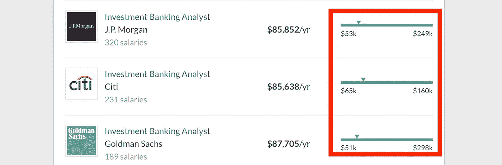
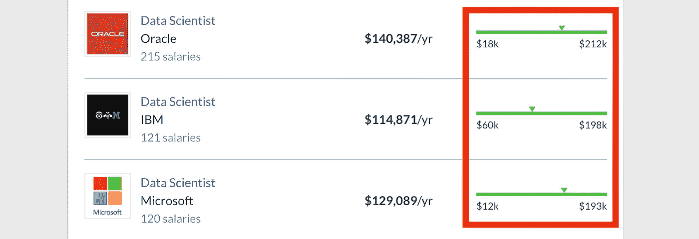

# 数据科学家是新的投资银行家

> 原文：<https://towardsdatascience.com/data-scientists-are-the-new-investment-bankers-149e80d86ba2?source=collection_archive---------5----------------------->

## 意见

## 21 世纪初，我在一所顶级商学院上学时，我所有的同学都想成为投资银行家

来自 [Pexels](https://www.pexels.com/photo/women-s-white-button-up-long-sleeved-shirt-1037914/?utm_content=attributionCopyText&utm_medium=referral&utm_source=pexels) 的[驼鹿照片](https://www.pexels.com/@moose-photos-170195?utm_content=attributionCopyText&utm_medium=referral&utm_source=pexels)

*这是一篇观点文章。我很想在下面的评论中听到你的想法。*

在本世纪初就读于一所顶级商学院时，我们都想成为投资银行家。

快进 10 年，每个人都想成为数据科学家。

他们的共同点比你想象的要多。

# 数据科学家和投资银行家都是多面手

数据科学是编码、统计和商业的结合。我们通过建立数据模型来解决问题，然后将结果呈现给决策者。

投资银行家产生“投资”想法，用金融模型支持它们，并向客户推销。

在前一种情况下，数据几乎总是专有的。工具包括 python 和用于分析、可视化和 ML 的相关包。后者大量使用付费数据源，如彭博、路透社和 Capital IQ。工具包括用于自动化的 excel、SAS 和宏。

两者都提取、清理、建模和分析数据，然后呈现结果。

虽然 IB 不太技术性，但我会提出数据科学的未来也不太技术性的观点。

投资银行包括各种各样的活动，如交易、并购和融资。

# 没有编码背景的商科毕业生正在转向数据科学

商学院毕业生经常向我寻求进入数据科学领域的建议。我也遇到了一些前银行家，他们现在在初创公司担任分析职位。

在某些时候，数据变得很酷，银行削减了员工数量，出现了一些金融科技初创公司。商学院随后跟进分析流。

2008 年金融危机之前，“数据科学”还不是一个词，商科毕业生都想去华尔街工作。[非理性繁荣](https://en.wikipedia.org/wiki/Irrational_exuberance)制作了如下荒谬的视频，我们会在金融课上观看。

但是时代变了。现在正是数据科学如此受欢迎。

# 数据科学正在成为一种商业角色

数据科学是一个总括术语，用于许多涉及数据的角色。

但如果你从中减去其他离散的工作，如人工智能研究，ML 工程，数据工程和软件工程，剩下的看起来更像是商业/分析角色。

概念化的问题，解释数据，可视化的结果，并向非技术利益相关者展示。在某种程度上，这就是投资银行家的工作。

随着数据科学的成熟和分析基础设施通过 SaaS 开箱即用，我们将看到这一趋势加速发展。对技术感兴趣的人可能会选择软件工程，而 MBA 类型的人会填补数据科学的空白。

# 两者都是外表光鲜，但内心却是痛苦的

数据科学被宣布为 21 世纪最性感的工作。但有趣的是，这项工作的很大一部分变成了数据争论。

1987 年原版《T2》中的戈登·壁虎说服了整整一代金融毕业生进入银行业。但现实并不像“戈登壁虎”那样，更多的是在周末建造滑梯甲板，更新金融模型直到午夜。

# 你可以在这两方面都赚很多钱

句号。

以下是一些公司对 IB 分析师的薪酬。右边的“高”数字意义重大。考虑到“分析师”是投资银行图腾柱上的最低级别，这一点更令人印象深刻。

[玻璃门](https://www.glassdoor.ca/Salaries/index.htm):美国投资银行分析师工资

数据科学也是如此。

[玻璃门](https://www.glassdoor.ca/Salaries/index.htm):美国数据科学家的薪水

数据科学暂时就业多，竞争少。但我很想知道，整整一代人都想进入这个领域，这对他们的薪资会产生什么影响。

# 如果你不进入管理层，这两种工作都没有前途

脸书员工的平均年龄是 29 岁。

超过 30 岁就不能成为[投行分析师。](https://www.mergersandinquisitions.com/age-investment-banking/)

一个有家庭的人不会整夜熬夜调整一个新的模型或纠正沥青书上的错别字。但是一个没有爱好的 25 岁的人往往会。我跑题了，但我的一位前银行业同事曾“吹嘘”说，在华尔街工作时，他在桌子底下放了一个睡袋。

这两种职业都是“数字处理器”。虽然深领域的专业知识很重要，但有效性在某些时候会停滞不前。

要在这些环境中取得长期成功，需要进入管理角色，管理人员和项目，聪明地工作和授权，以及做更多的销售。

我将此与软件开发进行对比。虽然它也遭受年龄歧视，但大公司通常有个人贡献者轨道，这些轨道逐渐成为非经理人员的架构师角色。

# 科技公司是新的银行

在 Apple Pay 和脸书的 Libra 之间，科技公司正在变成银行，拥有金融基础设施。

此外，考虑到北美是落后的曲线。腾讯旗下的微信支付被中国 [80%的中小商户](https://www.chinainternetwatch.com/30201/wechat-stats-2019/)使用。

在我们的社会中，任何拥有我们共同的财务和浏览历史的公司都在决策桌上拥有一个事实上的席位。那是很大的力量...这让我想起了银行。

# 结论

与其说这是一次严肃的学习，不如说是一次思考练习。

尽管如此，在金融和人工智能的交叉领域工作了几年后，我看到越来越多的前银行家和准银行家进入科技领域并取得成功。

随着银行部门自动化的升温，以及“技术”角色变得不那么“技术”，我认为我们会看到更多的金融专业人士进入 PM 和数据科学角色。

每个人都想做数据科学。