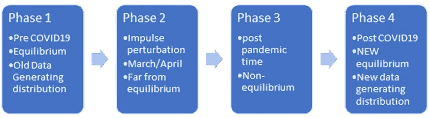

# 数据科学家们，当心新世界！

> 原文：<https://towardsdatascience.com/data-scientists-beware-of-the-new-world-9752df4c5b6e?source=collection_archive---------70----------------------->

## 意见

## 基于微扰理论解决 COVID19 时代分析问题的框架。

埃德温·胡珀在 [Unsplash](https://unsplash.com?utm_source=medium&utm_medium=referral) 上的照片

数据科学是一项令人谦卑的工作，因为大多数时候，数小时的创造性和深思熟虑的建模在现实面前会导致令人失望的结果，因为现实并不关心我们的模型。

我预计，在接下来的几个月和几年里，我们在进行分析练习和建模时应该更加小心。

特别是，我们如何处理数据生成分布函数的扰动？

## COVID 之前/之后思考世界的框架 19

COVID19 前后世界的四个阶段

为了理解这种扰动的影响，您可以将时间轴分为四个阶段:

*   **第一阶段:**均衡 A，前 COVID19 时代，用 2017 年的数据训练你的模型几乎和用 2018 年的数据训练一样好。
*   **Phase2:** 冲击波、COVID19 和隔离时代，此时所有的赌注都结束了。这是一片混乱，每天都在改变指导方针，医疗保健系统被一种新的疾病所淹没，许多零售和餐馆停业，交通减少，等等。
*   **第 3 阶段:**后冲击波时代，第二波颠覆来自于尝试开放业务和管理 COVID19 对业务的影响，这些业务正在努力应对新的规范和新的消费者行为。例如，在医疗保健领域，所有被推迟的程序(诊断)都将导致医疗保健需求的高峰。这个系统仍然不稳定，远远没有达到平衡。想一想实验室和放射程序的更长等待时间及其对消费者的影响。医疗系统将试图自我修复，管理不堪重负和超负荷工作的医生和护士的能力。

> (均衡 B！=均衡 A)，*欢迎使用新的数据生成分布函数，其中可能你的 2018 年(或 2020 年)数据与你的 2021 年建模不相关。*

*   **第四阶段:**均衡 B(均衡 B！=均衡 A)，我们很可能不会回到之前的均衡。我们过去的一些数据点对于预测未来可能不太相关。
    此外，由于失业率高于正常水平，远程医疗和在家工作的采用率更高，人们很可能会对过敏症状和更多不必要的急诊室就诊反应过度，流感疫苗注射激增(或如果你观看阴谋论视频，则下降)，等等，你的实验都将停止。
    *欢迎使用新的数据生成分布函数，也许你 2018 年(或 2020 年)的数据与你 2021 年的建模并不相关。*

## 小心谨慎，但当生活给你一个柠檬时，把握住这个机会

[韩摄拉汉多](https://unsplash.com/@blcksdz?utm_source=medium&utm_medium=referral)在 [Unsplash](https://unsplash.com?utm_source=medium&utm_medium=referral)

虽然这些干扰会给你的建模/分析带来麻烦，但是你也应该保持警惕。世界已经发生了变化，没有人真正知道这意味着我们正处于新机遇和商业模式的沃土上。

也就是说，在你未来的分析工作中要更加谨慎:

*   如果建立一个新的模型，确保你正确地处理第二和第三阶段(如何处理？).这也适用于所有未来的机会发现/规模确定。
*   随着失业率的急剧变化和全球经济衰退的可能性，了解 2007 年至 2010 年利用率趋势的变化可能是有益的。也许这将部分地给我们一些指导，告诉我们应该期待什么，以及我们应该应用什么样的发型和修正因子。
*   如果您正在运行需要暂停的 AB 测试。这是/曾经是进行 **A/A 测试**的绝佳时机！你有一个测试和支持小组，但他们都没有收到任何信息。运行您的测试/活动分析，看看您是否看到任何重大差异！如果你做了，那就有问题了！可能你一直都有！对于使用全局支持的实验来说尤其如此。现在调试你的实验。你再也没有机会了！
*   问问你自己，对于你正在处理的机会类型，你预计 COVID19 中断后需求会激增吗？如果是，你能做些什么来利用这个机会和波动性吗？

COVID19 对您的日常工作有何影响？你认为你的世界发生了怎样的变化？