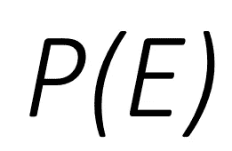
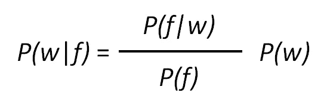
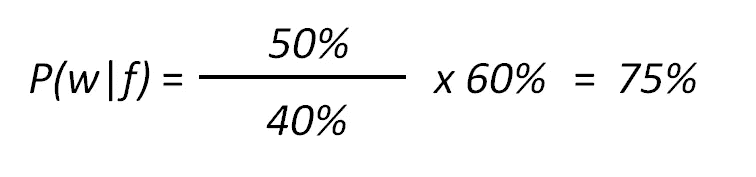
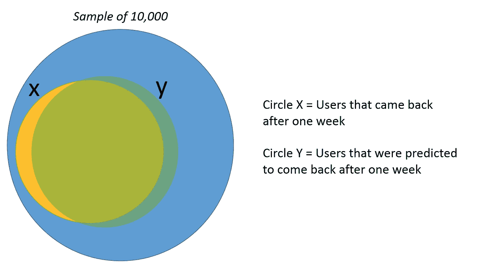

# 数据科学家必须知道概率

> 原文：<https://towardsdatascience.com/data-scientists-must-know-probability-7722cdd49d21?source=collection_archive---------15----------------------->

## 应用条件概率和贝叶斯定理的真实例子

简·根格在 [Unsplash](https://unsplash.com?utm_source=medium&utm_medium=referral) 上的照片

我是一家顶级科技公司的产品数据科学家，从事手机浏览器应用程序的开发，我面临许多关于我们产品的模糊问题，我必须用数据来回答它们。通常会有很多不同的答案，因为数据代表我们的用户，而不是所有的用户都一样。因此，答案并不总是直截了当的。概率帮助我衡量我对我的答案或我的机器学习模型有多自信。概率是许多机器学习模型和评估技术的核心，所以为了成为一名优秀的数据科学家，你必须知道概率是如何工作的。在本文中，我想帮助读者了解一个如何应用条件概率和贝叶斯定理公式的真实例子。

> 概率帮助我衡量我对自己的答案有多自信。

我相信贝叶斯定理是概率中最常用的术语和概念之一。如果你想学习概率的基础知识，我推荐你去看看我在文章底部提到的资源。

# **我们开始吧**

在直接进入我们的例子之前，为了定义一个特定“事件”的概率，我们写下如下内容:

下面是一个最常用的例子:

*   如果你掷一枚公平硬币，得到正面的概率会写成 *P(h) = 50%，*得到反面的概率会写成 *P(t) = 50%。*
*   *h* 代表正面的结果，而 *t* 代表反面的结果。

在本文中，我将使用我作为数据科学家在工作中遇到的一个问题中的一个例子。

问“如果一个用户在手机浏览器中收藏了一个网站，那么这个用户下周回来的可能性有多大？”

在该示例中，您有:

1.  用户喜欢某个网站的概率: ***P(f)***
2.  下周回来的概率:****P(w)****
3.  *给定用户喜爱的站点，用户下周再次访问的概率: ***P(w|f)****
4.  *假设一个用户在一个星期后再次访问某个网站，那么该用户喜欢该网站的概率: ***P(f|w)****

*让我们给这些变量分配一些随机概率%。*

*   ****【P(f)】****= 40%**
*   ****【P(w)】****= 60%**
*   ****P(f | w)=****50%**

**注:本例中的数字是虚构的。**

*如果有两个事件，您需要确保事件是**独立的**或**相关的。**在上面的例子中，这两个事件很可能是相关的，因为如果一个用户在他们的浏览器上喜欢一个站点 *P(f ),下周回来的概率很可能会受到**影响**。*这个**效果**可以是负面的，也可以是正面的。*

# *条件概率*

*我之前提到的例子也涉及到了条件概率。假设用户喜欢一个网站，一周后回来的概率， *P(w|f)。**

*如果这两个事件是独立的， *P(w|f)* 的定义将是:*

*   **P(w|f) = P(w) = 50%* 因为用户一周内回来的概率并不取决于用户对某个网站的偏好。*

*然而，正如我所说的，这两个事件很可能是相互依赖的。因此，更有意义的定义是:*

**

*条件概率的贝叶斯定理*

*   **P(w|f) =* 后验概率*
*   **P(w) =* 先验概率*
*   *P(f|w)/P(f) =似然比*

*使用我之前提供的%,你可以把它们代入公式，得到一个用户在一周后再次访问某个网站的概率。*

**

*如果用户喜欢一个网站，他们似乎更有可能回来。可能性(50%/40% = 125%)是这里的关键，这将有助于你理解条件是否会增加概率。*

# *模型预测和概率*

*好吧，现在我知道了。我将创建一个模型，根据用户第一周的行为来预测用户是否会回来。我测试了我的模型，它有 85%的准确率，这意味着它将在 85%的时间里产生正确的预测(这有时被称为回忆)。在我的测试结果中，我有一个 10，000 名用户的样本，我知道其中 6，000 名用户在一周后又回来了。如果我的模型预测一个用户会在一周内回来，那么这个用户一周后真正回来的概率是多少？*

*花点时间思考这个问题…*

*如果你认为答案是 85%，我不怪你。这似乎是最直观的答案。但是，我想用一个视觉来帮助你理解为什么这个答案不确切*

**

*从视觉效果来看，即使用户实际上不会回来，也有可能预测他们会回来(这可能就是您所说的“误报”)。考虑到误报，计算将如下所示。*

*6000 * 85%的用户确实会回来= 5100*

*+*

*4，000 * 15%的用户实际上不会回来= 600*

*=*

*5,700*

*所以，一个预测一周后回来的用户，一周后实际回来的概率是 89.5%(5100/5700 = 89.47%)。答案与我们之前的直觉很接近，但并不是所有用例都是这样。当人口不平衡时，准确性不是一个好的评估标准。幸运的是，在我们的例子中，在 10，000 名用户的样本中，回来的用户与不回来的用户的比例相当平衡，为 60/40。*

*我希望我能帮助你教学，并向你展示更多关于概率的重要性。我建议所有有抱负的数据科学家走出去，了解更多信息*

# *如果您有任何问题或反馈，请随时在下面留下您的问题或反馈，或者在 LinkedIn 上联系我。*

*中:[https://medium.com/@testandlearn](https://medium.com/@testandlearn)*

*领英:【https://www.linkedin.com/in/kennyk1m/ *

# *资源:*

* [## 基本概率

### 随机性无处不在。概率论是允许我们分析偶然事件的数学框架…

seeing-theory.brown.edu](https://seeing-theory.brown.edu/basic-probability/index.html)  [## 2.1.3 -概率规则|统计 200

### 今天就在宾夕法尼亚州立大学世界校区注册，获得统计学认证学位或证书。

online.stat.psu.edu](https://online.stat.psu.edu/stat200/lesson/2/2.1/2.1.3)*