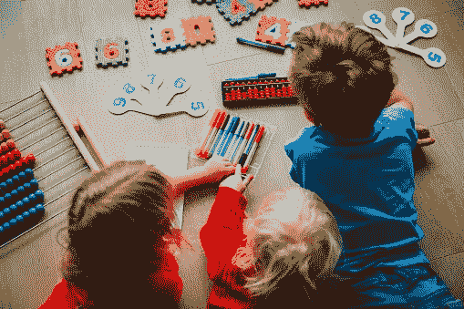

# 数据科学家应该在游戏中学习

> 原文：<https://towardsdatascience.com/data-scientists-should-learn-through-play-649412faaa12?source=collection_archive---------61----------------------->

## 我第一次听说通过玩耍学习是在我送孩子去幼儿园的时候，但现在我意识到这是所有数据科学家应该学习的方式

如果说现在有一件事真的让我恼火，那就是当人们看着我正在做的东西问我，通常是用“比你更神圣”的语气:你的用例是什么？你想解决的问题是什么？作为一名训练有素的麦肯锡顾问，没有人比我更清楚必须预先定义你的问题，为你正在做的工作列出用例的原则。

但是如果你正在学习数据科学，我认为你应该把那个原则扔出窗外，采取一个新的原则:*通过玩耍学习*。这种哲学的基础是这样一种想法，如果你的目标是学习新的技术技能，你应该在头脑中想出没有特定最终目标的项目，除了你想做这件事，并且你认为你可能会从参与活动中获得一些刺激。在这篇文章中，我将论证通过游戏学习的原则同样适用于数据科学家和学龄前儿童。我们将看看行为心理学家对通过玩耍学习的看法，我希望你能和我一起得出这样的结论:如果你尝试其他方式，你将会错过在其他地方找不到的重要学习。

## 寓教于乐的原则

对所有学龄前儿童来说，这个世界是新的，他们需要在幼年时了解它。大多数行为心理学家和教育家都认为最有效的方法是通过玩耍。正是通过玩耍，孩子们利用一个安全的环境来探索和测试他们成长过程中需要的技能——他们的社交和认知技能，他们的情感成熟和自信。

这本书*爱因斯坦从未使用过抽认卡*列出了游戏区别于工作的五个特征:

1.  参与者需要享受它
2.  没有目标或规定的学习
3.  这是自发的，参与者自愿参与
4.  参与者主动参与，而不是被动参与
5.  有“假装”或“假装”的成分

重要的是，工作和娱乐之间有两个关键的区别。首先是谁发起的。游戏大多由参与者发起，而不是由领导者、协调者或权威人物发起。游戏是完全面向过程的，没有明确的预先目标。

在工作之外，我经常参加个人学习项目，以继续发展我的技术数据科学技能，并跟上最新技术。这方面的一个例子是，我最近完成了一个个人项目，在这个项目中，我从电视连续剧*朋友* 中创建了一个人物网络，这样我就可以分析和可视化这个网络。

直到我现在把它写下来，我才如此明确地意识到这一点，但我所有的个人学习项目都遵循在玩耍中学习的原则。以我的*朋友*项目为例:

1.  我知道我会喜欢这样做
2.  我心里没有具体的最终产品。我知道会有一个最终产品，我也知道我会在做的过程中学习新的技能，但我还没有预先定义那些会是什么。换句话说，这是过程驱动的，而不是目标驱动的。
3.  我凭空想到了它，并自发地着手解决它
4.  我主动追求到了一个自己满意的自然终点。
5.  这不是一个真实的工作环境，所以有一个“假装”的因素，消除了我在取得进步的喜悦之外的任何风险或个人压力。

## 数据科学家为什么要通过玩来学习？

就像学龄前儿童的世界一样，数据科学家的世界是巨大的，有时令人不知所措。我从哪里开始？接下来我该做什么？我怎么知道我能做到？什么可能会出错？但是你玩得越多，这些问题就越少，你就越有信心迎接任何挑战。

不要误会我的意思，我并不是反对数据科学中的正规教育和学习目标，这些仍然是绝对必要的，尤其是对于刚进入该领域的人来说。但我认为，伟大的数据科学家只有通过游戏学习才能成为伟大的数据科学家。以下是三个原因:

1.  正规教育只能涵盖当今数据科学中存在的所有工具、方法和可能性的不到 1%。在某些时候，当你发现你需要的技能时，你只能靠自己。这种发现是通过玩耍实现的。
2.  知识和能力只有在找到用途的情况下，才能有效地获得并保留在人们的头脑中。鉴于我们的工作和职业本质上是狭窄的，履行日常职责所需的知识和技能通常是有限的。因此，如果我们想学习新的不同的技能，我们需要其他渠道，其他项目。玩项目。
3.  当我们玩数据的时候，从定义上来说，我们是在享受。这为学习和保留知识创造了一个更好的环境，而不是简单地做我们被告知要做的事情。我们更有可能知道事情什么时候可行，什么时候不可行，这意味着当未来风险更高时，我们可以更好地应用它们。

## 你通过玩耍学习吗？

我毫不怀疑我是通过玩耍来学习的。在我最近的记忆中，我在工作中使用或应用的所有新事物都是我通过有趣的个人项目接触到的东西。如果我没有参与这些项目，我可能永远也不会知道我在工作中使用的方法。

但是你呢？这里有一些问题可以问你自己，以确定你是否在玩耍中有效地学习:

1.  我在工作之外接项目是为了个人享受吗？
2.  我是带着探索精神和个人兴趣接受他们的吗？
3.  我是否在思考如何着手这些项目并取得进展(而不仅仅是盲目复制别人已经做的东西)？

几年来，在玩耍中学习一直是我的口头禅，尽管我现在才开始把它表达出来。我确信这应该是所有数据科学家的口头禅。

*最初我是一名纯粹的数学家，后来我成为了一名心理计量学家和数据科学家。我热衷于将所有这些学科的严谨性应用到复杂的人的问题上。我也是一个编码极客和日本 RPG 的超级粉丝。在* [*LinkedIn*](https://www.linkedin.com/in/keith-mcnulty/) *或*[*Twitter*](https://twitter.com/dr_keithmcnulty)*上找我。也可以看看我在*[*drkeithmcnulty.com*](http://drkeithmcnulty.com/)*上的博客。*

iStock 照片