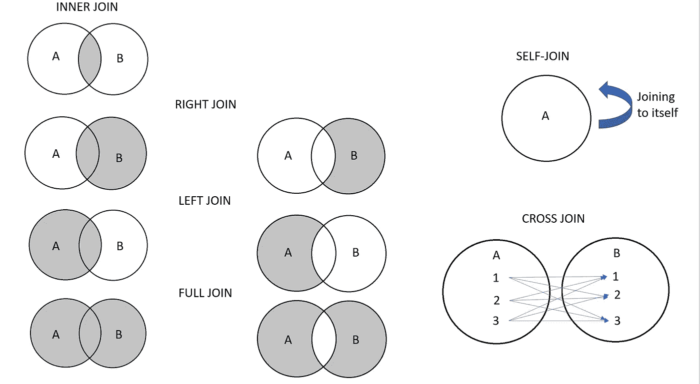

# 数据科学家— SQL 技术访谈

> 原文：<https://towardsdatascience.com/data-scientists-sql-technical-interviews-1fae6b6fea1e?source=collection_archive---------21----------------------->

## 数据科学家需要了解多少 SQL？SQL 知识清单。


米尔科·布利克在 [Unsplash](https://unsplash.com?utm_source=medium&utm_medium=referral) 上拍摄的照片

如果你想成为一名数据科学家，你必须了解 SQL。SQL 和数据密不可分，因此今天所有的数据科学家面试都将通过使用 SQL 的技术面试。当然也有例外，他们可能会给你 R 或者 Python 的选择。然而，我可以保证，与任何其他语言相比，采访将更普遍地涉及 SQL。

> SQL 是数据的基础语言。

# 下面是我将在本文中介绍的内容:

*   **学习资源**
*   **SQL 清单**

# 学习资源

为了掌握 SQL，我推荐两个资源:

1.  安东尼·莫里纳罗的 SQL 食谱。我在学习 SQL 的时候就有这本书，即使我对 SQL 很流利，我也把它带到工作中。拿到这本书，准备做饭。我想有些人可能认为这对于一些数据科学家来说是有点太多的 SQL，但是说实话，数据科学家生活在 SQL 的世界里。如果您能更好地使用 SQL，您将在任何数据科学项目的前端节省大量时间。
2.  [**模式— SQL 教程**](https://mode.com/sql-tutorial/introduction-to-sql/) **。**这可能是最好的免费资源之一，在这里你可以实践你在他们的查询编辑器中学到的东西。

*注意:我不是这些资源的赞助商。我有预算意识，所以这就是我选择上面两个资源的原因。以上将花费你 30 美元来开始。*

当你开始学习时，不要太担心你正在学习的语法。不是每个公司都使用相同的工具来处理数据，所以我的建议是你学习基本概念，面试官通常会让你通过。例如，在微软，我使用 SQL 的三种内部变体，它们在语法上都不同…

# SQL 清单


格伦·卡斯滕斯-彼得斯在 [Unsplash](https://unsplash.com?utm_source=medium&utm_medium=referral) 上拍摄的照片

在这一部分，我想介绍大多数数据科学家面试官希望你提供的 SQL 清单。我不会介绍 SQL 提供的所有内容，而是会介绍最重要的主题，并尝试为您指出我没有介绍的主题的正确资源。

*注意:我将在这里使用 SQL Server 语法，因为它最接近我使用的语法。*

## 1.让我们来看看 SQL 结构

1.  这是 SQL 的一般“结构”。你应该知道所有这些是如何工作的。

```
SELECT [columns]
FROM [table]
WHERE [filter]
GROUP BY [group by columns]
HAVING [filter condition 
ORDER BY [select columns/aggregate to order by (ASC OR DESC)]
```

## **2。获取顶部行进行快速检查**

当您浏览任何表时，您应该总是检查前 N 行，以便理解表的模式。您可以使用**顶部**来完成此操作。

```
SELECT TOP N
FROM
```

为了进行快速检查并节省处理时间，您希望只提取几行，以便获得关于模式的足够信息，从而指定您的 SQL 代码。

## **3。滤镜！滤镜！滤镜！**

```
WHERE
```

在检索您指定的列之前， **WHERE** 子句将确保过滤掉您需要的所有列。请确保在执行 SQL 查询之前这样做，因为处理大数据需要大量的计算能力。通常，这种计算能力需要花钱，并且由数据团队共享，所以您需要注意 SQL 代码中的 WHERE 子句，以确保您没有检索任何不必要的数据行。

继续在这里练习。您应该关注以下部分，以便真正理解如何利用 WHERE 子句。

*   SQL WHERE
*   SQL 比较运算符
*   SQL 逻辑运算符
*   SQL LIKE
*   SQL 输入
*   SQL BETWEEN
*   SQL 为空
*   SQL 和/或
*   SQL NOT

重要提示:WHERE 子句不接受聚合、标量子查询、窗口函数和别名[1]

## **4。处理空值…并在 SELECT 语句中添加逻辑**

数据没有你想的那么干净。它通常很脏，在获得您想要的数据之前，您需要清理它。最常见的挑战之一是处理空列。在应用任何 SQL 函数之前，您必须首先了解如何处理它们以及它们会如何影响您的查询。查看此 [**链接**](https://www.essentialsql.com/get-ready-to-learn-sql-server-what-is-a-null-value/) 了解更多信息。

在查询 NULL 值时，它们有许多细微差别(也因您使用的工具而异)，所以很多时候，您会尝试用更有信息性/更有帮助的值来替换它们。 **COALESCE** 是 SQL 用来处理空值的一个很棒的函数。如果您注意到列中可能有许多 null 值，并且希望在它为 NULL 时提供另一个值，那么可以使用 COALESCE 函数。

```
SELECT coalesce(<column A>, <if column A is null THEN "">)
FROM-- Example: Grab <date> column from the <DateDim> table and if it's null, give me "01/01/2020"SELECT coalesce(date, "1/1/2020")
FROM DateDim
```

**CASE WHEN THEN ELSE(可选)结束。**

如果您想在 SQL 中使用逻辑语句，CASE 语句可能是大多数数据库查询语言语法将使用的语句。学习如何使用它们，并在这里练习使用它们。这可能是 SQL 中最常用的函数之一。Mode.com 很好地解释了这一点，并为你提供了练习的选择:[https://mode.com/sql-tutorial/sql-case/](https://mode.com/sql-tutorial/sql-case/)

## **5。聚集物**

计数、求和、最小/最大值和 AVG 可能是最常用的聚合函数。练习使用它们，并理解它们是如何工作的。我将再次向您推荐 Mode.com，但这里有一些需要注意的有用提示:

1.  在大多数 SQL 语言中，当您对未聚合的列使用聚合时，这就是您必须使用 Group By 子句的地方。
2.  当您使用聚合时，您可以利用 HAVING 子句。
3.  聚合经常忽略空值！

## **6。日期**

如果您正在处理大数据，您将拥有带有时间戳的数据，这些时间戳表示数据何时被接收到数据库中，或者包含您正在处理的数据行的一些日期数据。就我个人而言，我经常和日期打交道，它们会让人很困惑。

尝试确定这些概念:

1.SQL 中的日期格式

*   这里有一个理解日期数据类型的好资源: [Link](https://docs.microsoft.com/en-us/sql/t-sql/functions/date-and-time-data-types-and-functions-transact-sql?view=sql-server-ver1) 。没有必要记住它，除非您可能知道日期格式是“YYYY-MM-DD ”,还有其他数据类型。

2.如何加减不同组的日期？

```
DATEADD (datepart , number , date ) -- Example: Return all the data from the past weekSELECT *
FROM MyTable
WHERE <DateColumn> >= DATEADD(day, -7, getdate())
```

3.获取当前时间。(其他可用选项)

```
SELECT GETDATE()
```

## 7.SQL 中的数据类型

很多时候，您正在使用的数据类型并不适合您，因此您必须学会如何改变它们。如果你没有处理过数据，这可能并不重要，但这是一个非常重要的概念。

关于数据类型，您可能需要了解以下三点:

*   了解存在哪种数据类型。[链接](https://www.w3schools.com/sql/sql_datatypes.asp)
*   使用 CAST 和 CONVERT 更改数据类型
*   理解数据类型可以隐式地改变(这里有更多的)

```
-- CAST Syntax:   
CAST ( expression AS data_type [ ( length ) ] ) 

-- CONVERT Syntax:   
CONVERT ( data_type [ ( length ) ] , expression [ , style ] )
```

## 8.连接和**联合**

连接和联合在数据科学领域至关重要，因为您经常要处理多个数据集。通过连接，您可以将两组数据放在一起以创建有用的见解，但这通常可能是查询可能出错的最常见的地方之一。

要理解 JOIN 的工作原理，请阅读并练习如何使用 JOIN[**这里的**](https://mode.com/sql-tutorial/sql-joins/) 。

要理解联合是如何工作的，请在这里阅读并练习如何使用联合[](https://mode.com/sql-tutorial/sql-union/)**。**

**以下是关于联接和联合需要了解的一些主要概念:**

*   **没有在连接中确定正确的键会导致笛卡尔积**
*   **请确保在加入之前将数据集缩减到您需要的大小！连接的处理量很大，尤其是在处理数百万行数据时。**
*   **外部联接可以帮助您获得与联接键不匹配的数据。**
*   **JOIN 和 UNION 的区别。这里有一篇[很棒的文章](https://www.sqlservertutorial.net/sql-server-basics/sql-server-union/)是我在比较两者时发现的。**

**因为我是一个视觉化的人，我决定创建一个可视化来帮助你理解连接。**

****

## **9.窗口函数(也称为分析函数)**

**窗口函数可能是一种更高级和更有效的 SQL 功能。它可以使非常复杂的任务变得更加容易解决。一个常见的错误是认为窗口函数实际上会将行组合成一行，因此理解 SQL 中的组和窗口之间的区别将真正帮助您使用窗口函数。窗口函数的关键字是 OVER()，语法可能会有所不同，这取决于您想要进行的计算类型。了解这个函数的用途可以节省您大量的时间。**

**我在网上找到的两个最好的资源:**

1.  **[模式](https://mode.com/sql-tutorial/sql-window-functions/)**
2.  **[PostgreSQL](https://www.postgresql.org/docs/9.1/tutorial-window.html)**

# **摘要**

**综上所述，学习 SQL 最好的方法就是实践。有许多细节你可能仅仅通过阅读就忘记了，所以我的建议是使用我推荐的资源，花时间键入和浏览它们提供的问题，以便学习 SQL 的小复杂性。如果您有任何问题，或者如果您觉得我错过了成为数据科学家的基本 SQL 知识的任何主要组成部分，请联系我。**

# **附录**

**[1]Anthony Alinaro 的 SQL 食谱**

# **如果您有任何问题或反馈，请随时在下面留下您的问题或反馈，或者在 LinkedIn 上联系我。**

**中:[https://medium.com/@testandlearn](https://medium.com/@testandlearn)**

**领英:【https://www.linkedin.com/in/kennyk1m/ **