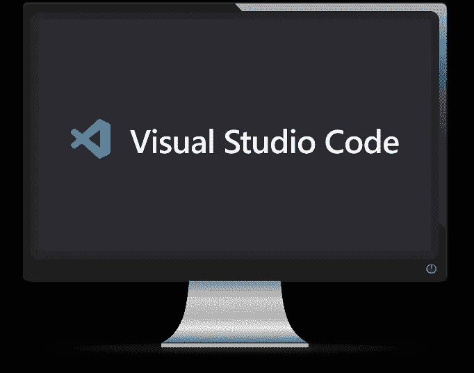
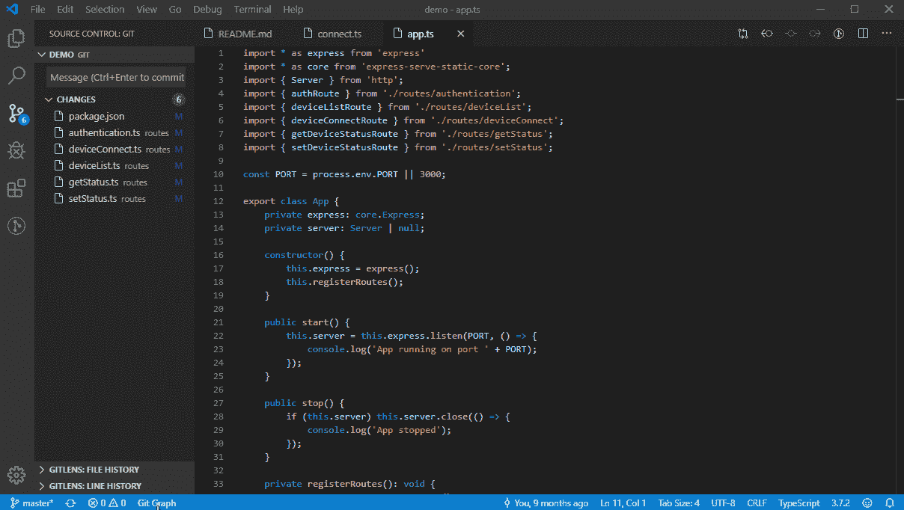

# 数据科学项目中的必备工具

> 原文：<https://towardsdatascience.com/data-scientists-starter-pack-32ef08f7829c?source=collection_archive---------30----------------------->


约书亚·阿拉贡在 [Unsplash](https://unsplash.com/s/photos/laptop-code?utm_source=unsplash&utm_medium=referral&utm_content=creditCopyText) 上的照片

## 数据科学家入门包—第 1 部分(VSCode，Bash，Virtual Env。单元测试)

在从事数据科学项目时，可能需要从理论到`technical`的许多技能。
在这篇文章中，我将主要关注一些最`important tools`可拥有和使用的工具，以及`collaboration`的`cleaner coding`和`faster`方式。

# 目录

摘要如下:

1.  **Visual Studio 代码**
2.  **Bash 命令**
3.  **虚拟环境**
4.  **单元测试**

# 1.Visual Studio 代码



作者图片

数据科学家的日常工作主要是编码。因此，拥有一个能够封装许多其他工具的优秀编辑器是非常重要的。VS 代码就是这么做的！它是微软开发的工具，被认为是使用最多的编辑器之一。它允许运行、编辑和调试您的代码以及许多其他有用的扩展，例如:

*   [**Python**](https://marketplace.visualstudio.com/items?itemName=ms-python.python) :“一个丰富支持 Python 语言的 Visual Studio 代码扩展，包括智能感知、林挺、调试、代码导航、代码格式化、Jupyter 笔记本支持、重构、变量资源管理器、测试资源管理器、代码片段等功能！”


[https://code.visualstudio.com](https://code.visualstudio.com)

*   [**Git lens**](https://marketplace.visualstudio.com/items?itemName=eamodio.gitlens):“Git lens 增强了 Visual Studio 代码中内置的 Git 功能。它可以帮助您通过 Git 责备注释和代码透镜快速查看代码作者，无缝导航和探索 Git 库，通过强大的比较命令获得有价值的见解，等等。”


[https://code.visualstudio.com](https://code.visualstudio.com)

*   [**git 图形**](https://marketplace.visualstudio.com/items?itemName=mhutchie.git-graph) **:** 允许可视化您的 Git 分支的图形，并使用同一个图形执行 Git 动作！



[https://code.visualstudio.com](https://code.visualstudio.com)

*   [**【vs Code-icons**](https://marketplace.visualstudio.com/items?itemName=vscode-icons-team.vscode-icons)】:为您的 Visual Studio 代码添加图标，以实现更好的表示和可视化


[https://code.visualstudio.com](https://code.visualstudio.com)

*   [**Docker**](https://marketplace.visualstudio.com/items?itemName=ms-azuretools.vscode-docker):“Docker 扩展使得从 Visual Studio 代码构建、管理和部署容器化的应用程序变得容易。它还提供了 Node.js、Python 和。容器内的 NET Core。”如果你对 docker 不熟悉，不用担心这部分。


[https://code.visualstudio.com](https://code.visualstudio.com)

*   **黑色**:默认安装的 python 格式库(如果不使用 pip 的话)，允许在保存时自动格式化你的代码。为此，可以在 VS 代码的“setting.json”文件中添加以下几行

```
"python.formatting.provider": "black",
"editor.formatOnSave": true
```

以下是 Black 的代码格式示例:


*   [更好的注释](https://marketplace.visualstudio.com/items?itemName=aaron-bond.better-comments):在写代码的时候，你通常会添加注释来详述你的脚本并解释它们。这个扩展帮助你使它更友好，更容易理解。例如，你可以使用符号“！”使评论变红，从而更好地吸引你的注意力。
    下面是一个由扩展生成的高光的例子:


更多信息，请访问 VS code 官方[网站](https://code.visualstudio.com)。

# 2.Bash 命令


作者图片

Bash 命令对于快速导航到您的操作系统非常有用，对于处理文件也非常有效。当在没有图形界面的虚拟机上工作时，例如在云中的环境中，它们也会暴露出来。

当使用 bash 命令时，拥有一个能够可视化封装许多元素的好终端是很重要的。下面是我推荐的两款游戏机:

*   Mac: [Iterm 2](https://www.iterm2.com) ，提供了一个非常漂亮的可视终端，在上面你可以找到关于当前工作目录 git、它的分支(project dev)和它的状态(黄色:等待提交)以及你正在工作的虚拟环境(project_env)的信息。


作者图片

*   Windows: [Cmder](https://cmder.net) ，是一个更加增强的终端，它还允许运行 linux 命令，这在某些情况下非常有用。


cmder.net

也不要犹豫检查 [Powerlevel10K](https://github.com/romkatv/powerlevel10k) ，这是一个在您的终端上拥有的很酷的功能，它可以实现更好的风格和更有效、更灵活的工作方式。

下面是最常用的命令行的简要列表(在 macOS 上):


安装完终端后，可以在 VS 代码中使用它，这将使您的工作更加高效。

# 3.虚拟环境


作者图片

在处理一个项目时，您经常希望它可以在其他机器和云中重现。由于所使用的包的版本一直在变化，所以设置一个私有或者`virtual`环境是很重要的，在这个环境中你可以开发你的项目并且保存包的版本。`virtualenv`是一个 python 库，它允许您执行上面讨论的隔离和版本控制，如下所示(您也可以使用 anaconda):


作者图片

当第一次在笔记本电脑上安装 python 时，它的默认环境称为“基础”或“全局”。值得一提的是，创建的虚拟环境不与 base 通信，这意味着它们最初是空的！

## 创建并激活虚拟环境

```
#PIP
cd dossier project
pip install virtualenv # if not done before
virtualenv <env>
source <env>/bin/activate

#Anaconda
cd dossier project
conda create -n <env>
conda activate <env>
```

一旦你的项目稳定下来，在需要的时候逐步安装软件包`pip install <packageName>` / `conda install <packageName>`:

```
#PIP
pip freeze > packages.txt/

#Anaconda
conda env export > packages.yml
```

如果您使用“packages.txt”或“environment.yml”文件克隆项目以便运行它，您可以:

*   首先创建并激活一个新的虚拟环境
*   运行以下命令，从给定文件安装所有必需的软件包:

```
#PIP
pip install -r packages.txt/

#Anaconda
conda env create -f environment.yml #No need to create an env before
```

## VS 代码和虚拟环境

创建虚拟环境时，选择它作为解释器很重要。VS 代码能够检测到它并建议使用它，否则您可以如下选择它:

*   在设置中，点击`Command Palette`
*   类型:`Python: Select Interpreter`
*   从列表中选择它:


[https://code.visualstudio.com](https://code.visualstudio.com)

我个人更喜欢使用 Virtualenv 和 pip，而不是 Conda，因为 Virtualenv 允许只安装需要的包，并优化了内存的使用。
请访问 [virtualenv](https://virtualenv.pypa.io/en/latest/) 的[网站](https://virtualenv.pypa.io/en/latest/)了解更多信息。

# 4.单元测试


作者图片

是一种软件测试技术，它运行一系列单独的测试来验证一个开发模块或其一部分的良好功能。这些测试会暴露出来，尤其是在你的项目中采用`test-driven development`方法的时候。它包括在开始开发之前首先编写您的脚本应该通过的测试。

在 python 中，你可以通过框架`[pytest](https://docs.pytest.org/en/stable/)`来使用单元测试，这对大大小小的项目都非常方便。假设，我们正在开发一个函数`f`，对于每组值( *var* 1， *var* 2，...)，它应该返回一个*预期的* _ *值*。
编写完应该通过的测试后，我们开发该功能，然后使用以下方案编写脚本:

```
#Import packages
import pytest
import ...

#Create function
def f(var1, var2,...):
	return ...

#Unit tests
@pytest.mark.parametrize(
	"var1, var2,...,expected_result",
	[
		(val1_1, val2_1,...,expected_result_1),
		(val1_2, val2_2,...,expected_result_2),
		...
	]
)
def test_func(var1, var2,..., expected_result):
	assert f(var1,var2,...)==expected_result
```

上面的脚本将测试所有不同的测试( *var* 1_ *i* ， *var* 2_ *i* ，…)并逐一检查它们是否与它们对应的值*预期值* _ *值* _ *i* 匹配，并运行以下命令行:

```
python -m pytest -v --tb=line --disable-warnings pathtotestfile.py::function
```

*   **举例** : *功率函数*。为了便于说明，我们将考虑一个简单的函数:数的幂。单元测试文件如下:

```
# Import packages
import pytest

# Create function
def f(a, n):
    return a ** n

# Unit tests
@pytest.mark.parametrize(
  "a, n, c",
  [
    (2, 3, 8),
    (5, 2, 25),
    (4, 2, 16)
    ]
)
def test_func(a, n, c):
    assert f(a, n) == c
```

我们运行以下命令行:

```
python -m pytest -v --tb=line --disable-warnings tests.py::test_func
```

我们得到以下结果:


作者图片

三个测试都通过了。我们的测试越多，代码就越稳定！

# 结论

作为一名数据科学家，为了让自己的工作更加高效和可扩展，掌握这些技术非常重要。像 git 这样的工具是不可或缺的，它们使协作变得强大而直接。
我进一步指出，其中一些工具是个人选择，可以替换，也可以完成工作！
#TEAMVSCODE #TEAMITERM2

*原载于 2020 年 9 月 20 日 https://www.ismailmebsout.com**[*。*](https://www.ismailmebsout.com/Data%20Scientist%20Starter%20Pack/)*