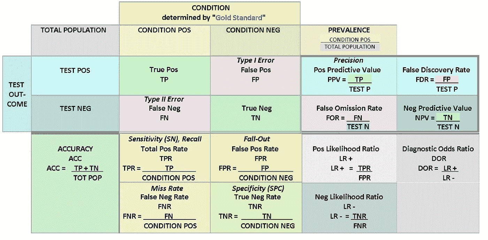

# 数据科学家:像生物学家一样思考！

> 原文：<https://towardsdatascience.com/data-scientists-think-like-biologists-b681a9795627?source=collection_archive---------34----------------------->

在 [Unsplash](https://unsplash.com/s/photos/science?utm_source=unsplash&utm_medium=referral&utm_content=creditCopyText) 上由[halance](https://unsplash.com/@halacious?utm_source=unsplash&utm_medium=referral&utm_content=creditCopyText)拍摄的照片

## 生物机器学习的清单

这篇文章是为那些对生物学知之甚少或一无所知，但拥有数据科学技能并对研究生物领域问题感兴趣的读者写的。

我的目标是让你明白，不用读教科书或花 20 个小时在可汗学院学习，你就能解决这个问题。

请记住，虽然许多问题都被巧妙地预先消化到训练和测试数据集中，但情况并非总是如此。这篇文章是关于在你到达那个点之前帮助你的想法。

# 清单:

*   选择你的任务。理解它
*   理解解决你的问题的数据(通过现代生物学的**数据类型**
*   将你的项目放在上下文中理解你的目标。
*   最后，你应该如何以及为什么合作

# 选择你的任务。了解一下。

生物学是对活的有机体的研究。它是巨大的。接受现实吧。幸运的是，你的问题更具体。

这是一个有趣的问题，这是否是人类分类偏好的功能，但是如果你去维基百科查看生物学未解决问题的列表，你会看到每个问题都被整齐地分成不同的类别，比如“生物化学”、“神经生理学”和“生态学”。

重要的事情先来。不要认为你必须事先研究所有的东西，这通常是不必要的。根据需要了解更多信息。你的时间很宝贵。

本文的其余部分是关于如何将这些文献分解成对您的解决方案有帮助的有用见解。

如果你头脑中还没有一个问题，你可以到[这里](https://www.kaggle.com/search?q=biology+in%3Adatasets+in%3Acompetitions)挑选一个问题。

学习一般技能最好是在可以找到具体答案的直接和真实问题的背景下进行。

[David Clode](https://unsplash.com/@davidclode?utm_source=unsplash&utm_medium=referral&utm_content=creditCopyText) 在 [Unsplash](https://unsplash.com/s/photos/science?utm_source=unsplash&utm_medium=referral&utm_content=creditCopyText) 上拍摄的照片

# 现代生物学的数据类型

将我们的大部分时间花在训练和评估模型上是很诱人的。然而，在任何数据科学项目中，思考您的数据源和数据生成过程可能会有回报。

在生物学中，理解你的数据会有巨大的回报。

**比较原始数据、注释数据和研究数据**

**原始数据**是新的。它还没有被处理。

以 DNA 序列为例。这些信息包含了为所有生命提供蓝图的分子。我们用四个字母“A”、“T”、“C”和“G”的有序组合来表示它们。

尽管这些信件不是原始数据。事实上，我们通过实验技术来推断它们，这些实验技术涉及到溶液中 DNA 分子的反弹，这个过程有一些误差。因此，真正的原始数据实际上可能是在那个实验中产生的波状光谱。

因此，在现实中，数据的“原始性”是非常主观的，但在许多情况下询问这些数据是有价值的。

我们可以对比原始数据和**注释数据**。这些数据已经进行了某种程度的编辑。

详述前面的例子。我们可以使用类似字典的键将 DNA 序列翻译成蛋白质序列(由 20 个不同的字母组成)。

如果你看到一个来自 DNA 序列的蛋白质序列，这将是对 DNA 序列的一种注释形式，而不是与直接测序的蛋白质相同的数据(这确实来自[其他分析过程](https://en.wikipedia.org/wiki/De_novo_peptide_sequencing))。

注释和其他领域一样，随着时间的推移会变得更加详细。

如果我们将研究定义为使用数据评估可能得到支持的假设的过程，那么研究本身可以被认为是一种极端形式的注释。

今年，[呼吁使用自然语言处理(NLP)对可能与新冠肺炎相关的研究论文](https://www.kaggle.com/allen-institute-for-ai/CORD-19-research-challenge)进行注释，使我们能够从现有文献中挖掘线索，以帮助应对全球冠状病毒。

这些项目的原始数据然后成为期刊文章中的文本，它本身描述了其他类型的数据。这里的是一篇示例论文[。](https://arxiv.org/abs/2008.07880)

使用数据类型作为描述生物数据的框架和语言是非常强大的，这些细节可以决定最终模型的解释和有效性。

**观察对比实验**

考虑你的数据来自哪里将决定分析的类型和你的洞察力的范围。在科学上，我们做实验。但是很多时候，我们也不会。

如果没有观察数据(出去观察动物之间的相似性)，达尔文将如何证明进化？

反过来，当自然实验发生时，我们是不是应该忽略它们？(当自然随机地以不同的方式对待相同的实体时)。

**实验数据**源于有意改变一个或多个变量，观察世界如何变化。这种数据通常是用特定的分析方法创建的，如果要分析这种类型的数据，您需要理解这背后的逻辑。

实验数据之所以令人敬畏，是因为它常常能促成[的因果推断](https://en.wikipedia.org/wiki/Causal_inference)。它通常非常适合监督学习任务。

**观测数据**常见得多。这包括我们没有系统地改变任何感兴趣的变量的任何数据。

用观察数据进行因果推断要困难得多，如果不是不可能的话。达尔文可能因为自然实验而成功(见上面的超链接)。

监督学习仍然适用于观察数据，但围绕模型解释的语言变得危险了。这在公共领域引起了很多关于 X 或 Y 是否对你的健康有益的困惑。

**全球与本地**

这种区分将可公开访问的数据与实验室或公司等特定团体收集的数据进行比较。我怀疑思考这种区别不仅仅是生物学上的应用。

**全球** **数据**由大量关于分子、物种、医疗状况等的在线数据库组成，这些数据已被公开收集和共享。这些数据集是公共研究的重要存储库，并且可以通过链接丰富本地数据集。

学习如何利用**全球数据**资源可能是目前数据科学家处理大型非商业数据集的最令人兴奋的机会之一。

**本地数据**然而，是只有你或你的组织拥有的数据。它的结构可能与其他数据集相似，也可能不相似，或者使用相同的方法生成。

如果您试图在学术上或商业上与他人竞争，这些数据可能非常有价值，但如果您试图创建一个需要在许多环境中适用的通用解决方案，这些数据可能价值较低。

在本地数据上构建模型的危险在于，您的模型可能很难被其他人恰当地使用，除非他们能够重建您的数据收集过程。

进一步说明:本地数据不会因为可以在网上获得而成为公共数据，尽管这里的细节可能很重要。全局数据存储库通常在数据点之间创建关系，这意味着需要一个过程来向这些存储库提交附加内容。

由 Lavender888000 在 [WikimediaCommons](https://commons.wikimedia.org/wiki/File:Preventive_Medicine_-_Statistics_Sensitivity_TPR,_Specificity_TNR,_PPV,_NPV,_FDR,_FOR,_ACCuracy,_Likelihood_Ratio,_Diagnostic_Odds_Ratio_2_Final_wiki.png) 上发布

# 背景是关键

数据科学的每个应用解决问题的标准都在变化，生物科学也是如此。

[**评估指标**](https://deepai.org/machine-learning-glossary-and-terms/evaluation-metrics) 对于任何项目来说都是重要的考虑因素，但是对于生物项目来说，重要的指标通常是特定于领域的(因此您应该了解领域！).

例如，在数据科学的许多生物医学应用中，[错误发现率](https://en.wikipedia.org/wiki/False_discovery_rate)将构成您评估标准的一部分。如果你的算法说一个分子存在，而事实上它并不存在，并且一个研究人员相信你，他们可能会围绕这个结果建立他们的下一个研究！

[**模型解读**](https://gilberttanner.com/blog/introduction-to-machine-learning-model-interpretation) 在生物问题中并不是微不足道的(曾经是吗？).取决于你如何构建你的模型，你也许能，也许不能解释它为什么做出这样的决定。有时候，这样可以，有时候不行。

模型解释可以简单到跟踪特征重要性(在基于树的模型中)、回归模型中的系数。通常，这些值可以直接与现有的理论或其他模型进行比较，从而将您的结果放在上下文中。

在生物领域，理解和交流模型的局限性是非常重要的。

数据科学从根本上受到数据的约束，所以当考虑你对你的模型的结论能说什么或不能说什么时，我会从那里开始。

您的数据在本地吗？还是分析了更大的全球数据集？后者将允许更大的普遍性。数据是实验性的吗？如果是这样的话，因果解释可能会摆在桌面上。

你用来训练你的模型的数据是如何注释的？这会影响你的模型吗？

理解领域和数据不是数据科学的附属品，而是了解模型能做什么和不能做什么的基础。

约翰·施诺布里奇在 [Unsplash](https://unsplash.com/s/photos/collaborate?utm_source=unsplash&utm_medium=referral&utm_content=creditCopyText) 上的照片

# 你必须合作

这不言而喻。

如果你想进步并接受挑战，最好的方法就是和不同的人一起工作。此外，如果这些人在你感兴趣的问题上有专业知识，这一点就变得尤为突出。

当我说有很多人愿意分享他们的专业知识时，我不认为这只是一厢情愿。

记住，一个能帮助你的人不需要博士学位，只需要比你现在拥有的更多的经验、知识或教育。

冒险，寻求帮助，分享问题。寻求帮助并不是对你性格的控诉，所以你真的没有什么可失去的。

# 后续步骤:

希望，当你努力去理解你问题的这些方面时，你会在一个更好的地方去解决它。

以我个人的经验，在质量动力公司，彻底确定问题和解决方案的标准是非常有用的。无论是对你的合作者、客户还是普通大众，努力理解你的问题领域将会创造真正的红利，并推动所有参与者的成功。

因此，做你通常会做的事情，处理数据，特征工程，特征选择，寻找潜在空间，创建嵌入，训练你的模型，评估和调整。做到这一切，知道你的目标是什么，真正的解决方案标准，并有一只援助之手引导你通过。

* *特别感谢本·哈珀等人帮助编辑本文。