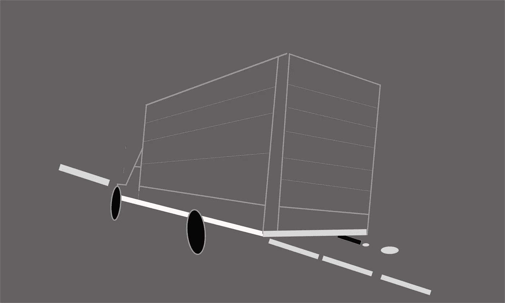
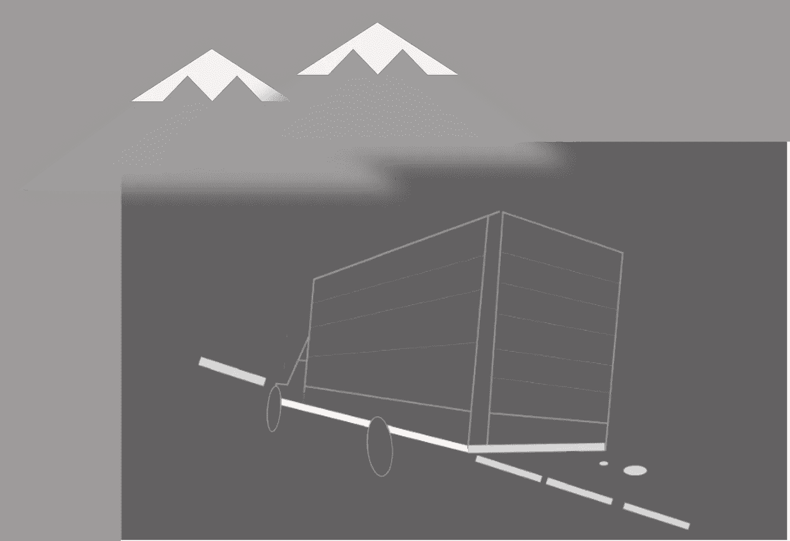
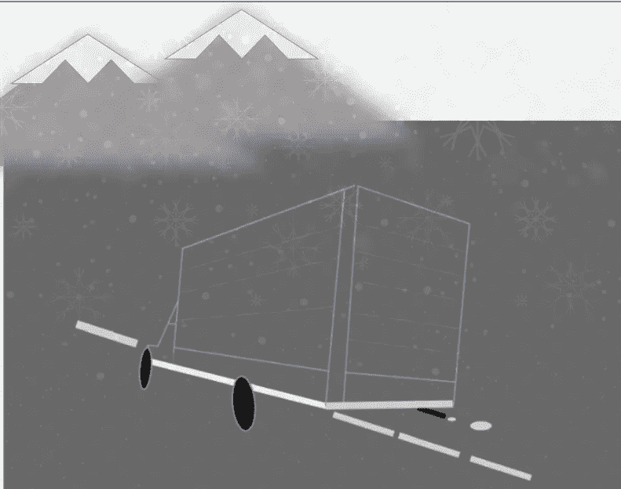

# 数据农奴和标签数据验证:未来的挑战

> 原文：<https://towardsdatascience.com/data-serfs-and-labelled-data-validation-and-the-challenges-ahead-7dd618d4720f?source=collection_archive---------25----------------------->

## 前沿是更先进的模型还是当前模型更快更好的数据？

你走在你附近的一个城市，你问你的虚拟机器人朋友“我的家在哪里？”“我的家”是一家当地的中国餐馆。然后，你的虚拟朋友会问你是否迷路了，找不到回家的路，然后会给你提供真实的家庭地址。你真的很想找到那家餐馆。

你正驾驶着你的车绕着一个弯道行驶，它告诉你，当你可以明显地看到你做得很好的时候，你还没有完全在车道上。

你去看医生，后来收到保险公司的通知，说他们不会支付你的医疗费用。你很快就会发现办公室里的“某人”没有选择正确的诊断代码([截至 2018 年，共有 155，000 个可能的代码](https://www.verywellhealth.com/diagnosis-code-decides-if-medicare-will-pay-3989741))。该办公室表示，一个新的自动化系统已经到位，该系统将通过电子方式读取医生的记录，并在未来防止这些问题的发生。你还没被说服。

这是怎么发生的？人工/增强智能(AI)的魔力失效了吗？或者更有可能的是，给餐厅数据或道路上的图像或医疗诊断代码贴标签的数据农奴大军那天表现得很疲惫，甚至那些负责验证标签(另一项数据农奴任务)的人也错过了错误。说到医疗编码，估计只有 63%的编码是准确的[。](http://A pilot study by the Healthcare Information Management Systems Society suggests that only 63 percent of ICD-10 coding may be accurate.)

尽管随着越来越多的数据被贴上标签，人工智能或增强智能的进步已经加快，尽管新的硬件设备和开源模型在很大程度上缓解了复杂机器模型中密集计算的成本，但当你探究为什么这么多对人工智能未来进步的预测落后于预期时，答案往往是，“是数据，傻瓜”。

随着我们对标记数据集的要求有了更深入的了解，还需要考虑标记者(仍然是人)的偏差以及标记过程的实际成本。标签的价格范围从 10 美元到 1000 美元，每 1000 个单位(或每件商品 10 美分至 1 美元)不等，并因多余的贴标机数量而异。当你像罗伯特·芒罗在这篇[文章](https://medium.com/@robert.munro/bias-in-ai-3ea569f79d6a)中所做的那样更深入地挖掘数据时，你会发现尽管这辆车可能是“她的”，但它更有可能被标记为“他的”，因为“在每个数据集中，男性代词的频率分别是女性代词的 3 倍和 4 倍”，然后你开始意识到，并非所有因偏见导致的错误最初都可能被视为错误。

作为建立和调整你的机器学习模型的过程的一部分，你决定花钱让其中一家数据标签公司给你的数据贴标签，有些公司像 Hive 吹嘘[有超过 150 万名员工](https://www.economist.com/business/2019/10/17/data-labelling-startups-want-to-help-improve-corporate-ai)。当你将 Hive 的员工人数(临时或非临时)与亚马逊的约 70 万人和沃尔玛的约 220 万人进行比较时，所需工作的规模就变得更加清晰了。2019 年， [*《经济学人》*](https://www.statista.com/statistics/264671/top-20-companies-based-on-number-of-employees/) 引用了一个预测，“到 2023 年，数据标签服务市场可能会增加两倍，达到 50 亿美元”。如果您雇用一家公司的标签数据来构建您的初始模型，您是否应该雇用同一家公司来验证数据标签(无论是简单的输入验证还是确定模型在现实世界中是否如预期那样运行)？你应该雇佣自己的数据验证团队吗？有什么方法可以使这种验证自动化吗？把预测的和实际发生的进行比较？还是说这个精度不重要？

如果关于偏离车道的故事不是关于司机通知，而是关于一辆自动驾驶牵引拖车驶入你的车道，会怎么样？

…尽管是一个山口…

…在雪地里…..

增强智能的要求不同于真正的人工智能，在增强智能中，提供可操作的数据，以便人类可以干预，而在真正的人工智能中，设备或车辆预计会自主行动。大多数增强智能依赖于大量精确标记的数据。因此，也许今天人工智能的真正前沿是数据标签和验证的规模化自动化，这可能会降低成本或改善环境，而不是更复杂的模型？

似乎很明显，要以自动驾驶汽车或设备的形式实现真正的人工智能，需要更高的预测精度和/或更好的上下文理解，这些汽车或设备可以在与生物相同的领域中运行。与此同时，值得关注的公司可能不是那些演示最棒的公司，而是那些致力于解决特定于其专业领域的规模化标签数据的公司。