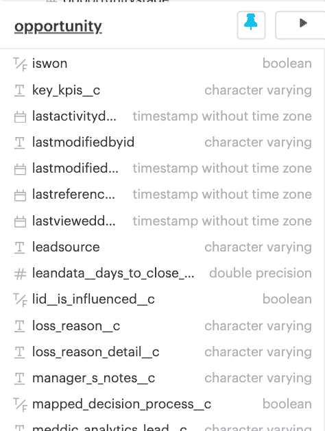
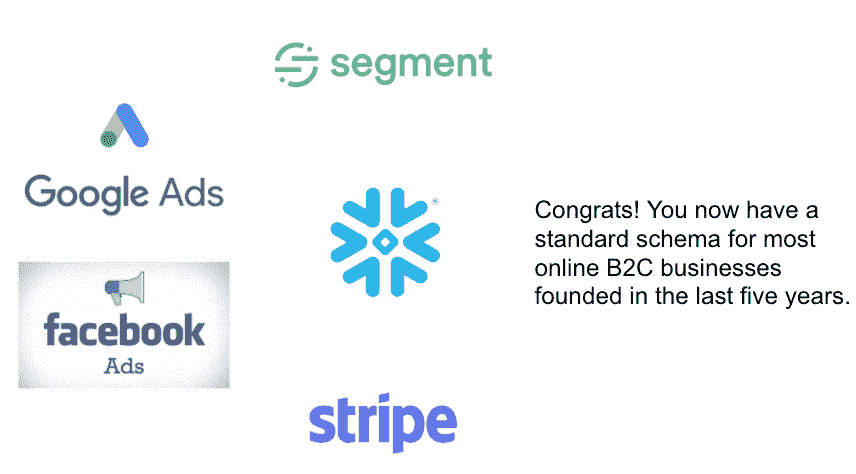
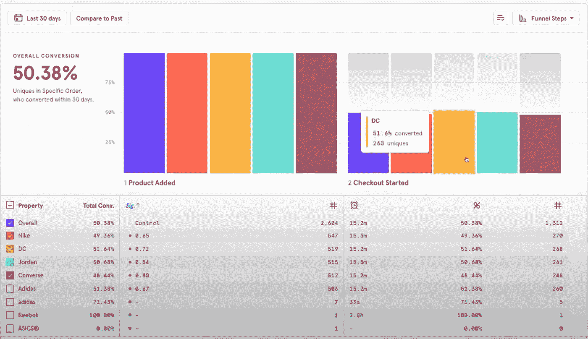
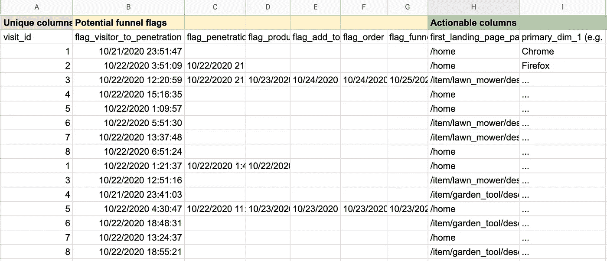
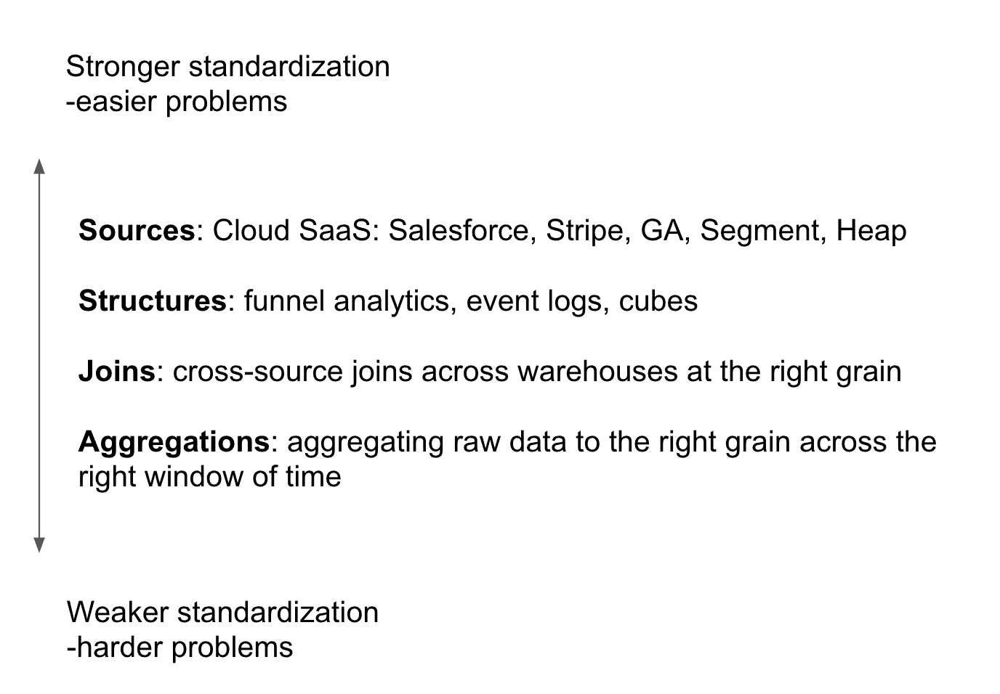
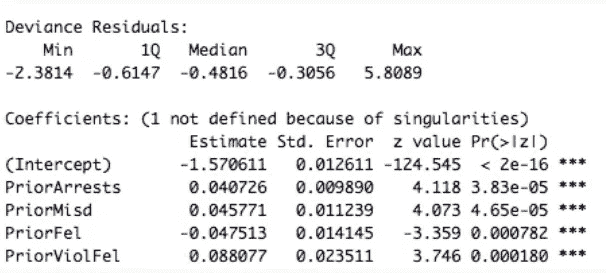
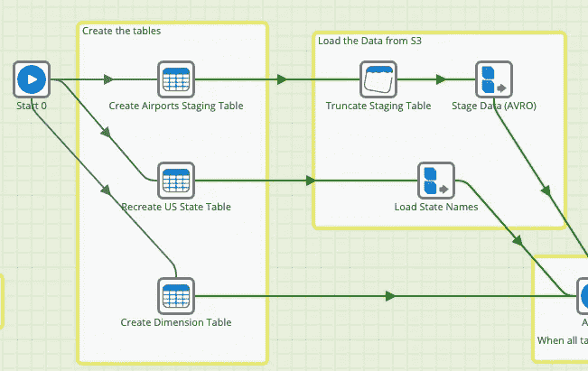

# 数据来源越来越标准化；分析学、数据科学、ML 跟得上吗？

> 原文：<https://towardsdatascience.com/data-sources-are-getting-standardized-can-analytics-data-science-and-ml-keep-up-8185a6c4ac4a?source=collection_archive---------38----------------------->

## *对标准模式开箱即用洞察机会的态度*

叶 olde Salesforce 机会表！图片作者。

在过去的一年里，我在 [Sisu Data](http://sisudata.com) 采访了 50 多位分析师、商业智能负责人和数据科学家。向他们中的任何一个人询问他们最大的痛点，答案都是一致的:从 ETL 工作到减少维度再到量化因素级别，使分析可行和有用所必需的准备、争论、转换和管理。

众筹[的一项调查](https://visit.figure-eight.com/rs/416-ZBE-142/images/CrowdFlower_DataScienceReport.pdf)强调了这一点，该调查显示，数据分析师和科学家 70%的时间都花在数据准备上，而且(毫无疑问)被认为是工作中最不愉快的部分。总之，这是一个耗时且低价值的必要之恶。

但是我有希望:在接下来的几年里，我相信由于两个趋势，这种数据争论将减少到只占数据工作流的 20%。

*   第一个，已经发生了，涉及到在源和用例级别的数据标准化的增加。
*   第二个是即将到来的机会，包括 ML 生态系统能够**在标准模式上提供现成的可操作的见解**

对于第二种趋势，分析师和数据科学家将越来越多地承担创建开箱即用的洞察系统的任务，或者翻译、解释和业务用户授权的问题。

# 数据源标准化正在实现数据准备的自动化

SaaS 正在标准化模式。图片作者。

业务用例有两种标准化。一个是源代码级别的更强形式的标准化。另一种是基于通用数据结构而不是来源的较弱形式的标准化。两者都支持数据准备的标准化。

# 强大的标准化:占主导地位的 SaaS 供应商正在决定基础模式

如果说 SaaS 垄断带来了什么好处，那就是数据标准化。

在过去的 20 年中，Salesforce Opportunity 对象主导了公司看待渠道、赢得率和净新收入的方式。因此，它们的流行定义了跨行业销售和收入运营的标准数据格式。反过来，这种标准化创造了一个完整的公司生态系统，专注于最小化摩擦和最大化 Salesforce opportunity 表的价值。

我们在流量获取(谷歌广告、脸书广告)和金融交易(Stripe)方面看到了类似的趋势。即使是最后一个前沿领域——产品和 web 分析——也正在接近一个通用标准，Heap、Segment 和 Amplitude 等公司在事件日志数据的转换方面提出了自己的观点，同时在过去几年中获得了很高的市场份额。

Segment 提供了开箱即用的基本图表和可视化功能，可以轻松实现事件级日志记录。作者截图。

然而，由于可解释性和技术问题，源代码级别的数据标准化并没有像人们希望的那样带来有用分析的标准应用的繁荣。它为要应用的一致的有洞察力的算法和工具建立了框架，但是在最基本的图表之外，我们仍然需要分析师手动转换数据来为业务创建报告工具。这是因为标准仪表板可视化之外的用于转换和分析数据的工具仍然需要高级技术技能，即使这些任务变得可重复。我们离真正的洞察力还差一步。

> 标准仪表板可视化之外的用于转换和分析数据的工具仍然需要高级技术技能，即使这些任务变得可重复

# 弱标准化:数据结构、ETL、数据连接

如果数据源在用例间变得标准化，我们需要缩小的差距是标准化我们聚合数据的方式，并在不同的数据源间连接数据。例如，我们可能能够分析 Salesforce opportunity 表，但许多团队希望将 Salesforce 表中的数据与产品分析(例如，堆、幅度、细分)、营销属性和公司地理数据相结合，以便了解功能使用如何与追加销售机会或流失可能性相关联。

幸运的是，正在进行令人印象深刻的工作来消除这种摩擦。像 Fivetran 这样的公司正在进行 ETL/ELT 的标准化，five tran 只要求你指向一个数据源，并以自动化的方式吸收、加载和(与 DBT 合作)转换。这确保了跨不同数据源的连接也可以以某种标准的方式完成。

也许最弱的标准是关于业务用户的最终转变，或者是 [ETLT](https://www.xplenty.com/blog/what-is-etlt/) 的悬空端。例如，仍然很难理解如何将事务聚集到合适的粒度或合适的时间窗口，以满足业务用户的特定需求。

但是伪标准的数据结构，即使没有单一的数据源，也使得一键自动准备的梦想成为可能。例如，在进行标准的营销漏斗分析时，将漏斗的每一步都列为一个字段，并用时间戳表示是否到达了该步骤，这正迅速成为一种最佳实践，为业务用户转换数据奠定了基础。

漏斗分析涉及将漏斗的不同步骤聚合成时间戳，并将特征附加到漏斗上的不同元素。作者截图。

又如，产品事件日志数据包含许多可能的来源，但结构大致相同。有些公司会从后端创建自己的 Kafka 流；其他的依赖于第三方，比如细分市场。但是事件日志结构在任何地方都是一样的。因此，减少摩擦的一个成熟领域是将正确的事件数据聚合到正确的时间框架中的非常常见且繁琐的分析。例如，用户可以查看每个用户在 90 天内点击“提交”的次数，或者用户在前七天点击“提交”的次数，或者用户在第一年发表评论的次数。

**有了云的无限可扩展性，为什么不在不编写任何 SQL 语句的情况下，自动聚合多个不同时间段的多个不同事件呢？**

# 如果业务数据正在变得标准化，为什么吐出一个有趣的见解仍然如此令人沮丧？

概括一下，这里有四个地方正在进行标准化

来源:作者

但是，即使没有分析堆栈的所有部分的标准化，**从我们漂亮的、高价值的 Salesforce 机会表构建甚至最简单的模型也是令人沮丧的繁琐。**

对于 ML 和复合建模来说，最大的机会是**将分析和 ETL 融合在一个统一的步骤中。**

为了说明今天的问题，让我们问 Salesforce opportunity 表中最简单的业务问题—与高成交率的业务机会相关的是什么，这样我就可以专注于这个分组了。在 2020 年，我希望能够用一行程序将它插入到一个工具中，并立即得到答案。

在我的例子中，我想在桌面上运行一个快速的[套索](/feature-selection-using-regularisation-a3678b71e499)来理解看起来最重要的特性。LASSO 是一种很好的技术，因为它通过损失函数进行正则化，使得噪声系数变为零。换句话说，LASSO，如果我有一堆数值变量，会突出最有影响力的变量。但是很快，我一个接一个地遇到了许多令人沮丧的事情，尽管成千上万的数据科学家最终在任何地方都编写了相同的预处理逻辑:

## 吸收

很多时候，数据集可能太大而无法打开，许多云工具在 10GB 左右的上限时失败(我们的 Salesforce 表很小，但请耐心等待一会儿)。然后，数据科学家必须**采样**，以便在本地 Jupyter 实例中打开它。

但是当最终结果依赖于拥有整个数据集时，它就开始崩溃了。例如，管理人员希望看到一段时间内的总销售额或总“成交金额”计数。在这种情况下，抽样显然会导致严重的少计。在这些情况下，为了减小规模，分析师将求助于构建数据立方体或运行 GROUP BY。不幸的是，一旦某些东西变成立方体格式，就很少有工具可以利用 ML 建模的最新进展。

一些工具，如 Anyscale 和 Ray，开始关注数据堆栈的这一部分，从而在任何规模的数据集上实现无限的可扩展性。只是看你想出多少钱。

幸运的是，我们的 Salesforce 表很小，但是如果它很大，我甚至很难获得数据。

## 转换和聚合

假设我们的 Salesforce 数据集足够小，可以装入笔记本电脑。同样，我特别感兴趣的是了解什么与高成交率的机会相关联，并且喜欢使用 LASSO 进行功能选择。但是，我们注意到该模式包含了大量的非数字字段。

叶 olde Salesforce 机会表！来源:作者。

所以我现在的自然选择是[一次性编码](https://machinelearningmastery.com/why-one-hot-encode-data-in-machine-learning/)分类特征，这会导致[稀疏性和多重共线性](/one-hot-encoding-multicollinearity-and-the-dummy-variable-trap-b5840be3c41a)的问题，这需要更多的 munging。这甚至没有检查富文本字段。尽管现在开箱即用的软件包使处理这些问题变得更加容易，但产品经理或注重数据的商务人士没有时间学习开源 scikit 软件包。

**此外，世界在不断发展，只需点击几下鼠标，就能按需获得“见解”,而不是多行脚本。**

我正在想象一个点击式工具，本质上是“Salesforce 模式的套索”或“Python 系列数据的套索”。它可能已经在某些地方投入生产，我迫不及待地想让它成为标准。

我们甚至还没有探究我过去提到的事件日志数据。首先，要生成的特征的数量几乎是无限的。LASSO 有助于从列表中选择功能，但不是生成本身:我想看看注册后前 7 天的登录次数吗？还是付款后第一天的总会话持续时间？在没有任何机器帮助的情况下浏览最重要的功能，我只能依靠我的直觉，或者我的商业用户可能已经有的任何偏见。

## 解释

到了这一步之后，我得到了一个具有统计显著性系数的向量。

学生项目的 GLM 输出。作者截图。

但是想象一下将这一点转化为你的商业利益相关者！相反，我必须回到 SQL，让它更容易理解。在我的例子中，我确定了一个系数，它似乎具有非常低的 p 值，即使在正则化之后也是一个合理的系数:B2C = 1，BI_Tool_looker = 1。然后，我简单地查找了出现的系数的转换率(在这种情况下，B2C 销售机会的转换率特别高)，并显示了转换率。

在所有这些工作之后，在浏览了给团队留下深刻印象的所有 p 值和系数之后，这实际上只是一个见解:

*   使用 Looker 和新的轻量级销售流程的旧金山 B2C 客户进入销售漏斗晚期的可能性增加了 3 倍。

就为了这个？哦！在这一点上，我只是累了。

# 早期的一线希望

随着数据世界中出现的所有标准化，如果数据科学工具和供应商可以将标准数据与标准的多阶段模型相匹配，情况会怎样？如果我们能够让业务用户直接从几个标准数据源获得洞察力，会怎么样？

Alteryx 是一家朝着这个方向前进的公司，它能够将 ETL 和多阶段建模集成到一个 [DAG](https://medium.com/data-ops/dag-what-s-a-dag-why-is-it-cool-44ec9ab6ad9d) 中。

Dag，如 Matillion 中的这个，支持点击式数据准备。Alteryx 也支持作为 DAG 的一部分的 ML 模型创建、训练和生产化。作者截图。

如上所述，更改模式、创建正确的字段、进行聚合，然后进行逻辑回归都是通过拖放点击来完成的。但是，在一个数据正在成为标准，所有业务用户都必须由数据驱动的世界里，即使是 DAG 也可能不堪重负。

在 [Sisu Data](http://sisudata.com) (我在 Sisu 负责解决方案和数据产品)，我们相信即使是这些配方也可以简化。我们的愿景是，对于某些数据结构—产品事件日志、Salesforce 机会—您不应该需要 DAG 或 Python 甚至 SQL 来获得洞察力。在处理上面的 Salesforce 表时，我们有一个多阶段模型，分阶段对稀疏性、共线性和文本解析建模；甚至使输出具有高度的可解释性。

> 随着业务用户要求洞察，而不仅仅是报告或图表，对于标准数据结构上的垂直化、自以为是的工作流来说，这是一个巨大的机会，只需点击几下鼠标，就可以从源直接洞察

由于业务用户需要洞察，而不仅仅是报告或图表，因此标准数据结构上的垂直化、自以为是的堆栈存在巨大的机会，可以扩展从来源到洞察的路径:

*   **接收**:云仓库的出现使得接收 TB 级数据集不再需要一个超负荷工作的数据工程师团队。相反，这应该像业务用户的对话框一样简单。
*   **机器辅助聚合**:跨越时间窗口的交易事件日志等原始数据的聚合应该成为推荐，而不是令人眼花缭乱的各种可能性。
*   机器辅助连接:有了一些标准的数据源，我们可以建议跨不同数据源的有趣的转换和连接，机器会智能地选择最有意义的数据。
*   **建模**:对于标准的连接和模式，一个解决方案可以跨多个模型应用 80/20 解决方案，这些模型能够以可能的最佳方式提供可解释的洞察力，而不是多阶段模型。
*   **洞察与解读**:不再有系数或可变等级重要性图表。输出应该是可解释的，并且是商业用户期望的那种简洁的见解，就像脸书著名的“10 天 7 个朋友”的见解。

这给分析师和数据科学家带来了什么？如果来源的标准化导致流程的标准化和自动化以获得洞察力，数据科学家将可以自由地深入到开箱即用的洞察力不再起作用的长尾案例中。分析师将越来越多地发现自己扮演着类似 PM 的角色，引导洞察力的流动并将其转化为行动。两者都将摆脱“工作中最不愉快的部分”，并在最需要和最有趣的地方增加商业价值。