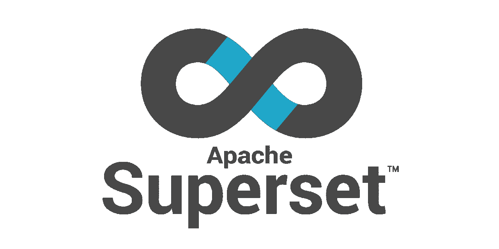

# 面向娱乐和非营利组织的数据堆栈—第二部分

> 原文：<https://towardsdatascience.com/data-stacks-for-fun-nonprofit-part-ii-d375d824abf3?source=collection_archive---------28----------------------->

## 使用 Meltano、dbt 和超集设计完整的数据堆栈

[伊瓦·拉乔维奇](https://unsplash.com/@eklektikum?utm_source=unsplash&utm_medium=referral&utm_content=creditCopyText)在 [Unsplash](https://unsplash.com/s/photos/stack?utm_source=unsplash&utm_medium=referral&utm_content=creditCopyText) 拍摄的照片

在我的[上一篇文章](https://medium.com/@andrewcstewart/data-warehouse-side-projects-part-1-f7bd74323bd7)中，我探索了一些廉价的选项来为训练练习和附带项目组装您自己的数据仓库。从那以后，我为这个系列想出了一个更巧妙的标题:*有趣的数据栈&非营利组织*。我正在扩展本系列的范围，以涵盖整个数据栈，而不仅仅是仓库组件。上次，我解释了数据堆栈往往由三个组件组成(ETL、DW 和 BI 组件)，对于 ETL 和 BI 组件，您的基本选择是 DIY 或面向企业客户定价的商业平台。

当然，我说得太早了，因为事实证明，在 ETL 和 BI 前沿都有一些非常有趣的开源开发！我将在本文中深入探讨这些，但结果是，我相信我们现在可以从免费增值和开源组件中组装一个真正的端到端分析堆栈。因此，本系列将面向那些希望建立自己的“DS4FNP”堆栈的人，无论是作为个人辅助项目、教学资源，还是无法在企业预算内运营的非营利组织。

我们完整的数据堆栈！**(左)**图片由[梅尔塔诺](https://meltano.com/) | **(中)**图片由 [dbt](https://www.getdbt.com/) | **(右)**图片由 [Apache 超集](https://superset.apache.org/)。

在本文的其余部分，我将从我上次探索的 DW 选项中报告一些结论，特别是通过`dbt`的视角。然后，我将介绍一些我认为是完整的开源 ETL 和 BI 选项。最后，我将通过描述如何设置一个完全本地的开发环境，以及为托管的生产环境提供一些选项来结束本文。

我之前确定了构成我们堆栈核心的三个候选数据仓库平台:BigQuery、Snowflake 和 Athena。为此，我对所有三个平台的结论如下…

雪花，我有一些折扣，因为它可能是三个中我最喜欢的，它不提供任何形式的免费增值定价模式。尽管是“随用随付”，你仍然需要支付一些费用。然而，事实证明你实际上把你的成本降到了每月 25 美元。现在，虽然这是一个相当低的月成本，但我仍然不知道它是否低到足以证明个人项目的合理性。但是如果这个项目对我个人来说足够重要，并且我觉得我可以最大化我的付费资源使用的效用，我可能会咬紧牙关付费。雪花真的很棒。也就是说，在令人兴奋的首次公开募股之后，如果能看到雪花发布某种专门针对小项目、培训等的有限免费增值模式，那真是太好了。

BigQuery 无疑是最吸引我的。设置帐户和 BigQuery 实例是一个非常简单的过程。 `[dbt](https://docs.getdbt.com/tutorial/setting-up/#create-a-bigquery-project)`中的[配置同样简单，甚至](https://docs.getdbt.com/tutorial/setting-up/#create-a-bigquery-project)[认证设置](https://docs.getdbt.com/tutorial/setting-up/#generate-bigquery-credentials)(我经常认为谷歌 IaaS 传统上让这个过程变得不必要的复杂)也是轻而易举。在本系列的大部分时间里，我很可能将重点放在 BigQuery 上作为目标仓库，同时尽可能保持仓库无关性。由于设置简单，其出色的定价模型(如果需要，很容易免费)，以及可用的集成数量，BigQuery 不会出错。

雅典娜和另外两个有点不同。它的主要优势是:1)它完全在你的控制之下，在你自己的 AWS 账户之内；2)如果 AWS 是你首选的生态系统，它是最便宜的选择。Athena 的主要问题是你必须自己完成所有的设置。我认为，在 [Terraform](https://www.terraform.io/) 或 [Pulumi、](https://www.pulumi.com/)的帮助下，这可以成为一个更全面的解决方案，这当然是我以后想要探索的事情。还有一个`dbt-athena` [插件](https://github.com/Dandandan/dbt-athena/)，尽管我发现文档仍然相当原始，我仍在努力克服配置障碍。随着时间的推移，我认为 dbt 插件和 Athena 供应脚本的成熟将使 Athena 成为 DS4FNP 的一个非常好的仓库选项。与 S3 的本地互操作性以及 Presto 的潜在抽象性使得 Athena 成为一个真正理想的仓库目标。

但是我们实际上在选择云仓库平台方面有点超前了。在开发您的分析项目时，您实际上可以从本地 PostgreSQL 或 SQLite 数据库开始，当然还有`dbt`。事实上，使用`dbt`，您可以为我们讨论过的任意数量的仓库以及我们的本地环境设置单独的连接概要文件。这意味着我们需要开始的只是我们的笔记本电脑、Python、`dbt`和我们本地的“仓库”(`postgres`或`sqlite`)。在本系列的后面部分(可能是第三部分)，我们将开始实际整理一个完整的教程，从头开始设置我们的项目。

好吧，那么我之前提到的这些开源 ETL 和 BI 平台呢？我有充分的理由认为，这些组件只有作为昂贵的企业服务或耗时的 DIY 项目才真正可用。ETL 通常计算成本相当高，所以没有提供免费增值定价的强烈动机。你在那里的商业选择包括 Fivetran、Stitch、Matillion 和其他几个。从 Python 脚本中运行您自己的 ETL 在理论上可能看起来很简单，但是大多数真实世界的 ETL 任务最终会陷入两种类型的复杂性中:

*   结构复杂性，意味着从复杂的数据库模式和 API 规范中加载数据，尤其是当这些结构随时间变化时。
*   容量复杂性，意味着加载需要流或批处理的大容量数据源。这主要与日志数据有关。这里的复杂性主要不是来自解析或转换逻辑，而是来自移动大型数据所涉及的基础设施逻辑。

不管是哪种情况，我认为人们倾向于低估 DIY ETL 所涉及的长期努力。这是一个很容易陷入的陷阱，因为从 10，000 英尺外看，这似乎是一个简单的“脚本化”任务:只需从一个源获取数据，然后将其发送到某个地方。不过，这种模式也有一定的道理，您经常会发现自己在重复相同的基本过程，只是有足够的变化来保证某种程度的抽象，尽管还不足以证明自己有理由进行抽象；这种类型的问题只需要一个标准化的框架，但长期以来，这些框架都被锁在商业平台的后面。

图片由[梅尔塔诺](https://meltano.com/)拍摄

幸运的是，开发人员可以使用这样一个框架:[歌手](https://www.singer.io/)，由[史迪奇](https://www.stitchdata.com/blog/introducing-singer-simple-composable-open-source-etl/)开发，是一个用于开发“taps”和“targets”的可组合框架。Taps 从数据源提取数据，包括数据库、API、日志、电子邮件等。目标是 taps 提取的数据的目的地，通常是常见的数据仓库(雪花、BigQuery 等)。每个 tap 将其数据提取到一个公共的中间体中，每个目标从该公共的中间体中进行加载，从而允许人们组合 tap 和目标的任意组合来形成 ETL 任务。

Singer 不一定是新的，但也不一定能为我们的需求提供完整的解决方案。Singer 为标准化我们的 ETL 工作流的组件提供了一个很好的起点，但是它仍然需要大量的配置管理和编排。然而，这个明显的差距已经被一些新进入该领域的人填补了，其中有[梅尔塔诺](https://meltano.com/)(来自 GitLab)和 [Pipelinewise](https://github.com/transferwise/pipelinewise) (来自 Transferwise)。这两个工具都是在 Singer 的基础上增加了一个配置管理和编排层。它们还允许您将提取/加载任务作为代码来管理，就像 dbt 允许您将转换模型作为代码来管理一样。我已经尝试了它们，我都喜欢它们，我有点希望这两个项目以某种方式合并或互操作，因为它们都有不同的优势，实际上是互补的。Transferwise 似乎更专注于开发一套符合特定标准的可靠歌手 tap/targets，而 Meltano 则更专注于填补所有空白，将 Singer 付诸实践，作为 Fivetran 和 Stitch 等平台的合法替代品。因为 Meltano 与我们 DS4FNP 项目的任务更相关，所以我将主要关注它。

Meltano 管理的项目的基本元素是提取器(Singer taps)、加载器(Singer targets)、转换器(dbt！)，以及编排(默认为气流)。仅凭 Meltano，您几乎可以管理您的整个分析项目。到目前为止，我已经完成了它的文档教程和设置项目。这感觉很像 dbt，虽然推出自己的生产部署似乎足够可行，但我非常有兴趣看到托管的 Meltano 即服务进入场景。Meltano 是很好的 Dockerized，我可以很容易地看到通过 AWS 批处理或类似的基础设施运行它。

在 BI 方面，你的商业平台包括 Tableau、Looker 和 PowerBI 等。雪花现在有内置的 Snowsight，BigQuery 与 Data Studio 很好地配对，Athena 的模拟伙伴将是 QuickSite。大型独立平台真的缺乏任何实用的 DS4FNP 友好定价选项，而 DW 特定选项对于该项目的精神来说感觉有点过于供应商锁定。到目前为止，这是整个堆栈中最主观的组件，因此无论如何，您应该在这里插入自己的偏好。BI 硬币的 DIY 面也提供了一些值得注意的选项，包括 R 的 Shiny 和 python 的 Dash。比起 ETL 工作流，我更不厌倦制作自己的 BI 接口。

图片来自[阿帕奇超集](https://superset.apache.org/)。

然而，为了形成一个完整的堆栈，我们确实有一个 BI 层的理想选择。[超集](https://superset.incubator.apache.org/)也不一定是新的，但它肯定在加速发展，现在它是 Apache 的一个项目。由气流创造者 Max Beauchemin 开发的 Superset 很快成为 Tableau 的开源替代方案。从美学上看，这感觉像 Tableau 和 Airflow 有一个开源的爱子，但内置的 SQL 实验室也感觉有点像 Snowsight 或 [Redash](https://redash.io/) 。通过`docker-compose`很容易部署，超集可以作为我们的 DS4FNP 开发环境的一部分在本地运行，也可以作为长期运行的 web 服务部署。

至此，我们的 DS4FNP 堆栈由以下组件组成:

*   Meltano 通过 Singer、dbt 和 Airflow 提供我们的 ETL (ELT)层。
*   我们的 DW 层将在本地使用 PostgreSQL 或 SQLite，在云中使用 BigQuery。
*   Apache 超集作为我们的 BI 层。

简单说一下环境吧。这个堆栈的伟大之处在于，我们可以轻松地在本地运行它的每个组件，但我们还需要最终确定我们希望如何在云中部署。

我认为我们可以在一个单一的存储库中组织我们所有的代码，这主要归功于 Meltano，他为我们管理 dbt 代码和 Airflow dags。在 Meltano 和 Superset 的 Docker 部署以及任何仓库基础设施供应代码之间，我们可能希望返回到通用基础设施存储库(或者不返回)。出于教程的考虑，我可能会使用 SQLite，这样项目的每个有形组件都是受版本控制的。

我使用 Mac，所以我的一些本地设置可能是特定于 Mac 的，但我会尽量做到平台无关。我是 VS 代码的忠实粉丝(它现在有一个`[vscode-dbt](https://marketplace.visualstudio.com/items?itemName=bastienboutonnet.vscode-dbt)`插件！)，尽管 Atom 或任何其他 IDE 也同样适用。Meltano、dbt、Singer、Airflow 和 Superset 大部分都是 Python，所以如果本地(非容器化)运行这些，我们需要 Python 和 Anaconda 或类似的设置。我们还需要确保安装了 git 和 docker。至于本地数据库，我们要确保我们安装了 SQLite 和 PostgreSQL，对于后来的 Mac，我强烈推荐 [Postgres.app](https://postgresapp.com/) 以及 [Postico](https://eggerapps.at/postico/) 或 [TablePlus](https://tableplus.com/) 作为 GUI 客户端。大部分工作将使用各种 CLI 工具来完成，所以要确保有一个舒适的终端设置，或者使用 VS Code 的内置终端。我个人用的是 VS 代码对 [iTerm2](https://www.iterm2.com/) 与 [Oh-My-Zsh](https://ohmyz.sh/) 的直通。

云部署将取决于几个因素。我强烈建议用 Github 或 GitLab 在 git 存储库中管理您的项目代码。然后，您可以设置 CI/CD 工作流(通过 Github Actions、Travis CI 等。)，这有助于自动化所有的部署管理任务。我倾向于使用 Github，我发现 Github Actions 比一个独立的 CI/CD 服务更实用，但是其他人可能会有不同的看法。现在，当我们考虑项目的云部署时，有一系列事件涉及几个不同的移动部分:

*   我们希望定期运行我们的提取和加载任务，可能由一个定义的时间表决定，这样做可能需要通过 AWS EC2、GCP 等产生一些可伸缩的执行主机。
*   我们还希望定期运行我们的转换代码，尽管因为转换代码大多只是远程执行的 SQL 命令，所以我们的执行主机更容易推广到标准大小的主机。
*   我们的数据仓库显然需要存在于某个地方，但当前下一代系统的美妙之处在于它们将计算和存储分开，并管理两者的协调。实际上，dbt 是我们与仓库实际内容的主要接口。
*   虽然我们的提取、加载、转换和仓储功能都可能是短暂的批处理过程，但不幸的是，我们可能无法避免将 BI 层作为长期运行的 web 服务。这意味着要为 24/7 服务主机付费。如果你对支付托管服务不感兴趣，我们可以简单地提供预先生成的静态内容作为我们的 BI 层(这是完全可能的)。

Github 或其他 CI/CD 服务可以托管我们的部署流程，但是对于批处理流程和长期运行的服务，我们都需要托管基础设施。因为几乎所有东西都是容器化的，所以我们可以在我们自己的自动工作站或 GCP 基础设施上部署任何这些流程。另外值得注意的是，dbt 提供 [dbt-cloud](https://cloud.getdbt.com/login/?next=/) , [天文学家. io](https://www.astronomer.io/) 提供优秀的气流托管服务， [Preset.io](https://preset.io/) 是即将推出的超集托管服务。唯一缺少的是 Meltano，似乎可以想象一个类似的托管服务将会出现。我们完全有可能最终能够在一个免费增值定价模式上托管我们堆栈的每个组件。

原来如此！我们有自己的数据堆栈架构。对于本系列的下一部分，我想通过一个更正式的教程来介绍如何使用所有这些组件来设置一个项目，并最终实现一个填充的数据仓库和一些动态数据可视化。在此之前，我绝对推荐阅读 Meltano、dbt 和 Superset。我还需要为 DS4FNP 教程提供一些数据集，所以请在评论中提出任何建议或请求。与此同时，你也可以享受由 Preset.io 团队编写的本教程。下次见！