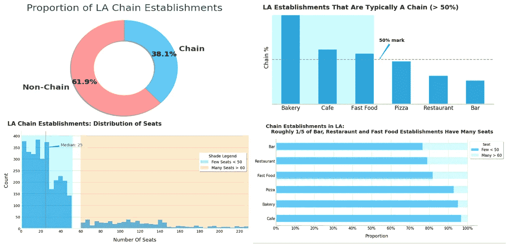
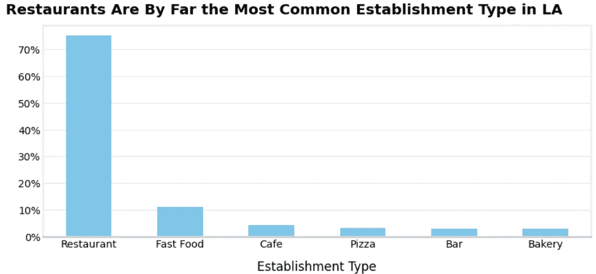
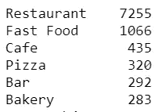
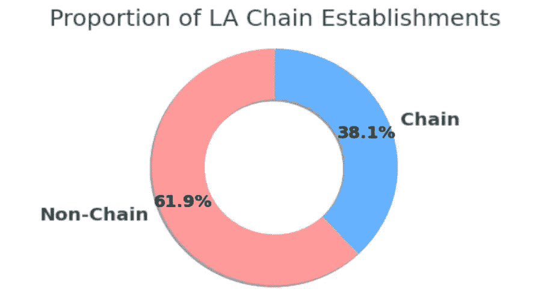
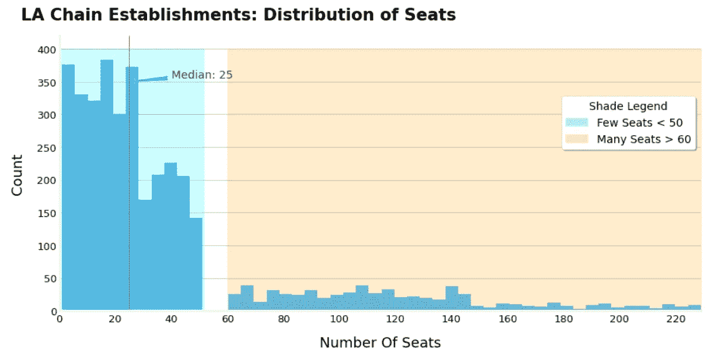
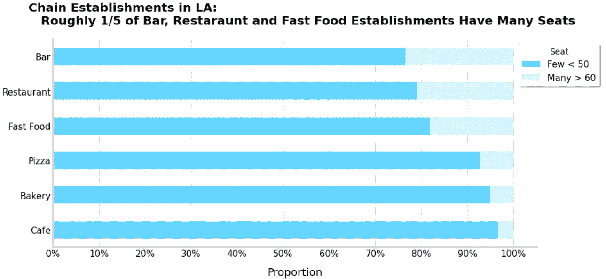
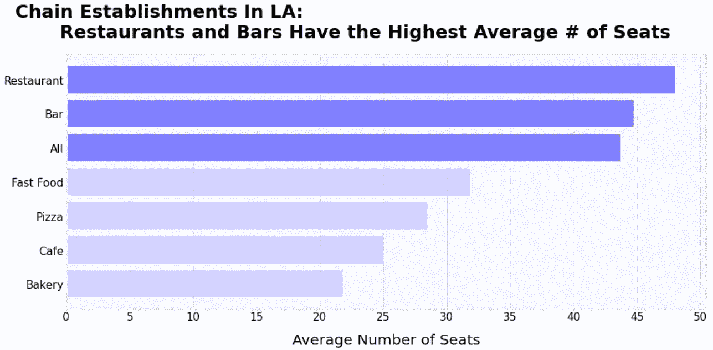
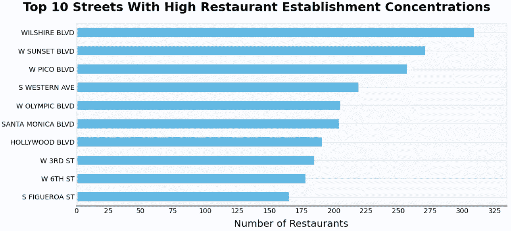

# 用数据讲故事项目

> 原文：<https://towardsdatascience.com/data-storytelling-project-python-750d63067833?source=collection_archive---------32----------------------->

## 使用 Python 的 Matplotlib 和 Seaborn 包进行数据可视化

我的[项目](https://github.com/dannygarcia193/Data_Storytelling_Project)的样本图表。

D 数据可视化通常服务于两个目标之一:呈现或探索数据。这里我依赖于前者，并使用 python 的 Matplotlib 和 Seaborn 包的组合来完成。

这篇文章将简要概述我在[实习委员会的数据分析师项目](https://practicum.yandex.com/profile/data-analyst/)中的发现。请继续关注第 2 部分，我将向您展示如何创建用于本项目的类似图形。

# 这项任务

> 你决定在洛杉矶开一家小型机器人咖啡馆。这个项目很有前景，但是很昂贵，所以你和你的合伙人决定尝试吸引投资者。他们对当前的市场状况感兴趣——当机器人服务员的新鲜感消退后，你还能保持成功吗？
> 
> 得出总体结论，并对餐厅类型和座位数量提出建议。介绍你的研究，与投资者— **目标受众**分享。

# 数据描述

洛杉矶餐馆的开源数据。点击[此处](https://code.s3.yandex.net/datasets/rest_data_us.csv)此处下载数据集。

*   对象名称—机构名称
*   链-链的建立(对/错)
*   对象类型—机构类型
*   地址—地址
*   数量——座位数量

# 洛杉矶流行什么类型的场所？

洛杉矶大约有 3/4 的餐馆是正规餐馆，其次是快餐(约 10%)。

当查看统计数字时，我们看到洛杉矶有 7255 家机构属于餐馆类型。相比之下，咖啡馆(拟议中的机构)只有 435 家，占全部机构的 5%。在此基础上，我们可以看看非连锁商店与连锁商店的比例。

# **连锁和非连锁企业的比例是多少？**

在目前的洛杉矶市场中，小型企业(非连锁机构)占有很大的份额(约 2/3)。

# **哪些类型的企业是典型的连锁店？**

咖啡馆成为连锁机构的几率更大。此外，大约 1/3 (31.6%)的餐馆属于连锁店；这可能就是为什么非连锁店在饼状图中出现的原因。

这一数字与 Allegra World Coffee 进行的一项深入研究(5000 项调查和 100 多次采访)的结果相一致，该研究表明，近五分之四(78%)的咖啡店是连锁机构，而且这一比例还在不断上升。

这些数字表明，从长远来看，开餐馆比开咖啡馆更为明智。

# 连锁餐厅的特点是什么:许多餐厅座位少，还是少数餐厅座位多？

该图向我们展示了每个机构 25 个座位的中位数，连锁倾向于拥有许多座位数量少(1-50 个座位)的机构，这是约 82%的机构的特征。

# 哪种连锁机构类型，相对于它们的总数，具有“许多座位”的机构最集中

因此，对于连锁机构来说，每种机构类型的少数座位比例都在 80%以上。

请注意，该图显示了机构类型的“多座位”比例，其中餐馆的份额最大，这可能是将*总计*“少座位”比例降至 80%的原因。

此外，餐馆设立的席位百分比很低，这表明洛杉矶有许多小型连锁餐馆。让我们继续探索

# 哪个连锁餐馆有最多的座位？

当我们考虑总平均数时，请注意 4 种机构类型的平均席位数是如何比它低 10 个以上的。

座位分布(见上图)上的大多数“许多座位”值可归因于餐馆和酒吧机构。考虑到前面的图表，连锁餐厅的平均座位数似乎是公司可以开始的合理座位数。

# 哪些街道的设施密度最高？

这些街道包含超过 110 家和多达 325 家的机构。进一步的分析表明，68%的街道包含一家餐馆，而 32%的街道包含不止一家。

如果公司想进入一个竞争激烈但蓬勃发展的市场，他们可能会对这些街道感兴趣。

# 推荐

考虑在洛杉矶开业时，考虑到(1)所选的店(小咖啡馆)，(2)所提供服务的新颖性(机器人服务员)，(3)当前的市场条件，(4)项目的成本，以及(5)维持成功开业的长期目标，给出以下建议:

*   公司应该考虑开一家餐厅而不是咖啡馆，因为大玩家在餐厅市场占据的空间更小。小型咖啡馆正在被连锁咖啡馆击败。
*   该公司应该考虑从一个有 48 个座位(连锁餐厅的平均座位)的独立机构开始，并根据其战略，选择一条有许多餐厅或一家餐厅的街道。然后，它可以基于其机器人服务员方法的新颖性，积极发展并建立一个连锁店。

# **结束语**

作为一个编程领域的新手，几个月前，创建上述图表超出了我的能力范围。当然，我可以用 Plotly 之类的库，但是我真的想了解图形的结构。Matplotlib 和 Seaborn(构建于 Matplotlib 之上)帮助我实现了这一点。

就我个人而言，我会说这是一个具有挑战性的项目，它教会了我如何思考观众、背景以及我在创作上述图表时试图讲述的故事。也是通过这个项目，我爱上了数据可视化，并很高兴能继续实践和学习这个广阔的创造性领域。

无论如何，我承认我没有包括这个项目的任何代码以及我的分析过程；我选择不写它，因为我不想让这篇文章比现在更长。也就是说，请继续关注第 2 部分，我将向您展示如何制作上面概述的一些图表。

*点击* [*此处*](https://practicum.yandex.com/) *了解有关 Practicum 的数据分析师项目的更多信息，这是一门实践密集型课程，教授您数据科学的基础知识及其在商业分析中的应用。*

另外，如果你愿意，让我们在 LinkedIn 上联系。

 [## 数据分析师组合-数据分析师组合

### 我的数据分析师组合。你好。我是丹尼尔，最近刚从心理学院毕业，现在是数据科学专业的毕业生…

dangarci.com](https://dangarci.com/)