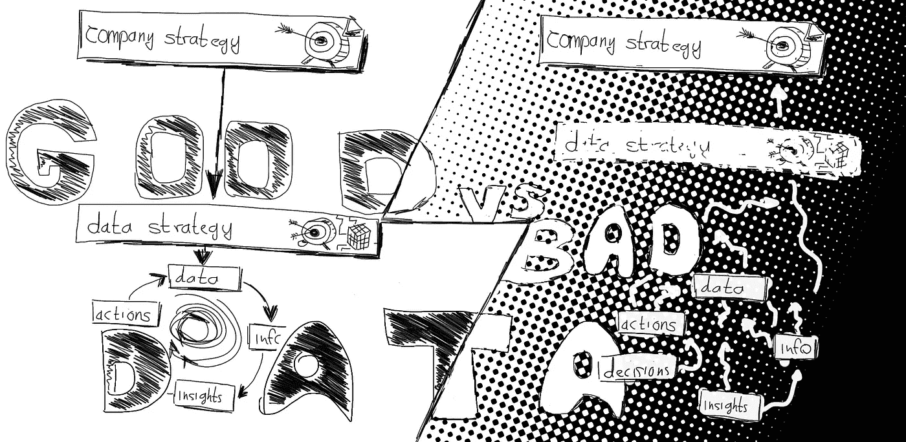
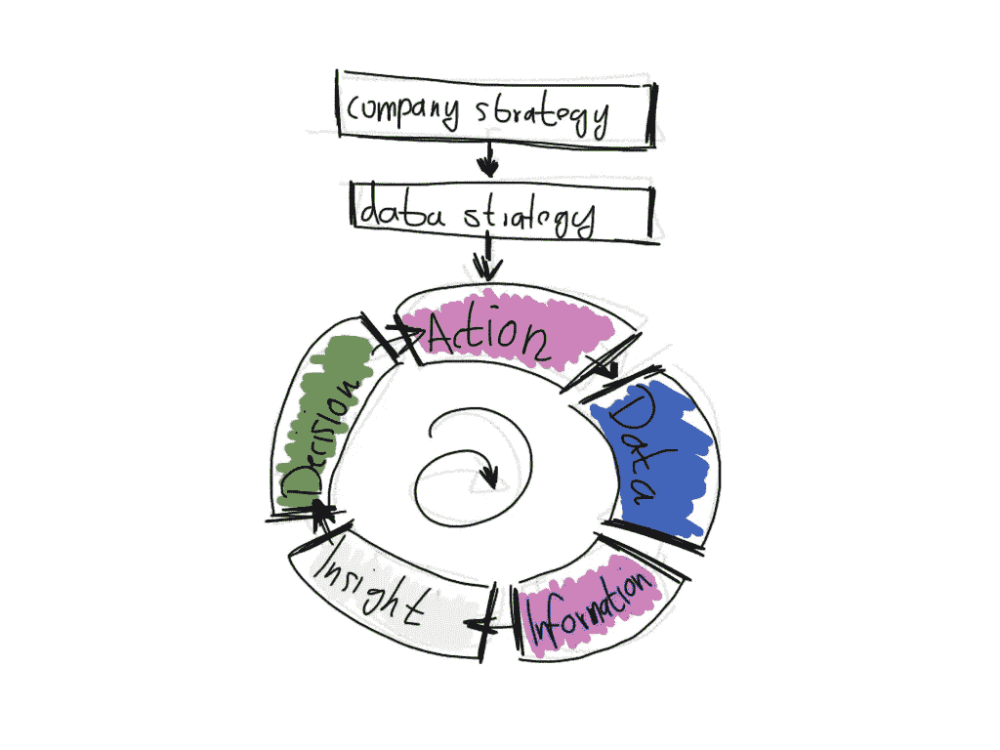
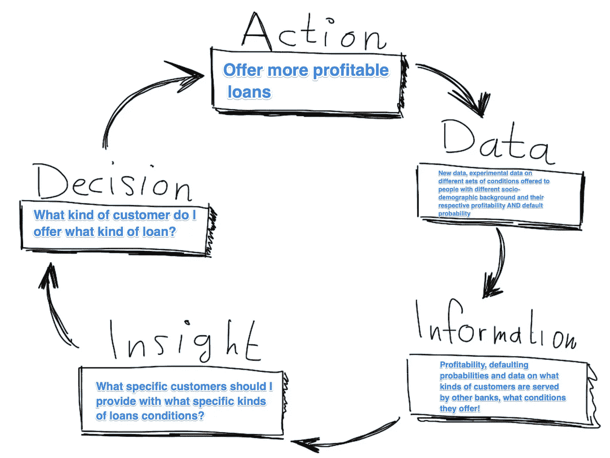
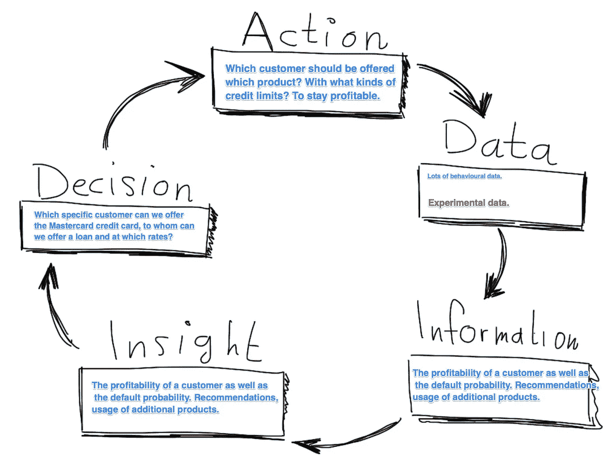

# 数据策略:好数据与坏数据

> 原文：<https://towardsdatascience.com/data-strategy-good-data-vs-bad-data-d40f85d7ba4e?source=collection_archive---------27----------------------->

## *了解好数据是什么样的，并快速发现坏数据*

好数据与坏数据。好数据，从公司战略中得出数据战略，并反馈到数据决策周期中。坏数据有许多“计划”在公司里飞来飞去，却没有一致的数据策略。图片由作者提供。

1990 年，总部位于弗吉尼亚的银行“图章银行”决定信任两位聪明人，理查德·费尔班克斯和奈杰尔·莫里斯，并对数据进行重大投资。他们决定将客户信贷部门变成一个大型实验室，根据不同的信贷接受者特征“测试”出不同种类的信贷条款，并因此收集了多年的数据。

这是一项巨大的投资，该部门在相当长的一段时间里“赔钱”。但是他们真正做的是获取数据，不仅仅是因为他们认为这是一项好的投资，费尔班克斯和莫里斯收集的是**好的数据**。数据整合成与**公司战略**一致的**良好数据战略**。

**他们收集数据的明确目的是提高 Signet Bank 信贷部门的决策能力。**

好的数据也不过如此。良好的数据是您拥有良好的数据策略的结果。您收集、清理/丰富/转换、洞察这些数据，其唯一目标是改进决策。

唯一的问题是，外面有很多坏数据！无论你走到哪里，都会看到糟糕的数据。它是出于任何其他原因而接触的数据，而没有更大的目标。

我不确定仅仅在这个尺度上判断数据是否公平，但以我的经验来看，这似乎是唯一好的衡量标准。数据的唯一价值是提高公司的**决策能力，从而帮助其采取更好的行动**。我确实认为这是一个已经被许多伟大的思想家理解的教训。例如，Provost & Facett 在“*商业数据科学:关于数据挖掘和数据分析思维，你需要知道什么”中指出了这一点。*

Fairbank & Morris 明白这一点，并加以应用，将小“图章银行”变成了美国最大的银行之一 Capital One。价值十亿美元的巴西独角兽银行的联合创始人大卫·维勒兹也从一开始就直觉地理解这一点。他现在正在将他的关键见解应用到世界各地的其他市场。

现在让我们看看坏数据是什么样的，然后看一下这两个好数据的例子。

我写这篇文章是为了帮助你了解好数据和坏数据之间的巨大差异。帮助您了解在这两种情况下都可以应用的大量技术。让您有机会重新审视自己的数据策略，在竞争对手之前将坏数据转化为好数据。

# **坏数据**

有很多**坏数据**的例子。当您试图让数据塑造数据策略时，坏数据就会出现，而不是相反。费尔班克斯和莫里斯没有雇佣一百名数据科学家来“想出伟大的东西”，也没有在整个公司收集大量随机数据。他们收集数据的目的是建立一个有利可图的信贷部门，然后雇佣数据科学家使用& **收集正确的数据**并支持这一战略。

尽管有一些证据表明，一些科技公司实际上只是“雇佣聪明人来提出伟大的东西”，并取得了成功，但我确实认为，通常情况下，他们确实有数据战略来支持这一点。

***坏数据*** *是…*

*…当一家公司投资建立一个数据湖，以“从数据中获得洞察力”，而不了解公司中是否有人会实际使用这些数据来做出比以前更好或更快的决策。*

*…当一家公司雇佣一些数据科学家来“利用大数据”，而没有考虑实际结果。*

*…当一家公司雇佣一群机器学习工程师&数据科学家来“想出一些伟大的东西”，而没有将他们融入他们的公司愿景。*

*…当一家公司因为中央数据收集团队出现问题而决定建立一个“数据网格”时，不知道这是否会导致其员工采取更好的行动。*

*…当一个分析部门因为人们要求而产生一份又一份的报告时，却不知道人们对这些报告的处理与以前有什么不同。*

当一个机器学习团队花了四分之一的时间为网站构建最新的推荐引擎，而没有考虑一个简单的“热门项目”列表是否也能做得一样好。

*…当一个营销部门安装了最新的营销自动化工具，但还没有大量的电子邮件营销活动和数据时。*

*…当一家公司花了一个季度的时间升级到最新版本的“AwesomeDataTool”时。x”到“跟随技术的步伐”，而不理解人们如何使用他们的 AwesomeDataTool 来做决定。*

这不是好数据。好的数据来源于数据战略，并整合到公司战略中。

# **图章银行的良好数据(然后是 Capital One)**

上面提到的导致坏数据的所有技术都可以用来产生好数据。也许对你来说是的。但是为了验证这一点，你必须问**为什么，为什么，为什么**。

要想得到好的数据，你必须从顶层开始。从数据战略开始，也就是公司战略。你必须以采取更好的行动、做出更好的决定为目标，然后沿着这条路努力。这条路是什么样子的？如今，我倾向于认为数据之路就像 [ThoughtWorks](https://www.thoughtworks.com/) 使用的流程一样:

在 ThoughtWorks Intelligence Enterprise Series，[https://www . ThoughtWorks . com/insights/articles/intelligent-Enterprise-Series-models-Enterprise-Intelligence # continuous Intelligence](https://www.thoughtworks.com/insights/articles/intelligent-enterprise-series-models-enterprise-intelligence#continuousintelligence)了解更多有关此周期的信息。图片由作者提供。

因此，如果我们从目标“更好的行动”开始，那么这些阶段是:

*   *采取更好的行动*
*   *做出采取特定行动的决定*
*   *具备做出具体决策的洞察力*
*   *拥有信息以获得洞察力。*
*   *已经收集了数据并将其转化为信息。*
*   *(让动作发出数据，让它被收集……这使得圆圈变满。)*

如果我们开始分析 Signet 银行案例，我们从数据策略开始。在这种情况下，它是“*收集&试验信用贷款，以获得足够的信息来撇去大银行不会提供的有利可图的信贷*”。

这在当时是一个非常独特的视角。上世纪 80 年代，自动违约概率计算彻底改变了信贷市场。因此，对于违约概率低的人，信贷提供保持在标准利率。但在 1990 年，费尔班克斯和莫里斯决定，是时候对两者都下注了，价格歧视，或者换句话说，为不同的人提供不同的信用条款，关注盈利能力，而不仅仅是违约概率。

所以从本质上说，他们认为在违约概率较高的人群中，仍然存在有利可图的贷款！在违约概率较低的人群中，有更多的盈利选择，因为这些人实际上是信贷部门的输家。

因此，我们可以推导出 Signet Bank 正在采取并希望改进的行动…

图片由作者提供。

行动——“提供更有利可图的贷款”。正如费尔班克斯和莫瑞斯指出的那样，他们需要同时关注盈利能力和违约概率。这个有争议的决定就变成了…

**决策—“我向什么样的客户提供什么样的贷款？**”。在 20 世纪 80 年代，这一决定仅仅是基于这样一种认识，即有些人违约概率较高，而有些人违约概率较低。图章银行现在寻求的是一种不同的洞察力…

**洞察——“我应该向哪些特定的客户提供哪些特定类型的贷款条件？”**。为了获得这些见解，我们需要更多的信息。不幸的是，这些信息在 1990 年根本不存在。提供的唯一信息是基于社会人口数据的违约概率。

**信息——“关于不同客户群盈利能力的硬数据，以及传统的违约概率和关于其他银行服务的客户类型、他们提供的条件的数据！!"**。因为所有这些信息都会影响到向谁提供什么产品包的决策。所以最后归结到数据的问题，原始数据根本不可用…

**数据—“新数据，提供给具有不同社会人口背景的人的不同条件的实验数据，以及他们各自的盈利能力和违约概率”**。因此，对 Signet Bank 来说，事实证明，好的数据策略是收集这种数据，将其与其他数据源结合起来，再次回到循环中，进而做出更好的决策。

当然，之后，这个轮子继续转动，为每个阶段增加更多的价值。据报道，Capital One 每年都会推出数千种此类变体。要更深入地了解这个案例，请参阅 Provost 和 Fawcett 在 2013 年发表的“*商业数据科学:你需要了解的数据挖掘和数据分析思维*”。

这种情况已经很久了，公司倾向于不共享这种数据。但我最近无意中发现了金融业的另一个相关案例，即巴西独角兽企业“Nubank”。

# **nu bank 的良好数据**

我知道 Nubank 是因为他们的机器学习框架 [fklearn](https://github.com/nubank/fklearn) 。该公司正在机器学习问题领域创造大量开源软件。但事实证明，Nubank 不只是投资于机器学习，因为行业内的其他人都这样做，对机器学习和算法的投资与公司战略和由此产生的数据战略密切相关。

Nubank 正在打入“无银行市场”,这个市场在巴西约占人口的 50%。这些人根本无法进入银行系统。Nubank 正在通过提供针对特定群体的产品来改变这种状况。第一款产品是一款仅支持手机的托管信用卡，旨在以巴西金融业前所未有的速度向没有银行账户的人提供小额贷款，更多的产品正沿着这条道路前进。

但是，为“无银行账户者”服务带来了一个显而易见的问题:你如何知道一个无银行账户者是否会违约，或者对公司来说是否有利可图？毕竟，他们没有银行历史或金融信息，如信用评分。

这就是**数据策略变得明显的地方**。Nubank 的创始人大卫·维勒兹在一定程度上描述了他们是如何准确地意识到这个问题的，以及他们必须专注于非传统的方式来查看和收集他们的数据。

**让我们从头开始:**为没有银行账户的人提供合理收费的信用卡，同时保持盈利。这就是我们想要采取的行动。因此，数据策略变成了“收集&分析数据，以得出哪些人提供哪种产品，是信用卡、贷款还是借记卡”…

图片由作者提供。

**行动—“应该向哪个客户提供哪个产品？用什么样的信用额度？以保持盈利。”**。毕竟，就像 Signet Bank 一样，Nubank 正在应对巴西传统银行系统回避的一批客户。关键决策是像…这样的决策。

**决策—“我们可以向哪个特定客户提供万事达信用卡，我们可以向谁提供贷款，贷款利率是多少？”**。为了做出这样的决定，Nubank 需要…

**洞察&信息—“客户的盈利能力以及违约概率。但作为一家快速增长的初创企业，他们也需要人们向其他人推荐该银行的可能性，就像忠诚度计划等其他产品的可能用途一样。”**。

根据维勒兹在 CNN 采访中的说法，这正是 Nubank 正在建立并继续发展的:

> “然而，Nubank 已经将其业务建立在一个全新的基础上:基于“大量非传统信息”的独特数据集和算法，”贝莱斯说

还有…

> “我们关注你住在哪里……你如何移动，你的朋友是谁，谁邀请你去 Nubank，你向什么类型的人寄钱，”他说。“我们观察你是否阅读信用卡的合同——事实证明，真正快速阅读合同的人往往是骗子。我们会观察你正在进行的交易类型，你是在购买食品杂货，还是在酒吧里。”

事实上，如果你仔细观察，Nubank 在利用这类信息方面处于特别有利的位置，因为他们也收集了许多传统公司不收集的数据！他们已经在你的手机上，有一个推荐程序，从而收集关键的行为数据。

事实上，这一点得到了 2011 年 Martens&Provost 的一项研究的支持，该研究基本上说:*对于银行来说，使用你住在哪里和你的年龄的信息来计算&是一个很好的起点，但是使用* ***行为数据*** *就像这里提到的那些提供了盈利能力的实质性提升，并且增加了使用的数据越多，而社会人口统计数据则达到了一个明确的顶点*。

您还应该注意到，Nubank 处于独特的位置，可以进行与 Signet Bank 非常相似的实验！他们目前提供了巴西 50%的新发行信用卡，这意味着他们控制了无银行市场的巨大份额。通过对无银行账户市场进行实验，他们可以根据目前收集的数据点得出非常相似的见解。他们比任何人都做得更好。

这是否足以保持盈利还有待观察，但至少足以让 Nubank 成为一家价值 10 亿美元的初创企业，并让它们在全球扩张。

如果你想让你的公司在使用数据方面有所作为，我希望这能帮助你辨别好数据和坏数据，并让你走上正确的道路，专注于数据战略，而不是让数据决定“战略”。敬请关注。还有更多的好数据即将出炉。

## **资源**

*   F.Provost，T. Fawcett，2013:“商业数据科学:你需要了解的数据挖掘和数据分析思维”。Provost 和 Fawcett 提供并分析了 Signet 银行(现在的 Capital One)的案例。他们还提出了数据科学是关于提高公司决策能力的观点。
*   J.Pepitone，2019: CNN，[拉丁美洲最有价值的初创公司之一正在改变巴西银行的方式](https://edition.cnn.com/2019/12/06/business/nubank-david-velez-risk-takers/index.html))。
*   R.Rumelt，好策略坏策略，2011: [这本书启发了本文](https://www.amazon.de/Good-Strategy-Bad-Richard-Rumelt/dp/1846684803)的某些部分。
*   [Fklearn](https://github.com/nubank/fklearn) ，Nubank 打造的开源功能性机器学习框架。
*   D.Martens，F. Provost，2011: [从消费者交易数据中锁定伪社交网络](https://papers.ssrn.com/sol3/papers.cfm?abstract_id=1934670)
*   [ThoughtWorks 智能企业系列](https://www.thoughtworks.com/insights/articles/intelligent-enterprise-series-models-enterprise-intelligence#continuousintelligence)。