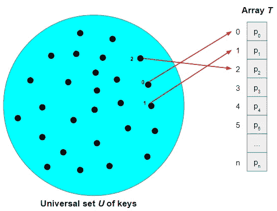
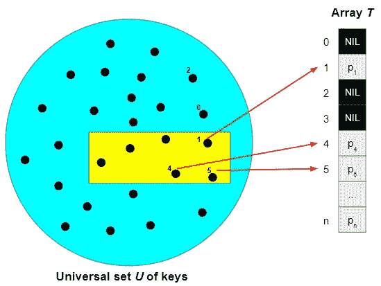
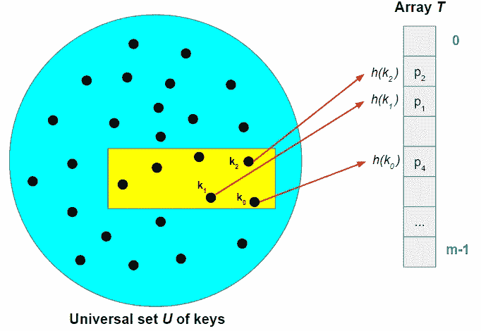
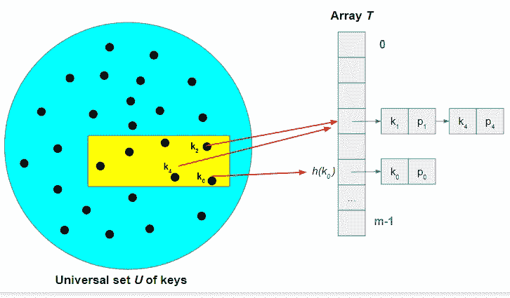

# 数据结构 1:哈希表

> 原文：<https://towardsdatascience.com/data-structures-1-hash-tables-f520cb3dc85?source=collection_archive---------35----------------------->

## 哈希表及相关概念的简要介绍


[万花筒](https://unsplash.com/@kaleidico?utm_source=medium&utm_medium=referral)在 [Unsplash](https://unsplash.com?utm_source=medium&utm_medium=referral) 上拍摄的照片

哈希表是实现字典的有效方法。在直接进入哈希表主题之前，掌握背景知识将有助于我们更好地理解与哈希表相关的概念。

# 什么是字典？

字典是一种**抽象数据类型**，用于存储键值对。

> 一个简单的字典→ {key_1:value_1，key_2:value_2，…。，key_n:value_n}

每个键都与一个值相关联。让我们用一个简单的例子来构建我们的整个讨论。

假设您是一家销售各种水果和蔬菜的商店的老板，您想创建一个包含商店中所有产品及其相应价格的列表。为了简化这个过程，您决定为每个产品创建一个唯一的 productId。


这里要注意的一个重要事实是，第 1 列包含了人类已知的所有水果和蔬菜的名称，现在让我们假设你正在销售所有这些品种。第二列是一个**万能设置** ***U*** 的按键对应每个产品。下一步是创建一个数据结构来存储这些细节(即键值对)

# 直接地址表

存储键(productIds)及其对应值(prices)的最简单方法之一是使用直接地址表。直接地址表只不过是一个数组，其中每个位置/槽对应于通用集合 *U* 中的一个键。下图说明了如何使用直接地址表来存储键值对。



作者图片

set *U* 中的每个元素都被映射到数组 *T* 中对应的槽中(为简单起见，图中只映射了键 0、1 和 2)。这里，pᵢ是 key *i.* 对应的价格，从图中可以看出，数组 *T* 中的 slot *k* 对应的是 universal set *U* 中的 key *k* ，*t【k】*是 key *k.* 对应的值

任何数据结构都支持三个主要功能:插入、删除和搜索。

```
INSERT(T, key, value):
   T[key] = valueDELETE(T, key):
   T[key] = NILSEARCH (T, key):
   return T[key]
```

所有三个操作都有 O(1) 的最坏情况时间复杂度，这是我们能达到的最好的时间复杂度。

# 直接访问表的限制

让我们继续我们的店主场景。

**限制 1:**

过了一段时间，你发现你的商店亏本了，于是你决定只卖有限种类的水果和蔬菜。假设你打算只卖 *m* (m < n) 种水果和蔬菜，并且每周都要更换品种。现在，你的直接访问表应该是这样的。



作者图片

黄色区域包含与您选择的 *m* 种水果和蔬菜相对应的 *m* 个按键。现在，只有与黄色区域中的键相对应的槽具有值，其余的为零，即仅使用了 *n* 槽中的 *m* 槽，我们正在浪费( *m-n* 槽所占用的内存。假设 n = 100，000，m=1000，那么您将浪费为该阵列分配的 99%的内存。因此，当通用集合 *U* 的大小与实际使用的键的数量相比非常大时，直接访问表在存储器使用方面变得低效。

**限制 2:**

如果您有 2Gb 的 RAM，并且使用 8 个字节来存储每个值(价格)会怎么样？

> 数组的最大大小 T = (2 * 1024 * 1024 * 1024) / 8 = 268，435，456

如果通用集合 *U* 的大小大于 268，435，456，则直接访问表无法使用，因为没有足够的内存来创建数组。

因此，直接访问表只对合理的大小有效 *n.*

# 哈希表

哈希表克服了上述两个限制。但是哈希表是如何工作的呢？？？

通过直接寻址，一个键为 *k* 的元素被存储在槽 *k* 中。在散列表中，具有键 *k* 的元素被存储在槽*h(k)*中，其中 *h* 被称为散列函数。下图将清楚地说明键是如何映射的。



作者图片

哈希函数将通用集合 *U* 中的每个键映射到数组 *T* 中的一个槽。如果数组 *T* 的大小是 *m* ，那么

> h : U → {0，1，2，…，m-1}

之前对于直接访问表，数组 *T* 的大小应该是| *U* |(数组 *U* 的大小)。然而，哈希表允许数组的大小为*m*(*m*<|*U*|)也就是说，我们可以创建任意大小的数组，而不考虑通用集合 U 的大小。

即使哈希表克服了直接地址表的限制，哈希表也有自己的挑战。

## 冲突

如果两个不同的键 *k₁* 和 *k₂* 有相同的哈希值，即 *h(k₁) = h(k₂，会发生什么？这种现象叫做**碰撞**。还好有办法处理。*

*   选择一个有效的散列函数来有效地分配密钥将减少发生冲突的可能性。让我们将黄色区域中的一组实际键命名为 set *W* 。如果集合 *W* 的大小大于数组 *T* 的大小(即|*W*|>|*T*|)，那么冲突就无法完全避免。然而，通过使用均匀分布密钥的有效散列函数，冲突的数量可以被最小化。
*   链接是用于冲突解决的另一种方法。假设两个键 *k₁* 和 *k₄* 有相同的哈希值，那么我们使用一个链表(通常是双向链表)来存储它们，如下图所示。



作者图片

## 链式哈希表时间复杂度

*   插入

键值对被插入到链表的头部。如果我们假设被插入的键还不存在，那么最坏情况下插入的运行时间是 O(1)。我们可以在插入之前检查一个键是否已经存在，这需要额外的成本(这与链表的大小成正比，因为您必须遍历链表)

*   删除

假设链表是一个双向链表，双向链表中的一个元素 *x* (键值对/链表中的一个节点)可以以最坏的时间复杂度 O(1)被删除(更多关于双向链表删除的信息)。然而，如果 delete 函数的输入是 key *k* (不是节点 *x* )，那么删除的时间复杂度与链表的大小成比例，因为您必须遍历链表来找到相应的节点。

*   搜索

对于 search 来说，最差情况下的运行时间是 O(| *W* |)，因为在最差情况下，散列函数会为所有键产生相同的散列值。然而，在实践中，这种情况从未发生过。理论上已经证明，对于存储 *n* 个元素的 *m* 大小的哈希表(定义 *n* / *m* 为**负载因子**)，在[简单均匀哈希](https://en.wikipedia.org/wiki/SUHA_(computer_science))的假设下，平均用例运行时间为θ(1+*n*/*m*)。

## 什么是好的哈希函数？

在一个好的散列函数中，每个键都同样可能散列到数组 *T* 中的 *m* 个槽中的任何一个，而与任何其他键散列到的位置无关。然而，重要的是要注意，我们不能检查这个属性，因为我们很少事先知道，从其中提取密钥的概率分布。

本文只打算提供哈希表的一个高层次的整体概念(不是非常高级的概念)。如果你感兴趣的话，可以参考下面这本书，这本书是我写这篇文章的主要参考资料。

***资源:*** 科尔曼、T. H .、莱瑟森、C. E .、里维斯特、R. L .、&斯坦恩、C. (2009)。*算法介绍*。麻省理工出版社。