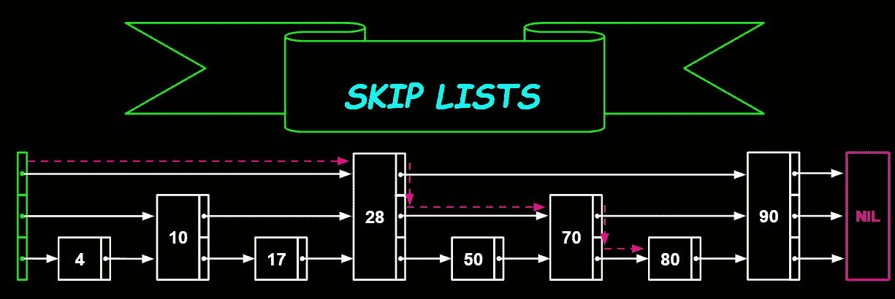
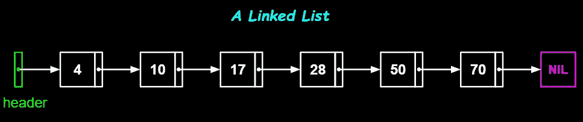
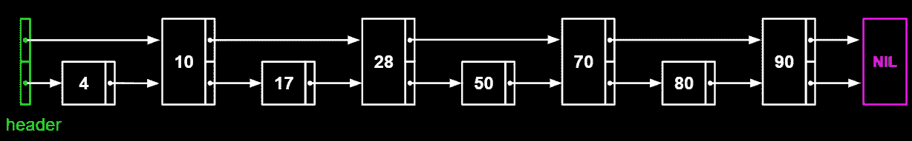
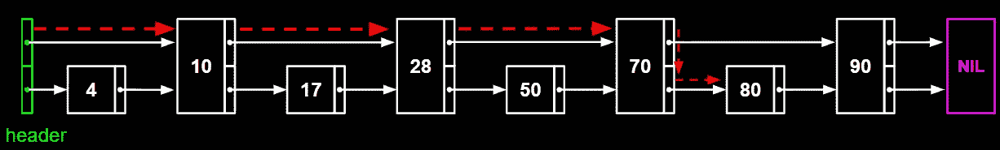
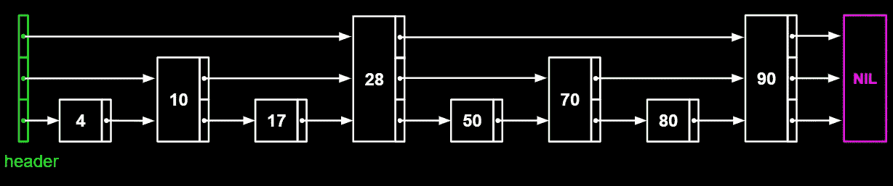
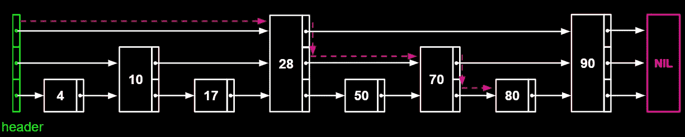
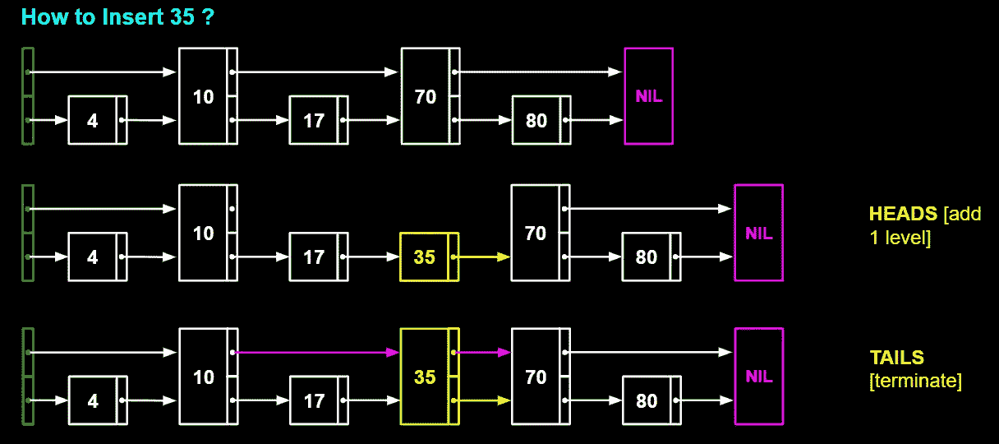
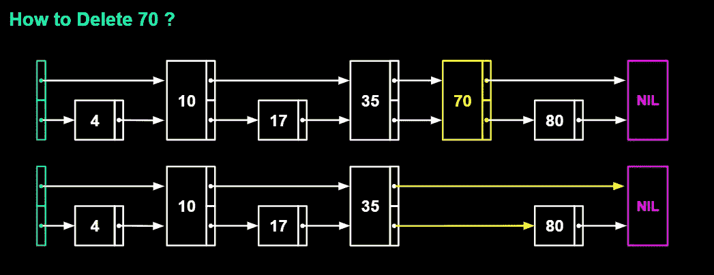

# 数据结构 2:跳过列表

> 原文：<https://towardsdatascience.com/data-structures-2-skip-lists-d36b58191d69?source=collection_archive---------20----------------------->

## 平衡树的概率替代方案

# 介绍

二叉树可以用来表示抽象数据类型，如字典和有序列表。然而，当我们按顺序插入元素时，很有可能最终得到一个性能很差的退化数据结构(例如，按顺序向二叉树插入 2，3，4，5，6，7，8)。这就是为什么我们经常使用平衡的树形结构，在执行操作时重新排列树形结构。跳过列表可以作为平衡树的替代物(根据约束条件，它们甚至可以执行得很好)。由于它们不像平衡树结构那样流行，我认为作为我的数据结构系列的第二篇文章来写这篇文章可能会有用。

# 链接列表

**链表**是一种非常熟悉的数据结构，简单且易于实现。下图说明了一个排序的单链表，其中每个节点都包含一个指向其右邻居的指针。

作者图片

***排序链表操作及时间复杂度***

我们寻找的常见操作是搜索、插入和删除。让我们来看看伪代码。

> Search (list，search key)
> //通过线性搜索找到 search key
> 
> Insert(node，newNode)//插入 new node 作为节点
> new node . next←node . next
> node . next←new node
> 
> Delete(node)//删除节点
> obsoleteNode←node . next
> node . next←node . next . next
> free(obsolete

相应地，平均案件时间复杂性将是，
-搜索:**θ(*n*)**
-插入:**θ(1)**
-删除:**θ(1)**

其中 *n* 是链表的长度(或链表中的节点数)

## 缺点

*   搜索效率不高。很难在不到 O(n)的时间内进行搜索
*   遍历很慢，因为您必须一次遍历一个节点，从第一个节点开始到感兴趣的节点。不能直接跳到中间。

*跳过列表*提供了这些缺点的解决方案。

# 完美的跳过列表

让我们对链表做一些修改。在我们最初的链表中，每个节点只有一个指向它右边邻居的指针。对于每隔一个节点，让我们添加一个指针指向前面两个节点。下图给出了一个更好的想法。

作者图片

对于一个链表，我们必须在搜索操作中遍历 n 个节点(在最坏的情况下)。现在，经过我们的修改，我们只需要遍历 *n* /2 + 1 个节点。例如，如果我们必须搜索值 80，

作者图片

我们从最高级别的标题开始。它指向值为 10 的节点。80 大于 10，所以我们移动到值为 10 的节点。它指向 28，也小于 80。我们继续这样，直到我们达到 70 岁。它指向值为 90 的节点。因为 90 大于 80，所以我们要低一级。现在指针指向 80。任务完成！！！我们只遍历了 4 个节点，而不是 7 个(这是典型链表的情况)。

让我们更进一步，为每第四个节点添加一个指针，指向前面第四个节点。下图演示了新的结构。

作者图片

现在搜索怎么样了？我们只需要遍历 *n* /4 + 2 个节点。如果我们搜索 80 个，

作者图片

我们可以这样继续下去，每一个 2ˣ)th 节点前面都有一个指针指向 2ˣ节点。我们可以很容易地观察到新数据结构中的一些重要特性，我们还没有命名这些特性。

1.  将会有最大的 log₂(n)等级(确切地说是 ceil(log₂(n)
    【在我们的例子中，log₂(8) = 3 个等级】
2.  每个更高的级别将包含其下一级别的一半数量的元素。[在我们的示例中，级别 1 有 8 个元素/节点，级别 2 有 4 个元素，级别 3 只有 2 个元素]
3.  header 和 NIL(姑且这样称呼吧)节点在每一层中都存在
4.  它非常类似于**平衡二叉树**

现在我们可以在 O(log *n* )时间内搜索，即使是在最坏的情况下，这与链表相比是一个显著的改进。这就是我们所说的**完美跳过列表**(最后我们给我们的新数据结构起了一个名字😊)**。**即使搜索性能很好，插入和删除现在也很困难，因为很难保持这种模式，因为新节点可以插入到任何地方，或者任何现有节点都可能被删除。在每次插入/删除之后，我们不能重构整个列表。我们该如何处理？通过 ***随机化*** 。

# 随机跳过列表

让我们放松一点约束。之前我们说过，每一级**的元素数量应该是下一级的一半。现在让我们**期待**每一层的元素数量是其下一层的一半。**

让我们假设我有一枚硬币。当我插入一个新的节点时，我会投掷硬币(任意次)直到我得到一条尾巴。我获得的连续人头数将决定我应该给那个特定的节点添加多少层。

**插入操作**

下图清楚地说明了如何在列表中插入 35。

作者图片

> **步骤 1:** 插入 35，创建一个指向右边邻居的指针。
> **第二步:**抛硬币。
> **第三步:**由于是人头，增加一级，连接到右边最近的节点，至少 2 级。连接左侧最近的节点至少 2 级
> **第四步:**再抛硬币。
> **第五步:**由于是尾数，终止。

假设如果我们在得到尾部之前得到了另一个头部，那么我们当前的节点将有三个级别，而 header 和 NIL 将只有两个级别。在这种情况下，我们应该向 header 和 NIL 节点添加额外的级别。header 和 NIL 节点应该始终具有与具有最大级数的节点相同的级数。

**删除操作**

现在就删 70 吧。

作者图片

我相信图表本身解释了一切。

搜索操作的方式与完全跳过列表中的方式完全相同。

掷硬币事件是引入随机化的事件。因为得到正面的概率是 0.5，所以我们试图重新创建一个随机化的跳过列表，它类似于我们的完美跳过列表，其中每一级与下一级相比只有一半的元素数量。

> 如果我们使用不同的概率函数，时间和内存消耗以及跳表结构会发生什么是一个有趣的话题。

*【你可以从底部提供的资源中了解更多相关信息】*

值得注意的是，我们牺牲内存来提高性能。添加额外的级别意味着添加更多的指针(在 64 位系统上，每个指针消耗 8 个字节)。

# 结论

*   跳跃列表可用作平衡树(如 AVL 树)和自调整树(如八字树)的替代物。然而，跳转列表是一个相对简单的数据结构，非常容易实现。
*   我们可以很容易地修改跳转列表来引入并行性(甚至有并行无锁跳转列表)
*   为了减少时间消耗，跳转列表倾向于使用稍微多一点的内存(在任何数据结构中，内存和性能之间的权衡是不可避免的)

最后一个重要问题。为什么我们称之为跳过列表？因为我们在遍历过程中跳过了节点(如果你到现在还没弄明白的话😂)

资源:普格，W. (1990)。跳过列表:平衡树的概率替代。*ACM 的通信*， *33* (6)，668–676。