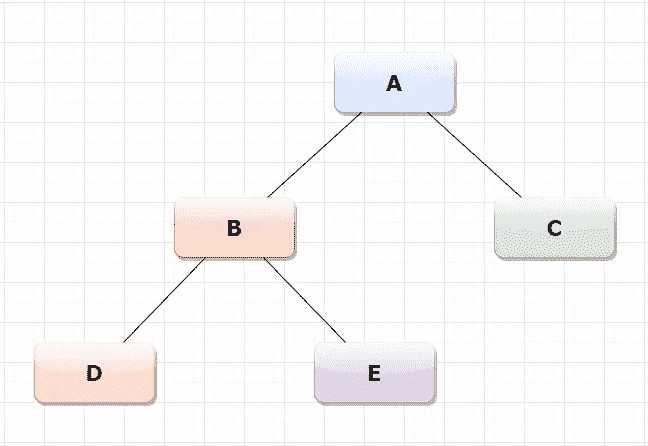

# Python 中的数据结构和算法

> 原文：<https://towardsdatascience.com/data-structures-algorithms-in-python-68c8dbb19c90?source=collection_archive---------2----------------------->

## 开始掌握数据结构和算法概述


图片来自 [Pixabay](https://pixabay.com/?utm_source=link-attribution&utm_medium=referral&utm_campaign=image&utm_content=62966) 的[维基图片](https://pixabay.com/users/WikiImages-1897/?utm_source=link-attribution&utm_medium=referral&utm_campaign=image&utm_content=62966)

> 为了发展一个完整的头脑:研究艺术的科学；研究科学艺术。学会如何去看。意识到每件事都与其他事相关联。
> 
> 列奥纳多·达· 芬奇

## 介绍

这篇文章的目的是给你一个 Python 中数据结构和算法的全景。对于数据科学家来说，这个主题非常重要，可以帮助他或她以更有效的方式设计和解决机器学习模型。

我们将看到内置数据结构、用户定义数据结构的实际例子，最后但同样重要的是，我将向您介绍一些算法，如遍历算法、排序算法和搜索算法。

所以，让我们开始吧！

## 第一部分:内置数据结构

顾名思义，数据结构允许我们组织、存储和管理数据，以便有效地访问和修改。

在这一部分，我们将看看内置的数据结构。Python 中有四种类型的内置数据结构:列表、元组、集合和字典。

***列表***

列表是用方括号定义的，包含用逗号分隔的数据。该列表是可变的和有序的。它可以包含不同数据类型的混合。

出局:

```
january['january', 'february', 'march', 'april', 'may', 'june', 'july']['birthday', 'february', 'march', 'april', 'may', 'june', 'july', 'august', 'september', 'october', 'november', 'december']
```

下面是列表中一些有用的函数。

出局:

```
What
is
your
favourite
painting
?Who-is-your-favourite-artist-?
```

出局:

```
['Chagall', 'Kandinskij', 'Dalí', 'da Vinci', 'Picasso', 'Warhol', 'Basquiat']
```

***元组***

元组是另一种容器。它是不可变有序元素序列的数据类型。不可变的，因为你不能从元组中添加和删除元素，或者就地排序。

出局:

```
The dimensions are 7 x 3 x 1
```

***设置***

集合是唯一元素的可变且无序的集合。它可以让我们快速地从列表中删除重复项。

出局:

```
{1, 2, 3, 5, 6}
False
Basquiat
```

***字典***

字典是一种可变的无序的数据结构。它允许存储一对项(即键和值)。

如下例所示，在字典中，可以将容器包含到其他容器中以创建复合数据结构。

出局:

```
In a Sentimental Mood
Lacrimosa
```

## 第二部分:用户定义的数据结构

现在我将向您介绍三种用户定义的数据结构:ques、stack 和 tree。我假设您对类和函数有基本的了解。

***堆栈使用数组***

堆栈是一种线性数据结构，其中元素按顺序排列。它遵循 L.I.F.O 的机制，意思是后进先出。因此，最后插入的元素将作为第一个元素被删除。这些操作是:

*   Push →将元素插入堆栈
*   Pop →从堆栈中删除元素

要检查的条件:

*   溢出情况→当我们试图将一个元素放入已经具有最大元素数的堆栈时，就会出现这种情况。
*   下溢情况→当我们试图从空堆栈中删除一个元素时，就会出现这种情况。

出局:

```
5
True
[10, 23, 25, 27, 11]
overflow
11
27
25
23
10
underflow
```

***队列使用数组***

队列是一种线性数据结构，其中的元素按顺序排列。它遵循先进先出的 F.I.F.O 机制。想想当你和你的朋友去电影院时，你可以想象第一个给你票的人也是第一个站出来的人。队列的机制是相同的。

描述队列特征的方面。

两端:

*   正面→指向起始元素
*   后→指向最后一个元素

有两种操作:

*   入队→将元素插入队列。它将在后方完成。
*   出列→从队列中删除元素。这将在前线完成。

有两个条件:

*   溢出→插入到已满的队列中
*   下溢→从空队列中删除

出局:

```
[2, 3, 4, 5]
[3, 4, 5]
```

**树*(一般树)*树**

树用于定义层次结构。它从根节点开始，再往下，最后的节点称为子节点。

在本文中，我主要关注二叉树。二叉树是一种树形数据结构，其中每个节点最多有两个孩子，称为左孩子和右孩子。下面你可以看到一个用 python 编写的二叉树的表示和例子，其中我构建了一个名为 **Node** 的类和表示不同节点(A、B、C、D 和 E)的对象。



作者图片

无论如何，还有其他用户定义的数据结构，如**链表**和**图。**

## 第三部分:算法

算法的概念自古就有。事实上，古埃及人使用算法来解决他们的问题。然后他们把这种方法传授给希腊人。

algorithm 一词源自 9 世纪波斯数学家 muḥammad·伊本·穆斯哈勒·赫瓦·里兹姆，他的名字拉丁化为 Algorithmi。Al-Khwārizm 也是一名天文学家、地理学家和巴格达智慧之家的学者。

正如你已经知道的，算法是以有限的顺序来解决问题的指令。

当我们编写一个算法时，我们必须知道确切的问题是什么，确定我们需要从哪里开始和停止，并制定中间步骤。

有三种解决算法的主要方法:

*   Divide et Impera(也称为分而治之)→它将问题分成子部分，并分别解决每个子部分
*   动态规划→它将问题分成子部分，记住子部分的结果，并将其应用于类似的问题
*   贪婪算法→解决问题时采取最简单的步骤，而不用担心未来步骤的复杂性

**树遍历算法**

python 中的树是非线性数据结构。它们以根和节点为特征。我用之前为二叉树构造的类。

树遍历指的是恰好访问树中的每个节点一次，以便更新或检查它们。


作者图片

有三种类型的树遍历:

*   有序遍历→指的是先访问左边的节点，然后是根，再是右边的节点。

这里 D 是最左边的节点，其中最近的根是 B .根 B 的右边是 e .现在左边的子树完成了，所以我向根节点 A 移动，然后到节点 c。

出局:

```
D
B
E
A
C
```

*   前序遍历→指的是先访问根节点，然后是左节点，再是右节点。

在这种情况下，我移动到根节点 A，然后移动到左边的子节点 B 和子节点 d。之后，我可以转到节点 E，然后是节点 c。

出局:

```
A
B
D
E
C
```

*   后序遍历→指的是先访问左边的节点，然后是右边的节点，最后是根节点

我到最左边的节点 D，然后到右边的节点 e，然后，我可以从左边的节点 B 到右边的节点 c，最后，我向根节点 a 移动。

出局:

```
D
E
B
C
A
```

**排序算法**

排序算法用于按照给定的顺序对数据进行排序。可分为归并排序和冒泡排序。

*   归并排序→遵循**分治规则**。给定的列表首先被划分成更小的列表，并比较相邻的列表，然后按照所需的顺序对它们进行重新排序。因此，从作为输入的无序元素总结，我们需要有作为输出的有序元素。下面是描述每个步骤的代码。

出局:

```
input - unordered elements: 15 1 19 93
output - ordered elements: 
[1, 15, 19, 93]
```

*   冒泡排序→它首先比较相邻的元素，如果它们没有按照指定的顺序排序，则进行排序。

出局:

```
[1, 3, 9, 15]
```

*   插入排序→它在给定的列表中选择一个条目，并把它放在应该放的地方。

出局:

```
[1, 3, 9, 15]
```

还有其他排序算法像**选择排序**和**外壳排序**。

**搜索算法**

搜索算法用于寻找给定数据集中存在的一些元素。有许多类型的搜索算法，如线性搜索，二分搜索法，指数搜索，插值搜索，等等。在这一节，我们将看到线性搜索和二分搜索法。

*   线性搜索→在一维数组中，我们必须搜索特定的关键元素。输入是我们想要找到的一组元素和关键元素。因此，我们必须将关键元素与组中的每个元素进行比较。在下面的代码中，我尝试在列表中查找元素 27。

出局:

```
'not fund'
```

*   二分搜索法→在这个算法中，我们假设列表是升序排列的。因此，如果搜索关键字的值小于列表中间的元素，我们将区间缩小到下半部分。否则，我们缩小到上半部分。我们继续检查，直到找到值或者列表为空。

出局:

```
False
True
```

## 结论

现在你对数据结构和算法有了一个大概的了解。所以，你可以开始深入理解算法。

我为这篇文章选择的维特鲁威人的美丽形象不是随便的。这幅画是基于理想人体与几何学的关系。事实上，对于这种表现，达芬奇受到了维特鲁威斯的启发，他将人的身体描述为确定建筑中正确比例的理想身体。

关于算法，维特鲁威人隐藏了一个秘密算法，这个算法被艺术家们使用了几个世纪，以证明他们的作品受到了神圣比例的启发。

有时候我喜欢想，也许达芬奇，通过他的精彩作品，想要定义最重要的算法，也就是生命的算法。

感谢你阅读这篇文章。您还可以通过其他方式与我保持联系并关注我的工作:

*   [订阅](https://upscri.be/wxv1zi)我的时事通讯。
*   也可以通过我的电报群 [*初学数据科学*](https://t.me/DataScienceForBeginners) 联系。