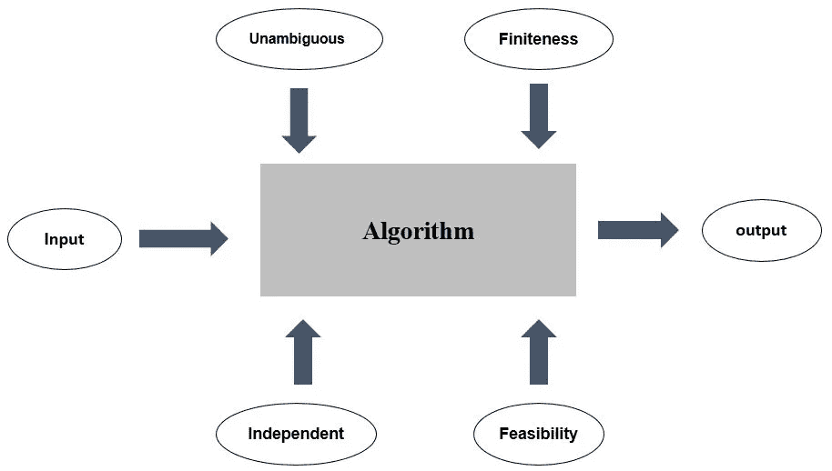
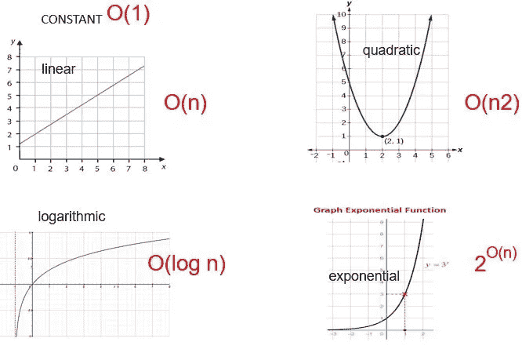
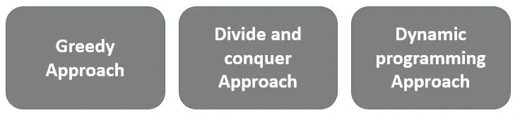
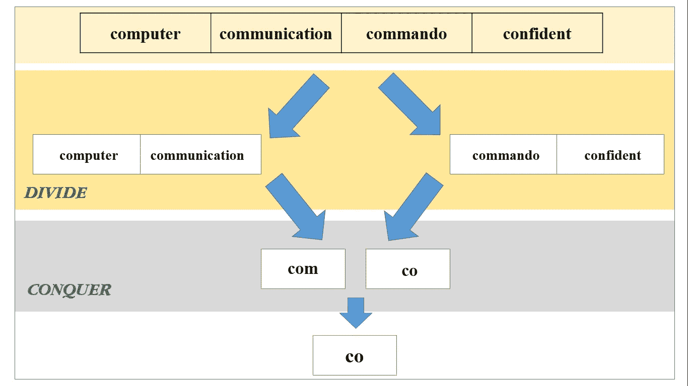
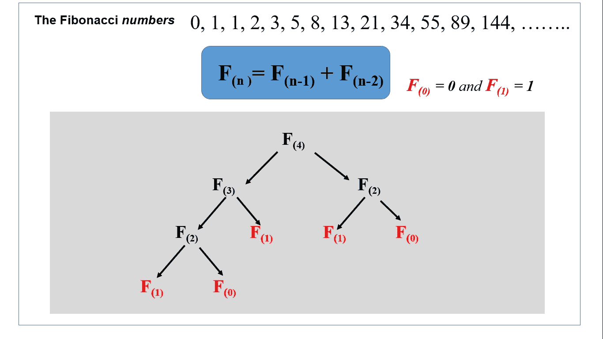

# 数据结构和算法之旅

> 原文：<https://towardsdatascience.com/data-structures-and-algorithms-journey-80d225cfbbd8?source=collection_archive---------46----------------------->

## 我们将开始一系列基于数据结构和算法的课程。


作者图片

**本文目标:**

1.  描述数据结构的重要性
2.  描述术语算法
3.  什么是算法复杂性
4.  求解算法的方法

他的特定概念被认为是软件工程中最重要的概念之一，并成为大多数顶级公司的主要检查点。在这一系列课程中，我们将讨论数据结构和算法概念背后的思想，并在接下来的课程中实现几种算法。

# 什么是数据结构？

数据结构的简单定义是“**在你的计算机上存储数据的不同方式**”或者“表示和组织你的数据的系统方式”。重要的是，任何数据结构都应该能够有效地用于任何给定的任务。例如，搜索、转换数据、编辑、更新等。

## 数据结构的特征

数据结构有三种不同的特性，我们可以根据用途对它们进行分类。

*   **时间复杂度**

*运行时间或* ***执行时间*** *被定义为给定任务的时间复杂度。对于给定的上下文，我们应该使用尽可能好的数据结构，以尽可能降低时间复杂度。*

*   **基于特定接口的正确性**

*每个数据结构都包含其* ***接口*** *即给定数据结构所支持的操作。同样，应该有一个正确的* ***实现基于正确接口的*** *数据结构。理想情况下，数据结构应该带有正确定义的接口和描述性实现。*

*   **空间复杂度**

*空间复杂度将衡量给定数据结构的内存使用情况。最终，我们应该优化我们的算法解决方案，以便对于具有大量数据集的解决方案，尽可能地最小化空间复杂度。*

## 为什么我们需要任何类型的数据结构？

如今，随着新处理器、计算机系统的发展，用我们普通的计算机处理大量的数据记录并不是一项复杂或详尽的任务。但是，当遇到基于一些标准的某些不可预测的情况时，如**数据大小**、**检索速度**和**多线程处理**，我们应该专注于为给定场景实现适当的数据结构。

假设您正在实现一个简单的文本搜索，该搜索基于一个拥有超过数百万条记录的大型文本语料库。如果您试图并行处理数据对象，并且您的执行时间不应该超过亚毫秒。

正确设计的数据结构将帮助您以高效的方式完成这些类型的任务。

# 什么是算法？

算法是完成任何任务的一步一步的过程。换句话说，算法是一组定义明确的指令，用来完成给定的任务，而不依赖于任何特定的编程语言。在本系列中，我们将尝试用 nodejs 和 python 编程语言实现主要的数据结构和算法，以了解任何给定算法的相似性。

## 给定算法的属性

正如我们之前提到的，算法应该有一组定义良好的指令来完成给定的任务，即使你有一组指令来完成一项任务，但如果以下特征不满足，则该任务将不会被定义为算法。



算法属性(图片由作者提供)

*   **毫不含糊**

*算法的每一步都应该清晰，所有的输入输出也应该清晰。*

*   **有限性**

*算法应该能够在有限数量的步骤出现后终止*

*   **可行性**

*该算法应该能够利用可用资源工作*

*   **独立**

*算法中的所有步骤应与语言无关(应能在任何编程语言中实现)*

*   **输入**

*算法应该有零个或多个明确的输入，这些输入应该是定义明确的输入。*

*   **输出**

*算法应产生一个或多个明确定义的输出。*

问题可以用很多方法解决。让我们设计一个简单的算法来识别和描述我们在上一段中解释的过程。

**例子:**设计一个算法，生成给定数字的平方值。

```
**Step 1 −** START**Step 2** − define a value **A** which you need to get the square**Step 3** − define the operation of **A** * **A****Step 4** − store output of step 3 to new variable **C****Step 5** − return **C****Step 6** − STOP
```

现在，仔细检查一个算法的所有特征，并尝试对照上面的简单算法来证明所有特征的合理性。

**自学:**尝试设计以下算法，检查你的算法是否支持我们之前描述的所有属性。

1.  设计一个算法，从给定的三个正数中确定最大值
2.  设计一个算法来得到斐波那契数列的第 10 个值

在分析你的算法时，算法的理论分析是非常重要的。 ***先验*分析**是一种着重分析算法效率的分析类型。

一个算法的效率可以用**算法复杂度**来衡量。算法的复杂度主要基于两个因素，即**时间因素**和**空间因素**。

## 空间复杂性

空间复杂度由算法执行其生命周期时所需的内存空间总量来衡量。

```
**Total Space Complexity = "**fix part complexity**" + "**variable part complexity**"**
```

**固定零件复杂度**被认为是存储相关数据和变量所需的空间量。例如，指定的常数，独立于问题大小的变量。

**可变零件复杂性**取决于问题的大小，并且组件在执行时间内动态变化。

## **时间复杂度**

时间复杂度是指完成给定算法**所需的时间单位总量。**

时间复杂度与输入大小线性相关，这意味着当输入大小增加时，时间复杂度也随之增加。

## **渐近分析**

在算法世界中，计算给定算法的运行时间指的是渐近分析。

算法的运行时间总是基于参数和算法背后运行的函数。

通常我们可以基于三种不同的情况来测量算法运行时间(**最佳**、**平均**和**最差**)。

我们主要考虑**最坏情况**的场景，这意味着执行算法所需的最大时间。

***流行算法的渐近表示法***



复杂性计算(图片由作者提供)

算法的设计是为了获得所需问题的最优解。在寻找解决方案的过程中，我们可以定义三种不同的方法来解决特定的问题。



实现算法最优解的方法(图片由作者提供)

## **贪婪的方法**

贪婪方法是一种常见的问题解决方法，它使用该方法通过寻找局部最优解来解决特定问题。

大多数时候贪婪方法收敛于**局部最优**解，而**很难得到**全局最优**解中的**，但是随着时间和迭代，局部最优解接近全局最优解。

**例**:在下面的树形结构中找到**和**最大的路径


贪婪方法与实际解决方案(图片由作者提供)

以下是一些流行的贪婪算法示例:

*   旅行推销员问题
*   克鲁斯卡尔最小生成树算法
*   Dijkstra 的最小生成树算法
*   背包问题
*   作业调度问题

尝试使用适当的算法解决这个问题。

## 分而治之

分而治之很好理解。在这种方法中，**问题将**分成**更小的子问题**，这些子问题将独立解决。当你把主问题分成子问题时，你可以一直分下去，直到你找到一个**原子问题**(不能再分成更多部分的子问题)。一旦你单独解决了子问题，你就可以**合并**所有的结果来生成你的问题的最优解。

**示例**:查找一组给定数据库记录的最长公共前缀



实际应用中的分而治之(作者图片)

以下是一些流行的贪婪算法示例:

*   二分搜索法算法
*   合并排序算法
*   快速排序算法
*   最近点对法
*   库利-土耳其快速傅立叶变换(FFT)

## **动态编程方法**

动态编程方法非常类似于分而治之的方法，但是由于问题解决方法的原因，它与分而治之的方法略有不同。

不像分而治之的方法，一旦你把你的问题分成亚原子层次的问题，你就不能单独解决那些原子层次的问题。不是解决单个原子级的问题，**你将被记住，并在其他重叠的(**重复的**)子问题中使用那些更小的原子级问题**的结果。

在动态编程方法中，通过使用原子问题的最优解和**记忆机制**可以获得最优解。

**备忘录:**动态编程使用先前解决的亚原子问题的记忆结果来解决给定迭代中类似的小问题。

**示例** : **斐波那契数列**数值表示



动态编程在斐波那契数列中的应用(图片由作者提供)

以下是一些流行的贪婪算法示例:

*   背包问题
*   项目调度问题
*   Dijkstra 算法的最短路径
*   汉诺塔问题
*   斐波那契数列

总之，我们已经了解了各种数据结构和算法的基本定义和思想。在以后的文章中，我们将讨论几种算法表示和许多现实问题的解决方案。除此之外，我们将实现算法来解决上述问题。