# Python 中的数据结构——简介

> 原文：<https://towardsdatascience.com/data-structures-in-python-a-brief-introduction-b4135d7a9b7d?source=collection_archive---------12----------------------->

## 当涉及到数据结构时，没有放之四海而皆准的模型。

您有多个算法，这些算法的步骤需要在任何给定的时间点获取集合中的最小值。值被分配给变量，但不断修改，使你不可能记住所有的变化。解决这个问题的一种方法是将这个集合存储在一个未排序的数组中，然后每次都扫描这个集合，以找到所需的值。但是考虑到集合有 N 个元素，这将导致所需时间与 N 成比例地增加。

数据结构来拯救！让我们发明一个普通的运算，从一组元素中找出最小值。这里，数据结构是所有这些算法用来更快地找到最小元素的通用操作。

查找数据没有单一的方法。因此，当使用一个算法时，一定要理解它所使用的数据结构的种类以及它们是运算的一部分。数据结构的主要目的是加速运算。在上面的例子中，当我谈到一个未排序的数组时，那也是一个数据结构。如果您正在使用的算法不在乎更快的结果，您可以继续使用数组来获得结果。

如果数据结构是您的算法所需要的，那么必须花时间来设计和维护一个数据结构，以便查询和更新该结构变得更容易。

# **Python 中的数据结构**

数据结构为我们提供了一种特定的存储和组织数据的方式，从而可以方便地访问和有效地使用它们。在本文中，您将了解各种 Python 数据结构以及它们是如何实现的。

一个到我的 GitHub 存储库的链接，以访问用于本演示的 Jupyter 笔记本:

[](https://github.com/sowmya20/DataStructures_Intro) [## sowmya20/DataStructures_Intro

### 在 GitHub 上创建一个帐户，为 sowmya20/DataStructures_Intro 开发做出贡献。

github.com](https://github.com/sowmya20/DataStructures_Intro) 

概括地说，数据结构可以分为两种类型——原语和非原语。前者是表示包含简单值的数据的基本方式。后者是一种更高级、更复杂的表示数据的方式，这些数据包含各种格式的值的集合。

非原语数据结构可以进一步分为内置和用户定义的结构。Python 提供了对内置结构的隐式支持，包括列表、元组、集合和字典。用户还可以创建自己的数据结构(如堆栈、树、队列等)。)使他们能够完全控制自己的功能。

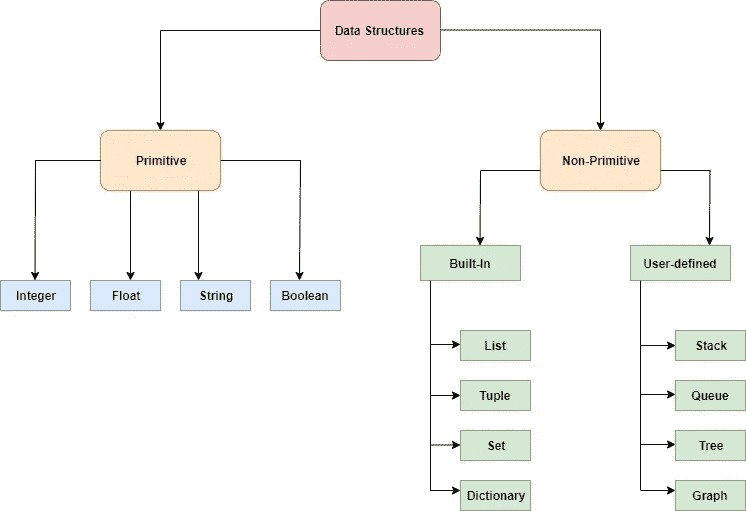

# **列表**

列表是一个可变的序列，可以按顺序保存同类和异类数据。列表中的每个元素都分配了一个地址，称为索引。列表中的元素用逗号分隔，并用方括号括起来。

您可以添加、删除或更改列表中的元素，而无需更改其标识。以下是使用列表时常用的一些函数:

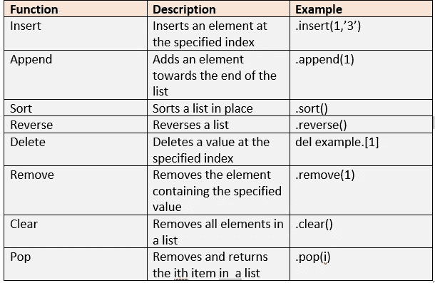

***创建列表:***

```
initial_list = [1,2,3,4]
print(initial_list)
```

列表可以包含不同类型的变量，即使在同一个列表中。

```
my_list = ['R', 'Python', 'Julia', 1,2,3]
print(my_list)
```

***向列表中添加元素:***

```
my_list = ['R', 'Python', 'Julia']
my_list.append(['C','Ruby'])
print(my_list)my_list.extend(['Java', 'HTML'])
print(my_list)my_list.insert(2, 'JavaScript')
print(my_list)
```

使用不同的函数，如插入、扩展和添加列表，输出会有所不同。

insert 函数在指定的位置/索引处添加一个元素。

append 函数将所有指定的元素作为单个元素添加。

extend 函数将逐个添加元素。

***访问元素:***

可以使用方括号对列表进行索引，以检索存储在某个位置的元素。列表中的索引返回该位置的整个项目，而在字符串中，返回该位置的字符。

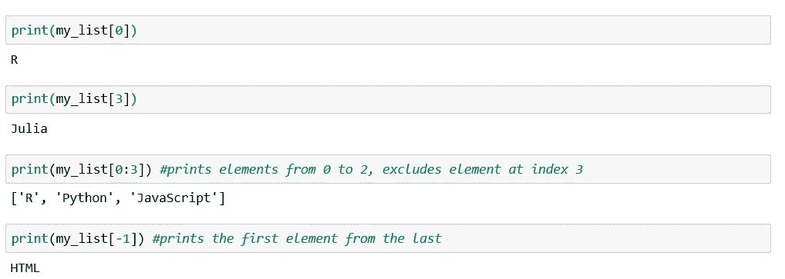

***从列表中删除元素:***

再一次，注意使用不同的函数时的输出，比如 pop、delete 和 remove。当您希望通过指定元素的值来移除元素时，可以使用 Remove。我们使用 del 通过索引移除元素，如果需要返回值，使用 pop()通过索引移除元素。


***切片列表:***

索引仅限于访问单个元素，而切片则访问列表中的一系列数据。

切片是通过定义父列表中第一个元素和最后一个元素的索引值来完成的，这是切片列表中所需要的。它被写成[ a : b ],其中 a，b 是来自父列表的索引值。如果 a 或 b 未定义，则索引值被视为 a 的第一个值(如果 a 未定义),以及 b 的最后一个值(如果 b 未定义)。

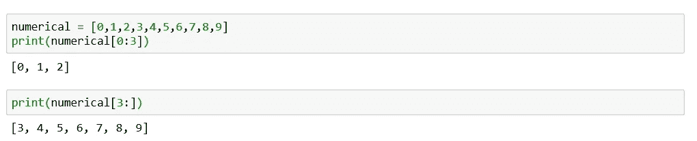

***排序功能:***

```
# print the sorted list but not change the original onenumero = [1,12,4,25,19,8,29,6]
print(sorted(numero))
numero.sort(reverse=True)
print(numero)
```

***最大、最小和 ASCII 值:***

在元素为字符串的列表中， **max( )** 和 **min( )** 适用。 **max( )** 将返回一个字符串元素，当使用 **min( )** 时，其 ASCII 值最高和最低。

每次只考虑每个元素的第一个索引，如果它们的值相同，则考虑第二个索引，以此类推。

```
new_list = ['apple','orange','banana','kiwi','melon']
print(max(new_list))
print(min(new_list))
```

如果数字被声明为字符串会怎么样呢？

```
new_list1 =['3','45','22','56','11']
print(max(new_list1))
print(min(new_list1))
```

即使在字符串中声明数字，也会考虑每个元素的第一个索引，并相应地返回最大值和最小值。

您还可以根据字符串的长度找到最大值和最小值。

***复制&工作列表:***

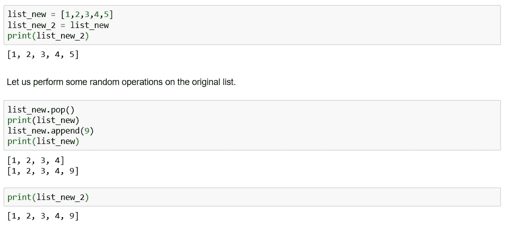

虽然没有对复制的列表执行任何操作，但是它的值也已经被更改。这是因为您已经将 new_list 的相同内存空间分配给了 new_list_2。

我们如何解决这个问题？

如果你还记得的话，在切片中我们已经看到了 parent list [a:b]从 parent list 返回一个带有起始索引 a 和结束索引 b 的列表，如果没有提到 a 和 b，那么默认情况下它会考虑第一个和最后一个元素。我们在这里使用相同的概念。

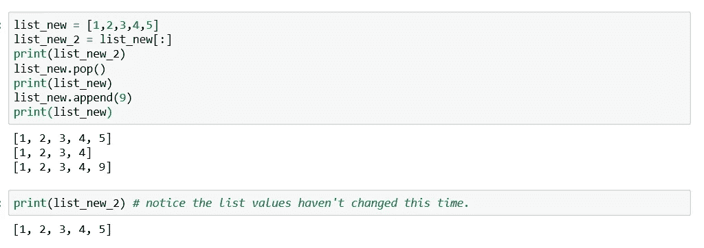

# **元组**

元组用于将多个对象组合在一起。与列表不同，元组是不可变的，并且在圆括号而不是方括号中指定。元组中的值不能被覆盖，也就是说，它们不能被更改、删除或重新分配。元组可以保存同类和异类数据。

***创建和访问元组中的元素:***

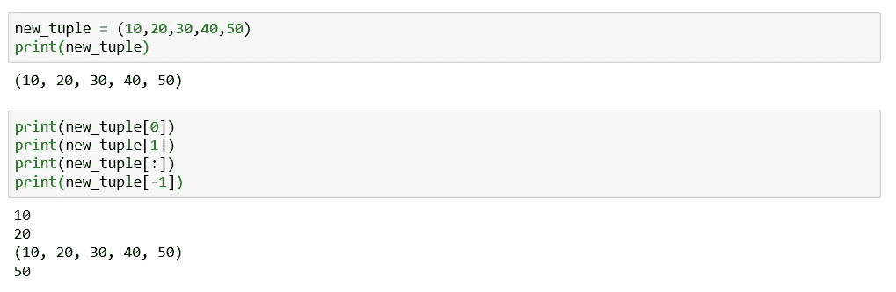

***追加一个元组:***

```
tuple_1 = (1,2,3,4,5)
tuple_1 = tuple_1 + (6,7,8,9,10)
print(tuple_1)
```

元组是不可变的。

***Divmod 函数:***

把元组想象成对某个特定的值为真，而对其他值不为真的东西。为了更好地理解，让我们使用 **divmod()** 函数。

```
xyz = divmod(10,3)
print(xyz)
print(type(xyz))
```

这里商必须是 3，余数必须是 1。当 10 除以 3 时，这些值无论如何都不能改变。因此，divmod 在一个元组中返回这些值。

***内置元组函数:***

Count 和 Index 用于元组，就像它们用于列表一样。

```
example = ("Mumbai","Chennai","Delhi","Kolkatta","Mumbai","Bangalore")
print(example.count("Mumbai"))print(example.index("Delhi"))
```

# **字典**

如果你想实现一个类似电话簿的东西，字典是你所需要的。字典基本上存储“键-值”对。在一个电话目录中，你将拥有 phone 和 Name 作为键，而分配的各种名称和号码就是值。“键”标识项目，“值”存储项目的值。“键-值”对用逗号分隔，值用冒号“:”字符与键分隔。

您可以添加、删除或更改字典中现有的键值对。下面提到的是使用字典执行的一些常见功能。

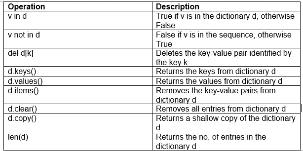

***创建字典:***

```
new_dict = {} # empty dictionary
print(new_dict)
new_dict = {'Jyotika':1, 'Manu':2, 'Geeta':3, 'Manish':4}
print(new_dict)
```

***添加或更改键值对:***

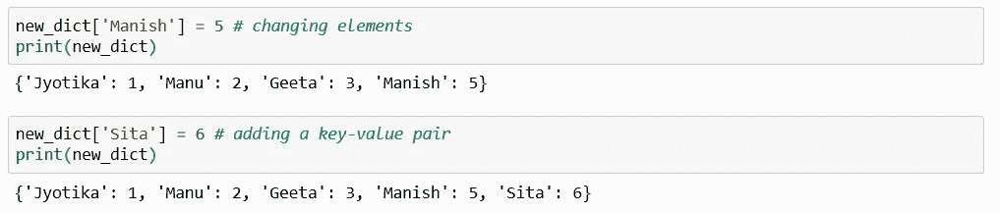

***删除键值对:***

使用 pop()函数删除值，该函数返回已删除的值。

要检索键-值对，可以使用 popitem()函数，该函数返回键和值的元组。

要清除整个字典，可以使用 clear()函数。

```
new_dict_2 = new_dict.pop('Manu')
print(new_dict_2)
new_dict_3 = new_dict.popitem()
print(new_dict_3)
```

***Values()和 keys()函数:***

values()函数返回字典中所有赋值的列表。

keys()函数返回所有的索引或键，这些索引或键包含它被赋予的值。

```
print(new_dict.values())
print(type(new_dict.values()))
print(new_dict.keys())
print(type(new_dict.keys()))
```

# **设定**

集合是唯一元素的无序集合。集合是可变的，但在数据集中只能保存唯一的值。集合运算类似于算术运算。

```
new_set = {1,2,3,3,3,4,5,5}
print(new_set)
new_set.add(8)
print(new_set)
```

***对集合的其他操作:***

**。union()** —合并两个集合中的数据

**。intersection()** —输出两个集合共有的数据

**。difference()** —删除两者中存在的数据，并输出仅存在于传递的集合中的数据。

**。symmetricdifference()** —删除两个集合中存在的数据，并输出两个集合中剩余的数据。

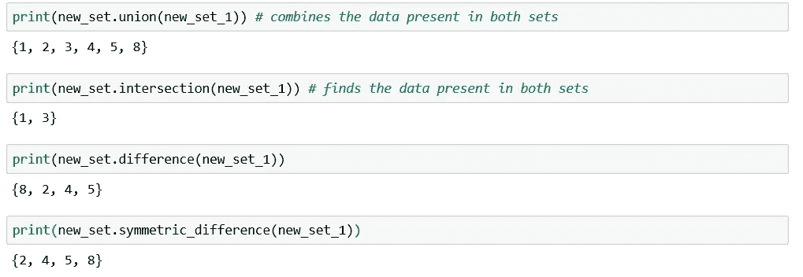

# **用户自定义数据结构概述**

1.  堆栈:基于 FILO(先入后出)和 LIFO(后进先出)的原则，堆栈是线性数据结构，其中新元素的添加伴随着从另一端的等量移除。堆栈中有两种类型的操作:

a)推送——将数据添加到堆栈中。

b)弹出—从堆栈中删除数据。


来源:[https://en . Wikipedia . org/wiki/Stack _(abstract _ data _ type)](https://en.wikipedia.org/wiki/Stack_(abstract_data_type))

我们可以使用 Python 库中的模块和数据结构来实现堆栈，即 list、collections.deque、queue.LifoQueue。

2.队列:队列是一种基于先进先出原则(FIFO)的线性数据结构。首先输入的数据将首先被访问。队列上的操作可以从头到尾两端执行。入队和出队是用于从队列中添加或删除项目的操作术语。与堆栈类似，我们可以使用 Python 库中的模块和数据结构来实现堆栈，即— list，collections.deque。

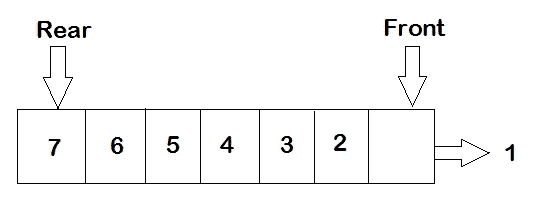

来源:[https://www.guru99.com/python-queue-example.html](https://www.guru99.com/python-queue-example.html)

3.树:树是由根和节点组成的非线性数据结构。数据的起源点称为父节点，随后出现的每一个其他节点都是子节点。最后的节点是叶节点。节点的级别显示了树中信息的深度。

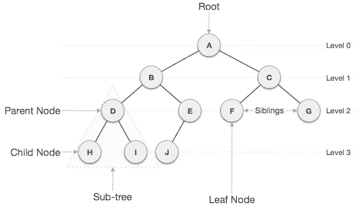

来源:[https://sites . Google . com/site/learnwithdatasures/content/graphs](https://sites.google.com/site/learnwithdatastructures/content/graphs)

4.图形:python 中的图形通常存储称为顶点(节点)和边(边)的点的数据集合。可以使用 python 字典数据类型来表示图表。字典的键表示为顶点，值表示顶点之间的边。

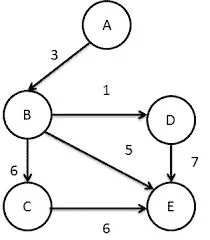

来源:[https://codepumpkin.com/graph/](https://codepumpkin.com/graph/)

数据结构有助于组织信息，不管你是编程新手还是老手，你都不能忽视数据结构的关键概念。

有关 Python 中使用的不同数据结构的更详尽的介绍，请参考以下链接:

[的官方 Python 文档列出了](https://docs.python.org/3/tutorial/introduction.html#lists)、[字典](https://docs.python.org/3/tutorial/datastructures.html#dictionaries)和[元组](https://docs.python.org/3/tutorial/datastructures.html#tuples-and-sequences)

本书 [*一个字节的 Python*](https://python.swaroopch.com/data_structures.html) 。

[https://docs.python.org/3/tutorial/datastructures.html](https://docs.python.org/3/tutorial/datastructures.html)