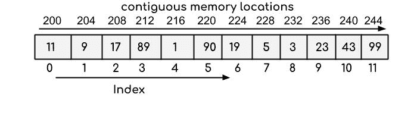
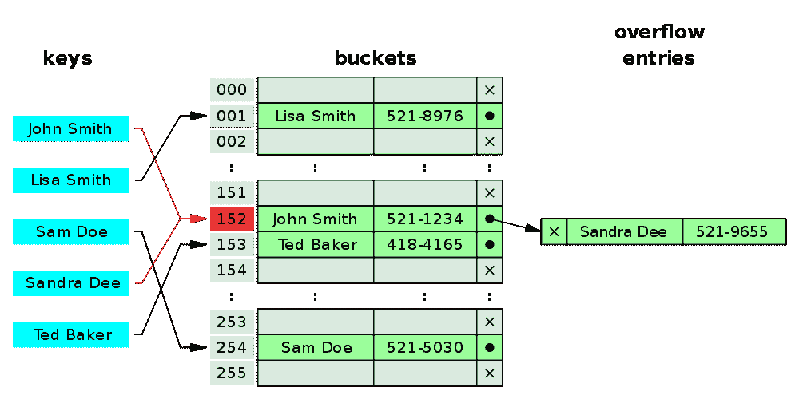
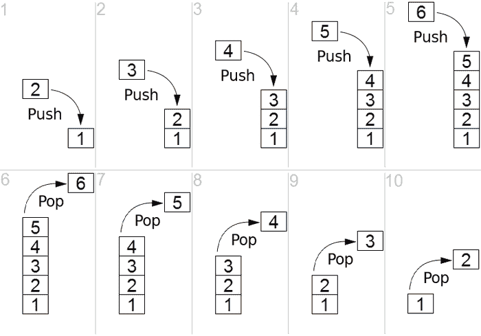
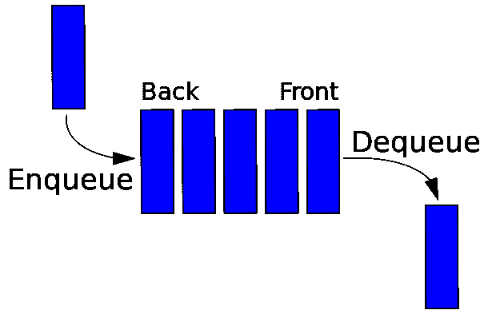
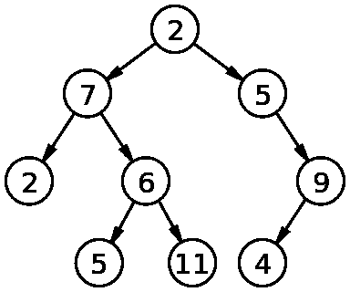

# 数据结构—简化和分类

> 原文：<https://towardsdatascience.com/data-structures-simplified-and-classified-e0c1e304436b?source=collection_archive---------25----------------------->

照片由克里斯蒂娜·莫里路通过 T2 的像素拍摄

为了通过编程面试，你需要解决算法，而要解决算法，你需要数据结构。现在的问题是，当你打开一本数据结构和算法教科书时，它充满了复杂的数学，对于那些不太喜欢这门学科的人来说，它将变成一场噩梦。然而，一旦你理解了数据结构，它们并不像看起来那么难。本文将简化和总结这些最基本的数据结构，您将理解并能够轻松使用它们。

# 什么是数据结构？

数据结构是在计算机中组织数据的一种特殊方式，以便可以有效地使用它:

> 在计算机科学中，数据结构是一种数据组织、管理和存储格式，能够实现高效的访问和修改。更准确地说，数据结构是数据值、数据值之间的关系以及可应用于数据的功能或操作的集合— [维基百科](https://en.wikipedia.org/wiki/Data_structure)

因此，我们必须将数据存储在某种数据结构中，选择正确的结构至关重要。

值得注意的是，没有什么数据结构是好的或坏的，而是每一种都有自己的优点和缺点。许多方法被用来衡量一个数据结构的好坏。这些也被称为[大 O 符号](https://en.wikipedia.org/wiki/Big_O_notation)。这是对操作可伸缩性的一种度量。

现在，让我们讨论不同类型的数据结构。

# 链表

链表的原子单位称为“节点”。这个节点包含一个值和一个指针。该值只是一个数字，比如 12，而指针将该值连接到链中的下一个节点。因此是链表的链接部分。列表中的第一个节点称为**头**，没有指针的最后一个节点称为**尾**。

图片来源:[维基百科](https://en.wikipedia.org/wiki/Linked_list)

**优点:**非常适合添加新节点和删除节点。这是通过改变下一个指针指向的位置来实现的。

**缺点:**不太擅长检索节点，尽管知道索引或搜索，因为每个节点只知道它旁边的节点。

# 排列

数组在所有编程语言中都很常见。它是计算机内存中连续的单元块。

下面的示例表示一个有 12 个元素的整数数组。数组的索引从 0 开始，因此有 12 个元素的数组的索引从 0 到 11。

图片来源: [BeginnersBook](https://beginnersbook.com/2018/10/data-structure-array/)

**优势:**数组在检索项目方面很棒，但只有在数组很小的时候。

**缺点:**随着数组的不断增长，我们开始在内存中运行其他项目。结果，加法是低效的，因为我们可能不得不将数组移动到内存中的新位置，这样它才合适。

幸运的是，这发生在 JavaScript 和 Python 这样的高级语言中。然而，在低级语言中，你必须预先声明数组的大小。

# 哈希映射

第三种类型的数据结构，也是非常重要的一种，是哈希表。这类似于 JavaScript 中的对象和 Python 语言中的字典。在这种类型的数据结构中，您给哈希映射一个单词或一个键，它就会为您检索定义或值。在引擎盖下，它的工作方式很像一个数组。这个密钥通过一个叫做“哈希函数”的函数运行，这个函数会为你溢出内存位置。

不同的是，这些内存位置不需要彼此相邻，而是可以在任何地方。因此，不存在大小增加的问题。然而，有一个不同的问题——取决于您使用的散列算法，两个密钥可能散列到同一个内存位置。这就是所谓的“冲突”,有多种方法可以解决它们，但同样，这一切都发生在引擎盖下。

图片来源:[维基百科](https://en.wikipedia.org/wiki/Hash_table)

**优势:**正如我们所知，哈希映射对于添加和检索非常有用。

**缺点:**可能会造成按键碰撞。

# 堆栈和队列

这两种结构彼此非常相似，都构建在数组之上，并具有一些额外的功能。

堆栈是一个 ***后进先出*** 的数据结构。这类似于一堆托盘相互堆叠，你放在上面的最后一个托盘是你需要取下的第一个托盘。当我们在顶部添加一个项目时，这被称为推动，而当我们从顶部取出一个项目时，这被称为弹出。每种语言都用调用栈来跟踪被调用的函数。栈对于一个叫做[深度优先搜索](https://en.wikipedia.org/wiki/Depth-first_search) (DFS)的算法非常重要。

图片来源:[维基百科](https://en.wikipedia.org/wiki/Stack_(abstract_data_type))

另一方面，队列是一种 ***先进先出*** 结构，类似于公共汽车站的队列或队伍，最后加入队列的人最后进入公共汽车。将一个项目添加到末尾称为入队，将它从前面移除称为出队。队列被用于一种叫做[广度优先搜索](https://en.wikipedia.org/wiki/Breadth-first_search) (BFS)的重要算法中。

图片来源:[维基百科](https://en.wikipedia.org/wiki/Queue_(abstract_data_type))

**优点:**两种结构在添加和删除项目上都非常高效。

**缺点:**与其他数据结构相比，它们的用例数量都非常有限。

# 图形和树

这个主题相当复杂，在计算机语言中有一个专门的章节叫做“图论”。一个图类似于一个链表，其中我们有指向其他节点的节点，除了在这种情况下指针被称为“边”。边也可以被赋予权重或数字。

有一种称为“树”的特殊类型的分层图，其中数据向一个方向扩展。这些可以用来指代很多东西，比如“家谱”，或者用来表示网络。与数组、链表、堆栈和队列这些线性数据结构不同，树是分层的数据结构。

图片来源:[维基百科](https://en.wikipedia.org/wiki/Binary_tree)

**优点:**树提供了有效的插入和搜索，树是非常灵活的数据，允许以最小的努力移动子树。

**缺点:**缺点是修改列表和检索需要花费 **O(log n)** 的时间。

总之，这些数据结构会给你一个很好的基础来开始求解算法。

我希望现在你对数据结构有了更多的了解，并且你可以更好地理解抽象表面下的可行结构来使用你的编程语言。

感谢阅读这篇文章！如果你有任何问题，请在下面留言。此外，看看我的其他文章，你可能会喜欢:

 [## 理解大 O

### 你的算法效率如何？

medium.com](https://medium.com/swlh/understanding-big-o-ff675cf63e11)  [## 如何增加你找到工作的机会

### 本文将详细介绍设计简历的最重要的技巧和诀窍，以便在求职过程中获得优势

medium.com](https://medium.com/@vpodk/how-to-increase-your-chances-of-getting-a-job-254c97c3b448)