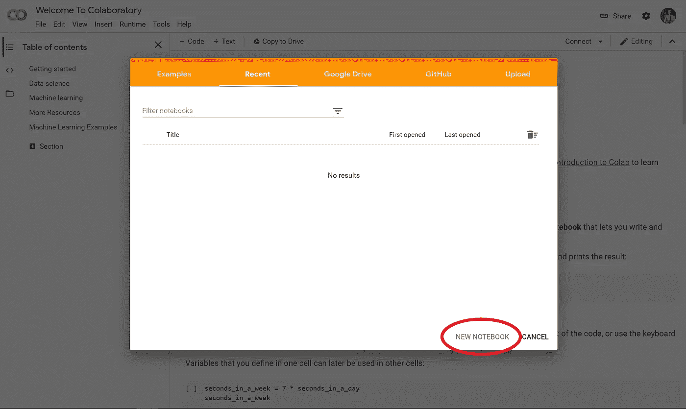
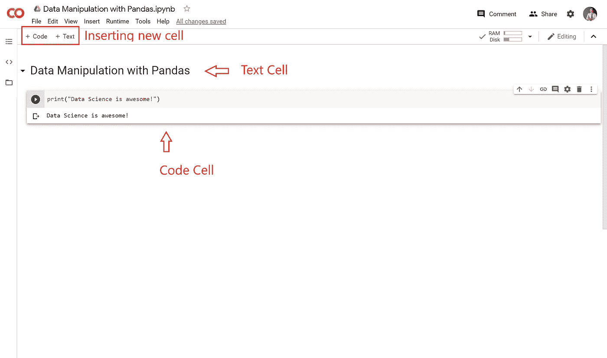
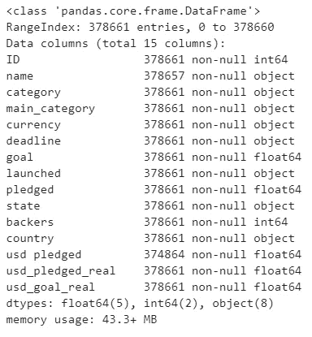
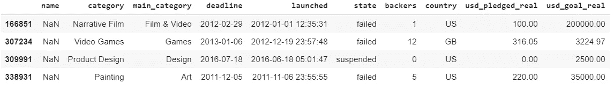
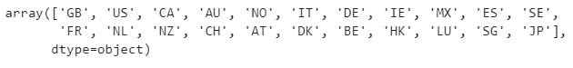
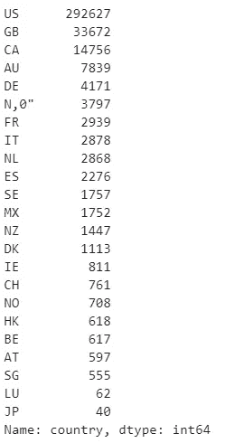
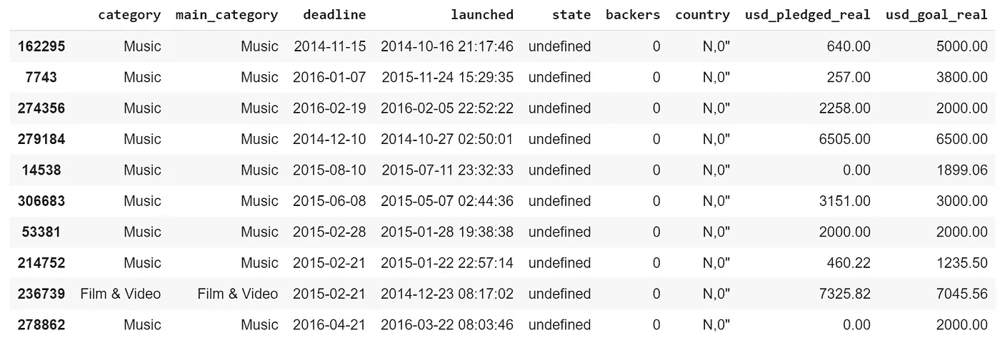
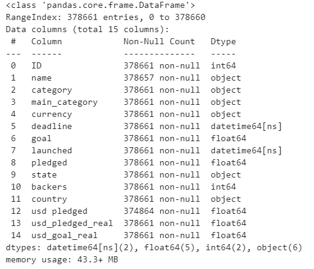

# 数据对话:熊猫数据操作实用教程

> 原文：<https://towardsdatascience.com/data-talks-a-practical-tutorial-on-data-manipulation-with-pandas-6a4715382a1?source=collection_archive---------34----------------------->

## 了解如何使用 Kickstarter 项目数据集处理和操作数据。

来源: [Kickstarter](https://www.kickstarter.com/learn)

# 数据无处不在

直到互联网的诞生，数据才真正对我们的生活产生重大影响，并彻底改变了商业运作的方式。这些天，我们有几乎所有的数据，从我们最喜欢的麦片品牌，你最好的朋友毕业的学校，到你下午 2 点的心率。现在说数据已经融入到我们的基因里，大概不为过。

 [## 数据就是一切，每个人都是数据。

### 收集、组织、构建和分析大规模数据的能力可能是最重要的特质…

medium.com](https://medium.com/scidex/data-is-everything-and-everyone-is-data-1886cfce2d92) 

无论是在日常生活中还是在商业环境中，为了我们自己的利益利用这些数据都不是一件容易的事情。**为什么？**处理数据不仅需要相关领域的知识，还需要对数学或计算机科学(仅举几个例子)的技术理解，这对任何没有技术背景的人来说都是一个挑战。

希望能帮助初学者消除这个入门障碍，我正在写这个系列，叫做**数据会谈。**它将介绍处理数据的必要工具，更重要的是，讲述数据语言的“词汇和语法”。

该系列将包括三个部分:

*   第 1 部分:熊猫的数据操作
*   **第 2 部分:**使用 Matplotlib 实现数据可视化(即将推出)
*   **第 3 部分:**使用 Google Data Studio 进行数据报告(即将推出)

为了演示这些技术，我将使用来自 **Kaggle** 的 [**Kickstarter 项目数据集**](https://www.kaggle.com/kemical/kickstarter-projects) 。[**ka ggle**](http://kaggle.com)**是一个非常有用的网站，拥有大量数据集、竞赛和其他资源，可以帮助您提高数据科学技能。**

****

**来源: [Kickstarter](https://www.kickstarter.com/)**

# **这是给谁的？**

**这个系列适合完全初学者。一些关于 Python 的先验知识会有所帮助，但并不是必须遵循的。即使您熟悉所介绍的工具，您仍然可以找到一些提示和技巧来升级您的武器库。**

# **开始之前**

1.  ****基本 Python** :我们将在第 1 部分和第 2 部分使用的工具在 **Python** 中。Python 是一种流行而强大的编程语言，有很多应用，尤其是在数据科学领域。Python 很容易上手，所以如果你不熟悉这种编程语言，可以看看下面的文章。**

** [## 学习 Python:从零到英雄

### 首先，Python 是什么？根据它的创造者吉多·范·罗苏姆的说法，Python 是一种:

medium.com](https://medium.com/the-renaissance-developer/learning-python-from-zero-to-hero-8ceed48486d5) 

2. **Google 账号:**使用 Google[**Colab**](https://colab.research.google.com/)—我们的编码环境和 Google[**Data Studio**](https://datastudio.google.com/)。

Google Colab 是一个编码环境，你可以在其中运行 Python 代码，无需任何预先设置。很整洁，不是吗？它也是以互动的形式开发的，允许你轻松地写笔记，使它成为学习者的理想工具。

要创建新笔记本，请进入 [**Google Colab**](https://colab.research.google.com/) 然后点击**新笔记本**。

你会看到如下界面:

*   代码单元:这些是你编写和执行代码的地方。
*   文本单元格:你可以在这些单元格中写笔记/标题。** 

# **熊猫**

****Pandas** 是一个强大的 **Python** 库，用于处理和分析数据。它能够处理大型数据集(不像 Excel)和处理复杂的数据操作任务。在本文的剩余部分，将向您介绍 Pandas 的基本特性，以及如何在 Kickstarter 项目数据集中应用它们。**

**这篇文章中没有提到熊猫的许多特征。我建议你在图书馆工作时参考熊猫文档。**

## **导入库**

**Pandas 没有自带 Python，所以我们首先需要将这个库导入到我们的笔记本中。幸运的是，Colab 的环境中预装了 Pandas，所以我们不必担心安装步骤。**

**`pd`是**熊猫的常用别名。****

**注意`pd`是我们为熊猫**设置的别名(即昵称)。从现在开始，无论何时我们想使用这个库，我们都可以简单地调用`pd`。****

## **读取数据**

**Pandas 支持各种输入数据源，如 csv 文件、Excel 电子表格、SQL 查询等。在本例中，我们将从 csv 文件导入 Kickstarter 项目数据集。**

**我们首先需要让 Colab 笔记本访问我们的 Google Drive，这是我们存储 csv 文件的地方。**

**运行上面的代码将生成一个链接，您可以点击它。用你的 Google 帐户登录，然后将**授权码**复制到运行代码后你会在 Colab 笔记本上看到的输入框中。**

**为了从 csv 文件中读取数据，我们使用 Pandas 方法 pamdas `.read_csv()`。**

**方法`.read_csv()`将文件的*路径*作为参数。您可能需要根据您放置 csv 文件的位置进行更改。数据将被读取并保存到**数据帧**(我将把它保存到一个名为`data`的变量中)。数据帧和**系列、**是 Pandas 中使用的两种主要数据结构。**

*   ****数据帧**是二维数组。这些就像你的 Excel 表格，有多列和多行，因此是二维的。**
*   ****系列**是**数据框架中的“列”。**这些对象只是一维的，每个对象只能包含一种数据类型(如字符串、浮点、日期时间等)。)**

## **查看数据**

********

**data.info()的输出**

**方法`.info()`为我们提供了数据的汇总报告，包括行数、非空值的数量、每个系列的数据类型以及数据帧的内存使用情况。这通常是我们导入数据后做的第一件事。**

**为了显示数据，我们可以简单地在代码单元中写下`data`(或者你给变量起的名字)并执行/运行代码单元。您可以使用快捷键 shift-enter 来完成此操作。**

**或者，我们可以用方法`.sample(n)`显示一些随机样本。`n`是我们想要显示的样本数量。例如，下面的代码打印出 Kickstarter 项目数据集中的 10 个随机行。**

**同样，您可以使用`.head(n)`和`.tail(n)`分别显示第一行和最后一行的*和*。**

**为了只选择一个或一些*系列*(列)，我们可以将系列名称放在*数据帧* `data`后面的方括号`[]`中。**

## **清理数据**

****

**我们处理的数据几乎从未为直接分析做好充分准备。有时，可能会有丢失或不准确的值，这会打乱我们的计算。在其他情况下，我们将需要执行进一步的处理和工程，以进行更有意义的分析。**

****处理缺失数据****

**Pandas 有几个内置函数来处理丢失的数据。例如，方法`.isnull()`过滤掉丢失的值。结合聚合方法`.sum()`，这将得出每个序列中缺失值的总数。**

****

**data.isnull()的输出。总和()**

**在我们的例子中，序列`name`中有 4 个缺失值。我们可以通过应用*过滤器*来进一步研究这些值是什么。**

****

**数据的输出[数据['名称']。isnull()]**

**`data['name'].isnull()`过滤掉`name`系列中缺失的值。当放在数据框`data`后面的方括号`[]`内时，它被用作步进器。`NaN`代表非数字，它是一种特殊的数值数据类型，代表未识别或缺失的值。**

**既然我们已经确定了丢失的值，下一步就是决定如何处理它们。最简单的方法是**删除**包含丢失数据的行。然而，这种方法通常应该避免，因为它减少了我们拥有的数据总量，并可能导致我们分析中的偏差。如果缺失数据在数据集中占很大比例，这种偏差可能非常显著。查看下面的文章，了解更多处理丢失数据的方法。**

** [## 如何处理丢失的数据

### “归罪的想法既诱人又危险”(R.J.A .利特& D.B .鲁宾)

towardsdatascience.com](/how-to-handle-missing-data-8646b18db0d4) 

对于我们的例子，`name`对于我们的分析来说不是一个非常有用的序列，所以我们可以安全地用某个任意值替换这个序列中缺失的值，或者简单地从数据帧中删除这个序列。先说第一种方法。

`data['name']`选择系列`name`。方法`.fillna()`用指定值替换所选系列中缺失的数据。参数`inplace = True`告诉 Pandas 直接修改原始数据帧`data`。将参数`inplace = False`保留为默认值将返回一个填充了缺失值的新序列，而不是将更改应用到实际的数据帧`data`。

**下降系列**

有时我们可能想排除一些不必要的系列。这样做的一个原因是它可以提高性能，特别是当我们处理大型数据集时。但是，在决定删除哪个系列时应该仔细考虑，因为您可能会删除有用的信息。

我们还包括参数`inplace = True`来直接修改`data`。

**处理错误**

在我们的数据中出现错误并不罕见，它可能由于多种原因而发生，从人为错误到系统故障。无论如何，我们都需要适当地处理它们，以便我们的分析更加准确。然而，识别和修复这些错误通常非常具有挑战性，因为它们不仅需要技术技能，还需要对数据集的深刻理解。

数字数据:数字数据中的错误需要各种各样的统计技术，这对于这篇介绍性文章来说可能太难了。

**分类**数据:检测分类数据错误的最快方法是打印出所有唯一值。

数据输出['国家']。唯一()

稍微好一点的方法是使用熊猫的方法`.value_counts()`，它打印出唯一的**值**和它们的**频率**。

数据输出['国家']。值计数()

这个系列讲述了 Kickstarter 上的一个项目是从哪里来的。有一个奇怪的值`N,0"`，好像是个错误。让我们看看它们是什么。

数据的输出[data[' country ']= ' N，0 ']。样本(10)

这些值是数据收集期间的错误(未定义状态和 0 支持者),由于它们只占整个数据集的 1%,我们可以删除它们。

**处理日期时间数据**

日期时间数据通常需要不同类型的处理。例如，我们可能想要计算两个日期之间的持续时间，或者提取时间部分(月、年、小时、分钟等。).Pandas 通过内置的日期时间函数使这些任务变得简单。

首先，我们需要转换 datetime 序列，以更正其正确的数据类型。

将**截止日期**和**启动日期**系列转换为日期时间后的输出 data.info()

为了提取任何日期时间成分，我们使用子模块`dt`。

上面的代码在我们的数据框架中创建了一个关于项目启动年份的新系列。有了它，我们可以很容易地发现这个系列中的一个错误。

这段代码返回 1970 年，这没有任何意义，因为 Kickstarter 是在 2008 年成立的！这显然是一个错误，因此我们可以从数据框架中排除任何启动年份小于 2008 年的行。

为了计算项目的持续时间，我们可以取`deadline`和`launched`系列的差值。

这将在两个 datetime 序列之间执行元素减法，并返回一个 timedelta 序列，我们可以将它转换为月或日这样的时间组件。

我们这里需要`numpy`的帮助。Numpy 是另一个非常强大的 Python 库，它增加了对数组和矩阵的支持。Pandas 构建在 Numpy 之上(还记得 DataFrame 是一个二维数组或矩阵吗？)所以这两个库配合得很好。要将时间增量转换为月份，请将`'D'`转换为`'M'`，或者如果您想转换为小时，请选择`'h'`。点击阅读更多[。](https://docs.scipy.org/doc/numpy/reference/arrays.datetime.html#datetime-units)** 

# **完整的笔记本**

**你可以在这里 找到本文 [**中的数据和包含代码的 Colab 笔记本。**](https://drive.google.com/drive/folders/1RC46pGR6pXAmjMni8jHreYn16wZDyMyM?usp=sharing)**

# **下一步是什么？**

**在接下来的几年里，熟练使用数据将成为一项基本技能。Pandas 是帮助你处理数据的一个很好的工具，尤其是当数据变得更大更复杂的时候。**

**在**数据会谈**系列的第二部分，我将讨论数据分析项目的下一步，即探索数据和提取见解。有了它，我将介绍 **Matplotlib** ，一个用于数据可视化的 Python 库。**

*   ****第 2 部分:**使用 Matplotlib 进行数据可视化(待更新)**
*   ****第 3 部分:**使用 Google Data Studio 进行数据报告(待更新)**