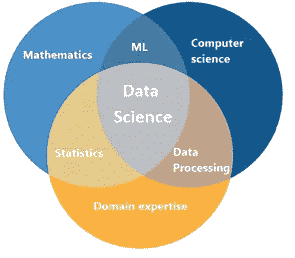
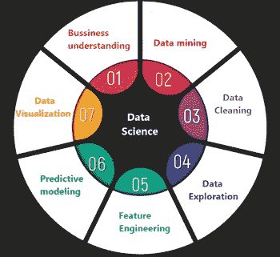
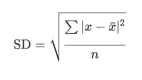

# 数据—数据科学之旅的起点

> 原文：<https://towardsdatascience.com/data-the-starting-point-of-a-data-science-journey-f7880f9f0eb7?source=collection_archive---------46----------------------->

## 数据为什么重要？有哪些类型的数据？我们如何在数据科学预测中使用数据？

# 什么是数据科学？

关于数据科学的有趣的事情是，它是一个年轻的领域，从教科书到报纸到白皮书，定义可能会有所不同。一般的定义是，数据科学是多种工具、算法和机器学习原则的混合物，目的是发现数据中隐藏的模式。这与已经存在并使用多年的统计数据有何不同？答案在于解释和预测的区别。

# 数据科学过程

数据科学由七个主要步骤组成。它们中的每一个对模型的准确性都很重要。我们来看看每一步都包含了什么。

## 商业理解

如果我们想创建一个数据科学项目，我们需要理解我们试图解决的问题。因此，在这一步中，我们必须得到以下问题的答案:

多少人？

哪个类别？

哪个小组？

这很奇怪吗？

-应考虑哪个选项？

基于对这些问题的回答，我们可以得出哪些变量应该被预测的结论。

## 数据挖掘

下一步是找到正确的数据。数据挖掘是从不同来源寻找和收集数据的过程。我们需要回答以下问题:

-项目需要哪些数据？

-我在哪里可以找到这些数据？

-如何获取数据？

-存储和访问数据的最有效方式是什么？

如果数据在一个地方，这个过程对我们来说会很容易。通常情况下，情况并非如此。

## 数据清理

这是最复杂的一步，需要 50%到 80%的时间。数据收集后，我们必须清理它。数据可能包含丢失的值，或者在一列中可能不一致。这就是为什么我们需要清理和组织我们的数据。

## 数据探索

在数据被清理之后，我们将试图在其中找到一个隐藏的模式。该步骤包括提取子集、分析和可视化子集。在此之后，我们得到了每个数据点背后的完整图像。

## 特征工程

在机器学习中，特征被解释为被观察到的现象的属性。例如，如果我们正在观察一个学生的成绩——一个可能的属性可能是学生获得的睡眠时间。该步骤分为两个子步骤。第一个是特征选择。在这一步中，我们可以删除一些特征，以减少可能导致模型复杂的维度。此外，我们想要删除的功能通常会带来比有用信息更多的干扰。第二个子步骤是要素构建-这意味着我们可以在现有要素的基础上构建一个新要素。

## 预测建模

这是我们最终建立模型的步骤。在这里，我们决定我们将使用哪个模型——基于我们在第一步获得的答案。这不是一个容易的决定，也不总是有一个答案。模型及其准确性取决于数据——数据的大小、数据的类型以及数据的质量。模型训练完成后，我们必须评估精度，确定模型是否成功。

## 数据可视化

在我们从模型中获得信息后，我们需要以不同的方式将它们可视化，以便被项目中的每个人理解。

## 商业理解

一旦一切都完成了，我们就返回到第一步，检查模型是否满足最初的需求。如果我们在生命周期的第一次迭代中遇到了新的见解(我确信我们会遇到)，我们现在可以将这些知识输入到下一次迭代中，以产生更强大的见解，并释放数据的力量，为项目提取非凡的结果。

# 什么是数据？

我们可以看到，几乎每一步都需要数据。我们可以看到，上一部分的五个步骤中有四个是与数据相关的。因此，我们可以假设数据在数据科学项目中起着至关重要的作用。什么是数据？数据是如何定义的？这看起来似乎是一个不重要的定义，但它是。每当我们使用“数据”这个词时，我们指的是一组有组织或无组织的信息。

# 基本数据类型

根据上一部分的定义，有两种格式:

o **结构化(有组织的)数据:**按行/列结构分类的数据，其中每一行代表一个观察值，每一列代表该观察值的特征

o **非结构化(无组织)数据:**自由形式的数据，通常是文本或原始音频/信号，必须进一步解析才能变得有组织。

当我们谈论数据时，我们首先需要回答的是数据是定量的还是定性的。当我们谈论定量数据时，我们通常会想到结构化数据集。这两种数据类型可以定义如下:

o **量化数据:**当数据可以用数字来描述，并且在集合上可以进行基本的数学运算，包括加法。

o **定性数据:**当数据无法用数字和基础数学描述时。这些数据通常使用自然类别和语言来描述。

## 数据

定量数据可以是:

o **离散数据:**描述被计数的数据。它只能呈现特定的值。离散定量数据的例子包括掷骰子，因为它只能取六个值，以及咖啡店的顾客数量，因为你不能有一个真实的人群范围。

o **连续数据:**描述测量的数据。它存在于无限的价值范围内。

## 数据的四个层次

一般认为，结构化数据的特定特征(特征/列)可以分为四个数据级别。这些级别如下:

o 名义水平

o 序数级别

o 区间水平

o 比率水平

让我们更深入地了解每一个层次，并解释每一个层次。

## 名义水平

该级别包含由名称或类别描述的数据。比如性别，名字，物种等等。这些数据不能用数字来描述，所以它是定性数据，因此我们不能对这些数据进行数学运算，如加法或除法。我们可以在这个级别上执行的操作是等式和设置隶属函数。此外，我们不能使用中心的度量——中心的度量被解释为向我们显示数据趋向于什么的数字，有时它被称为数据的平衡点。为什么我们不能使用中心的测量？解释很简单——通常，当我们使用这种方法时，我们使用众数、中位数或平均值。但是，在名义水平上，我们不能使用数学运算，所以这些措施没有意义。总之，这一层由分类数据组成，我们必须小心使用这些数据——因为它可能包含对我们非常有用的见解。

## 序数级别

当我们谈论数学运算时，名义水平不是很灵活。序数级的数据提供了一个等级顺序，但是我们仍然不能使用更复杂的数学运算——比如减法或加法，以便获得真正的意义。例如，从 1 到 10 的等级是序数数据——如果我们想使用加法，我们不会从中获得任何有用的信息。再比如一个调查结果。在这个层次上，我们在数学运算上比在名义上有更多的自由。名义级别的数学运算(相等和集合成员)被继承，允许的附加运算是排序和比较。在顺序级别，中位数通常是定义数据中心的合适方法，但我们也可以使用该模式。然而，平均值是不可能的，因为这一级别的划分是不允许的。

## 间隔等级

现在，我们正在达到这样一个水平，数据可以用平均值来表示，我们可以使用更复杂的数学公式。间隔级别的数据支持数据点之间的相减。例如，包含温度的数据属于间隔级别。来自较低级别的操作(排序、比较等)被继承，并且允许的附加操作是加法和减法。当我们谈论中心的度量时，我们可以使用中位数、众数或平均值，通常，对中心最准确的描述是算术平均值。让我们看一个例子。我们试图使用包含储存疫苗的冰箱温度的数据来找到中心的度量。最佳温度必须低于 29 度。找到平均值和中值后，我们假设它们都接近 31，因此这对于我们的数据集来说是不可接受的。这就是我们需要另一个衡量标准的地方——方差或标准差。如果我们想知道我们的数据是如何分布的，我们可以使用这个方法。如果要求方差的度量，需要计算均值，从均值中减去每个点，求每个平方差的平均值，求平方根。公式如下:

如果我们在温度的例子中使用这个公式，我们可以计算数据集的标准偏差，根据这个度量，我们可以看到温度可能会下降(平均值减去标准偏差)。

## 比率水平

最后一个层次叫做比率层次。比率和区间水平之间没有太大的区别——有时我们可能会搞不清哪个才是正确的。在区间水平上，我们没有自然起点或自然零点，但在比率水平上——我们有。来自较低层的数学运算被继承，而附加的是乘法和除法。例如，银行账户中的钱被分类到这一级——一个银行账户可以有一个自然零。作为中心的度量，我们可以使用几何平均值—它是所有值的乘积的平方根。这个级别的数据应该是非负的，这就是为什么这个级别不是优选的。

# 结论

数据科学可以为任何业务增加价值，重要的是好好利用数据。此外，数据科学可以帮助我们基于可测量的证据做出更好的决策。当我们做决策时，数据应该总是可用的。使用数据科学方法，我们可以研究历史数据，与竞争对手进行比较，分析市场，最重要的是，就产品或服务的最佳表现提出建议。这些分析是数据科学的一部分，提供了对市场的深入了解和理解，以及他们对产品或服务的反馈。据估计，每天产生大约 25 亿千兆字节的数据。随着数据量的增加，获取对目标群体来说重要的内容可能会很困难。公司从客户那里收集的每一条数据——无论是社交媒体赞、网站访问还是电子邮件调查——都包含可以分析的数据，以便更有效地了解客户。这意味着某些群体的服务和产品是可以定制的。例如，发现年龄和收入之间的相关性可以帮助公司为以前可能没有的群体创造新的促销或优惠。

如果你对这个话题感兴趣，请随时联系我。

领英简介:[https://www.linkedin.com/in/ceftimoska/](https://www.linkedin.com/in/ceftimoska/)