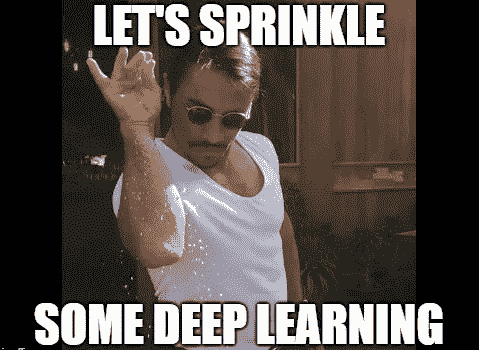

# 用 T5 产生数据到文本；建立一个简单而先进的 NLG 模型

> 原文：<https://towardsdatascience.com/data-to-text-generation-with-t5-building-a-simple-yet-advanced-nlg-model-b5cce5a6df45?source=collection_archive---------2----------------------->

## 通过微调 T5 实现数据到文本的 NLG 模型


作者图片

# **简介**

自从自然语言处理领域中的序列到序列模型出现以来，我就一直在探索 NLG 模型的数据到文本生成能力。解决这个问题的早期尝试没有显示出任何有希望的结果。像[简单 NLG](https://github.com/simplenlg/simplenlg) 这样的非基于 ML 规则的方法似乎没有很好地扩展，因为它们需要格式良好的输入，并且只能执行诸如改变句子时态之类的任务。但是在语言模型的时代，每两周就会有变形金刚的新版本发布，这样的任务不再是遥不可及的梦想。

在这篇博客中，我将讨论我如何用高级深度学习模型处理数据到文本的生成问题。



模因通过[图像翻转](https://imgflip.com/memegenerator)

openAI GPT-2 似乎是一个不错的选择，因为它具有引人注目的文本生成能力。但是在 NLG 2017 年数据上训练它并没有让我有所收获。模型根本没有收敛。GPT-2 的有条件和无条件文本生成能力相当不错，但是您很难找到可以处理这些任务的业务用例。

此外，根据特定领域的数据对它们进行微调有时会导致产生脱离上下文的句子


通过[图像翻转](https://imgflip.com/memegenerator)进行迷因

由于 openAI(不那么开放)没有发布 GPT-3 的代码，我在该系列中只剩下第二好的，即 [T5](https://arxiv.org/pdf/1910.10683.pdf) 。

# **型号:谷歌 T5**

Google 的 T5 是一个文本到文本转换转换器，它是一个共享的 NLP 框架，所有的 NLP 任务都被重新组织成一个统一的文本到文本格式，输入和输出都是文本串。


图片来源:[谷歌博客](https://ai.googleblog.com/2020/02/exploring-transfer-learning-with-t5.html)

它与只能输出一个类标签或输入范围的 BERT 型模型有很大的不同。T5 允许我们在任何 NLP 任务中使用相同的模型以及损失函数和超参数。

# **数据:WebNLG 2020**

我使用 WebNLG Challenge 2020 的 RDF-to-text 生成任务的[数据](https://gitlab.com/shimorina/webnlg-dataset/-/tree/master/release_v3.0)来训练 T5。

给定(a)中所示的四个 RDF 三元组，目标是生成一个像(b)这样的文本

**(a)RDF 三元组**


来源: [WebNLG](https://webnlg-challenge.loria.fr/challenge_2020/)

**(b)英文本**

*特灵于 1913 年 1 月 1 日在威斯康星州的拉克罗斯成立，总部位于爱尔兰。它有 29，000 名员工。*

# **数据预处理**

要对数据进行预处理，可以使用 Python 中的 XML WebNLG 数据读取器[这里是](https://gitlab.com/webnlg/corpus-reader)，或者使用下面代码中给出的`[xml.etree.ElementTree](https://docs.python.org/3/library/xml.etree.elementtree.html#module-xml.etree.ElementTree)`模块。(我最终使用了后者，因为我太无知了，无法阅读整个挑战文档😐)

在代码中，您可以看到我们保留了正常的三元组，并用“&&”连接多个三元组。当一个表的多行被一次输入到模型中时，它可以被认为是一个分隔符。

# **训练模型**

像往常一样，谷歌的 TensorFlow 实现很难解释，我继续使用[拥抱脸](https://github.com/huggingface/transformers)的 PyTorch 实现，并选择了 T5 基础模型。整个模型训练在 google colab 中进行。


通过[图像翻转](https://imgflip.com/memegenerator)进行迷因

安装转换器库

```
!pip install transformers
```

导入所需的模块

```
import pandas as pdimport torchfrom transformers import T5Tokenizer, T5ForConditionalGeneration,Adafactor 
```

加载预处理后的数据，并随机重排行，使不同长度的三元组(1 个三元组到 7 个三元组)分布在数据框中，从而快速归纳损失。
修剪掉一些数据点，这样一批就不会留下任何余数，因此可以避免一些代码行(好吧，这可能是一种粗略的做法)。

```
train_df=pd.read_csv(‘webNLG2020_train.csv’, index_col=[0])
train_df=train_df.iloc[  :35000,:]
train_df=train_df.sample(frac = 1)batch_size=8
num_of_batches=len(train_df)/batch_size
```

检测 GPU。

```
if torch.cuda.is_available():
   dev = torch.device("cuda:0")
   print("Running on the GPU")
else:
   dev = torch.device("cpu")
   print("Running on the CPU")
```

加载预训练的模型、记号化器，并将模型移入 GPU。

```
tokenizer = T5Tokenizer.from_pretrained(‘t5-base’)
model = T5ForConditionalGeneration.from_pretrained(‘t5-base’,
                                             return_dict=True)#moving the model to GPU
model.to(dev)
```

使用推荐的 T5 设置启动 Adafactor 优化器。

```
optimizer = Adafactor(model.parameters(),lr=1e-3,
                      eps=(1e-30, 1e-3),
                      clip_threshold=1.0,
                      decay_rate=-0.8,
                      beta1=None,
                      weight_decay=0.0,
                      relative_step=False,
                      scale_parameter=False,
                      warmup_init=False)
```

基于 Html 的进度条。

```
from IPython.display import HTML, display
def progress(loss,value, max=100):
 return HTML(""" Batch loss :{loss} <progress    
value='{value}'max='{max}',style='width: 100%'>{value}
      </progress> """.format(loss=loss,value=value, max=max))
```

现在，训练模型。

我花了大约 3-4 个小时在 Colab GPU 上运行四个纪元。

序列化模型

```
torch.save(model.state_dict(),'pytoch_model.bin')
```

t5 基础模型的配置文件可以下载并放置在与保存的模型相同的目录中。确保将其重命名为 config.json

```
!wget https://s3.amazonaws.com/models.huggingface.co/bert/t5-base-config.json
```

# **加载训练好的模型进行推理**

确保给定的路径既有保存的模型又有配置文件。此外，如果您有一个用于执行推理的 GPU，请记住将模型和输入张量移动到 GPU。

# **生成的结果**

现在让我们看看不同输入生成的文本输出。


作者图片

# 结论

我们讨论了如何构建一个从结构化数据生成文本的高级 NLG 模型。T5 的文本到文本架构使得将结构化数据(可以是文本和数字数据的组合)输入模型变得容易。我在 huggingface 的 transformer 上使用了原生 PyTorch 代码，在 WebNLG 2020 数据集上对其进行了微调。

> 与基于 GPT-2 的文本生成不同，这里我们不仅触发语言生成，我们还控制它！！

然而，这是该方法的基本实现，并且使用相对不太复杂的数据集来测试该模型。当用具有两个以上三元组的数据点测试模型时，它似乎忽略了数据输入中存在的一些信息。为了解决这个问题，需要做进一步的研究和大量的实验。

你可以在这个[回购](https://github.com/MathewAlexander/T5_nlg.git)里找到代码

有什么问题尽管问！谢谢大家！