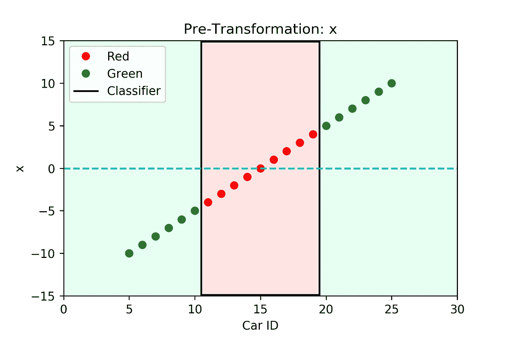
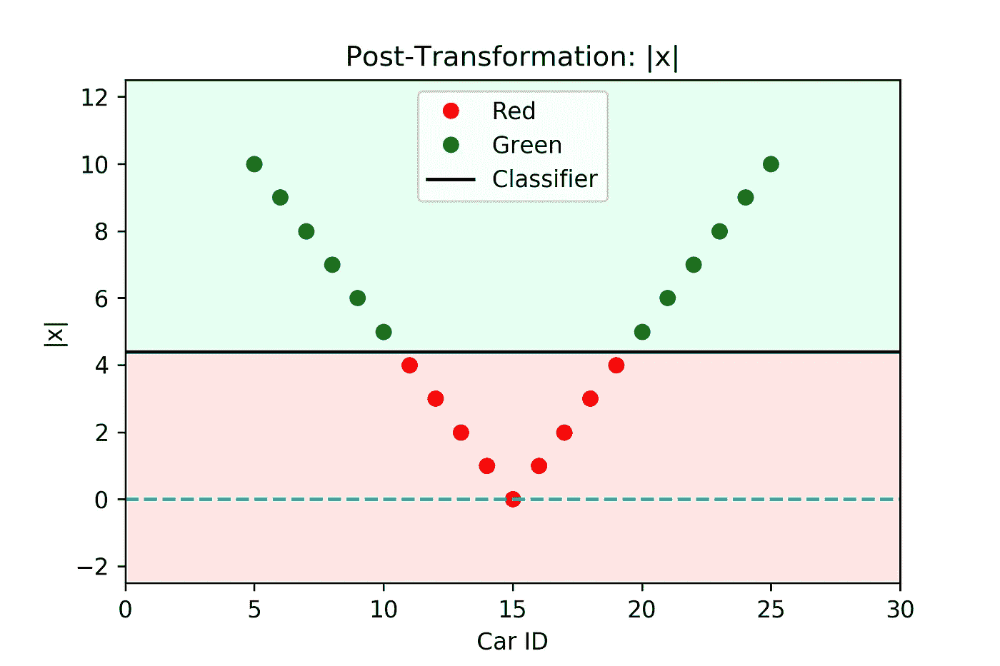
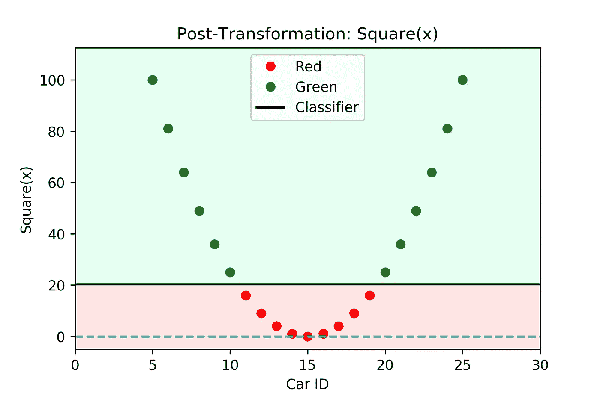
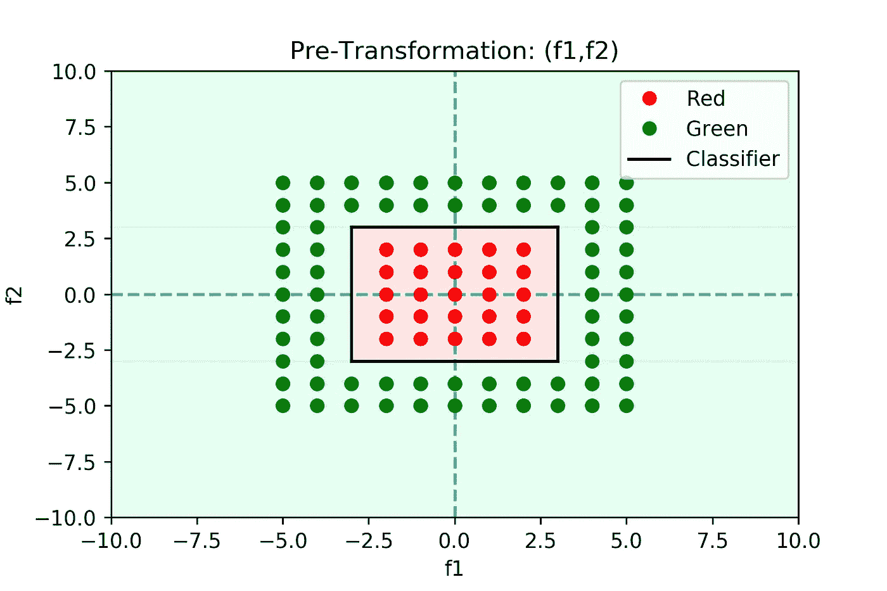
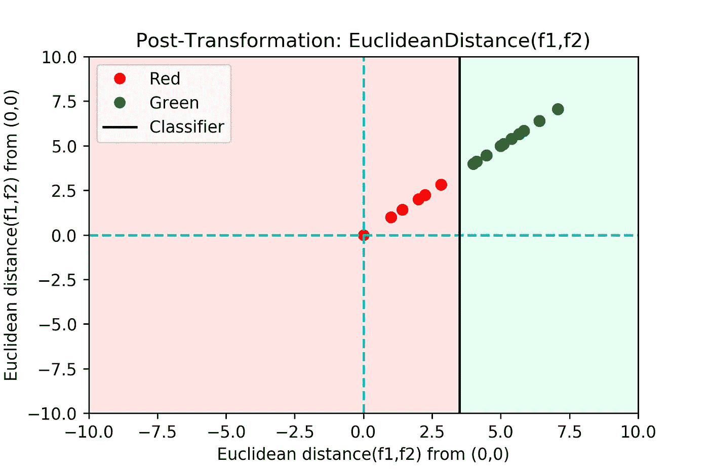
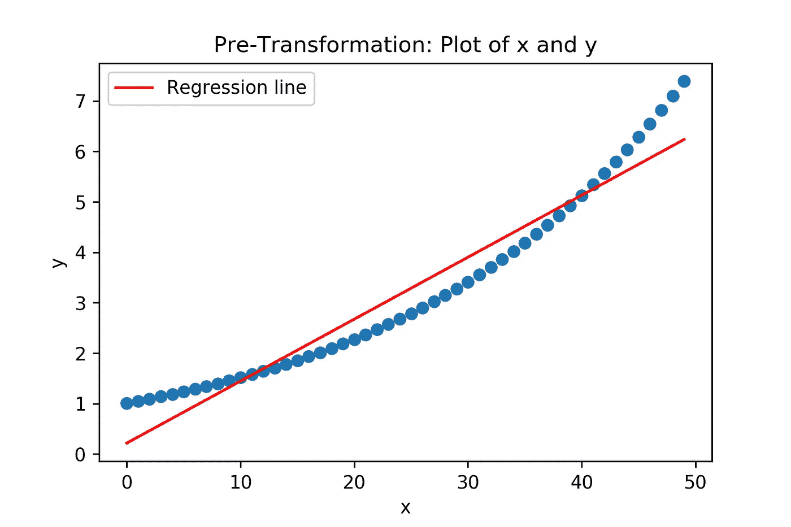
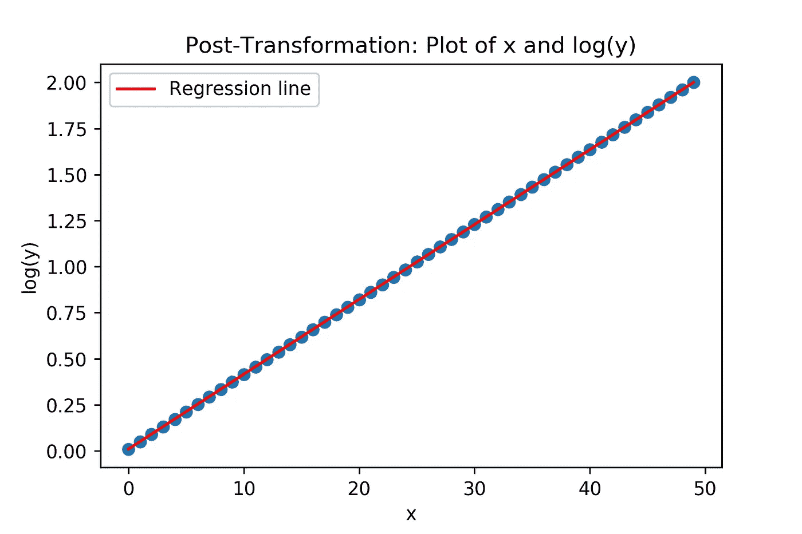

# 数据转换

> 原文：<https://towardsdatascience.com/data-transformation-e39bd132b66?source=collection_archive---------34----------------------->

## 理解为什么数据科学家工作中“不性感”的部分可能是最重要和最酷的部分之一

阿瑟尼·托古列夫在 [Unsplash](https://unsplash.com?utm_source=medium&utm_medium=referral) 上的照片

# 介绍

当我们谈论数据科学时，我们偏向于从像人工智能(AI)、机器学习(ML)、预测未来等性感的方面入手。就像我们的大脑试图从过去的经验中模拟未来一样，ML 算法从过去中工作和学习，我们的工作是为它们提供尽可能最好的学习体验。

> 你有没有想过如何现在就闭上眼睛，体验明天你要向广大听众发表的演讲的激情？

在本文的前半部分，我们将看看简单的用例，这些用例将帮助我们理解为什么数据转换是必不可少的，以及它如何帮助我们的分类器更好地执行。在后半部分，我们将直观地理解为什么对指数特征执行对数变换将允许我们使用线性回归对其建模。

# 分类环境中的数据转换

我们试图根据特征 x 将汽车分为两种类型——红色和绿色，我们在下面绘制了不同汽车 id 的 x 值。

如您所见，我们的分类器必须在红色区域周围绘制一个平行四边形边界，以准确识别不同的汽车。

现在，想想如果我们使用特征**绝对(x)或|x|** 而不是 x 会发生什么？

如上图，分类器可以画一条直线，对数据进行准确的分类。

多酷啊！我们通过对特征 x 执行简单的数据转换，将非线性分类问题转化为线性问题。这种转换将允许我们使用线性分类器，或者如果我们仍然希望使用复杂的非线性分类器，则减少它们的工作量。类比——想象你在幼儿园的美术课上，你的老师要求你画一条直线或一个平行四边形。你会选什么？为什么？

将问题转换成线性分类的对特征 x 的另一个操作是**平方(x)。**

## 锻炼

比方说，我们对不同的汽车有两个特征 f1 和 f2，我们把它们画在下面。你能想出(f1，f2)上的一个变换来把它转换成一个线性分类问题吗？

## 回答

计算并绘制(f1，f2)到(0，0)的欧几里德距离。

# 回归环境中的数据转换

假设我们的老板希望我们预测特定 x 的 y 值，作为一名负责任的数据科学家，我们将 y 可视化为我们的特征 x 的不同值，曲线图如下所示。

看了上面的图，我们知道 x 和 y 的关系不是线性的。考虑到散点图的形状，我们可以考虑使用指数模型，这非常有意义。但是，在此之前，让我们考虑绘制 x 和 log(y)。

一旦我们把 y 转换成 log(y)，我们就可以用一条直线来模拟 x 和 log(y)。这种操作称为对数变换，用于指数数据，使其成为线性。注意，x 和 y 仍然是非线性相关的。但是，由于变换，我们可以拟合一条线性回归线，从数学上讲，从线性模型回到指数模型并不困难。

此外，线性回归是可解释性的冠军，能够通过量化不同预测因素对因变量的影响来提供可操作的见解，受到许多企业利益相关者的青睐。

# 结论

没有通用的数据转换方法。了解您的模型喜欢什么，并以那种格式为它提供输入，将极大地提高您的 ML 管道的性能。

一般准则:

1.  可视化您的数据，尝试并了解其分布
2.  选择您要使用的型号
3.  根据您选择的数据和模型，为您的用例定制数据转换

请注意，有时，数据转换可能会:

*   成为唯一的出路。
*   在准确性、处理时间和可解释性方面提高性能。
*   不需要。

看完这篇文章，希望你偏从数据探索入手。在你开始训练一个复杂的模型之前，试着了解是否有任何转换会让你的机器学习模型受益。

我使用 Matplotlib 创建了本文中的所有可视化效果，代码在 [this](https://gist.github.com/GouthamDommaraju/08afd71485ef7bc94273f912fa1ccd44) GitHub Gist 中。

最后，我想感谢我的朋友萨姆校对了这篇文章。