# 数据转换

> 原文：<https://towardsdatascience.com/data-transformation-e7b3b4268151?source=collection_archive---------31----------------------->

## 📈Python for finance 系列

## 如何将现代机器学习应用于体积扩散分析(VSA)


[杰瑞米·托马斯](https://unsplash.com/@jeremythomasphoto?utm_source=unsplash&utm_medium=referral&utm_content=creditCopyText)在 [Unsplash](https://unsplash.com/s/photos/leaves-wallpaper?utm_source=unsplash&utm_medium=referral&utm_content=creditCopyText) 上拍照

**警告**:这里没有神奇的公式*或圣杯，尽管一个新的世界可能会为你打开大门。*

## 📈Python For Finance 系列

1.  [识别异常值](https://medium.com/python-in-plain-english/identifying-outliers-part-one-c0a31d9faefa)
2.  [识别异常值—第二部分](https://medium.com/better-programming/identifying-outliers-part-two-4c00b2523362)
3.  [识别异常值—第三部分](https://medium.com/swlh/identifying-outliers-part-three-257b09f5940b)
4.  [程式化的事实](/data-whispering-eebb77a422da)
5.  [特征工程&特征选择](https://medium.com/@kegui/feature-engineering-feature-selection-8c1d57af18d2)
6.  [数据转换](/data-transformation-e7b3b4268151)
7.  [细微差别特征](https://medium.com/swlh/fractionally-differentiated-features-9c1947ed2b55)
8.  [数据标签](/the-triple-barrier-method-251268419dcd)
9.  [元标签和堆叠](/meta-labeling-and-stacking-f17a7f9804ec)

在预览文章中，我简要介绍了体积扩散分析(VSA)。在我们完成特征工程和特征选择后，我立即注意到两件事，第一件是数据集中有异常值，第二件是分布不接近正态分布。通过使用这里描述的、这里描述的和这里描述的的方法，我去除了大部分的异常值。现在是时候面对更大的问题了，常态。

有许多方法可以传输数据。众所周知的一个例子是[一键编码](https://machinelearningmastery.com/why-one-hot-encode-data-in-machine-learning/)，更好的例子是自然语言处理(NLP)中的[单词嵌入](https://en.wikipedia.org/wiki/Word_embedding)。考虑到使用深度学习的一个优势是，它完全自动化了过去机器学习工作流程中最关键的步骤:特征工程。在后面的文章进入深度学习之前，我们先来看看一些简单的转移数据的方法，看看能否让它更接近正态分布。

在这篇文章中，我想尝试几件事。第一种是将所有特征转换成简单的百分比变化。第二个是做百分位数排名。最后，我将向您展示，如果我只选择所有数据的符号，会发生什么。像 Z-score 这样的方法，是深度学习中的标准预处理，我宁愿暂时不做。

# 1.数据准备

为了一致性，在所有的[📈Python for finance 系列](https://medium.com/swlh/identifying-outliers-part-three-257b09f5940b)，我会尽量重用相同的数据。关于数据准备的更多细节可以在[这里](https://medium.com/python-in-plain-english/identifying-outliers-part-one-c0a31d9faefa)，这里[这里](https://medium.com/@kegui/identifying-outliers-part-two-4c00b2523362)和[这里](https://medium.com/swlh/identifying-outliers-part-three-257b09f5940b)找到，或者你可以参考我之前的[文章](https://medium.com/@kegui/feature-engineering-feature-selection-8c1d57af18d2)。或者，如果你愿意，你可以忽略下面的所有代码，使用你手头上任何干净的数据，这不会影响我们将要一起做的事情。

```
#import all the libraries
import pandas as pd
import numpy as np
import seaborn as sns 
import yfinance as yf  #the stock data from Yahoo Finance
import matplotlib.pyplot as plt #set the parameters for plotting
plt.style.use('seaborn')
plt.rcParams['figure.dpi'] = 300#define a function to get data
def get_data(symbols, begin_date=None,end_date=None):
    df = yf.download('AAPL', start = '2000-01-01',
                     auto_adjust=True,#only download adjusted data
                     end= '2010-12-31') 
    #my convention: always lowercase
    df.columns = ['open','high','low',
                  'close','volume'] 

    return dfprices = get_data('AAPL', '2000-01-01', '2010-12-31')#create some features
def create_HLCV(i):
#as we don't care open that much, that leaves volume, 
#high,low and close 
    df = pd.DataFrame(index=prices.index)
    df[f'high_{i}D'] = prices.high.rolling(i).max()
    df[f'low_{i}D'] = prices.low.rolling(i).min()
    df[f'close_{i}D'] = prices.close.rolling(i).\
                        apply(lambda x:x[-1]) 
    # close_2D = close as rolling backwards means today is 
    # literly the last day of the rolling window.
    df[f'volume_{i}D'] = prices.volume.rolling(i).sum()

    return df# create features at different rolling windows
def create_features_and_outcomes(i):
    df = create_HLCV(i)
    high = df[f'high_{i}D']
    low = df[f'low_{i}D']
    close = df[f'close_{i}D']
    volume = df[f'volume_{i}D']

    features = pd.DataFrame(index=prices.index)
    outcomes = pd.DataFrame(index=prices.index)

    #as we already considered the different time span, 
    #here only day of simple percentage change used.

    features[f'volume_{i}D'] = volume.pct_change()
    features[f'price_spread_{i}D'] = (high - low).pct_change()
    #aligne the close location with the stock price change
    features[f'close_loc_{i}D'] = ((close - low) / \
                             (high -   low)).pct_change() #the future outcome is what we are going to predict
    outcomes[f'close_change_{i}D'] = close.pct_change(-i)

    return features, outcomesdef create_bunch_of_features_and_outcomes():
    '''
    the timespan that i would like to explore 
    are 1, 2, 3 days and 1 week, 1 month, 2 month, 3 month
    which roughly are [1,2,3,5,20,40,60]
    '''
    days = [1,2,3,5,20,40,60]
    bunch_of_features = pd.DataFrame(index=prices.index)
    bunch_of_outcomes = pd.DataFrame(index=prices.index)

    for day in days:
        f,o = create_features_and_outcomes(day)
        bunch_of_features = bunch_of_features.join(f)
        bunch_of_outcomes = bunch_of_outcomes .join(o)

    return bunch_of_features, bunch_of_outcomesbunch_of_features, bunch_of_outcomes = create_bunch_of_features_and_outcomes()#define the method to identify outliers
def get_outliers(df, i=4): 
    #i is number of sigma, which define the boundary along mean
    outliers = pd.DataFrame()
    stats = df.describe()

    for col in df.columns:
        mu = stats.loc['mean', col]
        sigma = stats.loc['std', col]
        condition = (df[col] > mu + sigma * i) | \
                  (df[col] < mu -   sigma * i) 
        outliers[f'{col}_outliers'] = df[col][condition]

    return outliers#remove all the outliers
features_outcomes = bunch_of_features.join(bunch_of_outcomes)
outliers = get_outliers(features_outcomes, i=1)features_outcomes_rmv_outliers = features_outcomes.drop(index = outliers.index).dropna()features = features_outcomes_rmv_outliers[bunch_of_features.columns]
outcomes = features_outcomes_rmv_outliers[bunch_of_outcomes.columns]
features.info(), outcomes.info()
```

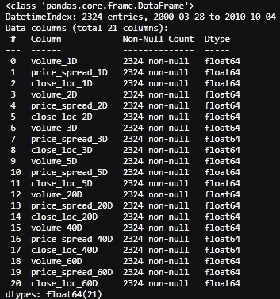

要素数据集的信息

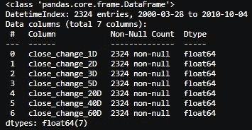

结果数据集信息

最后，我们将具有基于不同时间尺度的量差分析(VSA)的基本四个特征，如下所列，即 1 天、2 天、3 天、一周、一个月、2 个月和 3 个月。

*   音量:非常直接
*   范围/价差:最高价和收盘价之间的差异
*   收盘价相对于区间:收盘价是接近价格柱的顶部还是底部？
*   股票价格的变化:非常直接

# 2.百分比回报

我知道上面有很多代码。我们通过下面的函数将所有特征转换成简单的百分比变化。

```
def create_features_and_outcomes(i):
    df = create_HLCV(i)
    high = df[f'high_{i}D']
    low = df[f'low_{i}D']
    close = df[f'close_{i}D']
    volume = df[f'volume_{i}D']

    features = pd.DataFrame(index=prices.index)
    outcomes = pd.DataFrame(index=prices.index)

    #as we already considered the different time span, 
    #here only 1 day of simple percentage change used.

    features[f'volume_{i}D'] = volume.pct_change()
    features[f'price_spread_{i}D'] = (high - low).pct_change()
    #aligne the close location with the stock price change
    features[f'close_loc_{i}D'] = ((close - low) / \
    (high -    low)).pct_change()#the future outcome is what we are going to predict
    outcomes[f'close_change_{i}D'] = close.pct_change(-i)

    return features, outcomes
```

现在，让我们用聚类图来看看它们的相关性。Seaborn 的 `clustermap()`层次聚类算法展示了一种将最密切相关的特征分组的好方法。

```
corr_features = features.corr().sort_index()
sns.clustermap(corr_features, cmap='coolwarm', linewidth=1);
```

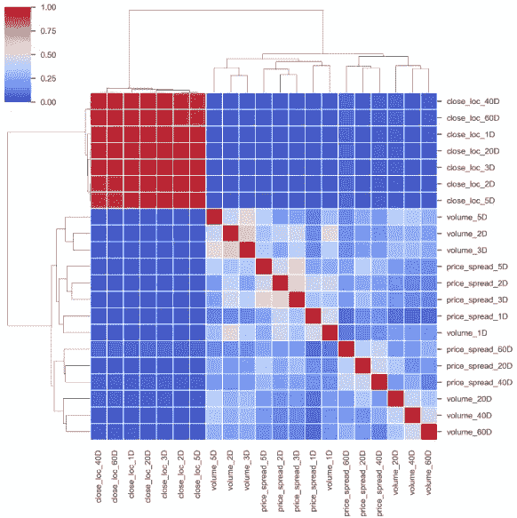

基于此聚类图，为了最大限度地减少所选要素中的要素重叠量，我将移除那些与其他要素紧密配对且与结果目标相关性较小的要素。从上面的聚类图中，很容易发现[40D，60D]和[2D，3D]上的特征是成对出现的。为了了解这些特征与结果之间的关系，我们先来看看结果之间的关系。

```
corr_outcomes = outcomes.corr()
sns.clustermap(corr_outcomes, cmap='coolwarm', linewidth=2);
```

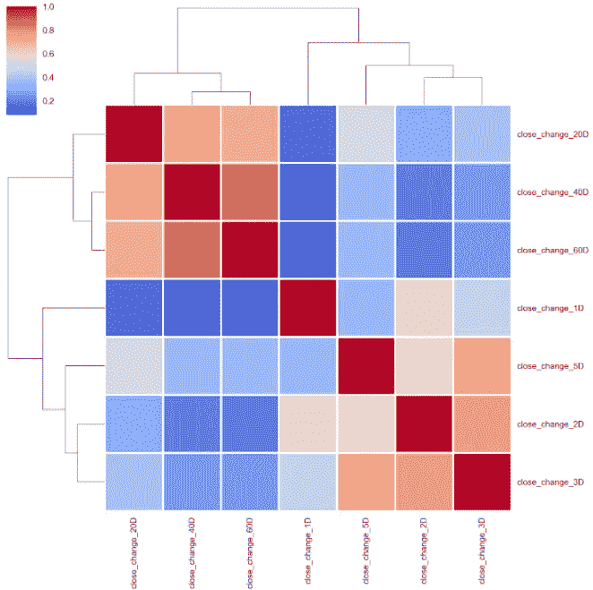

从上到下，20 天、40 天和 60 天的价格百分比变化被分组在一起，2 天、3 天和 5 天也是如此。然而，一天的股价百分比变化相对独立于这两组。如果我们选择第二天的价格百分比变化作为结果目标，让我们看看这些特性是如何与之相关的。

```
corr_features_outcomes = features.corrwith(outcomes. \
                                close_change_1D).sort_values()
corr_features_outcomes.dropna(inplace=True)
corr_features_outcomes.plot(kind='barh',title = 'Strength of Correlation');
```

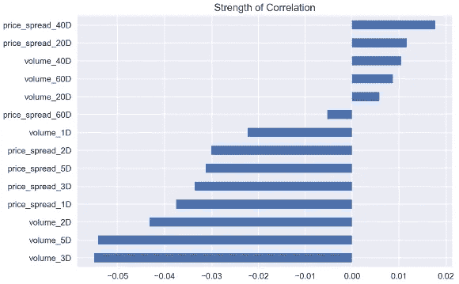

相关系数太小，无法得出可靠的结论。我会期望最近的数据具有更强的相关性，但这里的情况并非如此。

双人情节怎么样？我们只选择那些基于 1 天时间尺度的特征作为演示。与此同时，我将`close_change_1D`转换为基于它是负数还是正数的符号，以增加绘图的额外维度。

```
selected_features_1D_list = ['volume_1D', 'price_spread_1D', 'close_loc_1D', 'close_change_1D']
features_outcomes_rmv_outliers['sign_of_close'] = features_outcomes_rmv_outliers['close_change_1D']. \
                                                  apply(np.sign)sns.pairplot(features_outcomes_rmv_outliers, 
             vars=selected_features_1D_list,
             diag_kind='kde',
             palette='husl', hue='sign_of_close',
             markers = ['*', '<', '+'], 
             plot_kws={'alpha':0.3});
```

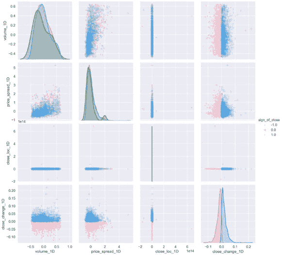

配对图建立在两个基本图形上，直方图和散点图。对角线上的直方图允许我们看到单个变量的分布，而上下三角形上的散点图显示了两个变量之间的关系(或缺乏关系)。从上面的图中，我们可以看到，随着交易量的增加，价差越来越大。大部分价格变动位于狭窄的价差，换句话说，更大的价差并不总是伴随着更大的价格波动。无论是低交易量还是高交易量都会导致几乎所有规模的价格变动。我们可以把所有这些结论应用到上涨和下跌的日子里。

您也可以使用接近的酒吧位置，以增加更多的维度，简单地应用

```
features[‘sign_of_close_loc’] = np.where( \
 features[‘close_loc_1D’] > 0.5, \
 1, -1)
```

看有多少棒线的收盘价高于 0.5 或低于 0.5。

在 pair 图中，我不喜欢的一点是所有的图都浓缩了`close_loc_1D`,看起来像离群值仍然存在，即使我知道我使用了一个标准偏差作为边界，这是一个非常低的阈值，338 个离群值被删除。我意识到因为 close 的位置已经是百分比变化了，在上面再加一个百分比变化没有太大意义。让我们改变它。

```
def create_features_and_outcomes(i):
    df = create_HLCV(i)
    high = df[f'high_{i}D']
    low = df[f'low_{i}D']
    close = df[f'close_{i}D']
    volume = df[f'volume_{i}D']

    features = pd.DataFrame(index=prices.index)
    outcomes = pd.DataFrame(index=prices.index)

    #as we already considered the different time span, 
    #simple percentage change of 1 day used here.

    features[f'volume_{i}D'] = volume.pct_change()
    features[f'price_spread_{i}D'] = (high - low).pct_change()
    #remove pct_change() here
    features[f'close_loc_{i}D'] = ((close - low) / (high - low))
    #predict the future with -i
    outcomes[f'close_change_{i}D'] = close.pct_change(-i)

    return features, outcomes
```

去掉了`pct_change()`，让我们看看现在的星团图是什么样子。

```
corr_features = features.corr().sort_index()
sns.clustermap(corr_features, cmap='coolwarm', linewidth=1);
```

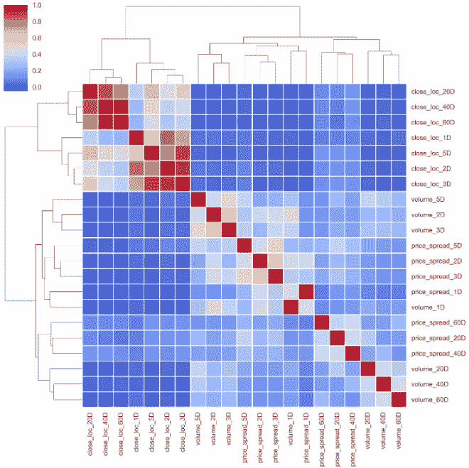

聚类图现在更有意义了。所有四个基本特征都有非常相似的模式。[40D，60D]，[2D，3D]配对在一起。

以及与结果相关的特征。

```
corr_features_outcomes.plot(kind='barh',title = 'Strength of Correlation');
```

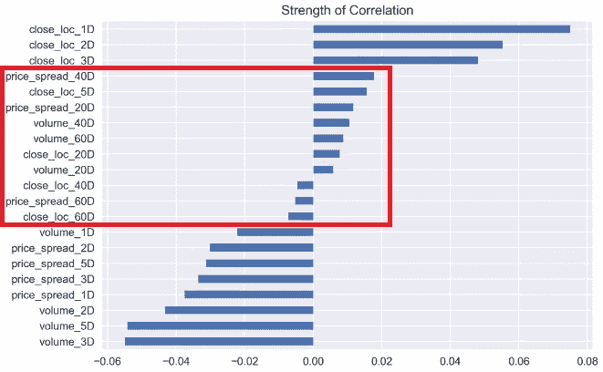

长期时间尺度特征与股票价格回报的相关性较弱，而近期事件对价格回报的影响更大。

通过去掉`close_loc_1D`的`pct_change()`，最大的区别在于`pairplot()`。

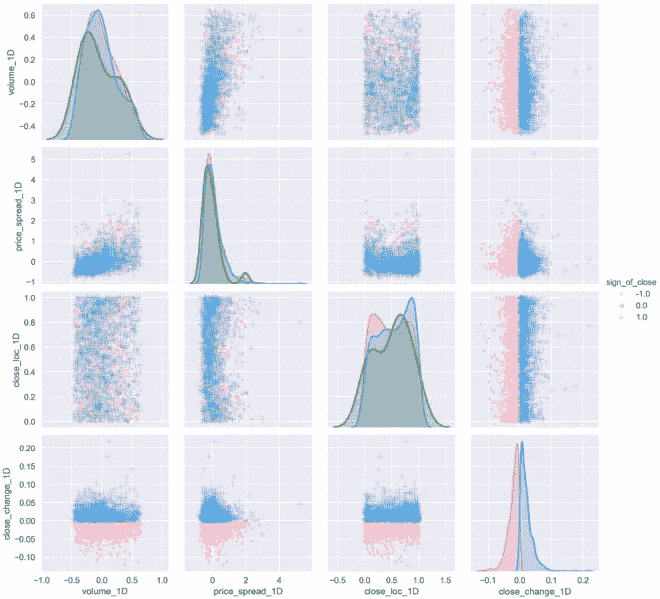

最后，`close_loc_1D`变量在正确的范围内绘图。这说明我们应该小心过度设计。它可能会导致一个完全意想不到的方式。

# 3.百分位数排名

根据维基百科，百分位排名是

> 分数的百分位数等级是分数在其频率分布中等于或低于它的百分比。例如，一个测试分数大于参加测试的人的分数的 75%被认为是在第**75**百分位，其中 75 是百分位等级。

以下示例返回与过去 60 天期间相比，每个值的交易量的百分比等级(从 0.00 到 1.00)。

```
roll_rank = lambda x: pd.Series(x).rank(pct=True)[-1]
# you only pick the first value [0]
# of the 60 windows rank if you rolling forward.
# if you rolling backward, we should pick last one,[-1].features_rank = features.rolling(60, min_periods=60). \
                apply(roll_rank).dropna()
outcomes_rank = outcomes.rolling(60, min_periods=60). \
                apply(roll_rank).dropna()
```

## ✍Tip！

熊猫`rolling()`，默认情况下，结果设置为窗口的右边缘。这意味着该窗口是向后看的窗口，从过去滚动到当前时间戳。这就是为什么对于那个窗口帧中的`rank()`，我们选择最后一个值`[-1]`。

更多关于`rolling()`的信息，请查看[官方文档。](https://pandas.pydata.org/pandas-docs/stable/reference/api/pandas.DataFrame.rolling.html)

首先，我们快速浏览一下结果的聚类图。它几乎等同于顺序不同的百分比变化。

```
corr_outcomes_rank = outcomes_rank.corr().sort_index()
sns.clustermap(corr_outcomes_rank, cmap='coolwarm', linewidth=2);
```

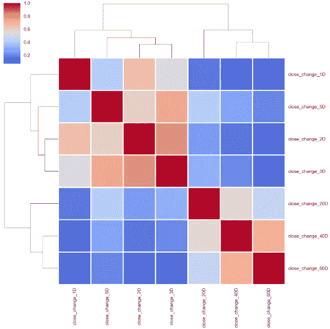

同样的模式也适用于要素的聚类图。

```
corr_features_rank = features_rank.corr().sort_index()
sns.clustermap(corr_features_rank, cmap='coolwarm', linewidth=2);
```

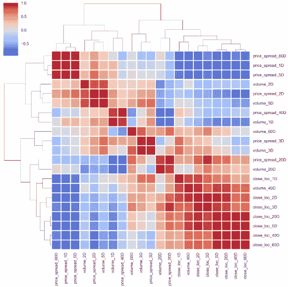

即使使用不同的方法，

```
# using 'ward' method
corr_features_rank = features_rank.corr().sort_index()
sns.clustermap(corr_features_rank, cmap='coolwarm', linewidth=2, method='ward');
```

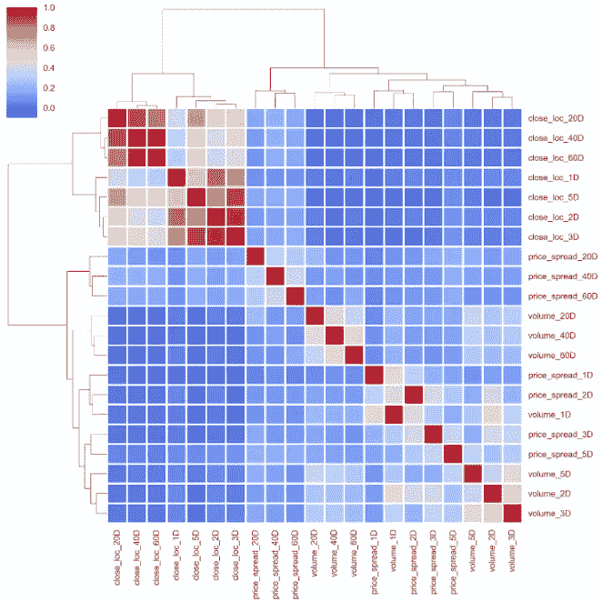

当然，特征和结果的相关性也是一样的。

```
corr_features_outcomes_rank = features_rank.corrwith( \
                              outcomes_rank. \
                              close_change_1D).sort_values()corr_features_outcomes_rank
```

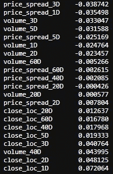

```
corr_features_outcomes_rank.plot(kind='barh',title = 'Strength of Correlation');
```

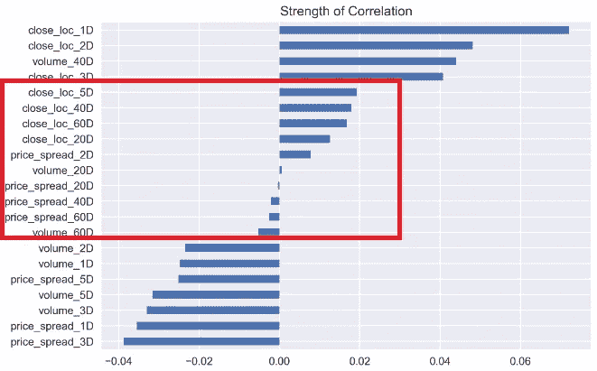

最后，你可能会猜到结对图也是一样的。

```
selected_features_1D_list = ['volume_1D', 'price_spread_1D', 'close_loc_1D', 'close_change_1D']
features_outcomes_rank['sign_of_close'] = features_outcomes_rmv_outliers['close_change_1D']. \
                                                  apply(np.sign)sns.pairplot(features_outcomes_rank, 
             vars=selected_features_1D_list,
             diag_kind='kde',
             palette='husl', hue='sign_of_close',
             markers = ['*', '<', '+'], 
             plot_kws={'alpha':0.3});
```

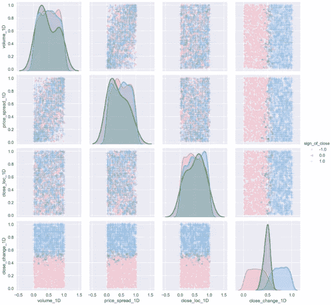

因为我们在集合窗口中使用了百分位等级(从 0.00 到 1.00)，所以斑点均匀地分布在所有特征上。与未经变换的相同数据相比，所有特征的分布或多或少接近正态分布。

# 4.签署

最后同样重要的是，我想删除所有的数据颗粒，看看这些功能在这种情况下是如何关联的。

```
features_sign = features.apply(np.sign)
outcomes_sign = outcomes.apply(np.sign)
```

然后再次计算相关系数。

```
corr_features_outcomes_sign = features_sign.corrwith(
                              outcomes_sign. \
                              close_change_1D).sort_values(ascending=False)corr_features_outcomes_sign
```

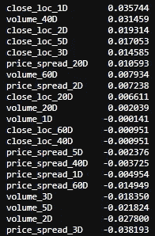

```
corr_features_outcomes_sign.plot(kind='barh',title = 'Strength of Correlation');
```

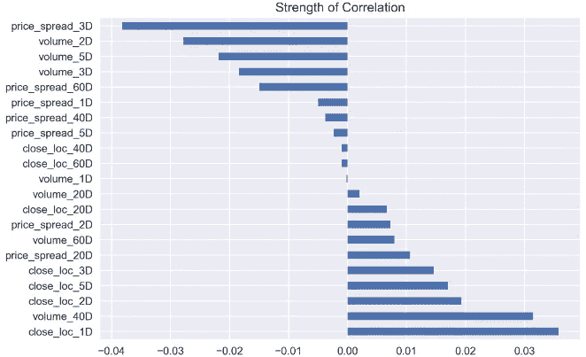

现在看来有点怪，像`volume_1D`和`price_spread_1D`和现在的胜负相关性很弱。

幸运的是，聚类图基本保持不变。

```
corr_features_sign = features_sign.corr().sort_index()
sns.clustermap(corr_features_sign, cmap='coolwarm', linewidth=2);
```

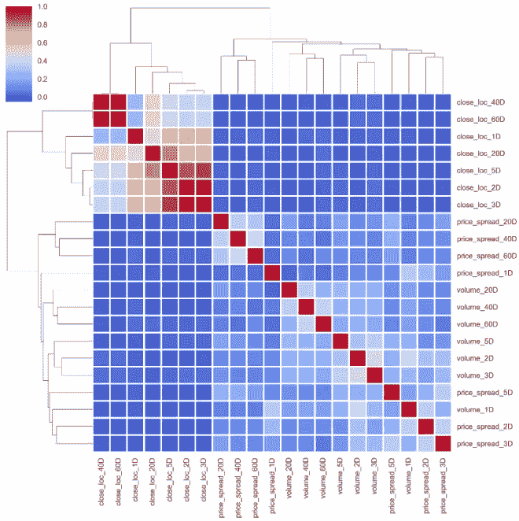

结果之间的关系也是如此。

```
corr_outcomes_sign = outcomes_sign.corr().sort_index()
sns.clustermap(corr_outcomes_sign, cmap='coolwarm', linewidth=2);
```

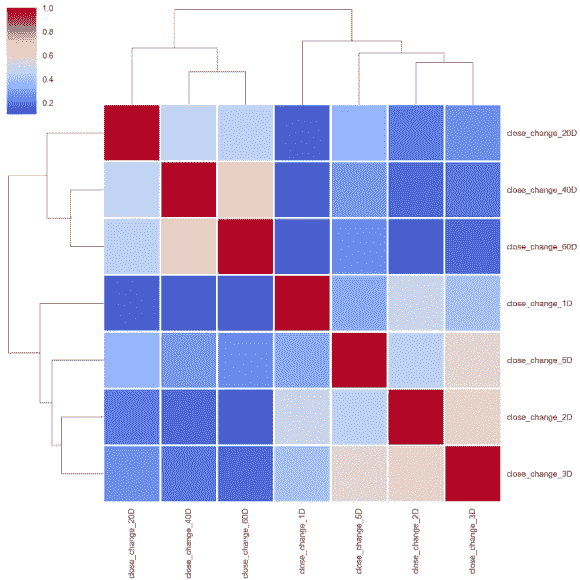

至于 pair plot，由于所有数据都被转移到-1 或 1，它没有显示任何有意义的东西。

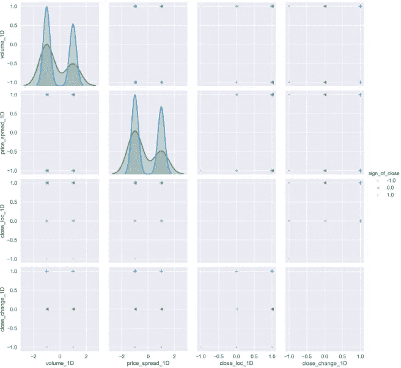

有时对数据进行“标准化”或“规范化”是至关重要的，这样我们才能在不同尺度的特征之间进行公平的比较。我很想用 Z-score 来标准化数据集。

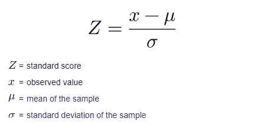

Z 得分的公式需要平均值和标准差，通过计算整个数据集的这两个参数，我们有机会看到未来。当然，我们可以再次利用滚动窗口。但一般来说，人们会在将数据注入模型之前对其进行标准化。

总之，通过利用 3 种不同的数据转换方法，现在我们很有信心可以选择最相关的特性并丢弃那些大量的特性，因为所有 3 种方法几乎共享相同的模式。

# 5.平稳和正态性检验

最后一个问题转换后的数据能通过平稳性/正态性检验吗？这里，我将使用[扩展的 Dickey-Fuller 检验](https://en.wikipedia.org/wiki/Augmented_Dickey%E2%80%93Fuller_test)，这是一种叫做[单位根检验](https://en.wikipedia.org/wiki/Unit_root_test)的统计检验。同时，我还想看看偏斜度和峰度。

```
import statsmodels.api as sm
import scipy.stats as scs

p_val = lambda s: sm.tsa.stattools.adfuller(s)[1]def build_stats(df):
    stats = pd.DataFrame({'skew':scs.skew(df),
                 'skew_test':scs.skewtest(df)[1],
                 'kurtosis': scs.kurtosis(df),
                 'kurtosis_test' : scs.kurtosistest(df)[1],
                 'normal_test' : scs.normaltest(df)[1]},
                  index = df.columns)
    return stats
```

检验的零假设是时间序列可以用一个单位根来表示，它不是平稳的(具有一些依赖于时间的结构)。另一个假设(拒绝零假设)是时间序列是平稳的。

*   **零假设(H0)** :如果没有被拒绝，说明时间序列有单位根，意味着它是非平稳的。它有一些依赖于时间的结构。
*   **备选假设(H1)** :拒绝零假设；这表明时间序列没有单位根，这意味着它是平稳的。它没有依赖于时间的结构。

以下是来自[增强迪基-富勒测试](https://en.wikipedia.org/wiki/Augmented_Dickey%E2%80%93Fuller_test)的结果:

对于功能和结果:

```
features_p_val = features.apply(p_val)
outcomes_p_val = outcomes.apply(p_val)
outcomes_p_val,features_p_val
```

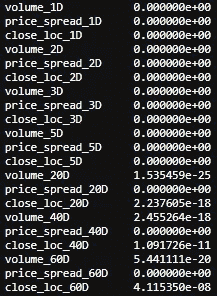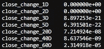

测试可以通过 *p* 值来解释。低于阈值的*p*-值(如 5%或 1%)表明我们拒绝零假设(平稳)，否则，高于阈值的*p*-值表明我们不能拒绝零假设(非平稳)。

*   ***p*-值> 0.05** :不能拒绝零假设(H0)，数据有单位根，非平稳。
*   ***p*-值< = 0.05** :拒绝零假设(H0)，数据没有单位根，是平稳的。

从这个测试中，我们可以看到所有的结果都远低于 5%，这表明我们可以拒绝零假设，所有转换的数据都是平稳的。

接下来，我们来测试正态性。

```
build_stats(features_outcomes_rmv_outliers)
```

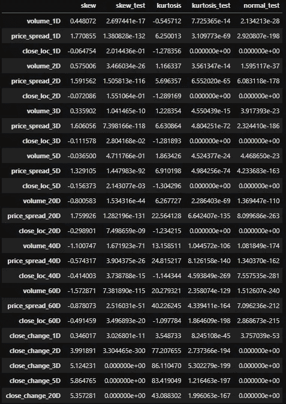

对于正态分布的数据，偏斜度应该大约为零。对于单峰连续分布，大于零的偏斜值意味着分布的右尾有更多的权重，反之亦然。

`scs.skewtest()`检验样本总体的偏斜度与相应正态分布的偏斜度相同的原假设。由于所有的数字都低于 5%的阈值，我们不得不拒绝零假设，并说偏斜度不符合正态分布。同样的事情去`scs.kurtosistest()`。

`scs.normaltest()`检验样本来自正态分布的原假设。它基于 D'Agostino 和 Pearson 的测试，结合了偏斜度和峰度，以产生一个正态性的综合测试。同样，所有数字都低于 5%阈值。我们必须拒绝零假设，并说由百分比变化转换的数据不是正态分布。

我们可以对通过百分比排名和签名转换的数据进行同样的测试。我不想让事情变得更复杂，把人们吓跑。在这篇文章太长之前，我最好在这里结束。

# 参考

1.  麦金农，J.G. 1994。单位根和协整检验的近似渐近分布函数。《商业与经济统计杂志》12，167–76。
2.  达戈斯蒂诺，R. B. (1971)，“中等和大样本量的正态性综合检验”，《生物计量学》，58，341–348
3.  达戈斯蒂诺，r .和皮尔逊，E. S. (1973)，“偏离正态性的检验”，《生物计量学》，60，613–622