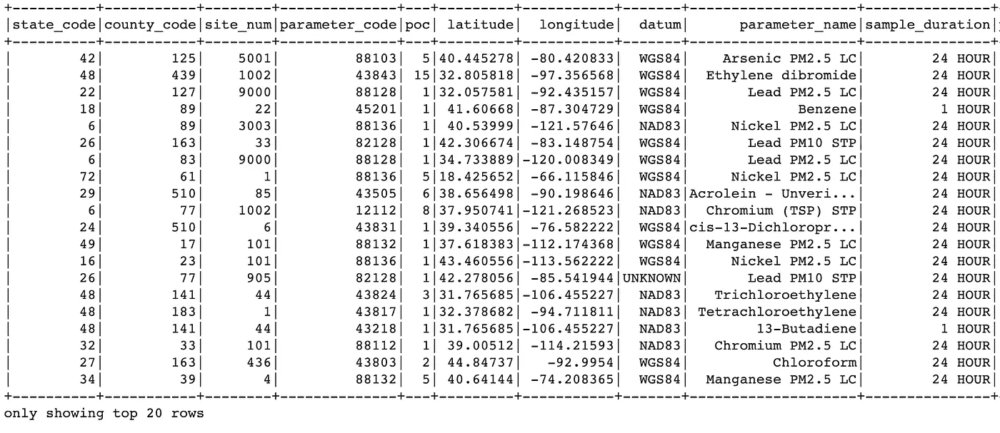
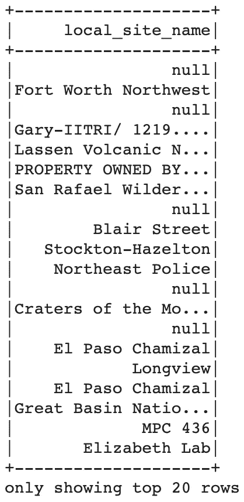
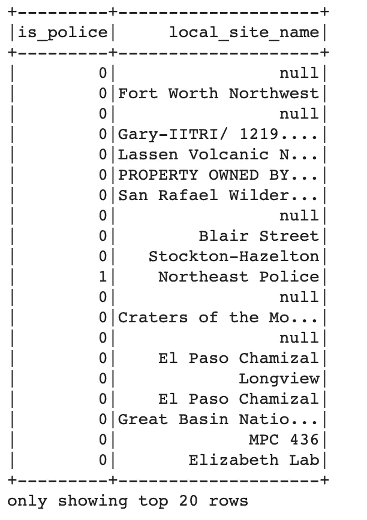
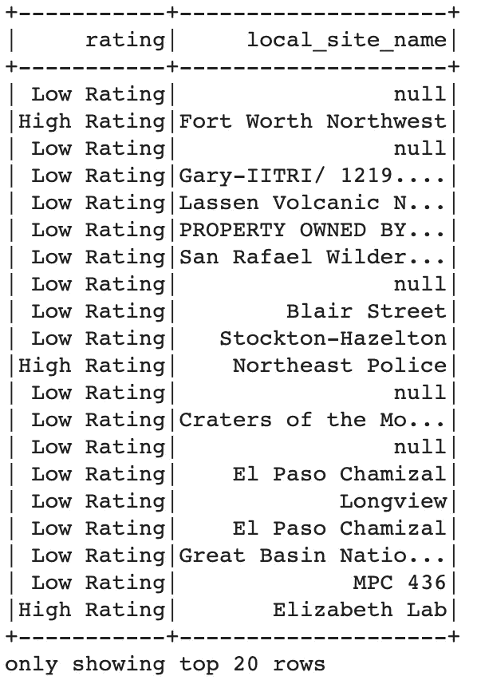
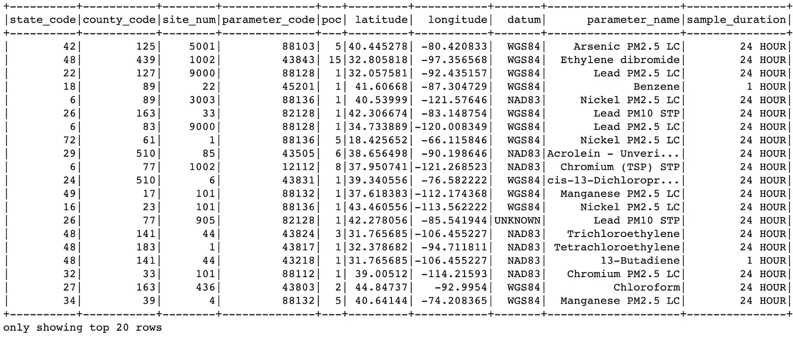

# PySpark 中的数据转换

> 原文：<https://towardsdatascience.com/data-transformation-in-pyspark-6a88a6193d92?source=collection_archive---------8----------------------->

## PySpark 中数据转换的演练


图片来自[Pexels](https://www.pexels.com/@markusspiske?utm_content=attributionCopyText&utm_medium=referral&utm_source=pexels)Markus Spiske

现在，数据的增长速度超过了处理速度。这个问题的众多解决方案之一是在大型集群上并行计算。输入 PySpark。

然而，PySpark 要求您以不同的方式考虑数据。

而不是逐行查看数据集。PySpark 鼓励您从专栏的角度来看待它。起初，这对我来说是一个艰难的转变。我会告诉你我学到的主要技巧，这样你就不用浪费时间去寻找答案了。

# 资料组

我将使用来自 Kaggle 的[有害空气污染物](https://www.kaggle.com/epa/hazardous-air-pollutants)数据集。

这个数据集是`8,097,069`行。

```
df = spark.read.csv(‘epa_hap_daily_summary.csv’,inferSchema=True, header =True)
df.show()
```



作者图片

# 条件 If 语句

我们要做的第一个转换是条件 if 语句转换。如下所示:如果数据集中的一个单元格包含一个特定的字符串，我们希望更改另一列中的单元格。

基本上我们想从这里开始:



作者图片

对此:


作者图片

如果`local site name`包含单词`police`，那么我们将`is_police`列设置为`1`。否则我们将其设置为`0`。

这种条件如果在熊猫身上陈述是相当容易做到的。我们会使用`[pd.np.where](https://pandas.pydata.org/pandas-docs/stable/reference/api/pandas.DataFrame.where.html)`或`[df.appl](https://pandas.pydata.org/pandas-docs/stable/reference/api/pandas.DataFrame.apply.html)y`。在最坏的情况下，我们甚至可以遍历这些行。我们在 Pyspark 做不到这些。

在 Pyspark 中，我们可以使用`[F.when](https://spark.apache.org/docs/2.1.0/api/python/pyspark.sql.html#pyspark.sql.functions.when)`语句或`[UDF](https://spark.apache.org/docs/2.2.0/api/python/pyspark.sql.html#pyspark.sql.functions.udf).`语句，这允许我们获得与上面相同的结果。

```
from pyspark.sql import functions as Fdf = df.withColumn('is_police',\
     F.when(\
     F.lower(\
     F.col('local_site_name')).contains('police'),\
     F.lit(1)).\
                    otherwise(F.lit(0)))df.select('is_police', 'local_site_name').show()
```



作者图片

现在假设我们想扩展我们上面所做的。这一次，如果一个单元格包含 3 个字符串中的任何一个，那么我们将在另一列中更改相应的单元格。

如果任何一个字符串:`'Police', 'Fort' , 'Lab'`在`local_site_name`列中，那么我们将相应的单元格标记为`High Rating`。

与我们之前看到的`F.when`函数结合的`[rlike](https://spark.apache.org/docs/2.2.0/api/python/pyspark.sql.html#pyspark.sql.Column.like)`函数允许我们这样做。

```
parameter_list = ['Police', 'Fort' , 'Lab']df = df.withColumn('rating',\
     F.when(\
     F.col('local_site_name').rlike('|'.join(parameter_list)),\
     F.lit('High Rating')).\
     otherwise(F.lit('Low Rating')))df.select('rating', 'local_site_name').show()
```



作者图片

`F.when`实际上对很多不同的事情都有用。事实上你甚至可以做一个连锁`F.when`:

```
df = df.withColumn('rating', F.when(F.lower(F.col('local_site_name')).contains('police'), F.lit('High Rating'))\
                              .when(F.lower(F.col('local_site_name')).contains('fort'), F.lit('High Rating'))\
                              .when(F.lower(F.col('local_site_name')).contains('lab'), F.lit('High Rating'))\
                              .otherwise(F.lit('Low Rating')))df.select('rating', 'local_site_name').show(
```


作者图片

这与我们在前面的例子中看到的完全一样。然而，要写的代码更多，要维护的代码也更多。

我更喜欢上面讨论的`rlike`方法。

# 删除空白

空白真的很烦人。它确实会影响字符串匹配，并会导致查询中不必要的错误。

在我看来，尽快删除空白是个好主意。

`[F.trim](https://spark.apache.org/docs/2.1.0/api/python/pyspark.sql.html#pyspark.sql.functions.trim)`允许我们这样做。它将删除指定列中每一行的所有空白。

```
df = df.withColumn('address', F.trim(F.col('address')))
df.show()
```



作者图片

# 删除特定列的空行

假设我们只想删除一列中的空行。如果我们在`pollutant_standard`列中遇到`NaN`值，则删除整行。

这可以相当简单地完成。

```
filtered_data = df.filter((F.col('pollutant_standard').isNotNull())) # filter out nulls
filtered_data.count()
```

条件 OR 参数允许删除我们`event_type`或`site_num`所在的行`NaN.`

这就是[所指的](https://stackoverflow.com/questions/3154132/what-is-the-difference-between-logical-and-conditional-and-or-in-c)的` |`。

```
filtered_data = df.filter((F.col('event_type').isNotNull()) | (F.col('site_num').isNotNull())) # filter out nulls
filtered_data.count()
```

[df.na.drop](https://spark.apache.org/docs/2.2.0/api/python/pyspark.sql.html#pyspark.sql.DataFrame.dropna) 允许我们删除所有列都是`NaN`的行。

```
filtered_data = df.na.drop(how = 'all') # filter out nulls
filtered_data.show()
```

# 结论

PySpark 仍然是一门相当新的语言。可能正因为如此，互联网上没有太多的帮助。像熊猫或 R 这样的东西有丰富的信息。有了 Spark 就完全不是这么回事了。

所以我希望这些代码能帮助到一些人。他们肯定会帮助我，节省我很多时间。我经历的转变可能看起来很小或微不足道，但当它涉及到 Spark 时，没有多少人谈论这些东西。我希望这能在某种程度上帮助你。

如果我犯了一个错误，或者你想联系我，请随时通过 [twitter](https://twitter.com/neeliyer11) 联系我。

*原载于 2020 年 9 月 6 日*[*https://spiyer 99 . github . io*](https://spiyer99.github.io/Pyspark-Hacks/)*。*