# R 中的数据转换

> 原文：<https://towardsdatascience.com/data-transformation-in-r-288e95438ff9?source=collection_archive---------6----------------------->

## 带 *tidyverse* 包


照片由[德鲁·格拉汉姆](https://unsplash.com/@dizzyd718?utm_source=medium&utm_medium=referral)在 [Unsplash](https://unsplash.com?utm_source=medium&utm_medium=referral) 上拍摄

**D** ata **T** 转换是从事商业数据分析、数据科学甚至人工智能前期工作的关键方面之一。在本练习中，我们将了解如何在 R 中转换数据。 [**R**](https://cran.r-project.org/) 是一种开源的统计计算和机器学习编程语言，由 R 统计计算基金会提供支持。使用其广泛使用的集成开发环境- [**RStudio**](https://rstudio.com/) 既易学又舒适。这里我们要用的 R 包是[**tidy verse**](https://www.tidyverse.org/)**。**

> tidyverse 是专为数据科学设计的 R 包集合。所有的包共享一个底层的设计哲学、语法和数据结构。

**dplyr**&**tidyr**包 **tidyverse** 中的函数主要完成数据转换的工作。

让我们先安装并加载这个包

```
**install.packages("tidyverse")
library(tidyverse)**
```

*注意:您只需要安装软件包一次，但是每次启动环境时都需要加载软件包。*

这些是我们将在本文中研究的功能—

*   **排列()**:对观察值进行排序
*   **select()** :选择变量或列
*   **filter()** :根据观察值过滤观察值
*   **gather()** :将观察从列转移到行
*   **spread()** :将变量从行移动到列
*   **group _ by()&summary()**:将数据进行分组汇总
*   **mutate()** :从现有变量创建新变量

# 排列()

按变量排列行


埃菲社在 [Unsplash](https://unsplash.com?utm_source=medium&utm_medium=referral) 上拍摄的照片

该函数按顺序排列观察值。它将一个列名或一组列名作为参数。对于单个列名，它将该列的数据与该列后面的其他列一起排序；对于多个列名，每个附加的列都会打断前面列的值。

为了展示这一点，我们将加载 **mpg** 数据集。它有 38 种流行车型从 1999 年到 2008 年的燃油经济性数据。

```
?mpg **data(mpg)
View(mpg)**
```

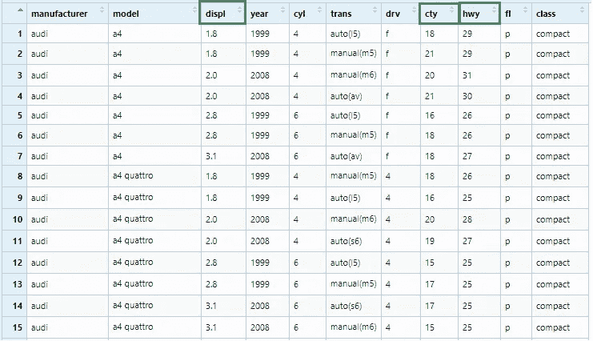

作者图片

首先，我们将根据 **displ** 列对观察结果进行排序。默认情况下，该列的值将按升序排列，其他列将遵循 **displ** 列的顺序。

```
**mpg_arrange1 <- mpg %>% arrange(displ)**
View(mpg_arrange1)
```

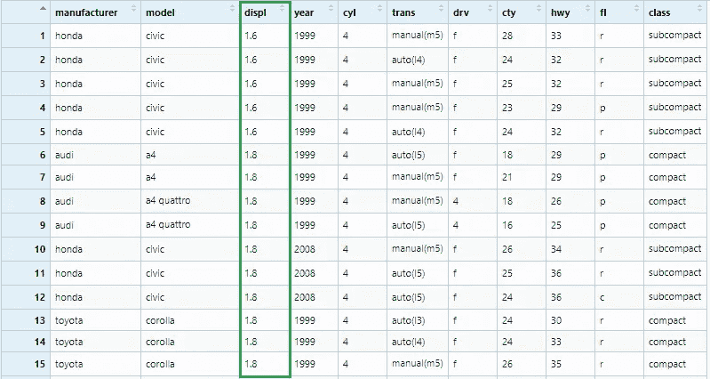

作者图片

然后我们将在参数中添加更多的两个列名—**cty**&**hwy**。

```
**mpg_arrange2 <- mpg %>% arrange(displ, cty, hwy)**
View(mpg_arrange2)
```

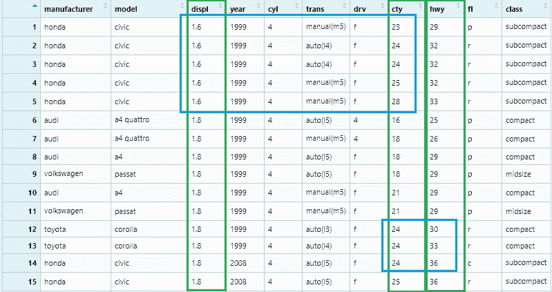

作者图片

我们可以看到第二( **cty** )和第三( **hwy** )列分别打破了第一( **displ** )和第二( **cty** )列的值之间的联系。

为了按降序排列观察值，将使用 **desc()** 函数

```
**mpg_arrange3 <- mpg %>% arrange(desc(displ))**
View(mpg_arrange3)
```

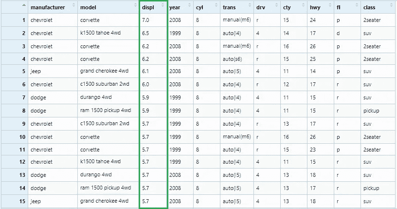

作者图片

*注意:如果有任何丢失的值，那么这些值将总是在末尾排序*

# 选择()

按名称选择变量


亚历山大·席默克在 [Unsplash](https://unsplash.com?utm_source=medium&utm_medium=referral) 上拍摄的照片

我们将在这里使用相同的 **mpg** 数据集

```
?mpg **data(mpg)
View(mpg)**
```


作者图片

现在我们将选择三列— **displ** ， **cty** & **hwy** 到一个新的数据帧

```
**mpg_select1 <- mpg %>% select(displ, cty, hwy)**
View(mpg_select1)
```

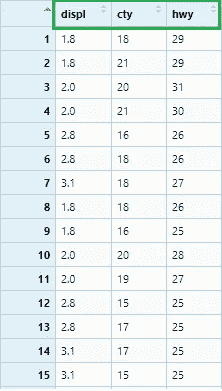

图片由 RStudio 作者提供

如果我们想选择从 **displ *到* hwy** 的所有列，我们可以写如下

```
**mpg_select2 <- mpg %>% select(displ : hwy)**
View(mpg_select2)
```

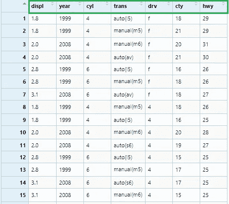

图片由 RStudio 作者提供

# 过滤器()

按条件过滤观察值


比尔·牛津在 [Unsplash](https://unsplash.com?utm_source=medium&utm_medium=referral) 上拍摄的照片

为此，我们将使用**钻石**数据集，看看如何根据条件选择观察值。

```
?diamonds
**data(diamonds)
View(diamonds)**
```


图片由 RStudio 作者提供

我们可以检查列值的汇总

```
> **summary(diamonds$carat)**
***Min. 1st Qu.  Median    Mean 3rd Qu.    Max.*** 
0.2000  0.4000  0.7000  0.7979  1.0400  5.0100> **summary(diamonds$price)**
***Min. 1st Qu.  Median    Mean 3rd Qu.    Max.*** 
326     950    2401    3933    5324   18823> **table(diamonds$cut)
*Fair      Good Very Good   Premium     Ideal*** 
1610      4906     12082     13791     21551
```

让我们只过滤掉 ***理想的*** **切工的**钻石

```
**diamonds_filter1 <- diamonds %>% filter(cut == 'Ideal')**
View(diamonds_filter1)
```

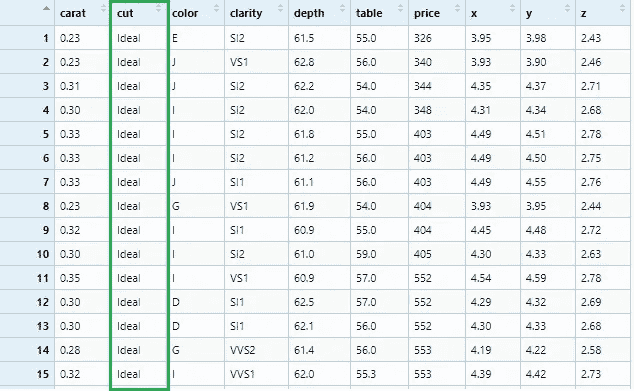

作者图片

现在让我们过滤 ***理想******高级*** **切割**钻石

```
**diamonds_filter2 <- diamonds %>% 
  filter(cut == c('Ideal', 'Premium'))**
View(diamonds_filter2)
```

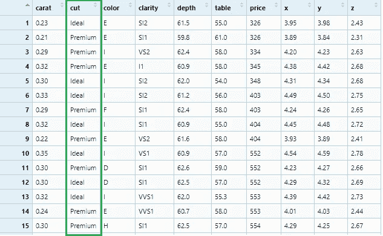

作者图片

这就是我们如何过滤价格大于 2500 的钻石

```
**diamonds_filter3 <- diamonds %>% filter(price > 2500)**
View(diamonds_filter3)
```

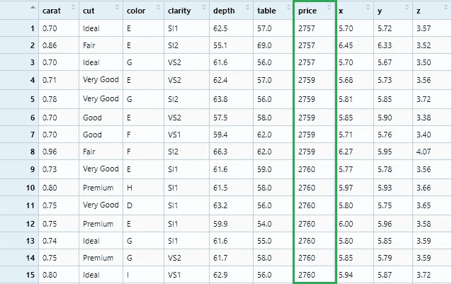

作者图片

现在我们将在三列中应用滤镜: ***理想*** **切工*****0.54*****克拉**钻石与**价格** ***1266***

```
**diamonds_filter4 <- diamonds %>% 
  filter(cut == 'Ideal', carat == 0.54, price == 1266)**
View(diamonds_filter4)
```

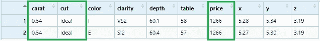

作者图片

我们来看一个更复杂的过滤标准——***理想*** **切**， ***介于 0.4 和(*&*)1.0*****克拉**同**价格** ***小于 580 或者(* | *大于 10000*** 适当的逻辑运算符将被用来表达这些条件。

```
**diamonds_filter5 <- diamonds %>% 
  filter(cut == 'Ideal' , 
         carat >= 0.4 & carat <= 1.0 , 
         price < 580 | price > 10000)**
View(diamonds_filter5)
```

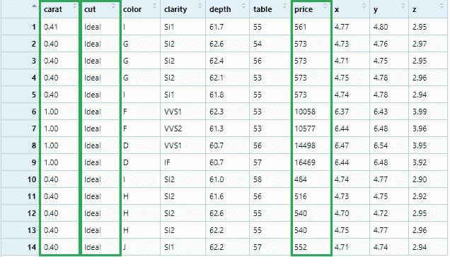

作者图片

***不是(*！ *)*** 运算符需要非常小心地使用。在使用时，我们需要牢记德摩根定律。本法写明 ***！(x & y)*** 同 ***！x |！y*** ，还有 ***！*(x | y)**同 ***！x &！y*T91。**

```
**diamonds_filter6 <- diamonds %>% 
  filter(cut != 'Ideal', 
         !(carat >= 0.4 & carat <= 1.0) , 
         !(price < 580 | price > 10000))**
View(diamonds_filter6)
```

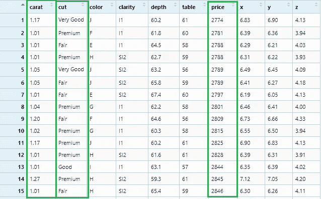

作者图片

# 聚集()

将列收集到键值对中


菲尔·科夫曼在 [Unsplash](https://unsplash.com?utm_source=medium&utm_medium=referral) 上拍摄的照片

有时，我们可以有一个数据集，其中的观察值是在列名中找到的，需要收集到具有新列名的变量下。让我们先构建数据集。

```
**Country_Name** <- c('Qatar', 'United States', 'Germany', 
                  'Canada', 'United Kingdom')
**Y2009** <- c(59094, 47099, 41732, 40773, 38454)
**Y2010** <- c(67403, 48466, 41785, 47450, 39080)
**Y2011** <- c(82409, 49883, 46810, 52101, 41652)**gdp <- data.frame(Country_Name, Y2009, Y2010, Y2011)
View(gdp)**
```

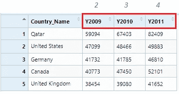

作者图片

该数据集可视为五个国家 2009 年、2010 年和 2011 年的 GDP 数据。可以清楚地看到，Y2009，Y2010 & Y2011 这些列名本身就是观测值，应该在一个变量或列名之下- ' **Year** '。我们将通过 **gather()** 函数来实现。

```
**gdp_gather <- gdp %>% gather("Year", "GDP" , 2:4)**
View(gdp_gather)
```


作者图片

为了让这个数据集为数值分析做好准备，我们需要从**年**值中删除字符“ *Y* ”(或任何字符)，并将其从*字符*转换为*整数*。

```
**gdp_gather$Year <- gsub("[a-zA-Z]", "", gdp_gather$Year)
gdp_gather$Year <- as.integer(gdp_gather$Year)**
View(gdp_gather)
glimpse(gdp_gather)
```

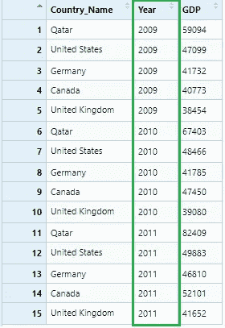

作者图片


作者图片

# 传播()

将键值对分布在多个列中


照片由[扎卡里·纳尔逊](https://unsplash.com/@zacharytnelson?utm_source=medium&utm_medium=referral)在 [Unsplash](https://unsplash.com?utm_source=medium&utm_medium=referral) 上拍摄

有时，我们可以看到变量分布在数据集中的观察值中。在这种情况下，我们需要将它扩展到列名。让我们用键值构建一个数据集。

```
**Student** <- c('Jack', 'Jack', 'Jack', 'Jack', 'Jack', 'Jack', 
             'Rose', 'Rose', 'Rose', 'Rose', 'Rose', 'Rose')
**Subject** <- c('English', 'Biology', 'Chemistry', 'Maths', 'Physics', 
             'Social Science', 'English', 'Biology', 'Chemistry',
             'Maths', 'Physics', 'Social Science')
**Marks** <- c(80, 70, 87, 75, 90, 82, 65, 70, 88, 92, 79, 93)**reportCard <- data.frame(Student, Subject, Marks)**
**View(reportCard)**
```

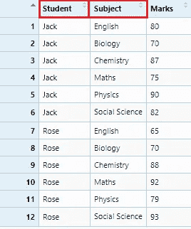

作者图片

在这个报告卡数据集中，如果我们将**主题**名称视为变量，那么它需要扩展到列名称。我们将通过 **spread()** 函数来实现。

```
**reportCard_spread1 <- reportCard %>% spread(Subject, Marks)**
View(reportCard_spread1)
```

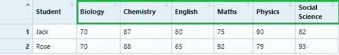

作者图片

如果我们将**学生**的名字视为变量-

```
**reportCard_spread2 <- reportCard %>% spread(Student, Marks)**
View(reportCard_spread2)
```


作者图片

# group _ by()& summary()

按变量分组&将多个值减少到一个值


照片由[塞维多夫·热莫夫斯基](https://unsplash.com/@yuriyr?utm_source=medium&utm_medium=referral)在 [Unsplash](https://unsplash.com?utm_source=medium&utm_medium=referral) 拍摄

这些是非常有用的函数，它们组合在一起将值汇总成组。这里我们将使用 **msleep** 数据集。它包含了一些哺乳动物的睡眠数据和体重数据。

```
?msleep
**data(msleep)**
colnames(msleep)
**msleep <- msleep %>% select(name, order, sleep_total, bodywt)
View(msleep)**
```

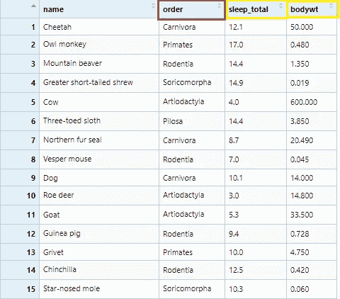

作者图片

我们将 **sleep_total** 汇总到其*平均值*值- **sleep_avg** 和 **bodywt** 到其*最大值*值- **bodywt_max** 。该汇总将按**订单**分组，每个**订单**观察的数量将在**计数**栏下。这些都将由 **group_by()** 和**summary()**用数学函数- **n()** 、 **mean()** 和 **max()** 来完成。

```
**msleep_groupby_summarize <- msleep %>% group_by(order) %>%
  summarise(
    count = n(),
    sleep_avg = mean(sleep_total),
    bodywt_max = max(bodywt)
  )**
View(msleep_groupby_summarize)
```

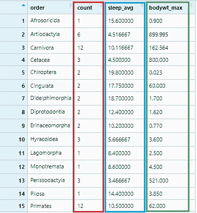

作者图片

# 变异()

创建或转换变量


克里斯·劳顿在 [Unsplash](https://unsplash.com?utm_source=medium&utm_medium=referral) 上拍摄的照片

在数据分析中，从现有变量推导出新变量是非常常见的。这里我们将使用**航班**数据集。它有 2013 年从纽约起飞的所有航班的准点数据。为了得到这个数据集，我们需要安装并加载包**nyflights 13**。

```
**install.packages("nycflights13")**
**library(nycflights13)**?flights
**data(flights)**
colnames(flights)
**flights <- flights %>% select(year, month, day, dep_delay, 
                              arr_delay, distance, air_time )
View(flight)**
```

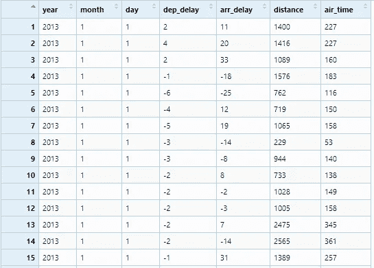

作者图片

现在我们将通过从 **dep_delay** 中减去 **arr_delay** 来创建两个新变量- **time_gain** 以及通过将**距离**除以 **air_time** 和乘以 60 来创建**速度**。

```
**flights_mutate <- flights %>% 
  mutate(time_gain = dep_delay - arr_delay ,
  speed = distance / air_time * 60)**
View(flights_mutate)
```

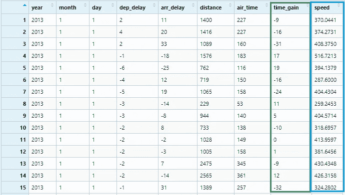

作者图片

所以现在就这样了。我建议您使用不同的数据集以及您自己的数据来练习这种数据转换功能。这可能是你进入*数据科学这一惊人领域的第一步。祝你接下来的旅程一切顺利！*

*你也可以看看我关于数据可视化的文章*

*[](/data-visualization-with-ggplot2-db04c4956236) [## 使用 ggplot2 实现数据可视化

### R 语言中的“图形语法”一瞥

towardsdatascience.com](/data-visualization-with-ggplot2-db04c4956236) 

[克里斯托夫辊](https://unsplash.com/@krisroller?utm_source=medium&utm_medium=referral)在 [Unsplash](https://unsplash.com?utm_source=medium&utm_medium=referral) 上拍照*