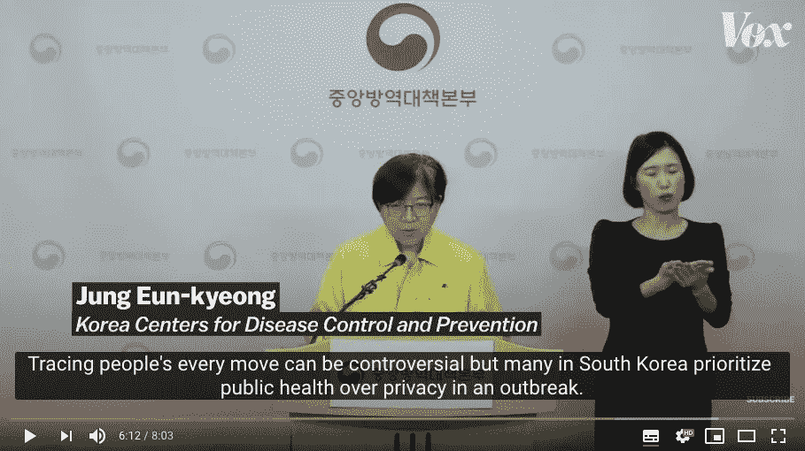

# 数据可信度

> 原文：<https://towardsdatascience.com/data-trustworthiness-47d2fa76c022?source=collection_archive---------66----------------------->

## 如果收件人值得信任，泄露一些个人隐私不一定是件坏事

本·怀特在 [Unsplash](https://unsplash.com?utm_source=medium&utm_medium=referral) 上的照片

想象一下，你有一条敏感信息，你必须告诉至少一个人。你会把它告诉那个众所周知爱说长道短、经常走漏风声的人，还是那个把你的秘密看得不仅仅是有趣的细节、而且非常负责任地保管这些信息的人？你会告诉那个你几乎不认识，但你听说过的值得信任的人，还是那个你已经认识一段时间并赢得你信任的人？你会告诉那个听到这个敏感信息后会问十个不同的后续问题的人，还是那个重视你给他们的信息而不会追问你更多信息的人？

希望这些问题已经帮助你明确了在敏感信息方面你认为什么样的人是值得信任的。

随着政府处理当前的新冠肺炎疫情，隐私已经让位于更大的利益，这种趋势在当前危机之前我们已经在医疗数据中看到了(见[这篇](https://medium.com/swlh/death-and-data-science-453ad2bc1371?source=friends_link&sk=83712c7b87b1c5a7b50f0711d6c9f9ac)文章讨论了医疗数据的使用，以及[这篇后续文章](/death-and-data-science-part-2-2a17c6322c5b?source=friends_link&sk=94ea005960528b1b3a3e3f4ae5a447bc)关于我们如何开始看到这种情况在疫情发生)。最近，我看了 Vox 关于韩国相当成功地应对新冠肺炎病毒的视频，其中一段话让我特别感兴趣，下图是疾病控制和预防中心的韩国主任说的。

视频截图链接[此处](https://www.youtube.com/watch?v=BE-cA4UK07c)(同上)

事实是，为了公众健康，我们现在可能不得不放弃一些隐私，特别是如果我们想得到像韩国那样有效的回应。然而，放弃一些隐私并不等同于放弃我们在余下的数字生活中所有的隐私权。至少，不一定是这个意思。正如《纽约时报》的这篇文章所描述的，一月份，韩国当局公布了大量感染新冠肺炎病毒的人的信息。由于韩国是一个网络发达的社会，这些人很快就被抓了起来，并被公开羞辱。作为回应，卫生官员本月宣布，“他们将完善数据共享指南，以将患者风险降至最低。”通过这样做，他们证明了自己是敏感个人数据的更周到、更值得信赖的管理者。事实上，韩国疾病控制和预防中心主任郑恩景最近说:

> “我们将在保护个人人权和隐私的价值与维护公共利益防止大规模感染的价值之间取得平衡”

还记得在这篇文章的开头，我让你想象你会和什么样的人分享敏感的个人信息吗？从这些问题中，你可能已经确定了一个人，他有着重视敏感信息、尊重你和信息敏感性的良好记录。简而言之，他们已经证明了自己在数据方面是值得信赖的。上述声明以及韩国卫生官员正在采取的措施证明，韩国政府正在积极努力成为公共数据的可信管理者。

当然，这种敏感数据的获取和使用远不止发生在韩国。我们看到技术正被用于跟踪像波兰、T2、以色列、T4、法国和其他许多地方的人。正如美国人从 911 袭击的后果中知道的那样，一旦这些许可被授予，就很难再取消。此外，随着我们进入一个更加数据驱动的时代，无论我们喜欢与否，我们的个人数据可能会变得越来越容易获取。这就是为什么我们开发具体的方法来确保拥有我们数据的人是值得信赖的管理者更加重要。如果像政府这样的机构想要访问我们的数据，我们需要确保它们是可信的，而确保它们保持可信的最佳方式是明确定义“可信”的含义。当然，这是一项艰巨的任务，因为这个定义可能会根据你交谈的对象而有所不同。然而，回想一下我在开始时问的那个假设的值得信任的人，我认为我们确实普遍同意让一个人值得信任的某些特质，例如以这样一种方式行事，一个人不会获取超过他们需要的信息，并确保敏感信息不会无意中传播给其他人。

在我上周的文章中，我讨论了轻视个人隐私的文化是如何导致灾难性后果的，正如最近的 Zoom 安全问题所展示的那样。上周，我指出了轻视隐私的文化的负面影响，而本周，我想指出重视个人隐私的文化的正面影响，这种文化就像是在韩国医疗机构对新冠肺炎事件的反应中培养的那种文化。是的，当他们在一月份发布敏感信息时，他们肯定犯了很大的错误，但他们利用这个机会赢得了公众的信任，并且在处理数据时更加小心。如果损失的是值得信赖、安全的一方，他们会负责任地处理数据，不会要求超出他们需要的东西，并且已经证明他们积极重视人权和隐私，那么一定程度的隐私损失不一定是坏事。

没有任何科学是非政治性的，数据科学也不例外。在我们生活的这个数据密集的现实中尤其如此。有鉴于此，数据科学家不应将他们的目标局限于获得最佳准确度或精确度分数。尤其是当我们处理越来越多的敏感信息时，我们的目标不应该总是“获取更多数据”我们的目标应该是，“充分利用我们所拥有的一切。”也许这有时会有局限性，但是一些最好的创新来自于适应局限性。