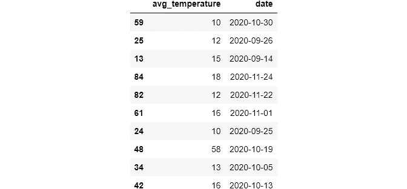
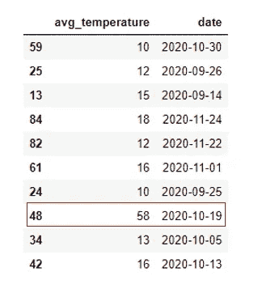
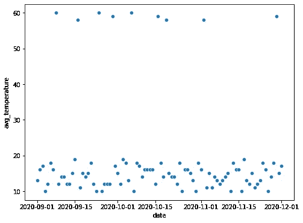
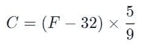
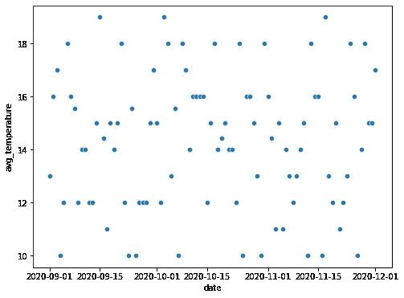
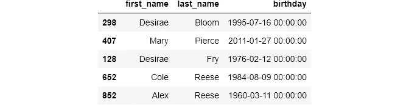
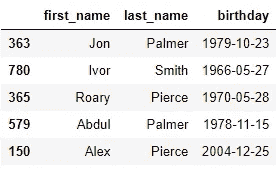

# 数据科学中的数据一致性

> 原文：<https://towardsdatascience.com/data-uniformity-in-data-science-9bec114fbfae?source=collection_archive---------38----------------------->

## 处理熊猫最常见的一致性问题


**图片由** [**马蒂亚斯**](https://pixabay.com/users/mwewering-185784/?utm_source=link-attribution&utm_medium=referral&utm_campaign=image&utm_content=1699137) **上** [**Pixabay**](https://pixabay.com/?utm_source=link-attribution&utm_medium=referral&utm_campaign=image&utm_content=1699137)

## 介绍

在我以前关于数据清理的文章中，我谈到了超出范围的值、不正确的数据类型、唯一性约束是如何成为常见问题的，如果不加以处理，会严重影响我们的分析。

在本文中，我们将解决一个同样危险的问题，它同样会扭曲我们的分析，这就是**单元一致性**。

与一致性相关的问题有多种形式:

*   华氏和摄氏温度数据
*   重量以千克和磅表示
*   多种日期格式
*   用不同货币表示的货币

这些问题的出现有很多原因。例如，跨多个位置收集数据并合并到一个位置。这会导致上述问题。您必须知道如何处理一致性问题，以便进行准确的分析。

## 设置


```
people.head()
```


> 本文使用的笔记本和数据可以在[本](https://www.kaggle.com/bextuychiev/data-uniformity-in-data-science) Kaggle 笔记本或[本](https://github.com/BexTuychiev/medium_stories/tree/master/november_2020/uniformity) GitHub repo 上找到。

## 单位一致性

考虑之前导入的这个温度数据集。它以摄氏度为单位给出了 3 个月的日平均温度信息:

```
temperatures.sample(10)
```



如果我们看指数 48，除非发生重大气候事件，我们可以猜测值是以华氏温度给出的:



**图片由** [**作者**](https://medium.com/@ibexorigin)

在这种情况下，使用散点图直观地发现它们:



散点图清楚地显示了华氏温度值。快速的谷歌搜索向我们展示了将华氏温度转换为摄氏温度的公式:



**图片由** [**作者**](https://medium.com/@ibexorigin)

现在，我们将使用该等式将 40 以上的任何值转换为摄氏度:

我们可以通过两种方式检查转换是否成功。首先，用`assert`声明:

再次使用散点图:



尽管这是一个简单的例子，但你的情况可能完全不同。有时，你可能甚至没有注意到数据海洋中的不一致。在寻找它们之前，你必须完全了解你的数据，并了解这些数据是如何收集的。

## 日期一致性

另一个非常普遍的问题是日期一致性。不同的国家有不同的标准日期时间格式，当您有来自多个来源的数据时，您将不得不处理多种日期格式。在 Python 中，有 3 种主要的日期时间格式可供使用:

*   25–12–2019-->**(% d-% m-% Y)**->年，月，日
*   2020 年 10 月 31 日-> **(%c)** - >字面日期
*   12–25–2019-->**(% m-% d-% Y)**->月，日，年

当您使用`pandas`将数据加载到您的环境中时，它总是将日期作为`object`数据类型导入。在设置部分，我们导入了包含人的全名和生日的示例数据:

```
people.sample(5)
```



`birthday`列用 YY-MM-DD 格式表示日期，但用字符串表示。将日期列转换为`datetime`对于执行分析有很多好处。我们将使用`pd.to_datetime()`功能将列转换为`datetime`:

我们出错了！如果我们仔细看，错误说月份必须在 1，2，…，12。这意味着，在数据的某个地方，有一个不一致的值阻止了函数的运行。`pd.to_datetime`对此类情况有一个很好的解决方法:

这一次，我们没有出现任何错误。如果您将`infer_datetime_format`设置为`True`，`pandas`将根据第一个非 NaN 元素自动识别日期格式，并将其余部分转换为该格式。如果有任何值不适合转换，`errors`参数决定如何处理它们。如果设置为`coerce`，`pandas`将放置`NaT`为缺失的日期值。

基于我们的假设，上面的代码行应该已经发现了日期不一致，并将`NaT`放入不一致的日期:

有几种方法可以处理这种不一致:

*   转换为 NA 并进行相应处理
*   通过查看数据源推断格式，它是如何收集的
*   通过查看其他日期来推断格式

如果你有许多不一致，将它们转换成`NaN`并不总是一个选项。您应该通过观察它们的模式和推断它们的格式来尝试提出定制的解决方案。

完成错误处理和转换后，最佳做法是将日期列转换为全局日期时间标准:



**图片由** [**作者**](https://medium.com/@ibexorigin)

# 如果你喜欢这篇文章，请分享并留下反馈。作为一名作家，你的支持对我来说意味着一切！

阅读更多与主题相关的文章:

[](/data-type-constraints-data-range-constraints-duplicate-data-with-pandas-44897a350b1e) [## 掌握 DS/ML 中最耗时的任务，#1

### 处理常见的数据问题

towardsdatascience.com](/data-type-constraints-data-range-constraints-duplicate-data-with-pandas-44897a350b1e) [](/master-the-most-hated-task-in-ds-ml-3b9779276d7c) [## 掌握 DS/ML 中最讨厌的任务

### 用 Pandas 清理分类数据

towardsdatascience.com](/master-the-most-hated-task-in-ds-ml-3b9779276d7c) [](/fuzzywuzzy-fuzzy-string-matching-in-python-beginners-guide-9adc0edf4b35) [## FuzzyWuzzy:Python 中的模糊字符串匹配，初学者指南

### …以及在真实数据集上的动手实践

towardsdatascience.com](/fuzzywuzzy-fuzzy-string-matching-in-python-beginners-guide-9adc0edf4b35) [](/meet-the-hardest-functions-of-pandas-part-i-7d1f74597e92) [## 认识熊猫最难的功能，第一部分

### 掌握 pivot_table()、stack()、unstack()的时机和方式

towardsdatascience.com](/meet-the-hardest-functions-of-pandas-part-i-7d1f74597e92) [](/from-kagglers-best-project-setup-for-ds-and-ml-ffb253485f98) [## 来自 Kagglers:DS 和 ML 的最佳项目设置

### 来自顶级 Kagglers 的项目成功最佳实践的集合

towardsdatascience.com](/from-kagglers-best-project-setup-for-ds-and-ml-ffb253485f98) [](/deep-guide-into-styling-plots-delivering-effective-visuals-12e40107b380) [## 我的情节糟透了。以下是我如何修复它们。

### 你的，在某种意义上，可能也是。

towardsdatascience.com](/deep-guide-into-styling-plots-delivering-effective-visuals-12e40107b380)