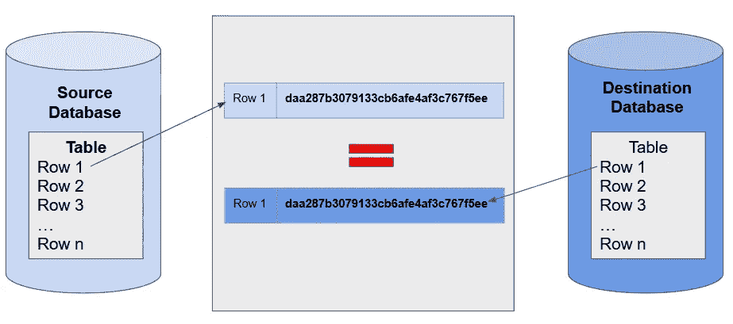
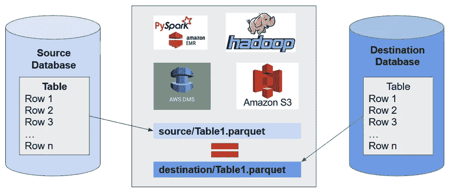

# 数据验证—数据湖和数据库迁移项目

> 原文：<https://towardsdatascience.com/data-verification-data-lake-database-migration-projects-391f5a5554d9?source=collection_archive---------33----------------------->

## 使用 Spark 进行高速低成本数据验证的指南


图片由[穆罕默德·哈桑](https://pixabay.com/users/mohamed_hassan-5229782/?utm_source=link-attribution&utm_medium=referral&utm_campaign=image&utm_content=4576720)拍摄，来自[皮克斯拜](https://pixabay.com/?utm_source=link-attribution&utm_medium=referral&utm_campaign=image&utm_content=4576720)

在过去的 25 年里，我参与了大量的数据库迁移和数据湖项目。数据迁移/数据湖接收后，客户的一个非常常见的验收标准是执行数据验证。根据经验，我可以很容易地说，任何给定项目的大部分时间都花在了数据验证上。在处理异构数据库时尤其如此。花费在数据验证上的时间经常超过实际执行迁移或接收所花费的时间。如果您需要执行多次迁移和摄取迭代，问题会成倍增长。

在过去的几年里，我的主要目标是开发一种不仅速度快而且成本低的解决方案。以下是我多年来开发的框架的发展阶段。

## 采样后进行人工验证

在我早期，一种非常常见的数据验证方法是抽样。在此方法中，从源和目标中选择了一组样本行。质量保证工程师对样本集进行了目视扫描/比较。该过程大部分是手动的，因此效率低下且容易出错。此外，它只验证了一小部分行样本。

## 采样后自动验证

在这个方法中，从源和目标中选择一组样本行，然后是执行数据验证的 SQL/PERL 脚本。该过程是自动化的，非常高效，但有时仍然很慢，这取决于样本大小。该方法还验证了一个小样本行。

## 整个数据集的自动验证

客户开始要求逐行逐列地进行数据验证。这意味着数据采样不再是一个选项。需要一种能够执行完整数据验证的解决方案。我们制定了如下计划:

*   从源和目标中根据主键选择相同行的串联列
*   创建行的校验和并进行比较。校验和匹配确保行完全相同。
*   如果发现不一致，则将违规行写入失败表



(*图片作者*)

在我们开始处理大型数据集之前，上述解决方案对我们来说工作得相当好。与此同时，大数据开始变得强大。尽管上述解决方案具有内置的并行处理能力，但我们经常开始缺少时间，错过最后期限。

当我们计算出当前项目的数据验证每一次迭代需要超过 30 天时，问题变得极其严重和可怕。一个失败的开始，因为我们最终会错过所有的最后期限。

我们需要一个更好的解决方案…快速

## 分布式计算拯救世界

幸运的是，我们已经进入了大数据时代。作为早期采用者，我们已经在几个项目中采用了 Hadoop。Spark 和云计算的应用即将出现。除了数据迁移，我们还遇到了几个数据湖项目。因此，我们希望创建一个框架，既能适用于这两种使用情形，又能兼容内部部署或云基础架构。我们是这样做的:

*   **数据接收:**除了从源到目的地迁移/接收数据，我们还选择在 HDFS(本地 Hadoop)或 S3 (AWS cloud)上以 ***Parquet*** 格式转储源和目的地数据的额外副本。如果您使用 AWS DMS 并使用—S3-settings“data format”:“parquet”创建一个 S3 端点，这一步非常简单
*   **基础架构:**针对内部部署的——Spark 集群(Hadoop ),针对 AWS 云的——EMR 的——HDFS 上的 PySpark，HDFS 上的 PySpark。由于数据验证计划不是真正的关键任务，我们选择使用 4-5 个 Spot 实例来降低成本。对我们来说效果很好。我已经发布了 EMR 实例的详细信息，如下所示:

```
--instance-groups '[{"InstanceCount":5,"BidPrice":"OnDemandPrice",
"EbsConfiguration":{"EbsBlockDeviceConfigs":[{"VolumeSpecification":{"SizeInGB":32,"VolumeType":"gp2"},"VolumesPerInstance":2}]},
"InstanceGroupType":"CORE","InstanceType":"c4.8xlarge","Name":"Core - 2"},{"InstanceCount":1,
"EbsConfiguration":{"EbsBlockDeviceConfigs":[{"VolumeSpecification":{"SizeInGB":32,"VolumeType":"gp2"},"VolumesPerInstance":2}]},
"InstanceGroupType":"MASTER","InstanceType":"m5.xlarge","Name":"Master - 1"}]'
```



(*作者图片*)

*   **火花码:**漂亮*简单*却非常*有效*。为每个表创建两个 pyspark 数据帧，并执行两次减法，如下所示:

```
dfsourcesubdfdest = dfsource.subtract(dfdest)
dfdestsubdfsource = dfdest.subtract(dfsource)
```

*   **以前的方法与新方法的比较:**假设比较 5 亿行，以前的方法需要 36 个小时才能完成。如果表有数十亿行(在我们的例子中经常如此)，那么您就完了。使用新方法，将数据转储到存储器只需一个多小时，进行火花比较大约需要 20 分钟。相当整洁…😄

我希望这篇文章能帮助你进行快速而低成本的数据验证。尽管我还没有发布完整的代码集和命令，但是如果您需要更多的细节，请随时联系我。

我希望这篇文章是有帮助的。**三角洲湖**作为大数据 Hadoop、Spark & Kafka 课程的一部分，由 [Datafence 云学院](http://www.datafence.com)提供。课程是周末自己在网上教的。