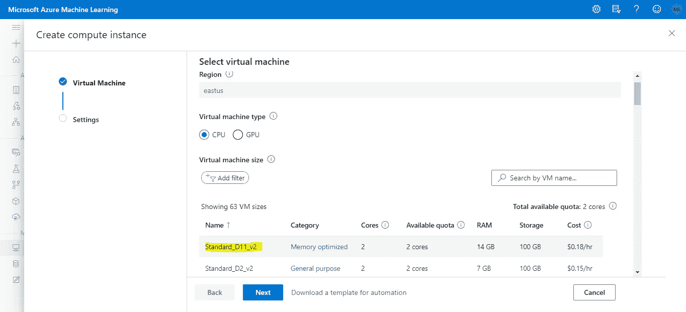

# 使用 Azure 机器学习服务进行数据版本控制

> 原文：<https://towardsdatascience.com/data-versioning-in-azure-machine-learning-service-acca44a3b3a1?source=collection_archive---------29----------------------->

## 读完这些，你就会明白 Azure ML 是如何处理数据的，MLOps 是如何关联的，学会自己怎么做

[斯科特·格雷厄姆](https://unsplash.com/@sctgrhm?utm_source=medium&utm_medium=referral)在 [Unsplash](https://unsplash.com?utm_source=medium&utm_medium=referral) 上拍照

在这个数据科学时代，最重要的问题之一是实现人工智能的整个生命周期。你可能知道，机器学习的基础是数据。如果你想确保你的项目有完全的可追溯性，你不能忘记不那么性感的部分。

这篇文章旨在探讨为什么数据版本化是必不可少的，以及如何在 [Azure 机器学习](https://docs.microsoft.com/en-us/azure/machine-learning/overview-what-is-azure-ml)上做到这一点。

# 只是对 MLOps 的一瞥

但首先，让我们深入了解一下 MLOps 到底是什么。理解这一点的一个很好的方法是看看微软制作的信息图。在这里，您可以看到良好的实践是:

*   能够创建或重新训练模型。
*   模型和数据版本控制。
*   审计能力。
*   部署和监控性能。
*   观察数据漂移。

微软的[图片](https://azure.microsoft.com/en-us/resources/mlops-infographic/)

这是一个表面的表示，但具有构成机器学习项目的所有关键组件。

# 那么…为什么是数据版本化？

你可能已经注意到了，我们需要为审计做好准备，如果我们不能证明我们使用了哪些数据，这个难题就不完整。这只是在我们考虑监管问题的情况下，但我们还需要考虑良好的质量流程。

了解所有使用过的零件在哪里是至关重要的。如果失败或表现不佳，我们可能不知道为什么我们没有得到预期的结果。数据应该永远是我们的第一怀疑对象，所以无法检查数据是一个大问题。

由 [Borna Bevanda](https://unsplash.com/@bbevanda?utm_source=medium&utm_medium=referral) 在 [Unsplash](https://unsplash.com?utm_source=medium&utm_medium=referral) 上拍摄的照片

但是可能还有其他原因来修改我们的数据。正如我们也看到的，数据漂移也是一个非常令人头疼的问题。数据漂移是模型精度随时间下降的主要原因之一。因此，如果我们不断检查我们的数据是否在漂移，我们就可以及时做出反应，并在为时已晚之前重新训练我们的模型。

# 那就开始吧！

在数据版本化方面有不同的选择。标准玩家是 [DVC](https://dvc.org/) ，但是如果你正在寻找一些考虑到所有 Azure 服务的东西，Azure 机器学习服务是最适合你的。

# 创建 Azure 机器学习工作区！

> 先决条件:完成以下步骤后，你应该创建一个 [Azure](https://azure.microsoft.com/en-us/free/) 账户并开始免费试用。如果你已经知道如何创建你的机器学习工作空间，直接跳到下一节。

首先，您应该创建一个资源组，它是您创建的其他资源所在的容器，所以请转到搜索栏并单击“Resource groups”选项。

作者从[门户网站 Azure](https://portal.azure.com/) 、*图片截屏。*

之后，你应该点击“添加”按钮。

来自[门户 Azure](https://portal.azure.com/) 的屏幕截图

然后，为您的资源组选择一个名称，并选择“查看+创建”选项。

作者从[门户网站 Azure](https://portal.azure.com/) 、*获取的屏幕截图。*

一旦你准备好资源，下一步就是找到机器学习服务。

来自作者的[门户网站 Azure](https://portal.azure.com/) 、*图片的截屏。*

然后，你应该点击“添加”按钮。

作者从 [Portal Azure](https://portal.azure.com/) 、*图片中截取的屏幕截图。*

之后，您将被重定向到下面的页面，您应该在这个页面上创建您的资源。

作者从 [Portal Azure](https://portal.azure.com/) 、*图片中截取的屏幕截图。*

之后，你应该准备好了！点击[这个](http://ml.azure.com)链接，选择你的资源。

太棒了，你已经创建了你的第一个 Azure 机器学习工作区！

# Azure 机器学习数据存储

数据存储是 Azure ML 的第一个组件，它与我们今天要看的数据相关。数据存储是到 Azure 存储服务的安全连接。这很好，因为您可以引用不同资源上的任何其他存储服务。您的数据应该可以在您的工作区内访问。

当您创建 Azure 机器学习资源时，会自动创建一个 Blob 存储和一个文件共享，并将其作为数据存储引用。如您所见，如果您选择侧栏上的 Datastore 选项，您将看到它们被创建(Blob 存储是工作区的默认选项)。

截屏来自 [Azure ML](https://ml.azure.com/) ，*图片作者。*

因此，创建数据存储是为了更好地访问您的数据，而不必担心代码中的硬编码凭证。但是，具体的文件呢？如何跟踪我的图像、CSV、拼花地板或其他文件？

# 数据集！

数据集是拯救数据版本化的元素。它们是引用数据源位置及其元数据副本的抽象。

数据集的伟大之处在于你可以注册它们，并且会自动以给定的名称创建。当您使用相同名称注册新数据集时，数据集将作为新版本上传，并保留其他版本的注册表。

每次创建新模型时，您都可以存储所使用的数据，并且有权访问工作空间的每个人都应该能够检查您的数据集。

# 让我们把手弄脏吧！

你知道没有代码的教程是不完整的。因此，让我们创建一个新的计算实例来最终破解一些代码。去计算，点击“新建”按钮。

作者截图自 [Azure ML](https://ml.azure.com/) ，*图片。*

之后，选择您的虚拟机，并点击“下一步”。

作者提供的来自 [Azure ML](https://ml.azure.com/) 、*图片的截屏。*

在最后一部分，您可以创建您的资源。

作者提供的来自 [Azure ML](https://ml.azure.com/) 、*图片的截屏。*

一旦你的实例准备好了，点击“Jupyter”选项。

截屏来自 [Azure ML](https://ml.azure.com/) ，*图片作者。*

要显示我们心爱的具有 AzureML 可能性的“Jupyter”笔记本，请单击选项“新建”,选择“Python 3.6 — AzureML”或您应该看到显示的版本。

屏幕截图来自 [Azure ML](https://ml.azure.com/) Jupyter 笔记本，*图片作者。*

现在我们已经准备好在我们的机器学习工作空间中编码了！

> 在下一节中，我将使用屏幕截图，但是您可以在我的 GitHub [repo](https://github.com/MauricioLetelier/data-versioning) 中找到代码。

# 了解我们的工作空间

首先，我们需要定义我们将要使用的工作空间。如果您在我们创建的计算实例的“Jupyter”笔记本中，您可以只使用方法*。from_config()，*这通常应该是一个 JSON 文件，但是这里所有的配置设置都已经完成了。

截屏来自 [Azure ML](https://ml.azure.com/) Jupyter 笔记本，*图片作者。*

# 将文件上传到您的数据存储

之后，我们可以上传一些数据到我们的数据存储。在我们的工作空间上使用 *get_default_datastore()* ，我们获得了对 Blob 存储的引用。我们需要选择一些数据来保存它，所以我们将使用 Azure open datasets 中的糖尿病数据集。

说到数据集，Azure 有两种风格:TabularDataset 和 FileDataset。当我们有结构化数据时，第一种方法是有用的(就像在这种情况下)。我们可以将这些数据集转换成熊猫或 spark 数据帧。FileDataset 是非结构化数据的正确选择。正如您将看到的，我们将把文件上传到 Blob 中。

屏幕截图来自 [Azure ML](https://ml.azure.com/) Jupyter notebook，*图片由作者提供。*

# 数据集

在我们将数据加载到 Blob 中之后，我们需要为注册过程检索它。当我们注册数据集时，您只是引用存储中的一个位置，因此不会产生额外的成本。如果你的数据在你自己的存储器里，你只需要[连接](https://docs.microsoft.com/en-us/azure/machine-learning/how-to-access-data)到你的工作空间。

屏幕截图来自[Azure ML](https://ml.azure.com/)Jupyter notebook，*图片作者。*

使用最后一个块，您成功注册了您的第一个数据集！。很好，但是如果在处理这些数据一段时间后，您意识到年龄字段被错误地赋值了呢？您应该将数据上传到数据存储，并用相同的名称注册新数据。

屏幕截图来自[Azure ML](https://ml.azure.com/)Jupyter notebook，*图片作者。*

因此，我们即将到达数据版本化发挥其魔力的时刻。如果我们收集数据集，我们应该会看到我们在年龄字段中所做的更改。但是如果我们想检查第一个数据集呢？嗯，我们只需指定版本，瞧！现在你有了一个可靠的方法来调用你的数据集！

截屏来自[Azure ML](https://ml.azure.com/)Jupyter notebook，*图片作者。*

# 回头见！

我认为 Azure 根据数据构建的解决方案非常酷。我们刚刚看到了为该服务创建的所有功能的一小部分，如果你想将工作负载迁移到 Azure，不要忘记数据是非常重要的。

我真的希望你喜欢或发现这篇文章有用！如果你喜欢这个内容让我知道！我们可以更详细地回顾 Azure 机器学习服务的其他组件。

> 关于作者:我对数据科学、云基础设施、商业问题和写作充满热情。我最近获得了 DP-100 Azure 数据科学家助理认证，我喜欢一拿到就分享所有的知识。

如果你喜欢，就在 [Medium](https://medium.com/@maletelier) 和 [Linkedin](http://www.linkedin.com/in/maletelier) 上关注我。如果你想给我写信，我最近在[推特](https://twitter.com/maletelier)上。我很乐意与你交谈！

如果你想多读一点，看看我最近的一些帖子:

 [## 想成为 Azure 数据科学家助理(DP-100)吗？让我们

### 读完本文后，您将对云认证和 DP-100 有更深刻的理解

towardsdatascience.com](/thinking-about-becoming-an-azure-data-scientist-associate-dp-100-lets-32f8766df21e)  [## 具有两个以上特征的聚类？尝试用这个来解释你的发现

### 使用 Plotly 的 line_polar 将向我们展示一种令人兴奋的聚类解释方法。此外，我们将看到…

towardsdatascience.com](/clustering-with-more-than-two-features-try-this-to-explain-your-findings-b053007d680a)