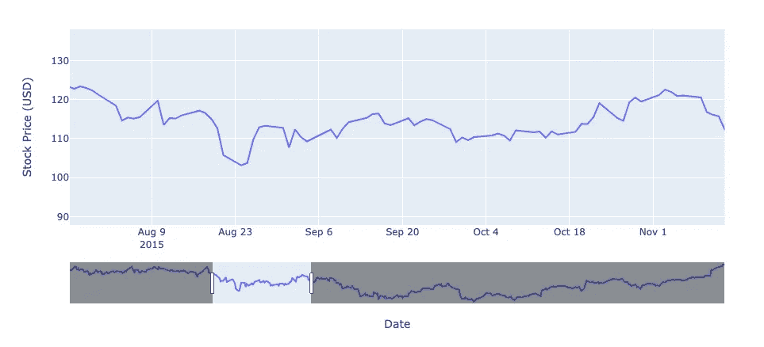
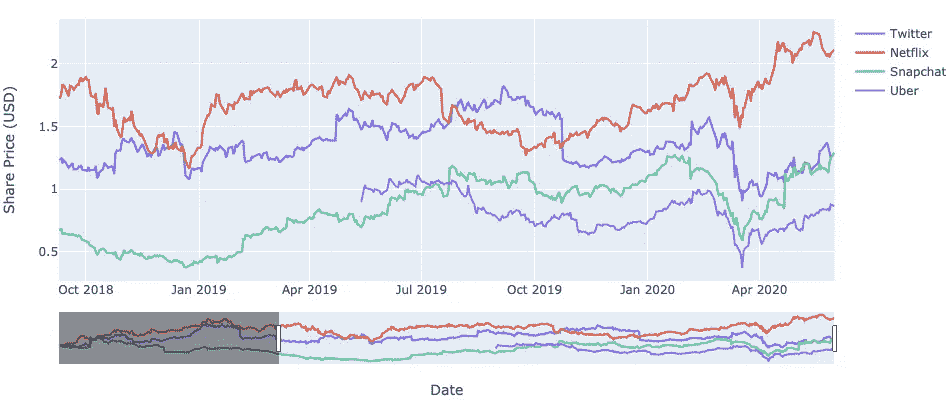
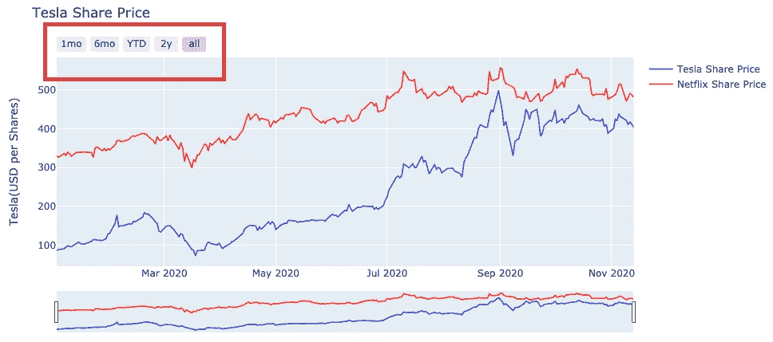

# 数据可视化:用 Python 制作交互式图表并给老板留下深刻印象的 3 个秘密技巧。

> 原文：<https://towardsdatascience.com/data-visualisation-3-secret-tips-on-python-to-make-interactive-graphs-and-impress-your-boss-233a4914efa2?source=collection_archive---------13----------------------->

## 在这篇文章中，我将给出我使用 Python 和 PlotLy(作为一名数据科学家)的 top3 数据可视化技巧，这会让你的听众欣喜若狂。经过测试和批准。


由[亚历山大·卡根](https://unsplash.com/@allewollenalex?utm_source=medium&utm_medium=referral)在 [Unsplash](https://unsplash.com?utm_source=medium&utm_medium=referral) 上拍摄的照片

在这篇文章中，我将尝试增强 Python 的可能性，使你的图形具有交互性、美观，并让你的老板印象深刻。这些技巧背后的目标是给人更好的印象，并增强用户/客户体验。**管用！**

概括来说，这三个目标是:

*   1.交互性(提示 1、2 和 3)
*   2.好看的图表(提示 3)
*   3.给你的老板留下深刻印象(建议 1、2 和 3)

Gif 来自 Giphy.com

这三个技巧来自我作为数据科学家工作 3 年后在客户面前的经验。如果你有其他想法，欢迎在评论中分享。

***在本文中，我们将介绍第一个技巧。***

让我们开始吧。

## 0.先决条件

在开始之前，请确保您安装了 Python3 版本和以下软件包:

*   熊猫
*   Plotly
*   熊猫数据阅读器

> 下面的代码不能在 Python 2 上运行

一旦你确保安装了上面的包，我们将使用 Pandas DataReader 导入市场数据。在本例中，我们将为 Tesla 导入数据。

如果这些软件包中的任何一个尚未安装，您可以使用 pip 命令，如下所示。

```
pip install pandas-datareader
pip install DateTime
```

如果你想阅读更多关于算法交易和如何获得市场数据的内容，我强烈推荐这篇精彩的文章:

[](/how-to-get-market-data-from-the-nyse-in-less-than-3-lines-python-41791212709c) [## 如何从纽交所获取不到 3 行的市场数据(Python)。

### 在本文中，您将学习使用 Python 获取股票市场数据，如价格、交易量和基本面数据…

towardsdatascience.com](/how-to-get-market-data-from-the-nyse-in-less-than-3-lines-python-41791212709c) 

如果你懒得看，可以找下面几行代码:

用于导入市场数据的代码行

一旦您从 Tesla 上传了数据，将使用的输出和数据集如下:


运行上述代码和 Yahoo Finance API 后的预期输出。

既然先决条件已经解决，我们可以从第一个提示开始。

## **提示 1** :添加范围滑块

我将与您分享的第一个技巧是**范围滑动选择器**。信不信由你，在一行代码中，你已经可以给你的图形带来实质性的交互性。

用户可以选择和缩放特定的时间段，而不是静态的图表。

在下面的例子中，它将面向财务图表，但是一旦有了时间序列，您就可以使用它。

例如，它可以用于*营销*来规划一段时间内的销售，或者*医疗工程*来规划恢复进展。我不能涵盖所有不同的领域，但你知道我的应用的可能性。

让我们在下面输入代码:

**输出:**



上图显示了使用范围滑动选择器的影响。

印象深刻不是吗？

如果你看上面的图表，你会发现一个范围滑动选择器被添加到图表中。用户/客户端将能够容易地缩放图形的特定部分。

您甚至可以用下面的代码行将其导出为 HTML，并发送给客户或朋友。

```
fig.write_html("/Users/Desktop/MyGraph.html")
```

如果你想从头到尾建造它，跟随这个一步一步的视频，它甚至是实时的**更惊人的**:

关于如何构建交互式 Python 图表的教程。

另一个例子是，您也可以导入多个份额，并将这些份额索引到相同的比例(Source 1)。结果如下:



## 后续提示:

在下一篇文章中，我们将介绍如何添加一个交互式按钮来帮助客户/用户本能地过滤数据，如下图所示。



如果你有任何问题，或者你想让我介绍数据可视化的某一点，欢迎在问答中发表评论。

# 来源:

一天学会算法交易(模块 3):

[](https://www.udemy.com/course/learn-algorithmic-trading-in-one-day/?couponCode=TOWARDSCIENCE) [## 一天学会算法交易(美国大选更新)

### 交易 707 是数据科学家和交易员的结合。我们都在伦敦工作和生活。我们觉得累了…

www.udemy.com](https://www.udemy.com/course/learn-algorithmic-trading-in-one-day/?couponCode=TOWARDSCIENCE)