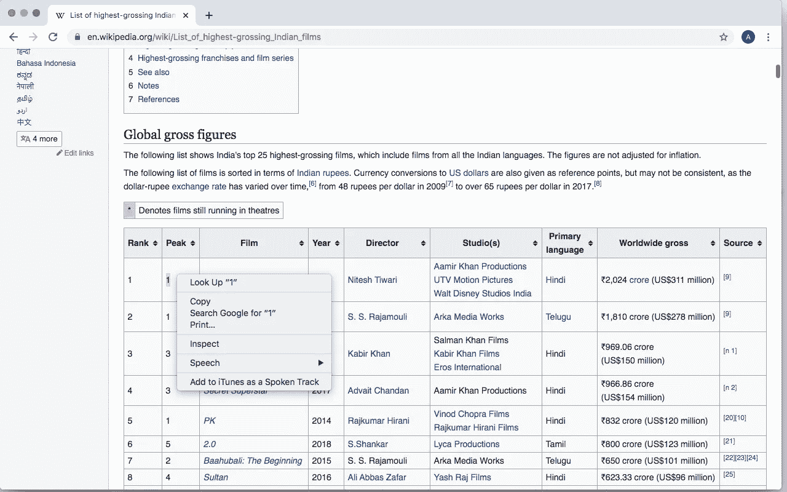
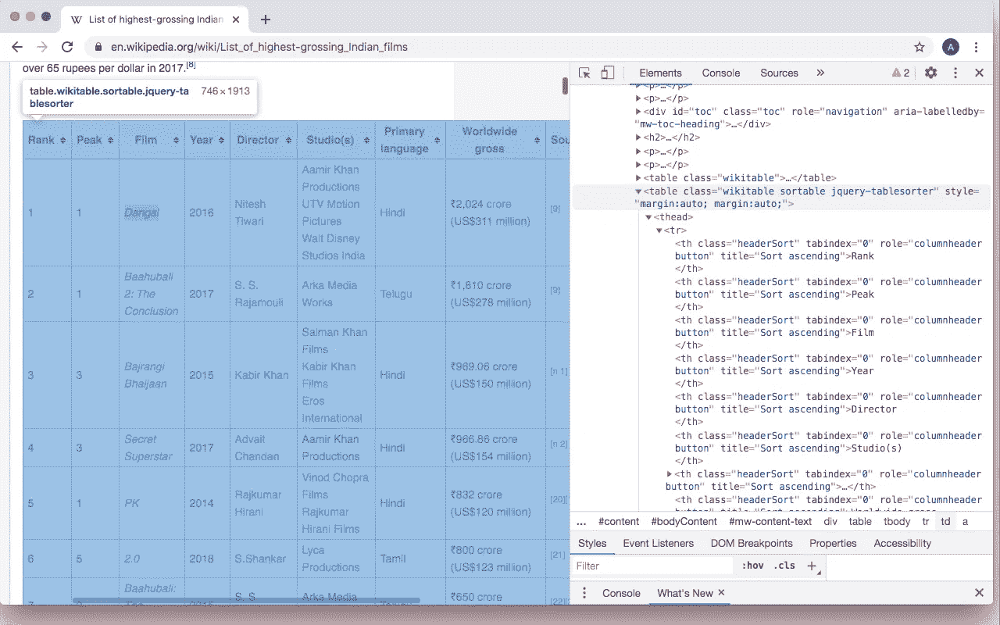
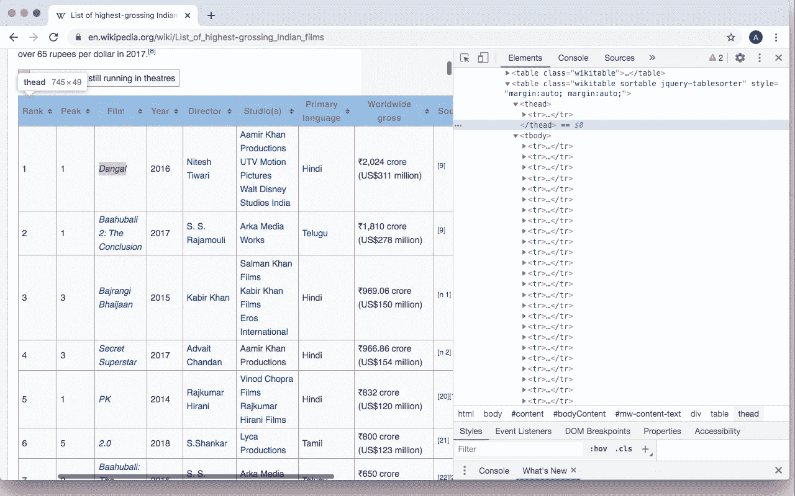
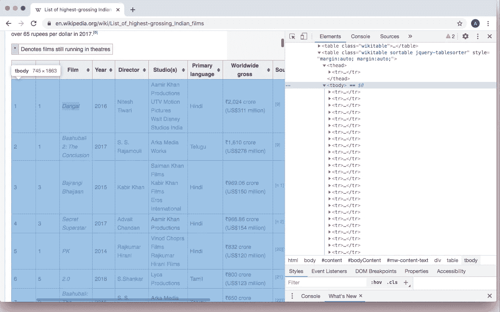
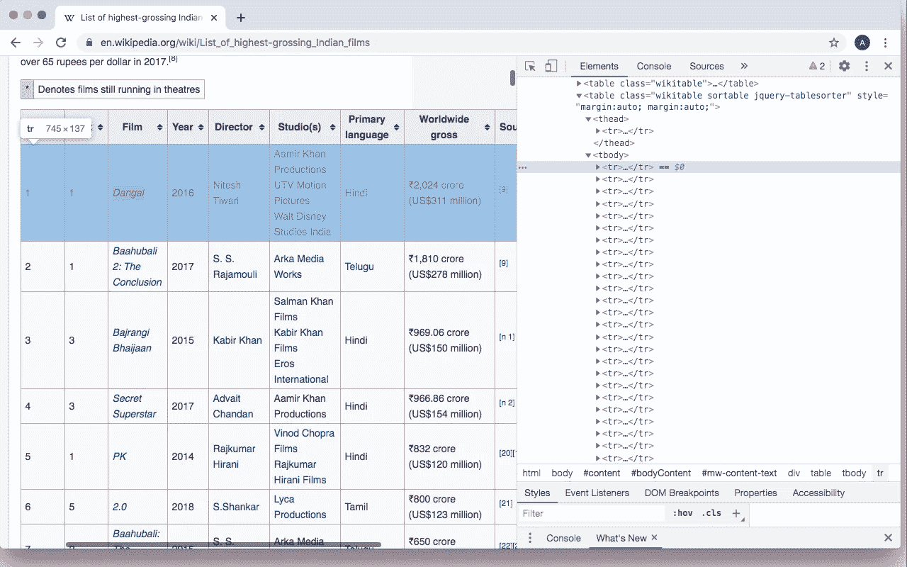
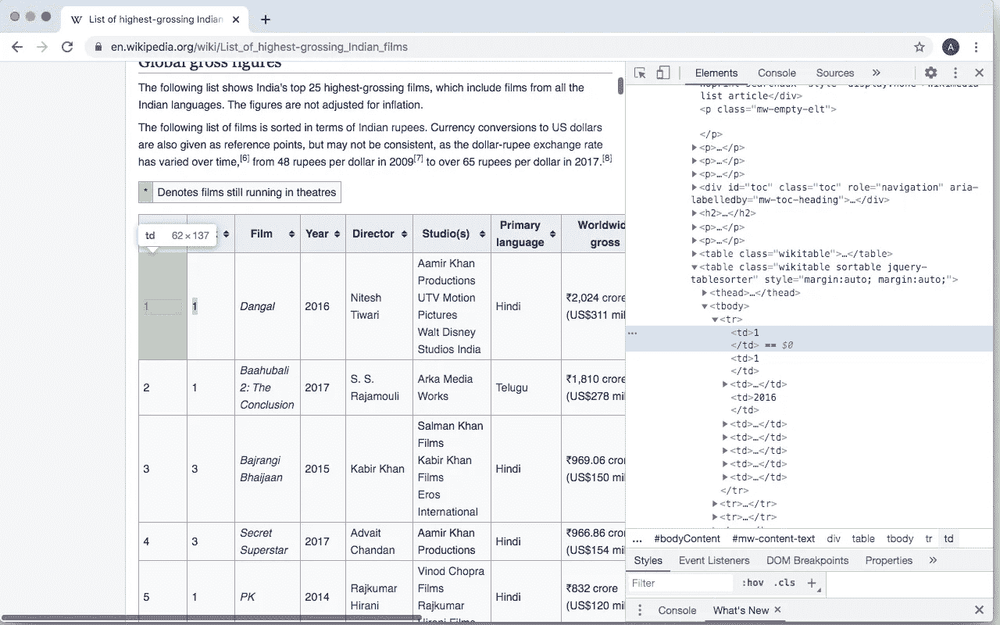
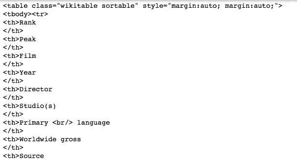
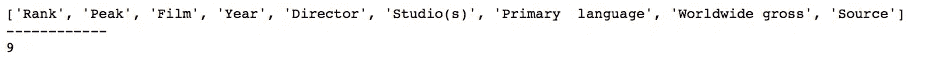
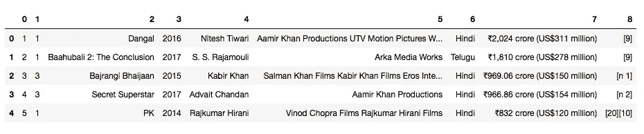
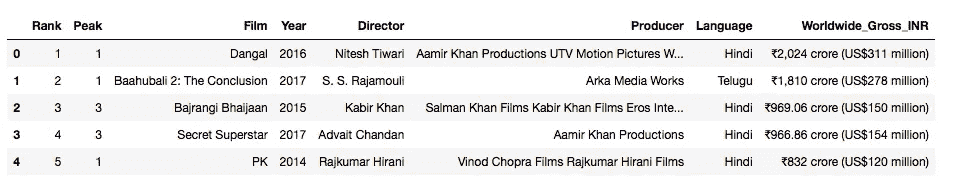

# 宝莱坞的数据可视化。一

> 原文：<https://towardsdatascience.com/data-visualisation-of-bollywood-365fd57ff1d3?source=collection_archive---------64----------------------->

## 角。1～网页抓取


布莱恩·麦高恩在 [Unsplash](https://unsplash.com?utm_source=medium&utm_medium=referral) 上的照片

如果你曾经有机会和印度人谈论电影，你一定已经意识到宝莱坞在他们的生活中扮演了多么重要的角色。代表我所有的同胞，我们就是离不开他们~无论是对着 *3 个白痴、*笑，还是过着 *Zindagi Na Milengi Dobara* (我个人一直最喜欢的)的常青时光，还是跟着*沙鲁克·汗*到*chamk Challo 一起跳舞！*

这个小项目的灵感来自于我对宝莱坞的热爱。由于这是一个巨大的产业，我想比较一下有史以来票房最高的电影。

我会把这个项目分成几个部分，这样更容易理解。这篇文章将围绕如何使用 Python 中的 **BeautifulSoup 收集数据展开。**

## 1.网络抓取简介，美丽的群组和请求

## 网页抓取

手动收集数据是一个乏味且耗时的过程，这时网络搜集就派上了用场。这是一种用于从网站自动检索信息的技术，几乎不费吹灰之力。

> 这是一种复制形式，从网络上收集并复制特定数据，通常复制到中央本地数据库或电子表格中，供以后检索或分析。——[维基百科](https://en.wikipedia.org/wiki/Web_scraping#cite_note-Boeing2016JPER-1)

## 美丽的声音

BeautifulSoup 是一个 Python 库，有助于网络抓取。它位于 HTML 或 XML 解析器之上，为迭代、搜索和修改解析树提供 Pythonic 式的习惯用法。


[卡洛斯·穆扎](https://unsplash.com/@kmuza?utm_source=medium&utm_medium=referral)在 [Unsplash](https://unsplash.com?utm_source=medium&utm_medium=referral) 上的照片

为了成功地使用 BeautifulSoup，必须了解 HTML 代码的基础知识，以便从页面中收集正确的信息。

当打开一个页面时，例如这个[维基百科页面，](https://en.wikipedia.org/wiki/List_of_highest-grossing_Indian_films)可以通过右击页面，然后转到“inspect”来访问 HTML 代码。对于初学者来说，那里的代码量肯定是巨大的，所以要快速找到具体的数据，必须突出显示表中的一个文本，右键单击它，然后转到“inspect”。



每个元素都有一个特定的标签和类。

*   表示整个表格，如下面的截图所示。它给出了一个“类”,从这个类中可以识别表。该表的各个组件都在此标签下。



*   接下来是标签，用来表示表格的表头。



*   标识表格的所有行。



*   标识单个行。



*   代表一行中的每个单独的单元格。



开始刮吧！

## 2.入门指南

为了下载页面以执行 web 抓取，必须安装 R *equests* 包。它不仅允许用户下载页面内容，还允许用户发送 HTTP 请求。

这可以使用终端中的 pip 命令来安装。

```
pip install requests
pip install beautifulsoup4
```

## 3.导入库

对于这一部分，这是收集数据所需的 4 个库。

```
import pandas as pd
import numpy as np
import requests
from bs4 import BeautifulSoup
```

1.  **Pandas:** 用于将数据转换成结构化的形式(表格)。
2.  **Numpy:** 一个流行的库，允许用户简单快速地执行数组操作。
3.  **BeautifulSoup:** 检索页面的 HTML 结构。

## 4.启动代码

```
website='[https://en.wikipedia.org/wiki/List_of_highest-grossing_Indian_films'](https://en.wikipedia.org/wiki/List_of_highest-grossing_Indian_films')
website_url=requests.get(website).text
soup=BeautifulSoup(website_url,'html.parser')
```

上面的代码定义了从中检索数据的网站，并调用 soup 函数来下载数据。

```
s = requests.Session() 
response = s.get(website, timeout=10) 
response
```

这段代码确保页面的下载已经完成。您应该得到输出为<response>，这意味着它是完整的。</response>

## 5.阅读表格

```
my_table = soup.find('table', {"class":'wikitable sortable'})
```

Soup.find 函数用于通过定义标签和类来查找页面中的特定元素。正如我上面所说的，页面中的表有“table”标记，所以如果整个页面中只有一个表，就没有必要指定它的类。在这种情况下，有多个表，我只想要其中的一个。当鼠标悬停在表上方时，可以看到我想要的表具有类‘wiki table sortable ’,所以我指定了它。

当您运行 print(my_table)函数时，您会看到它打印出标签内的所有内容(在 HTML 代码中从到

)，这非常难以阅读。



如果你想知道，这就是结果的样子。这幅图只是整个结果的一小部分。

如果您担心是否检索到了正确的表，此代码可用于确认。它打印出列标题和列数。

```
header = [th.text.rstrip() for th in rows[0].find_all('th')]
print(header)
print('------------')
print(len(header))
```



为了收集每行中的信息，下面的代码是

```
my_table_data = []
for row in rows[1:]:
            data = [d.text.rstrip() for d in row.select('td')]
            my_table_data.append(data)
```

既然数据已经收集完毕，就可以使用 pandas 将它们组成一个数据框。

```
df = pd.DataFrame(my_table_data)
```

打印出来后，应该是这样的:



耶！

不过任务还没有结束…在我们保存它之前，最好根据我们的喜好重命名和清理数据。

## 6.清洁和保存

我使用这段代码重命名了列名并删除了不需要的信息。

```
df.rename(columns = {0:"Rank"}, inplace = True)
df.rename(columns = {1:"Peak"}, inplace = True)
df.rename(columns = {2:"Film"}, inplace = True)
df.rename(columns = {3:"Year"}, inplace = True)
df.rename(columns = {4:"Director"}, inplace = True)
df.rename(columns = {5:"Producer"}, inplace = True)
df.rename(columns = {6:"Language"}, inplace = True)
df.rename(columns = {7:"Worldwide_Gross_INR"}, inplace = True)
df = df.drop(columns=[8])df.head()
```



一旦我对我的数据满意了，我就把它保存到一个 excel 文件中。

```
df.to_excel('Bollywood_movies1.xlsx', index=True)
```

瞧啊。我们刚刚使用网络抓取创建了我们的第一个数据表！

请继续关注我对这个数据集的可视化。:)