# 使用 Seaborn 的数据可视化教程

> 原文：<https://towardsdatascience.com/data-visualisation-tutorial-using-seaborn-26e1ef9043db?source=collection_archive---------33----------------------->

## 快速数据可视化教程/ Seaborn 参考笔记


照片来自 [Unsplash](https://unsplash.com/photos/hpjSkU2UYSU)

> “Seaborn 让您的数据科学项目的探索性数据分析阶段变得美丽而轻松”

# 介绍

这个教程是针对那些曾经和 [Seaborn](https://seaborn.pydata.org/) 合作过，但是已经失去接触的观众。我希望，通过阅读本文，您可以回忆起 Seaborn 可视化风格和命令，以便开始您的数据探索。本教程的布局是这样的，它展示了在给定 x 个数字特征和 y 个分类特征的情况下，如何使用 Seaborn 进行可视化。

让我们导入 Seaborn:

```
import seaborn as sns
```

# 数据集:

我们将使用 seaborn 库中可用的 tips 数据集。

使用以下方式加载数据集:

```
tips = sns.load_dataset('tips')
```

> **total_bill(数字变量) :该桌的总账单
> tip(数字) :给为该桌服务的服务员的小费
> 性别(分类):账单支付者的性别(男/女)
> 吸烟者(分类):账单支付者是否吸烟(是/否)
> day(分类):星期几(星期日、星期一等)
> table_size(数字):桌子的容量
> date:账单支付的日期和时间**

# **海风风格:**

让我们从 Seaborn 中可用的不同风格开始。每种样式都通过背景颜色、网格布局和图的轴刻度来区分。Seaborn 有五种基本样式:深色、深色网格、白色、白色网格和刻度。

```
sns.set_style('dark')sns.set_style('darkgrid')sns.set_style('ticks')sns.set_style('white')sns.set_style('whitegrid')
```

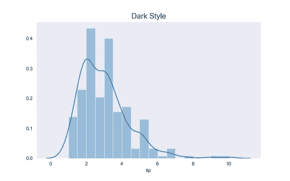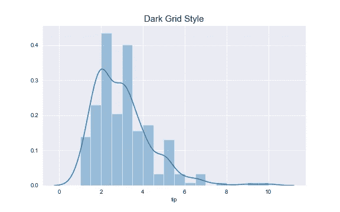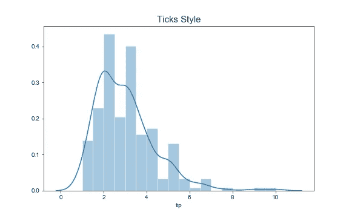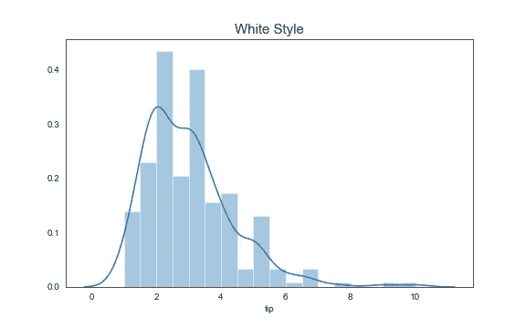

# 形象化

让我们看看使用 Seaborn 可以实现的各种可视化。下面的每一部分都展示了在给定你可用的分类变量和数字变量的情况下，如何进行可视化。

## 一个数字变量:

如果我们有一个数字变量，我们可以分析这个变量的分布。

```
g = sns.distplot(tips.tip)
g.set_title('Tip Amount Distribution');g = sns.distplot(tips.tip,kde=False)
g.set_title('Tip Amount Histogram');g = sns.distplot(tips.tip,rug=True)
g.set_title('Tip Amount Distribution with rug');
```

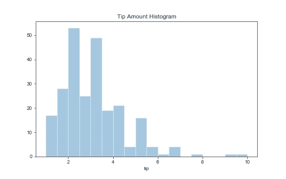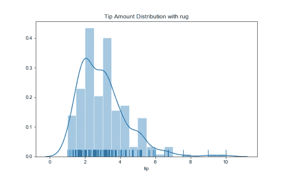

我们可以观察到小费金额数据大致正常。

## **一个分类变量**

如果我们有一个分类变量，我们可以做一个计数图，显示分类变量的每个值出现的频率。

```
g = sns.catplot(x="day",kind='count',order=['Thur','Fri','Sun','Sat'],data=tips);g.fig.suptitle("Frequency of days in the tips dataset [Count Plot]",y=1.05);
```

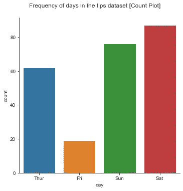

## **两个数值变量**

为了分析两个数值变量之间的关系，我们可以在 seaborn 做散点图。

```
g = sns.relplot(x="total_bill",y="tip",data=tips,kind='scatter');g.fig.suptitle('Relationship between continuous variables [Scatter Plot]',y=1.05);
```

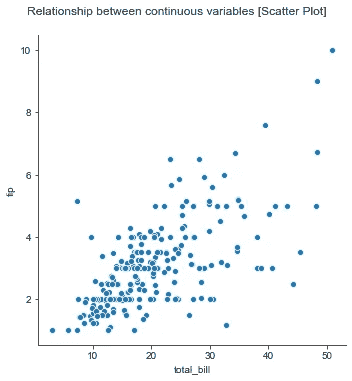

Seaborn 还使两个数值变量之间关系的密度分布可视化变得容易。

```
g = sns.jointplot(x="total_bill",y='tip',data=tips,kind='kde');g.fig.suptitle('Density distribution among tips and total_bill [Joint Plot]',y=1.05);
```

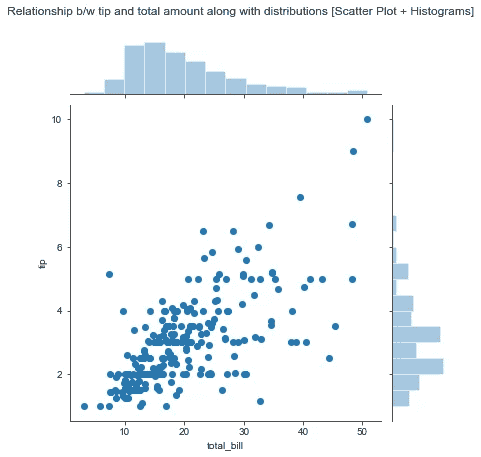

kde 图是另一种显示两个连续变量之间关系分布的图。

```
g = sns.jointplot(x="total_bill",y='tip',data=tips,kind='kde');g.fig.suptitle('Density distribution among tips and total_bill [Joint Plot]',y=1.05);
```

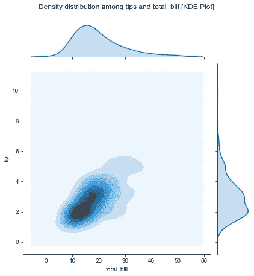

我们也可以用置信区间画一条回归线，其中一个数字变量作为因变量，另一个作为自变量。

```
g = sns.lmplot(x="total_bill",y="tip",data=tips);g.fig.suptitle('Relationship b/w tip and total_bill [Scatter Plot + Regression Line]',y=1.05);
```

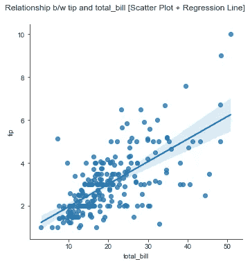

带回归线的散点图

如果自变量是 datetime，我们可以做一个线图，也是时间序列图。

```
g = sns.lineplot(x="date",y="total_bill",data=tips);g.set_title('Total bill amount over time [Line plot]');
```

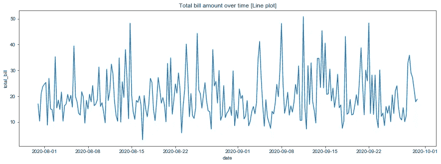

## 两个数字变量和一个分类变量

有了两个数值变量和一个分类变量，我们可以绘制两个数值变量部分提到的所有图。分类变量的附加维度可用作颜色/标记，以区分图中的分类变量值。

```
g = sns.relplot(x="total_bill",y="tip",hue='sex',kind='scatter',data=tips);
g.fig.suptitle('Relationship b/w totalbill and tip distinguished by gender [Scatter Plot]',y=1.05);g = sns.relplot(x="total_bill",y="tip",style='sex',kind='scatter',data=tips)
g.fig.suptitle('Relationship b/w totalbill distinguished by gender as marker [Scatter Plot]',y=1.05);
```

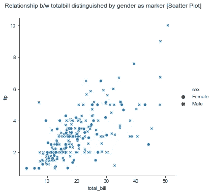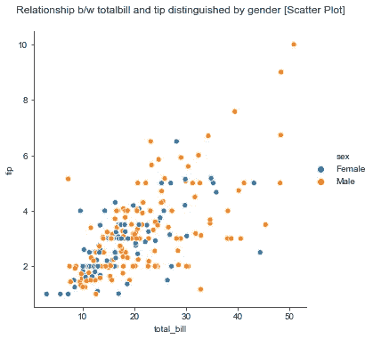

或者，我们可以将每个分类变量值作为一个组来绘制每个分类变量值的两个数值变量之间的关系。

```
g = sns.relplot(x="total_bill",y="tip",col='sex',kind='scatter',data=tips);g.fig.suptitle('Relationship between totalbill and tip by gender [Scatter Plot]',y=1.05);
```

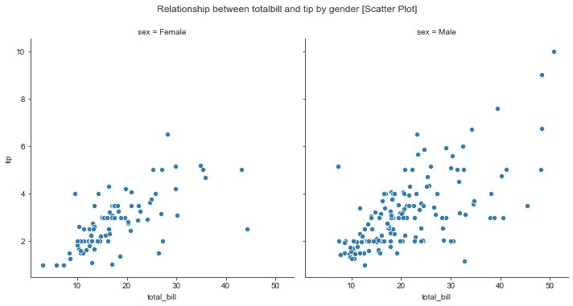

## 三个数字变量

如果我们有三个数值变量，我们可以做一个两个变量的散点图，第三个变量可以用作散点图中各点的大小。

```
g = sns.relplot(x="total_bill",y="tip",size='table_size',kind='scatter',data=tips);g.fig.suptitle('total bill vs tip distinguished by table size [Scatter Plot]',y=1.05);
```

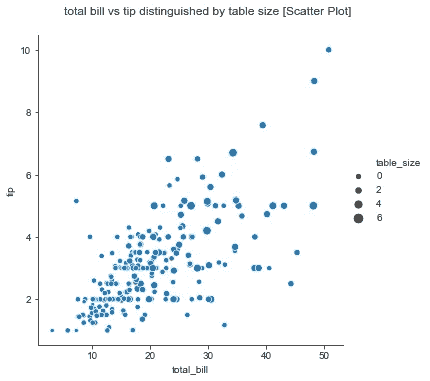

## **三个数值变量和一个分类变量:**

如果我们有三个数字变量和一个分类变量，可以为分类变量的每个值绘制上一节中提到的相同的图。

```
g = sns.relplot(x="total_bill",y="tip",col='sex',size='table_size',kind='scatter',data=tips);g.fig.suptitle('Total bill vs tip by gender distinguished by table size [Scatter Plot]',y=1.03);
```

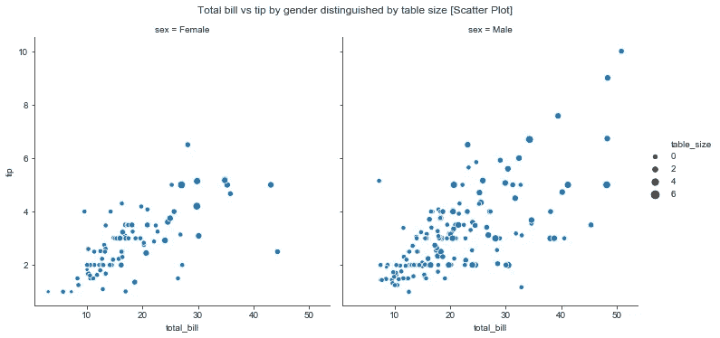

## 一个数字变量和一个分类变量:

这可能是数据可视化中最基本、最常见、最有用的情节。如果我们有一个数字变量和一个分类变量，我们可以做各种各样的图，如条形图和条形图。

```
g = sns.catplot(x="day",y="tip",kind='bar',order=['Thur','Fri','Sun','Sat'],ci=False,data=tips);g.fig.suptitle('Tip amount by day of week [Bar Plot]',y=1.05);
```

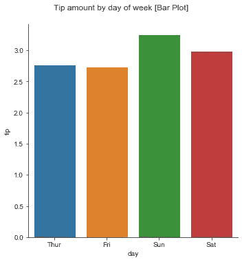

```
g = sns.catplot(x="day",y="tip",kind='strip',order=['Thur','Fri','Sun','Sat'],ci=False,data=tips);g.fig.suptitle('Tip amount by day along with tips as scatter [Strip Plot]',y=1.03);
```


如下图所示的蜂群图和小提琴图使我们能够可视化每个分类变量中数值变量的分布。

```
g = sns.catplot(x="day",y="tip",kind='swarm',order=['Thur','Fri','Sun','Sat'],ci=False,data=tips);g.fig.suptitle('Tip amount by day along with tip distribution [Swarm Plot]',y=1.05);
```

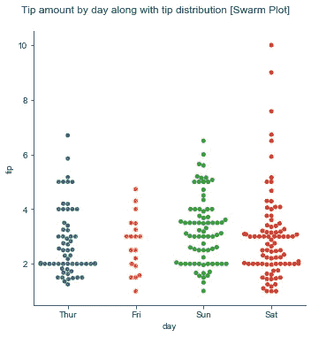

```
g = sns.catplot(x="day",y="tip",kind='violin',order=['Thur','Fri','Sun','Sat'],data=tips);g.fig.suptitle('Tips distributions by day [Violin Plot]');
```

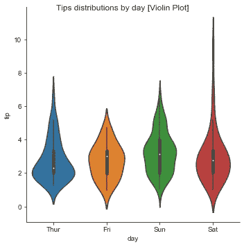

我们可以使用一个点图来显示连续变量在分类变量的每个值内的四分位数范围(第 25 个百分点到第 75 个百分点)。

```
g = sns.catplot(x="day",y="tip",kind='point',order=['Thur','Fri','Sun','Sat'],data=tips,capsize=0.5);g.fig.suptitle('IQR Range of tip by day [Point Plot]',y=1.05);
```


## 一个数字变量和两个分类变量:

有了一个数字变量和两个分类变量，我们可以使用上一节中提到的所有图，并在每个子图中将额外的第三个分类变量作为列变量或子组，如下所示。

```
g = sns.catplot(x="day",y="tip",kind='bar',col='smoker',order=['Thur','Fri','Sun','Sat'],ci=False,data=tips);g.fig.suptitle('Tip amount by day of week by smoker/non-smoker [Bar Plot]',y=1.05);
```

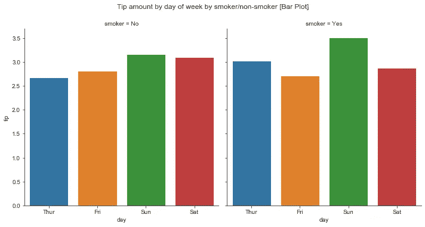

```
g = sns.catplot(x="day",y="tip",kind='bar',hue='smoker',order=['Thur','Fri','Sun','Sat'],ci=False,data=tips);g.fig.suptitle('Tips by day with smoker/non-smoker subgroup [Grouped Bar Plot]',y=1.05);
```

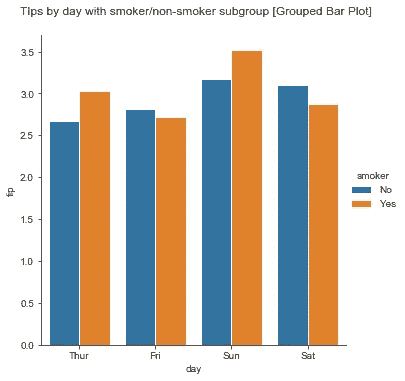

## 一个数字变量和三个分类变量:

有了一个数字变量和三个分类变量，我们可以实现“一个分类变量和一个数字变量”一节中提到的所有可视化，并容纳另外两个分类变量，其中一个变量作为图中的列变量/行变量，另一个变量作为每个子图中的子组。

```
g = sns.catplot(x="day",y="tip",kind='bar',hue='smoker',col='sex',order=['Thur','Fri','Sun','Sat'],ci=False,data=tips);g.fig.suptitle('Tips by day with smoker/non-smoker subgroup by gender [Grouped Bar Plot]',y=1.05);
```

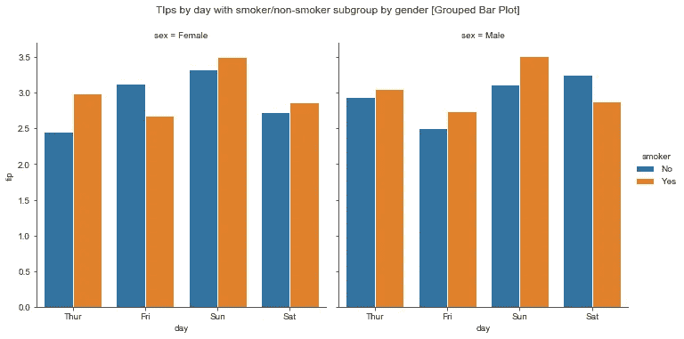

## 三个以上的连续变量:

最后，如果我们有三个以上的数字变量，我们可以使用热图或 pariplot。有了这些图，我们可以直观地看到单个图中每个数值变量之间的关系。

```
g = sns.heatmap(tips.corr());g.set_title('correlation between continuous variables [Heat Map]');
```

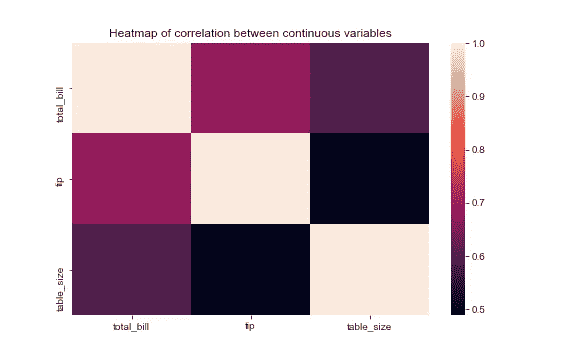

```
g = sns.pairplot(tips);g.fig.suptitle('Relationship between continuous variables [Patiplot]',y=1.03);
```


## 设置标题、标签和图例

一些 Seaborn plots 返回 matplotlib AxesSubplot，而另一些返回 FacetGrid(如果您忘记了什么是 matplotlib AxesSubplots，请查看我在 matplotlib 上的[注释](https://medium.com/@pavankumarb1357/quick-matplotlib-tutorial-adae2f7d3fe9)以供参考)。

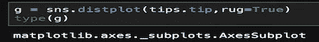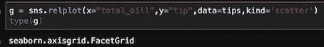

FacetGrid 是 matplotlib AxesSubPlots 的网格(2D 数组)。您可以使用数组索引访问每个子情节，并为每个情节设置标签和标题。

```
g = sns.relplot(x="total_bill",y="tip",data=tips,kind='scatter');
g.axes[0,0].set_title('Relationship between continuous variables [Scatter Plot]');
g.axes[0,0].set_xlabel('Total Bill Amount');
g.axes[0,0].set_ylabel('Tip Amount');
```

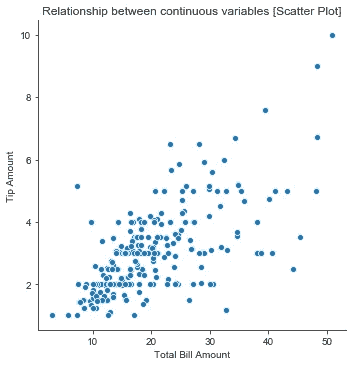

如果绘图返回 AxesSubplot，可以使用 AxesSubplot 方法设置标题和图例。

```
g = sns.distplot(tips.tip)
g.set_title('Tip Amount Probablity Distribution');
g.set_xlabel('Tip Amount')
g.set_ylabel('probability')
```

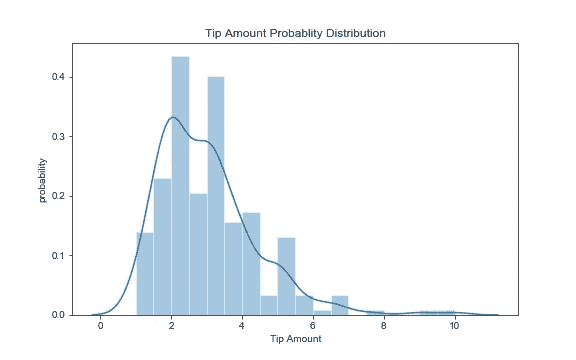

对于 FacetGrid，可以从 FacetGrid 对象中获取 figure 对象，并为 figure 对象设置标题。

```
g = sns.relplot(x="total_bill",y="tip",col='sex',kind='scatter',data=tips);g.fig.suptitle('Relationship between totalbill and tip by gender [Scatter Plot]',y=1.05);
```


# 结论

希望本教程有助于你开始使用 seaborn 轻松制作漂亮的可视化效果。虽然 Seaborn 易于使用，但它也提供了许多定制功能，这是一个高级主题。一旦你熟悉了基本的绘图，你就可以在使用 Seaborn 进行可视化时进一步探索它。

# 参考

用于显示样地的数据集:
[https://github . com/mwaskom/seaborn-data/blob/master/tips . CSV](https://github.com/mwaskom/seaborn-data/blob/master/tips.csv)

Seaborn 官方网站:
【https://seaborn.pydata.org/ 

本文中使用的图的源代码可以在我的 github repo 中找到:
[https://github . com/pavankumarboinapalli/articles/blob/master/seabornify . ipynb](https://github.com/pavankumarboinapalli/articles/blob/master/seabornify.ipynb)

> 我乐于接受建设性的批评。请随意评论改进这篇文章的方法。例如，如果你觉得有一些信息可以包括在内，或者如果你想对一个子主题有更多的解释。