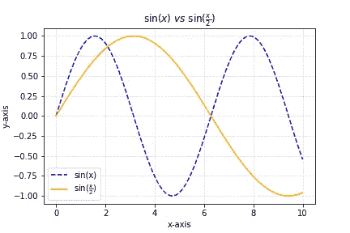
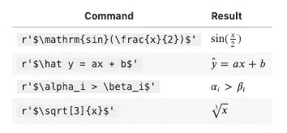
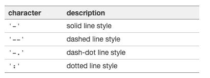
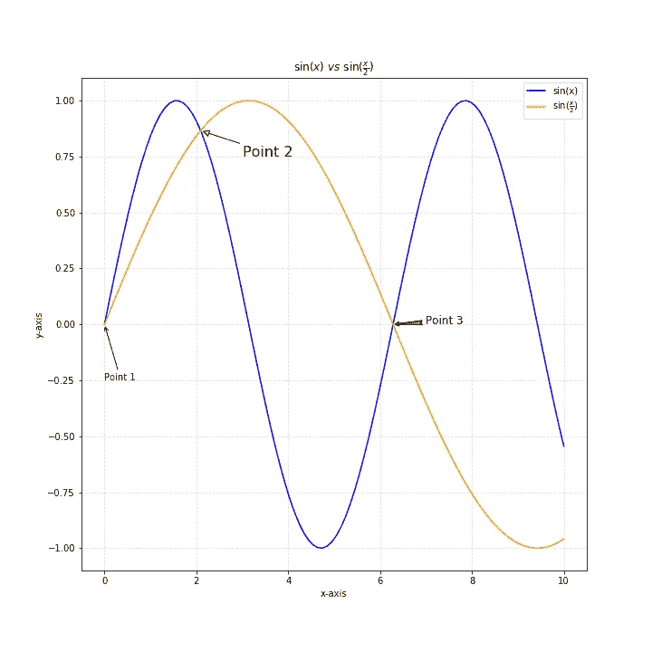
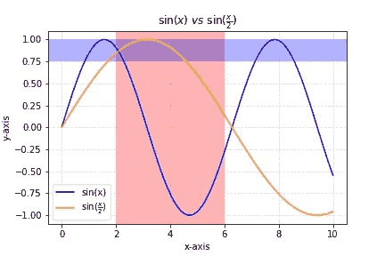
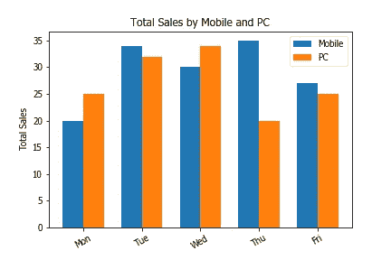

# 用 Matplotlib 实现数据可视化

> 原文：<https://towardsdatascience.com/data-visualisation-with-matplotlib-13aaf4787b30?source=collection_archive---------18----------------------->

## 如何在 5 分钟内掌握 Matplotlib 的基本关键特性


照片由 [Isaac Smith](https://unsplash.com/@isaacmsmith?utm_source=unsplash&utm_medium=referral&utm_content=creditCopyText) 在 [Unsplash](https://unsplash.com/s/photos/graph?utm_source=unsplash&utm_medium=referral&utm_content=creditCopyText) 上拍摄

Matplotlib 是 Python 中著名的可视化数据库之一。在本文中，我将介绍这些我认为有用且重要的关键函数，以便那些 Matplotlib 新手能够快速掌握。

*   基本制图
*   在标题和标签中生成数学表达式
*   用文本和箭头给图表添加注释
*   突出显示您的图表

# 入门指南

像往常一样，如果我们没有 matplotlib 包，我们需要安装它。

```
pip install matplotlib
```

让我们导入我们在本教程中需要的包。

# 基本制图



figure1.png

让我们从 Matplotlib 中的基本图表功能开始。

`plt.title`将为您的图表创建一个标题。它接受普通的字符串和 Tex 标记。如果您希望使用 Tex 标记来生成数学表达式，您必须使用`$`来包含您的文本字符串。我更喜欢用这个，因为它看起来比`sin(x/2)`好多了！下面是一些我们可以在 Matplotlib 中使用的其他数学表达式的例子。更多例子你可以参考[文档](https://matplotlib.org/tutorials/text/mathtext.html)。



`plt.plot`将用给定的数据点生成一个图，`x`和`np.sin(x)`是我们在这种情况下输入的数据点。默认情况下，`plt.plot`会返回一个实线样式(`-`)。您可以选择其他线型，如虚线或点线。



线条样式

我们可以用`color`参数定制绘图的颜色。你可以传递颜色字符串或颜色代码。和标题一样，你也可以把数学表达式传递给剧情的`label`。`plt.legend`将根据您在`plot`中传递的属性为图表创建图例。

`plt.grid`将在图表上创建一个网格。与`plot`类似，可以定义不同的线条样式。`alpha`是网格的不透明度。

`plt.xlabel`和`plt.ylabel`用于标注 x 轴和 y 轴。

如果您想将此图表保存为图像，请使用`plt.savefig`。如果您从未指定完整路径，默认情况下，图像将保存在脚本的同一文件夹中。

`plt.show`用于在使用终端或脚本时显示图表。这在一些 IDE 和 Jupyter 笔记本中是不必要的。

# 注释您的图表



figure2.png

我已经用`plt.figure(figsize=(10,10))`放大了图表的尺寸，这样我们可以更清楚地看到注释。您可以将宽度和高度传递给`figsize`以获得您想要的图表大小。

`plt.annotate`用于标注两条直线的交点。`xy`是注释点的位置，而`xytext`是注释文本的位置。我已经展示了 3 种不同颜色和尺寸的箭头，你可以参考[文档](https://matplotlib.org/3.3.1/tutorials/text/annotations.html#plotting-guide-annotation)以获得更多选项。

# 突出显示您的图表



figure3.png

`plt.axvspan`用于沿 x 轴高亮显示，而`plt.axhspan`用于沿 y 轴高亮显示。我们可以用`facecolor`参数定义不同的颜色，用`alpha`定义不同的不透明度。

# 自定义条形图中的 xtick

条形图也是另一个在可视化中常用的图表，让我们也来看看。



figure4.png

`plt.bar`取一个数组为你的横条坐标。如果你想创建一个多条形图，你必须传递两个条形图的坐标。`x — width/2`和`x + width/2`被传入其中以创建一个多条形图。

`plt.xtick`用于将标签更新为天数(`['Mon','Tue','Wed','Thu','Fri']`)，因为默认为`[0,1,2,3,4]`。如果文本太长，我们也可以给这个标签添加旋转。在这种情况下，刻度会旋转 30 度。

现在你已经学会了如何用 Matplotlib 定制你的图表**，我希望这篇文章能帮助你掌握 Matplotlib 的基础知识，并轻松熟悉 Matplotlib 的其他功能。如果我犯了任何错误或错别字，请给我留言。**

您可以在我的 [**Github**](https://github.com/chingjunetao/medium-article/tree/master/visualisation-with-matplotlib) 中查看完整的 Jupyter 笔记本。干杯！

**如果你喜欢读这篇文章，你可能也会喜欢这些:**

[](/how-to-rewrite-your-sql-queries-in-python-with-pandas-8d5b01ab8e31) [## 如何用熊猫用 Python 重写 SQL 查询

### 在 Python 中再现相同的 SQL 查询结果

towardsdatascience.com](/how-to-rewrite-your-sql-queries-in-python-with-pandas-8d5b01ab8e31) [](/how-to-master-python-command-line-arguments-5d5ad4bcf985) [## 如何掌握 Python 命令行参数

### 使用命令行参数创建自己的 Python 脚本的简单指南

towardsdatascience.com](/how-to-master-python-command-line-arguments-5d5ad4bcf985) 

**你可以在 Medium 上找到我其他作品的链接，关注我** [**这里**](https://medium.com/@chingjunetao) **。感谢阅读！**