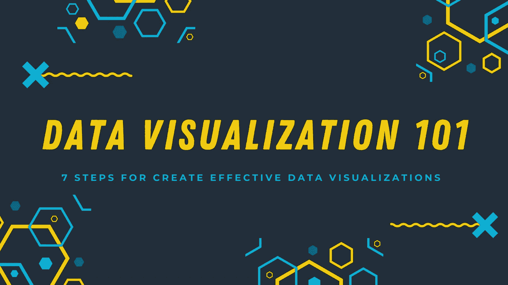
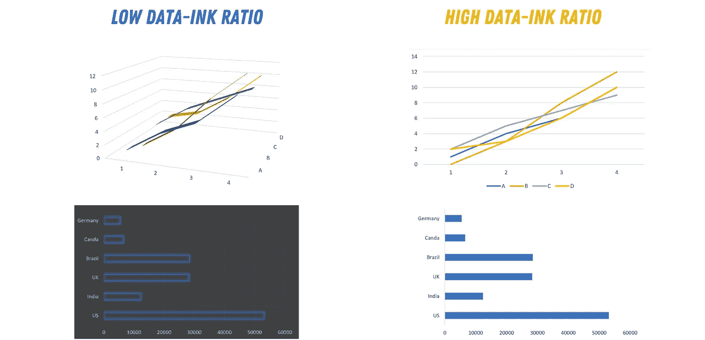
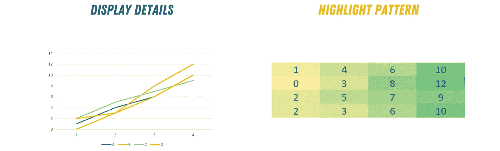
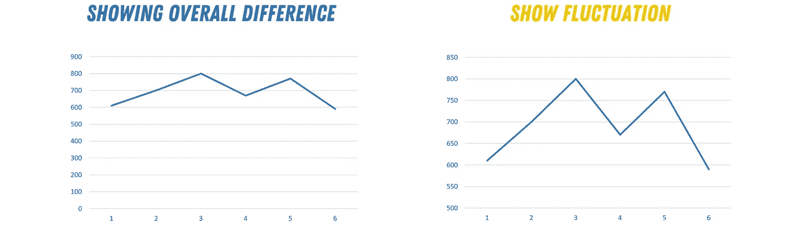
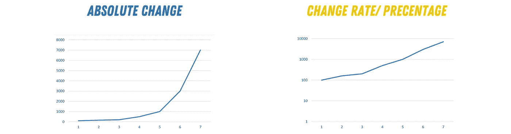
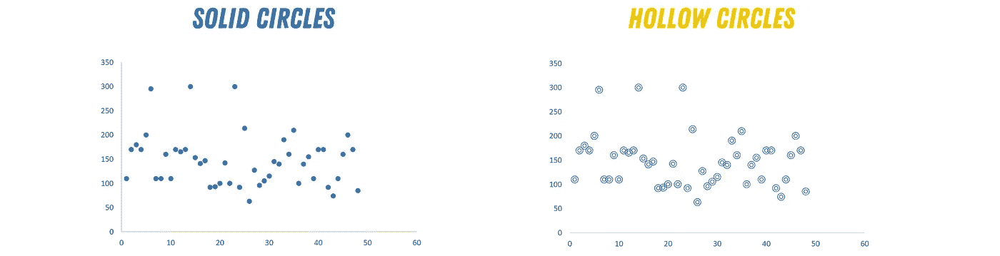
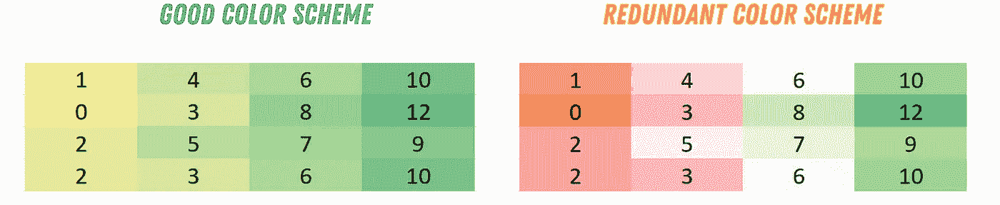

# 数据可视化 101:有效可视化的 7 个步骤

> 原文：<https://towardsdatascience.com/data-visualization-101-7-steps-for-effective-visualizations-491a17d974de?source=collection_archive---------13----------------------->

## 用引人注目的视觉效果讲述您的数据故事。

图片由作者提供(使用 [Canva](https://www.canva.com/) 制作)

成为数据科学家的一个重要方面是能够使用各种可视化工具有效地交流数据分析结果。

> 数据是一个用数字讲述的故事，可视化是你讲述这个故事的方式。

不幸的是，我们更多地关注学习新的分析方法、库和方法，熟悉新的数据集或趋势机器学习和人工智能算法，而忽视了提高我们的可视化技能。

不要误解我的意思，掌握最新的技术对于在 DS 领域取得成功是非常重要的。但是我们需要花一些时间来提高可视化和讲故事的能力。

**想象一下这个 T3；你** 花费数小时清理数据，探索数据，并对其建模。很有意思；你的结果是有效的，而且意义重大。但是，你的数据可视化是枯燥和无效的。这导致你的观众忽略了你的努力。

> 学习如何有效地可视化您的数据就像学习如何讲述一个引人入胜的故事。

您对图表类型、颜色和风格的选择将对他人如何看待您的数据产生巨大的影响。

幸运的是，有一些简单的指导方针，如果你遵循的话，可以让你的数据可视化在视觉上*吸引人*，引人注目*和迷人*。

这篇文章将介绍基于科学实验和研究的简单技巧来提升你的视觉化。

事不宜迟，让我们开始用我们的数据有效地讲述一个故事。

# 提示№1:简单总是更好

使用可视化的目的是让信息更容易被他人阅读和理解。因此，要避免复杂、拥挤的可视化。

每当你创建一个可视化，你需要注意数据和墨水的比例。数据-油墨比率是一个术语，用于表示图表中数据与冗余油墨的数量，如背景效果/颜色和数据的 3D 表示。

除了使用多维图形，您还可以使用可视化属性(如形状、颜色和厚度)来区分不同的数据集。

为了使您的可视化简单有效，您的数据-墨水比率需要很高。

图片由作者提供(使用 [Canva](https://www.canva.com/) 制作)

# 提示 2:选择正确的图表类型

 [## 数据可视化 101:如何选择图表类型

### 如何选择最能描述数据的图表类型

towardsdatascience.com](/data-visualization-101-how-to-choose-a-chart-type-9b8830e558d6) 

每当您试图创建一个图表时，您都需要注意您的数据类型，以选择正确的图表来准确地表示它。

根据您使用的数据，您将使用的图表类型会有所不同。一个好的经验法则是:

1.  如果您有分类数据，如果您有 5 个以上的类别，请使用条形图，否则请使用饼图。
2.  如果您有名义数据，如果您的数据是离散的，请使用条形图或直方图，如果是连续的，请使用折线图/面积图。
3.  如果要显示数据集中值之间的关系，请使用散点图、气泡图或折线图。
4.  如果要比较数值，请使用饼图(相对比较)或条形图(精确比较)。

# 提示 3:想象每个图表的一个方面

在创建图表之前，您需要决定您到底想要显示什么。你想显示图案还是细节？为了让你的视觉效果更有效，试着一次只展示一个方面。

如果您需要显示数据的两个方面，一个模式和一些细节，请使用两个不同的图。例如，您可以使用折线图显示详细信息，使用热图或水平图显示数据中的模式。

水平图平行显示多个时间序列。地平线图类似于时间序列图。然而，在横向图中，使用颜色来突出不同时间序列之间的差异和极端情况。

图片由作者提供(使用 [Canva](https://www.canva.com/) 制作)

# 提示 4:让你的坐标轴范围有趣

您的垂直轴和水平轴的范围取决于图表的类型和您试图用它讲述的故事。

例如，如果您使用条形图，并且只显示不同数据集的最大值，那么您的坐标轴需要从 0 开始。

然而，如果你想用精确的数字显示数据的波动，你需要放大你的坐标轴来清楚地显示这种波动。当图限接近波动范围时，更容易看到数据集中的变化。

图片由作者提供(使用 [Canva](https://www.canva.com/) 制作)

# 技巧№5:用数据转换强调变化率

在可视化中使用变换的决定取决于数据集和绘图目的。在图表上应用变换可以改变图表传达的印象和信息。

一般来说，您可以转换图形的两个方面。你的坐标轴或者数据本身。

## 变换您的坐标轴

绘制一组数据时，可以使用线性或对数刻度。对数刻度通常用于显示一段时间内的变化百分比，因此刻度上的点不是等距分布的。

另一方面，线性比例用于显示数据集各唯一点之间的绝对差异。

图片由作者提供(使用 [Canva](https://www.canva.com/) 制作)

## 转变您的数据

人们有时很难理解对数标度，因此避免这种情况的方法是转换数据。例如，您可以将值标准化为平均值或特定值，而不是显示绝对值。

# 提示 6:小心散点图中的重叠点

使用散点图时，有时两个或多个圆可能会相互重叠，这可能会使读取数据更加复杂。它还可以隐藏图形中特定集群的实际大小。

要避免这个问题并使你的散点图更有意义，你可以做的一件事是对你的圆使用不同的不透明度，以清晰地显示你的所有数据点。

实现类似效果的另一个策略是绘制未填充的圆。这种方法在大型数据集的情况下可能没有好处，那么，使用不透明度选项可能是一个更好的选择。您还可以更改圆圈的大小，以获得更清晰的整体视觉效果。

图片由作者提供(使用 [Canva](https://www.canva.com/) 制作)

# 提示 7:小心你的配色方案

颜色可以成就或破坏你的图表。当你创造新的视觉效果时，你需要小心选择配色方案。要选择最佳的配色方案，你需要问自己两个问题。

## 颜色在不同平台上可见吗？

有时，当我们在设备上构建图表以用于演示或会议时，我们会忘记测试该图表在不同平台上的显示效果。

它们在电脑或手机上显示时会清晰吗？灯光怎么样？我必须使用高屏幕亮度才能看清图表，还是不管用？

图片由作者提供(使用 [Canva](https://www.canva.com/) 制作)

## 我将使用什么媒体来显示我的图表？

如果您正在创建要打印的图表，纸张类型可能会影响您对颜色的选择。有时，在特定种类的纸张上打印时，屏幕上清晰的颜色可能不明显。

此外，尽量使用较少的颜色或相关的颜色来传达你的信息。如果你正在创建一个热图，你需要使用一种颜色的渐变，而不是不同的颜色。使用不同的颜色可能会混淆，使你的地图难以理解。

# 结论

可视化数据通常是将数据传达给广大受众的最佳和最直接的方法。每当我们试图创建图表和数字时，我们需要使它们简单、直接、易读。

请记住，您的数据讲述了一个故事，您对可视化的选择可以让这个故事变得激动人心，也可以让它变得完全乏味。

因此，遵循 7 个简单的步骤，你可以快速提高可视化的质量和可读性:

1.  *简单的*总是更好。
2.  您的*轴范围*产生了巨大的差异。
3.  每张图关注*的一个*方面。
4.  为您的数据选择正确的*图表类型*。
5.  使用*变换*来强调变化。
6.  小心散点图中的*重叠*圆。
7.  不要过度使用*颜色*方案。

# 参考

[1]希利，C. G. (1996 年 10 月)。为数据可视化选择有效的颜色。第七届 IEEE 可视化年会论文集' 96 (第 263-270 页)。IEEE。

[2]常青树，S. D. (2019)。*有效的数据可视化:正确的数据对应正确的图表*。Sage 出版公司。

[3]c .凯莱赫和 t .瓦格纳(2011 年)。科学出版物中有效数据可视化的十大准则。*环境建模&软件*、 *26* (6)、822–827。