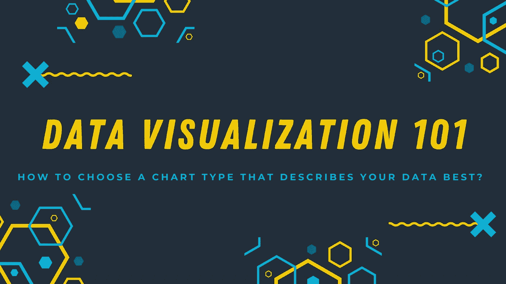
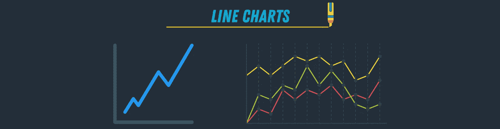

# 数据可视化 101:如何选择图表类型

> 原文：<https://towardsdatascience.com/data-visualization-101-how-to-choose-a-chart-type-9b8830e558d6?source=collection_archive---------0----------------------->

## 如何选择最能描述数据的图表类型

图片由作者提供(使用 [Canva](https://www.canva.com/) 制作)

在处理任何数据科学项目时，探索和解释结果的一个重要步骤是可视化数据。在项目开始时，可视化数据有助于您更好地理解数据，找到模式和趋势。

在项目结束时，在您完成分析并应用不同的机器学习模型后，数据可视化将帮助您更有效地交流您的结果。

人类天生是视觉动物；当事物以一种易于理解的可视化方式呈现时，它对我们来说是有意义的。解读条形图比查看电子表格中的大量数字要容易得多。

高效的数据可视化可以决定项目的成败。如果你花了大量的精力来分析和模拟你的数据，但是你最终使用了错误的图表类型来展示你的结果，你的观众将不会理解你所付出的努力或者如何使用这些结果。

有许多图表类型，如此之多，选择正确的图表的过程可能会令人不知所措。这篇文章将——希望——给你一个简单直接的方法来选择最好的图表类型，完美地代表你的数据，并最有效地传达它。

# 如何开始？

在开始研究图表类型之前，你需要问自己 5 个关于数据的关键问题。这些问题将帮助您更好地理解您的数据，从而选择最佳的图表类型来表示它。

## №1.你的数据试图传达什么样的故事？

> 数据只是用数字讲述的故事。

所以，关于你的数据，你需要知道的第一件事是，它试图传递什么样的故事？为什么收集这些数据，如何收集？

你收集数据是为了发现趋势吗？比较不同的选择？它显示出一些分布吗？还是用来观察不同值集之间的关系？

了解数据的起源并知道它试图传递什么将使选择图表类型变得更加容易。

## №2.你将向谁展示你的成果？

一旦你弄清楚了数据背后的故事，接下来，你需要知道你将向谁展示你的结果。如果你正在分析股票市场的趋势，并且你将把你的发现展示给一些商人，你可能会使用不同的图表类型，而不是把你的发现展示给刚开始接触股票市场的人。

> 使用数据可视化的全部目的是使数据通信更有效。

因此，您需要了解您的受众，以便在向他们展示数据时可以选择最佳的图表类型。

## №3.你的数据有多大？

数据的大小将显著影响您将使用的图表类型。有些类型的图表不适合用于大规模数据集，而有些则非常适合大数据。

例如，饼图最适用于少量数据集；但是，如果您使用大量数据集，使用散点图会更有意义。

您需要选择一种最适合您的数据大小的图表类型，并清楚地表示它而不混乱。

## №4.你的数据类型是什么？

有几种类型的数据，描述的，连续的，定性的，或分类的。您可以使用这种数据来消除某些图表类型。例如，如果你有连续的数据，条形图可能不是最好的选择；你可能需要用折线图来代替。

同样，如果您有分类数据，那么使用条形图或饼图可能是一个好主意。您可能不想使用带有分类数据的折线图，因为根据定义，您不能有连续的类别。必须是离散的有限数量的类别。

## №5.您的数据的不同元素是如何相互关联的？

最后，您需要问自己数据的不同元素是如何关联的。您的数据顺序是否基于某些因素—时间、大小、类型？并不代表基于某个变量的排名。还是不同变量之间的相关性？

您的数据是随时间变化的时间序列吗？或者更多的是一种分配？

数据集中的值之间的关系可能会更直接地决定使用哪种图表类型。

# 最常用的 7 种图表类型

有 40 多种图表可供选择；有些比其他的更常用，因为它们更容易构建和解释。让我们谈谈最常用的 7 种图表类型以及何时使用它们。

## 条形图

图片由作者提供(使用 [Canva](https://www.canva.com/) 制作)

***何时使用:***

1.  比较更大数据集的各部分，突出显示不同的类别，或显示随时间的变化。
2.  使用长类别标签——它提供了更多的空间。
3.  如果您希望在数据集中同时显示正值和负值。

***何时回避:***

1.  如果您使用多个数据点。
2.  如果你有很多类别，避免你的图表超载。你的图表不应该超过 10 条。

## 圆形分格统计图表

图片由作者提供(使用 [Canva](https://www.canva.com/) 制作)

***何时使用:***

1.  当您显示整个数据集的相对比例和百分比时。
2.  最适用于小型数据集-也适用于圆环图。
3.  当比较一个因素对不同类别的影响时。
4.  如果你有多达 6 个类别。
5.  当你的数据是名词性的而不是有序的。

***何时回避:***

1.  如果你有一个大的数据集。
2.  如果你想在数值之间进行精确或绝对的比较。

## 折线图

图片由作者提供(使用 [Canva](https://www.canva.com/) 制作)

***何时使用:***

1.  如果你有一个不断变化的数据集。
2.  如果您的数据集对于条形图来说太大。
3.  如果要显示同一时间线的多个系列。
4.  如果您想要可视化趋势而不是精确值。

***何时回避:***

1.  折线图适用于较大的数据集，所以，如果你有一个小的数据集，使用条形图代替。

## 散点图

图片由作者提供(使用 [Canva](https://www.canva.com/) 制作)

***何时使用:***

1.  展示大数据集中的相关性和聚类。
2.  如果数据集包含具有一对值的点。
3.  如果数据集中的点的顺序不重要。

***何时回避:***

1.  如果你有一个小的数据集。
2.  如果数据集中的值不相关。

## 对比图

图片由作者提供(使用 [Canva](https://www.canva.com/) 制作)

***何时使用:***

1.  如果你想展示部分到整体的关系。
2.  如果您想描绘数据量，而不仅仅是与时间的关系。

***何时回避:***

1.  它不能用于离散数据。

## 泡泡图

图片由作者提供(使用 [Canva](https://www.canva.com/) 制作)

***何时使用:***

1.  如果要比较独立值。
2.  如果你想显示分布或关系。

***何时回避:***

1.  如果你有一个小的数据集。

## 组合图表

图片由作者提供(使用 [Canva](https://www.canva.com/) 制作)

***何时使用:***

1.  如果您想比较不同测量值的值。
2.  如果值的范围不同。

***何时回避:***

1.  如果要显示 2~3 种以上的图形。在这种情况下，最好有单独的图表，以便于阅读和理解。

# 图表选择提示

每当您决定创建一些数据可视化时，请使用这些最佳实践来使其更加直观和有效。

1.  如果您有分类数据，如果您有 5 个以上的类别，请使用条形图，否则请使用饼图。
2.  如果您有名义数据，如果您的数据是离散的，请使用条形图或直方图，如果是连续的，请使用折线图/面积图。
3.  如果要显示数据集中值之间的关系，请使用散点图、气泡图或折线图。
4.  如果要比较数值，请使用饼图(相对比较)或条形图(精确比较)。
5.  如果要比较体积，请使用面积图或气泡图。
6.  如果要显示数据的趋势和模式，请使用折线图、条形图或散点图。

# 结论

在选择使用哪种图表类型之前，您需要更好地了解您的数据、数据背后的故事以及您的目标受众/媒体。每当你试图创建一个可视化，选择简单的颜色和字体。

永远以简单的视觉化为目标，而不是复杂的。可视化数据的目标是使其更容易理解和阅读。因此，避免超载和混乱你的图表。拥有多个简单的图表总是比一个复杂的图表要好。

本文是可视化 101 系列文章的第一部分。接下来的文章将介绍有效数据可视化的技巧和 Python 中不同的可视化库，以及如何根据数据和图形类型选择最佳库。