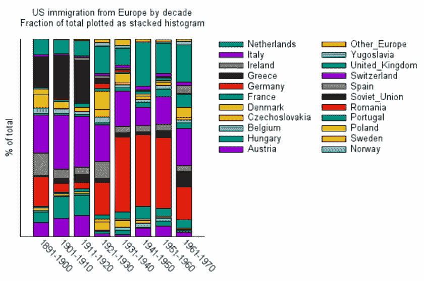
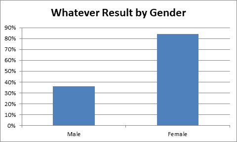
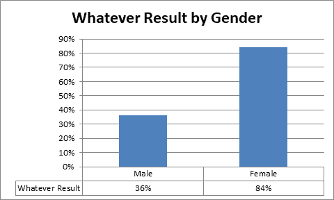

# 数据可视化 102:制作数据表最重要的规则

> 原文：<https://towardsdatascience.com/data-visualization-102-the-most-important-rules-for-making-data-tables-5b27d3a246e8?source=collection_archive---------47----------------------->

## 如何有效地使用表格来传达关于数据的信息？

图片来自[米卡·鲍梅斯特](https://unsplash.com/photos/Wpnoqo2plFA)

在之前的[关于](/data-visualization-101-the-most-important-rule-for-developing-a-graph-2f9a6cdeb8c5)[数据科学](https://ethno-data.com/data-science-and-machine-learning-summary/)和[统计](https://ethno-data.com/data-science-vs-statistics/)中的数据可视化的帖子中，我讨论了我认为绘制数据最重要的一条规则。在这篇文章中，我将继续讨论制作数据表的最重要的规则。我将把重点放在向其他人报告/交流发现的数据表上，而不是数据科学中表的许多其他用途，比如存储、组织和挖掘数据。

总而言之，图表就像句子一样，向浏览者/读者传达一个清晰的思想。另一方面，表格的功能更像段落，传达多个句子或想法来获得一个整体的想法。与通常提供一种思路的图表不同，表格可以更具探索性，为查看者/读者提供分析信息并从中得出自己的结论。

# 餐桌规则#1:不要害怕提供你需要的或多或少的信息。

段落可以用多个句子来传达一系列的思想/陈述，表格也不例外。一个人可以传达多条信息，观众/读者可以在他或她自己的闲暇时间浏览和分析，使用这些数据来回答他们自己的问题，因此可以根据需要随意占用空间。几页长的表格是公平的游戏，并且在许多情况下是绝对必要的(尽管经常被放在附录中，以供需要更深入了解的读者/观众使用)。

在我之前的[数据可视化帖子](https://ethno-data.com/data-visualization-graphing-making-no1-rule/)中，我给出了这个条形图作为一个例子，试图为一个图形说出太多的语句:

图片来自 [Linux 截图](https://www.flickr.com/photos/xmodulo/23635690633/)

这是相当于一个段落的信息，用表格来表示会更好。在表格中，读者/查看者可以自己按国家和年份浏览表格值，并回答他或她可能提出的任何问题。例如，如果有人想分析一个特定的国家是如何随着时间的推移而变化的，他或她可以很容易地用一个表格来完成，和/或如果他或她想分析比较某个特定十年的国家之间的移民比率，这也是可能的。在上图中，每个国家的子段在每个十年列的不同垂直位置开始，这使得很难直观地比较大小，并且由于每个十年有几十个值，后面的分析也很难直观地解读。

但是，与此同时，不要害怕将一句话或一张图表价值的数据传递到表格中，特别是当这些数据是你要说的核心内容时。有时，当一个想法至关重要时，作者会包含一个句子段落，同样，一个单独的陈述表也会有类似的效果。例如，为单个变量编写一个表确实有助于传达该变量很重要:

现在，有时在这些单语句实例中，你可能想要使用一个图表而不是一个表格(或者两者都用),我将在规则 3 中详细讨论这一点。

# 表格规则#2:保持列的一致性，以便于浏览。

我发现，当查看者/读者扫描表格时，他们通常下意识地假设一列中的所有变量都是相同的:相同的单位和值的类型。在行与行之间改变一列的值可能会让你的读者在看的时候感到困惑。例如，考虑这个虚构的研究数据:

在该表中，每行表示不同的值和/或单位。例如，沿着控制栏往下，第一栏是以年为单位的平均年龄。第二列切换到中值年龄，这是一个不同于平均值的值类型(尽管使用相同的年数单位)。最后两行表示男性和女性的数量和百分比:两者都是不同类型的值和不同的单位(数量和百分比不同于年份)。这可能会让查看者/读者感到不舒服，因为他们经常希望列具有相同的值和单位，并且很自然地将它们进行比较，就好像它们是相似类型的值一样。

我建议像这样转置它，这样列代表相似的变量，行代表两组变量:

表格规则#3:不要害怕使用图表来表达数量、比例或尺度

像规则#1 中的性别表这样的表用数字传达相关信息，但是数字本身并不能直观地显示值之间的差异。

图表擅长直观地描述数据的大小、比例和/或规模，因此，如果在这个例子中，重要的是传达女性比男性的“一些关键结果”大多少，那么基本的条形图可以让读者/观众看到女性的百分比是男性的两倍以上。

作者制作的图表

现在，为了传达这种视觉上的清晰，图表失去了精确关联精确数字的能力。例如，只看这个图表，读者/观众可能不确定男性是 36%、37%还是 38%。人们已经开发了许多绘图策略来处理这种情况(从使网格线更清晰，在线段的顶部、旁边或周围写下准确的数字，等等)，但是在既需要传达准确的数字又需要传达它们的大小、比例或规模的情况下，结合图表也可以很好地工作:

作者制作的图表

最后，鉴于表格可以传达多种陈述，请随意使用几个图表来描述一个表格的大小、比例或规模。不要试图将一个多语句的表过载到一个单一的、难以理解的图表中。将您试图与该表联系起来的每一项陈述分解，并在一个图表中分别描述。

# 结论

如果图表是句子，那么表格的功能就更像段落，传达大量信息，表达不止一种思想或陈述。这给你的读者/观众提供了探索数据的空间，并让他们自己解释数据来回答他们的任何问题。

不幸的是，我自己没有这张图表使用的数据，否则我会为它制作一个表格。

【https://ethno-data.com/rules-for-tables/】原文发表于此:*。有关该网站和其他文章的更多信息，请访问*[*https://ethno-data.com/*](https://ethno-data.com/)*。*

*也感谢《数据科学》杂志发表这篇文章。关于他们工作的更多细节，见* [*本*](/about-towards-data-science-d691af11cc2f) *。*