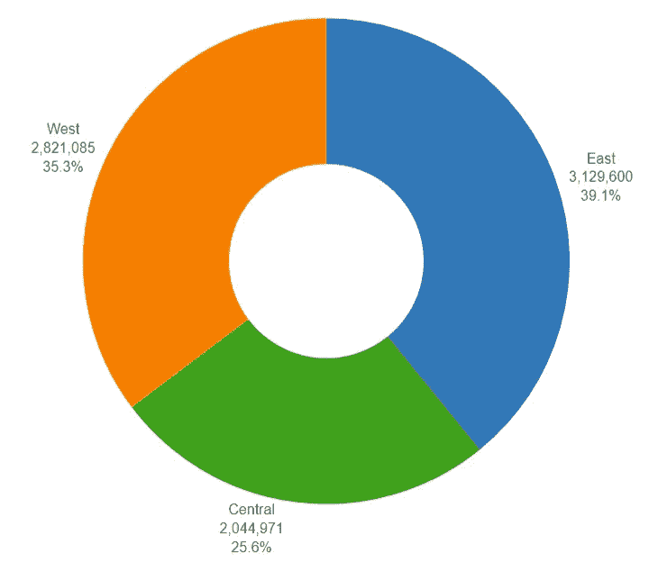
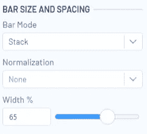
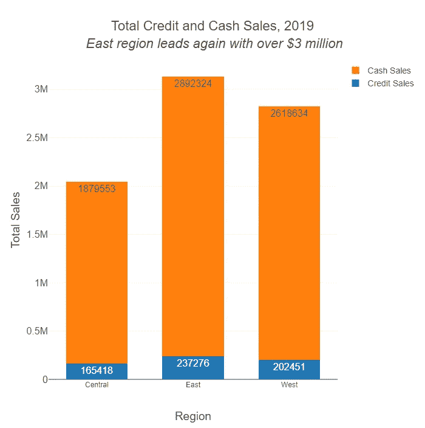
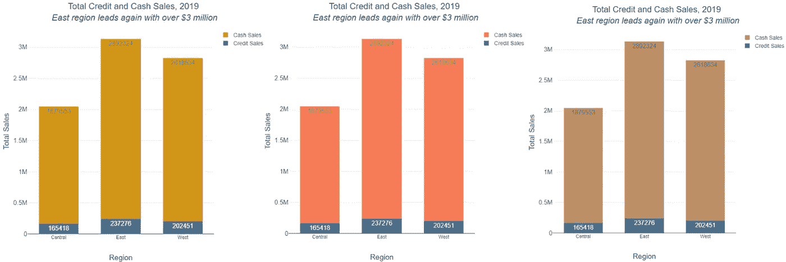

# 数据可视化和可访问性:三个推荐读物和顶级技巧

> 原文：<https://towardsdatascience.com/data-visualization-and-accessibility-three-recommended-reads-and-top-tips-9c5e862b464e?source=collection_archive---------50----------------------->

## 你可以制作一个你认为是有史以来最漂亮的数据可视化——但对许多观众来说，它可能几乎毫无用处。了解一些使数据可视化对每个人都更好的关键方法。

照片由[丹金](https://unsplash.com/@danielcgold?utm_source=unsplash&utm_medium=referral&utm_content=creditCopyText)在 [Unsplash](/s/photos/color-chart?utm_source=unsplash&utm_medium=referral&utm_content=creditCopyText) 上拍摄

本文的许多读者可能每天都在做的事情是创建不同类型的数据可视化。然而，我们可能不会总是停下来想一想，患有不同残疾的人是否会发现这些可视化是可访问的和有用的。

为了更多地了解这个重要的问题，我从专家那里找到了一些关于这个主题的资源，在这里与你分享。它们非常值得你花时间去完整阅读。我还会强调一些你可以在自己的工作中使用这些作者的顶级技巧的方法。

# 推荐阅读#1

[“可访问数据可视化设计简介”，](https://fossheim.io/writing/posts/accessible-dataviz-design/)开发者兼设计师莎拉·l·福斯海姆

**提示:**“可视化任何数据时，使用标签和图例很重要。如果可能，尝试在上下文中添加标签。…看到写出来的值也意味着:用户不必猜测、悬停或进行计算来获得准确的数字，[并且]不必完全掌握视觉效果来理解正在发生的事情。”

**使用它:**在 Alteryx Designer [交互式图表工具](https://help.alteryx.com/current/designer/interactive-chart-tool)中，您可以向图表的各个部分添加标签，以显示条形图或饼图各个部分的实际值和/或标签。

例如，在下面的图表中，我在饼图的各个部分添加了区域标签，并隐藏了图例，因为它变得多余了。现在，区域信息立即可用，而不是要求查看者来回查看颜色的含义。即使有人不能感知图表，他们仍然可以获得数字信息。

# 推荐阅读#2

[**“可访问的数据即更好的数据即”，**](http://www.storytellingwithdata.com/blog/2018/6/26/accessible-data-viz-is-better-data-viz) **作者 Amy Cesal(在 Cole Nussbaumer Knaflic 的博客上的客座博文，用数据讲故事的创始人兼首席执行官)**

**置顶提示:**“空白是你的朋友。当信息过于密集时，图形会让人感觉难以理解。在图表的各部分之间留出间隙会有所帮助。明智地使用留白有助于区分不同部分，而不仅仅是依靠颜色，从而提高可读性。这也可以通过帮助用户区分不同颜色之间的差异来补充可访问的颜色选择。”

**使用它:**如果空白能帮助你的浏览者从你的视觉化中获得价值，那么它就不是浪费的空间！在 Alteryx Designer 中可以做到这一点的一种方法是向条形图中添加更多的空白，如果其中有更多的空白区域，可能会变得更加易读。

默认情况下，每个条形将为其潜在宽度的 80%；将该数值增加到 100%会使条形相互紧靠，它们之间的间隙为零。减小条形宽度可以使一些图表更具可读性。下图中的条形设置为 65%宽度。

交互式图表工具中的条形图格式选项

*这张图表还使用了一个副标题，总结了其创建者的主要信息，这有助于人们从可视化中快速获得关键信息。*

在你的可视化或报告中加入更多的细节总是很诱人的，但是留白和简单让你的信息更容易被访问。

# 推荐阅读#3

**[**红绿色盲的五种设计方法**](https://www.visualisingdata.com/2019/08/five-ways-to-design-for-red-green-colour-blindness/) **，“安迪·基尔克****

****提示:**“颜色的含义由来已久，并被广泛使用，尤其是在金融或企业环境中，但尽管它们为许多观众提供了某种直接的含义，但大约 4.5%的人口是色盲(8%的男性)，其中红绿色盲是最常见的形式。这意味着很大一部分观众可能无法感知这种重要的视觉编码。”**

****使用它:** Kirk 的文章对某些颜色组合的文化意义提供了有趣的见解。例如，交通信号灯的红-黄-绿颜色对一些文化背景的人来说意味着“停-小心-前进”。**

**但是，即使这些含义看起来适用于我们的数据可视化，我们可能会无意中阻止一些人体验可视化。我们必须谨慎选择颜色，以确保患有各种色盲的人能够清楚地看到它们。更重要的是，确保颜色不是你在数据可视化中传达意义的唯一方式。**

**如果你选择了自己定制的调色板或公司的颜色，而不是提供的调色板，你可以使用在线模拟器如[科布利斯](https://www.color-blindness.com/coblis-color-blindness-simulator/)来检查你完成的图形的易理解性。**

****

***上图所示的同一张图表的三个视图，由科布利斯针对不同类型的色盲进行模拟。***

**关于这个主题还有很多需要了解的，我强烈建议全文阅读所有这些文章。**

**用上面的播放器听播客片段。**

**另一个了解更多的方法是:我们刚刚在 Alteryx 发布了一集关于可访问性的 Alter Everything 播客。Alteryx 工程经理 Steve Tomasak 与可访问性和本地化团队负责人 Jeremy Likes 和可访问性产品经理 Kyle Waterworth 进行了交谈。杰里米和凯尔都使用辅助技术，并分享他们的个人经历。他们还讨论了通用设计背后的关键思想，并讨论了一些创新的辅助技术。**

**听一听这一集，了解关于这个主题的更多信息，这对每个塑造和使用技术的人都很重要！**

**最初发表在 [Alteryx 社区数据科学博客](https://community.alteryx.com/t5/Data-Science-Blog/Data-Visualization-and-Accessibility-Three-Recommended-Reads-and/ba-p/592374)上。在 [Alteryx 数据科学门户](http://alteryx.com/data-science)上找到更多资源。**