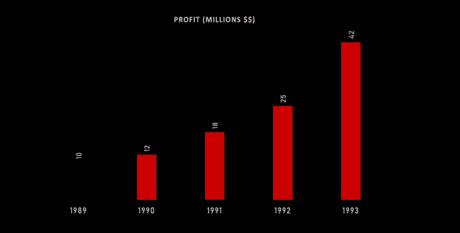

# 如何快速让你的图表看起来美得惊人

> 原文：<https://towardsdatascience.com/data-visualization-animate-bar-graphs-df9ca03a09f2?source=collection_archive---------21----------------------->

## **Excel 中的数据可视化和动画以及后期效果**

那么，您刚刚完成了对数据的检索、处理和分析。你拿起你的数据，决定把它制成图表，这样你就可以向别人展示你的发现。你点击“图表”,然后……


布鲁斯·艾隆哈特拍摄的照片

**丫看起来有点无聊**。我们想要的是更有趣、更有活力的东西。大概是…这样:


布鲁斯·艾隆哈特拍摄的照片

是啊！现在看起来真棒！让我们看看如何快速制作这个动画。

# 先决条件

好吧，这是你需要开始做的:

*   条形图的数据(咄！)
*   [**Adobe Illustrator**](https://www.adobe.com/ca/products/illustrator.html) (不要担心我们不需要它来做任何复杂的事情)
*   [**土坯后特效**](https://www.adobe.com/ca/products/aftereffects.html)

# 第一步:让你的 Excel 图表看起来更好

所以，让我们做一些事情来使我们的图表看起来更好。我们可以先把文本放大一点，然后改变一下图表的样式。

现在对于样式，我不需要 y 轴，相反，我只需要图形中每个条形顶部的总数值。我们可以很容易地在 excel 中完成，

1.  选择图表
2.  点击'**画笔图标'**
3.  在'**样式**下，我们可以找到我们正在寻找的图形样式。对我来说，这是第二次，但对你来说可能不一样。


布鲁斯·艾隆哈特拍摄的照片

下一步只是让字体变大，然后把字体改成你喜欢的样子。移除任何背景线(您可以选择并删除它们)。或许可以把酒吧变得更宽。在我完成编辑后，我的图表看起来像这样。


布鲁斯·艾隆哈特拍摄的照片

现在不要担心文本太浅，稍后，我会添加一个更深的背景色，让它看起来更流行。

尝试你想要的设计，尽情发挥你的创造力。

# 步骤 2:在 Adobe Illustrator 中将 Excel 图表分解成组件

在 Adobe Illustrator 中创建新项目，并将大小设置为 1920 x 1080。然后，只需将您刚刚从 Excel 制作的图表复制粘贴到 Illustrator 中。

该图像将复制为矢量图像，这意味着您可以调整其大小，而不必担心质量损失。调整图像大小，直到它适合您想要它在画布上呈现的方式。请参见下文，了解如何调整它的大小。


布鲁斯·艾隆哈特拍摄的照片

## 将每个条形拆分到它们自己的层中

如果你打开'**图层**'面板(你可以点击 f7 或窗口- >图层打开它)，你应该看到'**图层 1** 。如果我们打开它，我们应该看到一个名为“ **<剪辑组>** ”的图层，其中包含了我们需要的所有条。


布鲁斯·艾隆哈特拍摄的照片

现在他们都粘在一起了。

1.选择**-<剪辑组>-**->右键点击>选择**释放剪辑蒙版**。这将创建一个'**复合路径**'层。

2.选择该层，再次右击该栏，选择'**释放复合路径**'。现在我们把所有的小节都分开了。


布鲁斯·艾隆哈特拍摄的照片

创建五个新层(每个条形一个)，并将每个条形层拖到新层中。给新的条形层重新命名，以便以后在 After Effects 中更容易使用。


布鲁斯·艾隆哈特拍摄的照片

## 将条形值拆分到一个新层中

再创建一个名为“值”的图层，将所有的数值条移入该图层。确保不要移动任何年份值，我们只希望条形值在那里。

## 移除不必要的层

现在我们基本上完成了。我们需要做的最后一件事是移除第 1 层中我们不需要的任何子层。

一个简单的方法是点击图层旁边的小图标。如果某样东西从 Illustrator 中消失了，那么*我们希望保留它*。**如果看起来什么都没有消失，那么我们可以移除它**。这样做的目的是删除白色背景，这样我们就可以在后期添加我们自己的特效了。如果你想保留白色背景，请随意进入下一步。

完成后，将第一层的**重命名为**轴**，这样在后期效果中更容易识别。**

# 第 3 步:动画效果

创建一个新的 After Effects 项目，并将大小设置为 1920 乘 1080。我的持续时间被设置为 5 秒，但如果你愿意，你可以设置为 3 秒。接下来，我们需要导入刚刚创建的 Illustrator 文件。我们可以通过双击项目面板并选择我们的 AI 文件来做到这一点。

确保**导入种类**设置为**构图**并且**进尺尺寸**设置为**图层尺寸**。然后，我们只需点击 after-effects 自动为我们创建的新构图，就可以开始工作了。你也应该在合成面板中看到我们所有的图层。


布鲁斯·艾隆哈特拍摄的照片

每层都有一个锚点。这些锚点是我们应用的效果发生的点。我们需要将这些锚点移动到每个条的底部，以便动画从该点开始。

为此

1.  选择特定的条形对象(例如:条形 1)
2.  在工具栏中选择锚定工具。
3.  然后，只需将锚点移动到工具栏的中间底部。对每个条形重复此操作。你可以在下面看到一个我是如何做的例子。


布鲁斯·艾隆哈特拍摄的照片

## 将条形图从 0%缩放到 100%

一旦我们把锚定在正确的位置，我们就可以开始制作动画了。这部分真的很简单。

在“合成”面板中:条形层(例如:条形 1)>变换>缩放。

1.  点击秤选项上的**链图标**取消秤的链接。这就解除了宽度和高度之间的联系。
2.  点击秤选项旁边的**秒表**图标。这为我们的动画创建了一个关键帧。
3.  将高度设置为 0%。在比例选项中，高度是第二个值。
4.  将时间轴上的擦洗器移动到 7 帧(或者您希望动画持续多长时间)，并将高度调整回 100%。这将自动为我们创建一个新的关键帧，并在 7 帧内使我们的生长条从原始高度的 0%变为 100%。


布鲁斯·艾隆哈特拍摄的照片

## 添加反弹动画

反弹动画使我们的酒吧到达顶部时，它会超过，然后再下降。这使得动画看起来更加流畅生动。

为此，在按住 ALT 键的同时，点击秤台**旁边的秒表图标。**时间线上将打开一个文本区。将以下内容复制粘贴到那里。

```
// Inertial Bounce - Created by Animoplex: [www.animoplex.com](http://www.animoplex.com)
// Original Version: [http://www.graymachine.com/top-5-effects-expressions/](http://www.graymachine.com/top-5-effects-expressions/)
// Modified expression for a smoother bounce effect and easier editing. Use this on any property with two keyframes to get a nice bounce effect that is based on velocity of the value change. Perfect for a scale from 0 to 100 or a speedy rotation that needs some extra life. Adjust amp, freq and decay values to tweak the effect. Amp is intensity, freq is bounces per second, and decay is the speed of decay, slow to fast.// Variation Aamp = 5.0; freq = 2.0; decay = 4.0;n = 0;
if (numKeys > 0) {
  n = nearestKey(time).index;
  if (key(n).time > time) { n--; }
}
if (n == 0) { t = 0; }
else { t = time - key(n).time; }
if (n > 0 && t < 1) {
  v = velocityAtTime(key(n).time - thisComp.frameDuration/10);
  value + v*(amp/100)*Math.sin(freq*t*2*Math.PI)/Math.exp(decay*t);
}
else { value; }
```


布鲁斯·艾隆哈特拍摄的照片

**恭喜你！困难的部分已经过去了，现在我们只需要做一些复制粘贴和修复一些东西。您现在应该会看到类似这样的内容:**



布鲁斯·艾隆哈特拍摄的照片

## 将粘贴运动效果拷贝到其他条

如果您关闭我们刚刚处理的组件的下拉菜单并再次选择它，您可以在键盘上键入字母“U”来查看您已更改的属性。

1.  这样做，并选择我们刚刚制作的两个关键帧。
2.  Ctrl+C 或 Cmd+C 来复制它们。
3.  选择其他每个条形构件，并将其粘贴到每个构件上。


布鲁斯·艾隆哈特拍摄的照片

## 酒吧的移动时间

打开我们刚刚制作动画的所有酒吧的所有属性。我们看到每个条形的动画同时出现。要解决这个问题，我们只需要移动每个条形的关键帧动画，使其在最后一个动画结束时开始。

对我来说，**第 5 根棒线**是我在图上的第一根棒线，**第 1 根棒线**是我最后一根棒线。所以对我来说，我只需要像下面这样移动它们，但你可能需要以不同的方式移动它们。


布鲁斯·艾隆哈特拍摄的照片

## 动画显示条形值

动画开始时的值很奇怪。相反，让它们出现在动画的结尾会更好。

1.  点击“值”组件>变换>不透明度
2.  点按秒表并将关键帧设定为 0%
3.  我们希望**不要**在动画接近结束时才开始动画制作，所以把你的时间擦洗器放在*最后一个条形动画*开始和结束的中间。您可以通过选择“不透明度”属性最右侧的菱形图标来手动创建关键帧。
4.  将搓擦器移动到最后一个条形动画的末尾，并将不透明度设置回 100%。现在，这些值将出现在动画的末尾。


布鲁斯·艾隆哈特拍摄的照片

## 添加背景颜色

1.  图层>新建>实体…
2.  挑选你最喜欢的颜色。
3.  在构图面板中，将背景拖到底部，再次查看你的图形。


布鲁斯·艾隆哈特拍摄的照片

# 你完了！

漫威看着你美丽的作品。


布鲁斯·艾隆哈特拍摄的照片

如果你喜欢这个，可以考虑读一些更酷的东西，比如**如何在 Python 中处理丢失的数据**

[](/machine-learning-handling-missing-data-27b09ab146ba) [## 机器学习——处理缺失数据

### 开始使用数据前如何清理数据的指南。

towardsdatascience.com](/machine-learning-handling-missing-data-27b09ab146ba) 

或者说三文鱼怎么可以用一个**神奇的力量回到家**！

[](https://medium.com/illumination/how-do-salmon-get-back-home-48f2ab445568) [## 三文鱼是怎么回家的？

### 原来他们不用谷歌地图！

medium.com](https://medium.com/illumination/how-do-salmon-get-back-home-48f2ab445568)