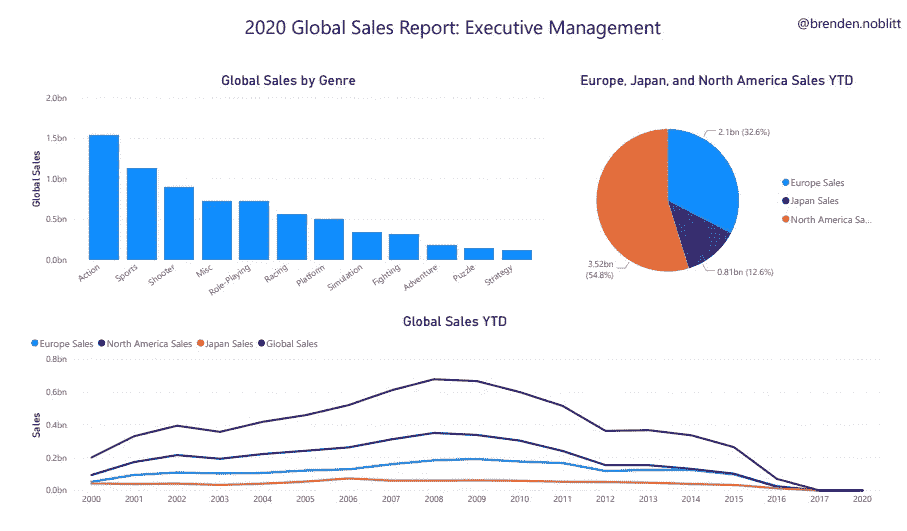
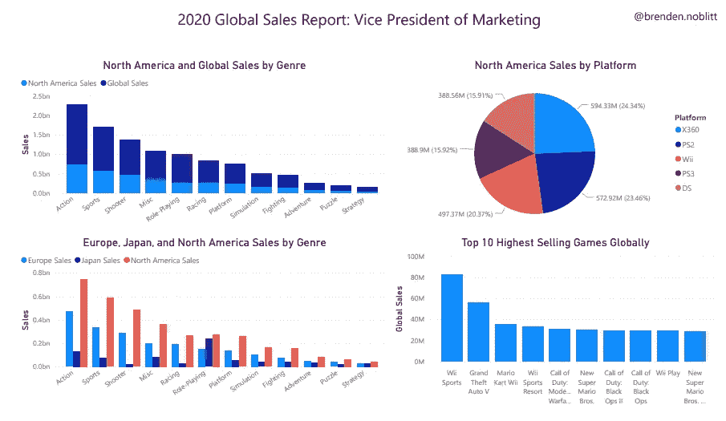
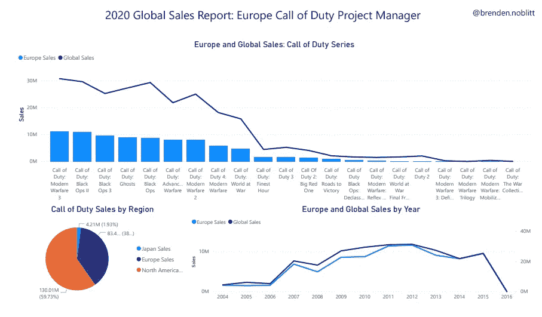

# 数据可视化受众和场景

> 原文：<https://towardsdatascience.com/data-visualization-audiences-and-scenarios-ffe64adcd364?source=collection_archive---------39----------------------->

## 数据科学/数据分析/教育

## 在数据可视化中，您可能会面临三种情况

[来源](https://unsplash.com/photos/hpjSkU2UYSU)

无论你是在做多元分析还是构建深度学习神经网络，数据可视化可以说是任何数据职业中最重要的部分。我个人更喜欢数据的分析而不是可视化，但是，如果最终用户不理解我正在分析的数据，那还有什么意义呢？

数据可视化是数据职业的一个有趣的部分，因为它是职业中唯一可以留给解释而不是纯粹事实的部分。当然，你比较销售额的条形图是正确的，但是如果它是一个圆形图，也许对最终用户更有意义？数据可视化是这个职业的一部分，我继续在这方面进行一些额外的实践，但是，鉴于我所经历的所有错误和实践，我想向我的读者和其他数据专业人士/学生提供一些数据可视化。让我们开始吧！

*免责声明:我不是全职的数据专家，我只是简单地转述我在暑期实习和个人实践中的经验。这并不是要告诉你你到底需要知道什么，而是从我的经历中给你一些实用的建议。高级技术信息请查看* [*走向数据科学*](https://towardsdatascience.com/) *。如果您对一些有助于数据可视化的建议感兴趣，请继续阅读！*

# 以最终用户为中心进行创作

我收到的关于数据可视化的最好的建议是“以终端用户为中心进行创建”。正如任何创意人员在创作一件艺术品时都了解他们的受众一样，数据专业人员在创作可视化作品时也是如此。从某种意义上说，可视化是数据的艺术品。我们花费大量时间构建模型、进行统计分析和清理数据。没多少人懂那部分专业，但每个人看到一个好图就懂了。考虑到这一点，让我们来看看一些观众:

## 首席执行官/高级管理层

*首席执行官、首席运营官、首席财务官等。*

除非你是中级数据管理人员或是高级分析师，否则你可能最少与这一组人打交道。这个群体往往年纪较大，经验丰富，技术不如分析师娴熟，因为这不是他们的工作。执行管理层是管理公司的人，他们需要快速清晰的概述。他们可能希望时不时地钻研数字，但大多数时候，他们只是需要高层次的观点来快速做出决策。Power BI 将是这些报告的一个好工具，因为它允许快速创建报告，而不是复杂的仪表板。

## 二。上层管理

*营销副总裁、销售副总裁、IT 总监等。*

你可能会比管理层更多地与这个团队合作。这个群体往往是中老年人，经验丰富，拥有高于平均水平的技术技能。他们更喜欢钻研数字，但在大多数情况下，仍然喜欢保持高层次的观点。Tableau 对这个群体来说是一个很好的工具，因为这些经理喜欢按照自己的意愿挖掘数字。

## 三。中层管理人员

*营销自动化经理、销售开发经理等。*

这是你最常与之共事的群体之一。这群人更年轻，经验更少，但技术更娴熟。成长在信息时代初期的他们，比其他群体更有兴趣挖掘数字。Tableau 非常适合技术含量较高的职位，而 Power BI 则适合技术含量较低的职位。

## 四。专业职位/个人

*BI 开发人员、网络分析师、客户开发代表等。*

这是另一个你会花大量时间与之共事的群体。许多集中的职位会要求你为他们拉指标。这个团队非常年轻，没有什么经验，但是技术能力很强。任何报告或可视化工具的工作，因为他们可能会理解它！

# 数据可视化场景

现在，我不想只告诉您不同的最终用户组，而是想展示一些示例，说明我如何使用相同的数据为这些不同的用户组创建报告。通常，你会收到一封电子邮件，有人会问:“嘿 _____，我们能从这些数据中学到什么，我们的表现如何？”。这就是你将得到的所有指导，所以这里有三个例子，是我在创建它们时的思考过程。为了实现这些可视化，我使用了格雷戈利·史密斯在 Kaggle 网站上发布的视频游戏销售数据集。在这些情景中，您是一家视频游戏公司的首席数据分析师，工作时间接近财年结束。许多利益相关者都很好奇他们做得如何，以及他们可以做些什么来改进。让我们看完这些报告吧！

假设，我们公司拥有这个数据集中的所有游戏，这是一个很好的商业模式

## I .全球销售报告:高级管理层

对于这份报告，我们视频游戏公司的首席执行官给我们发邮件说，“你好 ____，我想知道我们的表现如何，谢谢”。在为高管创建报告时，我们需要考虑的第一件事是，“我们如何尽可能简洁、高水平地呈现重要信息？他们需要知道什么？”。我们的首席执行官想知道我们的表现，所以让我们先解决这个问题。由于这是一家全球性公司，他们可能想知道总销售额，以及三个地区之间的销售额。可视化时间序列的最佳方式之一是折线图，所以让我们用过去 20 年的全球销售额以及所有三个地区的销售额制作一个折线图。首席执行官可能也想要一些能帮助他们做出重大战略决策的见解。由于流派是一个重要的跟踪指标，让我们跟踪它的表现，并把它放在报告中。最后，他们可能需要了解每个地区的独立表现，这样他们就可以根据需要推出基于绩效的激励措施。让我们在饼图中包括每个地区的总销售额。搞定了。那么这份报告提供了什么呢？你可能会注意到这都是长期的、大量的信息。根据这份报告，我们建议首席执行官们应该专注于开发一些动作游戏，并在北美进行市场推广。营销也应该遵循他们在 2008 年所做的，因为那是销售的最高点。在真实的数据集中，将会有更多的信息来做出决策，而不仅仅是少量的变量，但是对于我们的目的来说，这是可行的！进入下一个报告！

## 二。全球销售报告:营销副总裁

接下来，北美全球营销副总裁给我们发邮件。“嘿 ____，我正在为我们的 R&D 团队提出一个请求，以决定我们希望我们的下一个游戏是什么。介意拉一些数据发给我吗？”。我们开始工作吧！我们知道，因为这是全球营销副总裁，他们可能想知道指标在全球的表现，以及仅与产品或产品销售相关的指标。让我们先来总结一下北美相对于全球的销售情况，因为他们的第一要务是北美。在类型的话题上，让我们也想象一下不同的类型在每个地区是如何表现的，来感受一下全球营销战略的前景。平台是另一个重要的变量，因为合作关系很昂贵，所以让我们看看每个平台在美国的销售情况。最后，让我们也来看看前 10 名最畅销的游戏，看看哪些是热门的，哪些一直是热门的。搞定了。这些都是很好的指标，因为它们代表了北美和全球的表现。我们的建议应该是考虑用我们最新的技术为 Xbox 和 PlayStation 制作一些动作游戏。此外，我们在角色扮演游戏方面表现不佳，但日本在这方面表现出色。我们应该建议我们的副总裁打电话给日本的营销副总裁，从他那里获得一些关于他们如何营销和开发角色扮演游戏的想法。那应该很好，让我们开始最后的报告吧！

## 三。全球销售报告:欧洲使命召唤项目经理

快到中午的时候，《使命召唤》在欧洲的首席项目经理给我们发了一封电子邮件。“您好 ______，我想知道我们是否可以获取一些销售指标，谢谢”。显然，这封邮件有点模糊，所以我们需要使用我们的数据和直觉来做出一份好的报告。首先，我们来看看《使命召唤》在欧洲的表现与全球其他地区相比如何。接下来，我们来看一下各个地区的使命召唤销售总额。最后，我们来看看每款《使命召唤》游戏的表现如何。请注意，我们只包括了关于使命召唤的指标，因为使命召唤项目经理不需要在其他指标上浪费时间和内存。我们就给他使命召唤指标吧，因为这是他的专长。我们应该建议欧洲项目经理联系各自地区的其他两位项目经理，弄清楚 2015 年发生了什么导致销售额如此急剧下降。我们还应该建议他们联系“使命召唤:黑色行动”的开发者，并创建另一个系列，因为该系列表现非常好，五个顶级使命召唤游戏中的三个都是“黑色行动”系列的一部分。

# 结论

咻！这是一个很大的可视化！希望这能让你对创建报告的计划和思考过程有所了解。这不仅仅是把图表放在纸上那么简单，而是为每个最终用户创造独特的东西。在创建可视化效果的时候，一定要考虑到最终用户，他们会注意到的，你也一样。随时可以继续回来这个故事做参考！保持安全，快乐观想！

*"注:这些报告是使用* [*微软 Power BI*](https://powerbi.microsoft.com/en-us/)*创建的*

*查看我的其他一些故事！*

*[*面向有志分析师的三大技术平台*](/three-tech-stacks-for-aspiring-analysts-5cde49a22337)*

**成功实习的 10 个小技巧**

***作为营销分析实习生我学到了什么***

***[*营销分析实习生的一天*](/a-day-in-the-life-of-a-marketing-analytics-intern-2bed4d11d30f)***

***要联系我或接收更多内容，请在 Twitter 上关注我@*[*BMNAnalytics*](https://twitter.com/BMNAnalytics)*！***