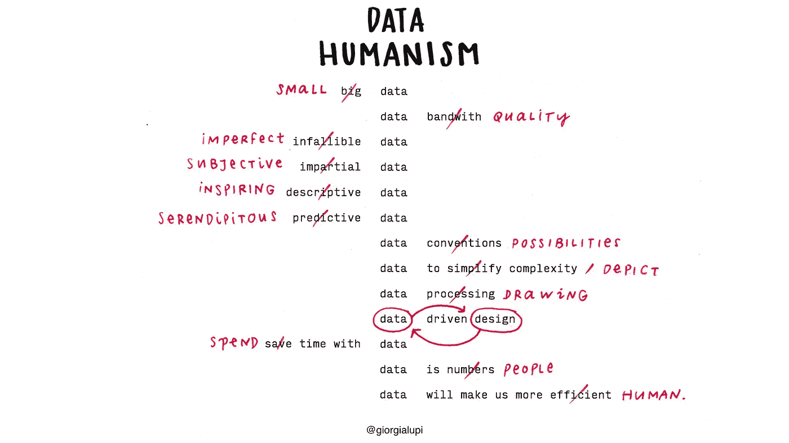
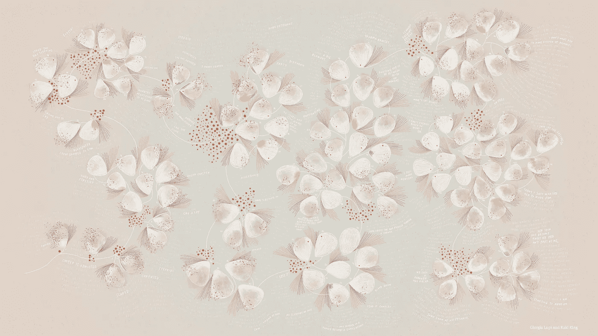
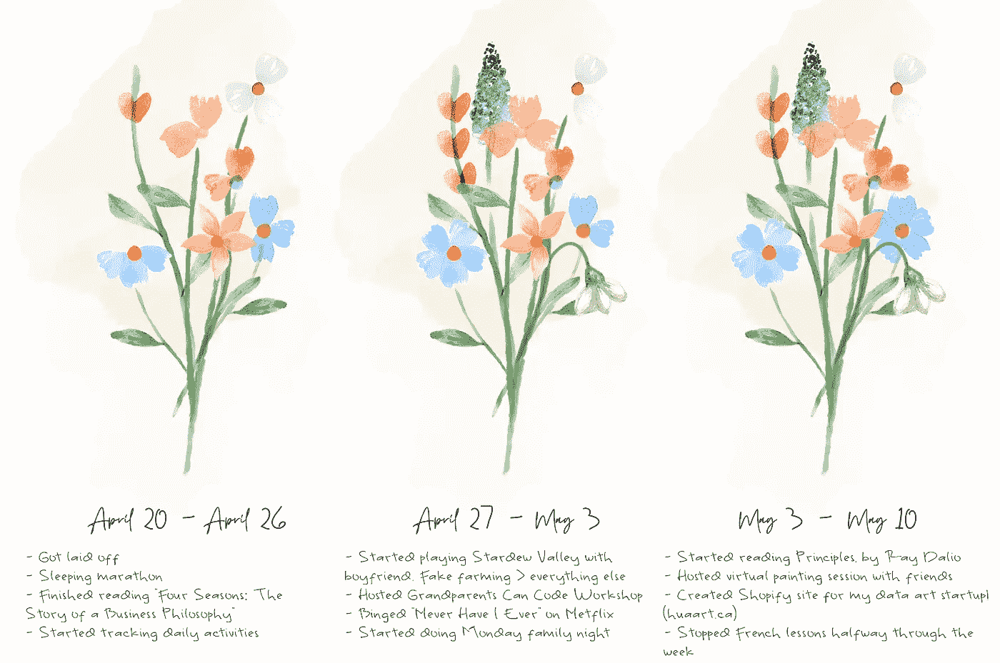
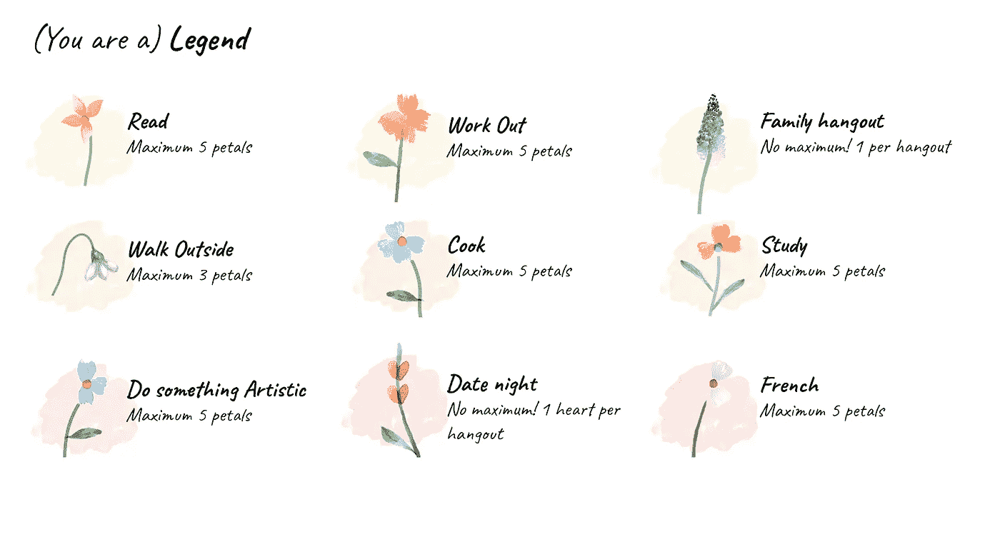
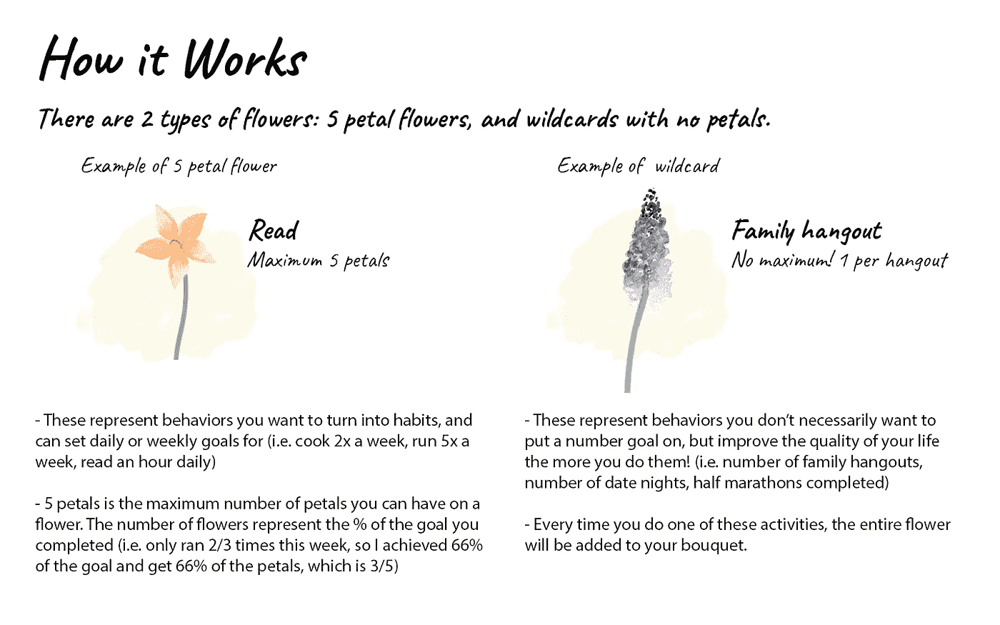

# 人类的数据可视化:我如何把我的数据变成水彩艺术

> 原文：<https://towardsdatascience.com/data-visualization-for-humans-how-i-turned-my-data-into-watercolour-art-651d6acb16a3?source=collection_archive---------68----------------------->

你有没有听过一个陌生人的谈话，感觉他们在表达你自己都不知道的想法？或者有过，但无法用语言表达？

虽然这听起来很有戏剧性，但这就是我在观看 Giorgia Lupi 的关于数据人文主义的 TED 演讲时的感受。Giorgia Lupi 是一位来自意大利的建筑师兼创始人，她的公司的整个交易是帮助公司以直观美观的方式可视化数据。我所说的漂亮，不仅仅是指饼图上的所有切片都来自同一个颜色家族。

总结一下我对数据人文主义的理解(Giorgia，如果你正在阅读这篇文章，请随意在评论中烤我)，这是一个处理数据的框架，旨在让过程和结果变得有趣，让一个完全没有数据背景的人可以理解。

数据人本主义还寻求捕捉典型报告指标领域之外的数据点。例如:当可视化一名年轻患者的自身免疫性疾病医疗保健经历时，除了捕捉血小板计数、皮肤瘀伤的强度以及患者服药的时间，Giorgia 还找到了一种方法来整合家庭拥有积极时刻的天数、家庭成员必须出差工作的天数以及每天的恐惧强度。

完成的作品！查看更多关于瘀伤的信息:我们在这里看不到的数据:[http://giorgialupi.com/bruises-the-data-we-dont-see](http://giorgialupi.com/bruises-the-data-we-dont-see)

Giorgia 的工作激发了我为自己的数据创建可视化的尝试，我已经记录了几个星期了(这是一件完全正常的事情)。这是我在每周开始时做的一份非常简单的每日清单，包括锻炼、学习法语、散步、和家人一起出去玩等等。大多数时候，我有 7-9 件想做的事情，如果我们诚实的话，我可能在一个好的日子里完成 5-6 件(在我从未去过网飞的周末，我会完成 0 件)。如果你还没看，那就别看这个了，马上去看。)

这是我过去 3 周生活的一个形象化的描述，还有一些关于每周亮点和不足的注释。

手绘水彩，然后在 Photoshop 中扫描和数字增强，供您欣赏👩🏻‍💻

每周用一束花代表，每次活动用一朵花代表(健身、家庭、美食等。).某项活动我做得越多，它的花瓣就越多，当我达到一周的目标时，最多能有 5 片花瓣。

我在过去 3 周内跟踪的目标和活动

我有一个愿景，我的花束会随着我的成长而“成长”,花的组成会随着我建立更强的习惯和发现新的兴趣而改变。例如，在我实验的第二周，我有了第一次数字家庭聚会，并决定每周至少有一次家庭聚会。因此，我添加了一朵新的花(紫色鼠尾草)，并开始跟踪它前进。

疯狂背后的数学。

我发现的最初趋势之一——尽管现在下定论还为时过早——是我越来越擅长从清单上划掉一些事情。我想追踪的东西也越来越多样化。随着我越来越坚持锻炼、约会之夜、和家人在一起、寻找新的爱好(比如 Photoshop！我可能学过也可能没学过这篇文章怎么用 PS)。

通过艺术可视化我的数据激励我采取比我以前的列表和复选框方法更好的行动。这是因为如果我错过了一天，我就无法找回那片花瓣——即使我一周的其余时间都很完美。相反，当我完成了所有的清单时，我会很兴奋地看到我的花束在周末会是什么样子，会不会比前一周更满。我没有纳入但在未来的迭代中探索会很有趣的事情是跟踪我试图打破的坏习惯(即玩我的头发、睡懒觉、叫外卖)并拿走一片花瓣或添加一个符号来代表我做这些事情中的一件。

这种数据人文主义的实践激励我每天都尝试着带着它，希望有一天我的生活会变成普西塔里的花束(我甚至满足于 Loblaws)。

说真的，你见过他们吗？它们太漂亮了。

在 Pusitari 的 150 美元，这个可爱的安排可能是你的。你可以以后再谢我

不要脸的 plug:如果你对自己的数据可视化感兴趣，或者想了解更多关于这个过程的信息，可以访问我在🥳的新公司