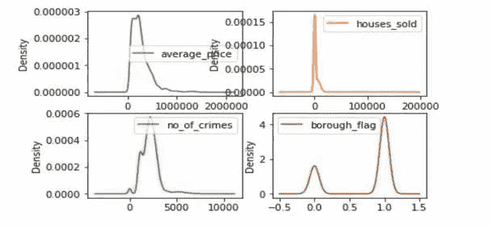
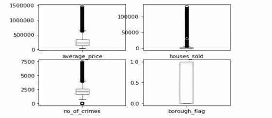
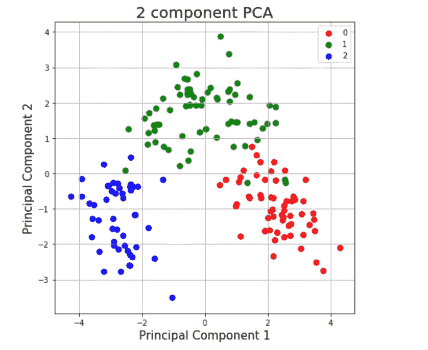
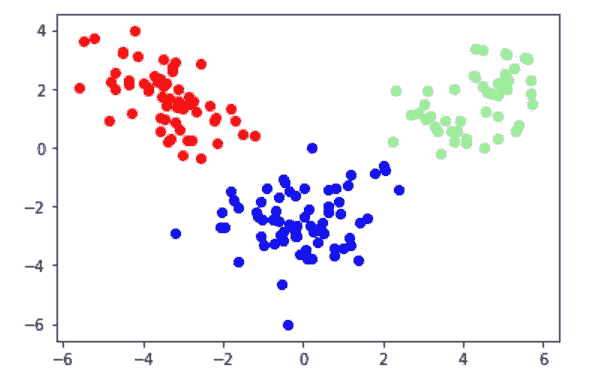
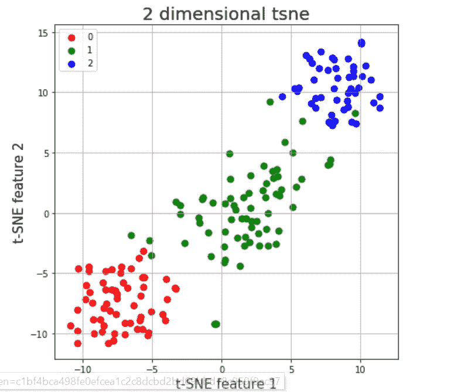

# 机器学习的数据可视化

> 原文：<https://towardsdatascience.com/data-visualization-for-machine-learning-d1f906664f56?source=collection_archive---------54----------------------->

理解数据是机器学习中非常重要的课题之一。在现实世界的问题中，我们会得到大量的原始数据，我们需要从这些数据中获取有意义的信息来解决问题。

机器学习有两种问题。回归和分类。考虑一个要求我们预测房子价格的问题。这里我们需要预测一个数值。这个问题就变成了回归问题。有时我们需要做出“是”或“否”的决定。这是一个二元分类问题。有时候我们需要预测一个类。考虑这样一个问题，我们需要预测像猫、狗、马等动物。这是一个多类分类问题。

每当我们为监督学习的问题获得数据时，我们就会获得属性和标签。属性是自变量，我们必须用它来预测标签或因变量。属性被称为输入、预测、特征、独立变量。标签被称为输出、目标、结果、因变量。如果标签是分类的，问题就变成了分类问题，如果是数值的，问题就变成了回归问题。

当你得到任何问题的数据时，都会有很多属性。我们需要从这些属性中选择特征。问题是当我们得到数据时，有许多相关和不相关的属性。我们需要检查这些属性与输出的相关性。我们需要根据与输出数据的相关性来选择特征。我们需要区分可以选择的好的和坏的属性。

机器学习或建立预测模型中最耗时的步骤之一是特征选择或特征工程。

斯科特·布莱克在 Unsplash 上拍摄的照片

**研究数据**

数据包含属性和标签。在许多理解数据的方法中，下面是两种主要的方法。用描述性统计数据理解数据，用数据可视化理解数据

**用描述性统计理解数据**

以下是我们分析数据的方法

1.查看原始数据以理解问题

2.了解数据的大小

3.检查是否有任何丢失的数据

4.了解数据的类型

5.总结数据的描述性统计，以便更好地理解。

6.理解具有相关性的属性之间的关系。

**了解数据集中属性的数据类型**

一般来说，数据有两种类型，定量的和定性的。定量数据仅由数字组成，定性数据由数字以外的数据组成。根据数据的收集、组织、存储和格式化方式，定性数据进一步分为结构化数据和非结构化数据。

结构化数据由数字或单词组成，可以分为名义数据或顺序数据。名义数据也称为分类数据，可以是标签、数字或文本，代表一个类别。例如，男性和女性可表示为 0 或 1 或 M 和 f。序数数据类似于名义数据，但此外，数据元素可基于偏好进行排序或分级。例如，人们的收入可以根据收入分为高、中、低三类。

文本、视频、图像、音频都属于非结构化数据。

定量数据又分为连续数据和离散数据。连续数据可以取某个范围内的任何值，通常用 decimal 或 float 表示。比如 1.23，2.45 等。离散数据取值一般不能再进一步有意义地细分，它代表离散值，并用整数表示。例如，数苹果，10，20，22，34 等等。

定性数据又分为区间数据和比率数据。区间数据没有原点或基数(绝对零度)，具有名义数据和序数数据的特征。因此，区间数据允许负值，并且只支持加法和减法运算(因为没有原点或基数)。例如，温度值以摄氏度和华氏度表示，而不是以开尔文表示(开尔文具有绝对零度)。比率数据具有名义数据、序数数据和区间数据的特征，此外，还具有起源或基础。因此，它支持所有四种运算——加、减、乘、除。例如，以开尔文为单位的温度值。

在数据科学领域，还发现数据分为四种基本类型——数值数据、分类数据、时间序列数据和文本。

数字数据代表任何数值，它进一步分为连续数据和离散数据，它们具有与上述相同的含义。

分类数据表示上述名义和顺序数据的特征。

时间序列数据表示在特定或规则的时间间隔内，在某个时间间隔或时间段内收集的数字序列。例如，某几年售出房屋的平均数量。时间序列数据不仅仅是数字(数值数据)的集合，而且是按时间顺序排列的。

文本数据通常只是单词。对于机器学习和深度学习，通常使用不同的方法将单词转换为数字。

**数据的描述性度量**

描述性测量给出了对数据的统计理解。它们让我们了解数据是如何定位的，以及数据的分布情况。描述性统计分析是从数据中得出结论的非常重要的一步。这是理解数据的第一步。

有两种数据的描述性度量，集中趋势的度量和扩散的度量。

**集中趋势的度量**

均值、中值和众数是集中趋势的度量。数据围绕某个值聚集的趋势称为集中趋势。

数据样本的平均值是所有数值的总和除以数值的个数。这是最常用和最可靠的集中趋势法。

平均值的计算是基于每个值的，因此它会受到异常值的很大影响。所以，当有极端值时，平均值就不是一个好的集中趋势的量度。

中位数是有序样本的中间点。它也被称为**第 50 百分位。**中位数比平均值受异常值或偏差数据的影响小得多。

众数是在样本中出现次数最多的值。模式是唯一可以应用于分类变量的中心趋势。

**方差或价差的度量**

方差是描述数据的第二个重要属性。方差是数据的扩散或分散程度。最流行的传播度量是范围、四分位范围、方差和标准差。

范围就是最大值和最小值之差。最小值是样本的最小值，最大值是样本的最大值。它只依赖于 2 个观察值，因此它有助于表示小数据集的离差。

四分位间距是第三个四分位值和第一个四分位值之间的差值。四分位数将排序数据集分为 4 个部分。分隔各部分的值称为 Q1、Q2、Q3

IQR 是 Q3——Q1

方差是值和平均值之差的平方和除以样本数— 1。

标准差是方差的平方根。这两个是最常用的变异度量。这些统计数据告诉我们这些值是如何围绕平均值波动的。如果平均值周围的数据浓度较高，则标准偏差将较低，反之亦然。

**理解属性之间的关系**

理解属性之间的关系对于选择在创建模型时要使用的特征是很重要的。可能有许多属性是冗余的或虚假的属性。在训练模型时，需要移除这些属性。使用冗余属性增加了训练时间和计算负荷。此外，属性的数据可能会有偏差。数据可能不符合完美的正态分布。当数据倾斜时，模型的性能将不会提高，即使对超参数进行调整。使用皮尔逊相关系数和检查偏斜数据可以了解数据之间的关系。

**皮尔逊相关系数**

皮尔逊相关系数是一个统计值，有助于理解一对属性或一个属性与标注或输出之间的关系。

其中 x 和 y 是两个属性，x 条和 y 条是属性的平均值

该系数的值可以在-1 和 1 之间变化。

*   值为 0 表示这两个属性之间没有关系
*   值 1 表示这两个属性之间完全相关
*   值-1 表示这两个属性之间存在负相关

如果皮尔逊系数的值更接近 1，则属性之间的相关性非常密切，在模型中包含这两个属性将会增加训练和计算量。您可以从模型中忽略一个属性或特征，或者应用 PCA(主成分分析)来降低特征的维数。

皮尔逊系数可应用于属性和目标变量之间。如果系数的值接近 0，则特征或属性与输出之间没有关系，我们可以忽略该特征。如果系数值是负值并且接近于 0，那么最好忽略该特征。有熊猫函数来求皮尔逊相关系数。

**偏斜数据**

通常，属性数据是正态分布的。数据通常位于钟形曲线中。有时会出现数据失真的情况。

注:此图摘自维基百科。

当数据呈正态分布时，平均值、中位数和众数相同，数据均匀分布在平均值的两侧。有时会出现正偏差或数据偏向平均值的左侧，或者出现负偏差，即数据偏向平均值的右侧。

当我们有倾斜的数据时，即使调整超参数，模型的性能也不会提高。这是因为我们偏离了数据正态分布的回归假设。在使用这些数据进行训练之前，需要对这些数据进行处理。处理倾斜数据的一种流行方法是应用对数变换。处理偏斜数据的另一种方法是应用 box cox 变换。

**用可视化理解数据**

数据可视化是理解数据的最快方式之一。属性的数据可视化可以独立完成，也可以与另一个属性相结合。数据的独立可视化是通过单变量图完成的，而用于检查与其他属性的关系的可视化是多变量图。

**单变量图**

单变量图用于独立理解每个属性的数据。直方图、密度图、箱线图和须线图是一些单变量图。

**直方图**

直方图用于获得数据的分布。数据被放入不同的箱或区间，观察的频率被记录在图中。下图给出了一个房价直方图的例子。

直方图给出了关于数据的以下信息。

*   它给出了观察的计数
*   它给出了数据的分布。
*   它表明数据是否正态分布。
*   它指示数据是否有偏差。
*   如果数据中有任何异常值，它也会给出信息。
*   它给出了数据的分布。

**密度图**

密度图显示了连续时间间隔内的数据分布。与直方图不同的是，没有为间隔分配条柱，因此我们可以看到数据的连续分布。直方图的视觉外观取决于条块宽度的选择。

**盒须图**

箱线图可以用来显示分布的形状、中心值和可变性。绿色中间线显示数据的中位数，方框的边缘显示数据的第三和第一个四分位数。附在盒子上的线称为触须，末端显示数据的最大值和最小值。箱形图给出了数据的范围和四分位间距。箱线图也显示了异常值。位于胡须上方或下方的点表示异常值

**多元曲线图**

当一个图中包含多个参数或属性时，它们被称为多元图。多元图用于理解两个或多个属性的相互依赖性。相关矩阵图和散点图是用于理解机器学习中属性相关性的一些图。

**相关矩阵图**

相关矩阵是显示变量之间相关性的表格。矩阵中的每个单元格显示了两个变量之间的相关性。变量之间的相关性表明变量是如何相互关联的。它显示了一个变量如何随着另一个变量的变化而变化。相关性可以是正的，也可以是负的。如果一个变量和其他变量的变化方向相同，那么这些变量就是正相关的。当一个变量的变化方向与另一个变量的变化方向相反时，这两个变量是负相关的。

这张图给出了变量之间的相关性。这里出售的房子和 borough_flag 负相关。区旗和犯罪数量没有关联。

从相关矩阵图中可以了解到以下情况

理解变量或属性之间的相关性。

如果变量之间有很多相关性，线性回归可能会有不可靠的结果，所以有时我们可以从模型中删除一个变量。

**散点图**

散点图使用点来表示变量组 x 和 y 的值。它基本上是确定两个变量 x 和 y 之间是否有任何统计关系。

上图显示了变量 A、B、C、D、e 的散点图。变量之间可能存在以下关系。变量之间可能存在正相关、负相关、非线性关系或不相关。在上图中，变量 A 和 b 之间存在正相关。变量 A 和 c 之间存在负相关。变量 A 和 e 之间存在非线性相关。变量 A 和 d 之间不存在相关。

散点图还可以识别数据中是否有异常值。

**多类数据的可视化**

有时我们需要可视化分类问题的数据，其中有多个类别的数据。很多时候，属性数据的维数非常大，上述技术都无助于降低维数。在这些场景中，PCA、LDA 和 t-SNE 技术用于特征提取和降维。这些技术降低了数据的维度，帮助我们直观地了解不同类别的数据是如何分离的。

**主成分分析**

这是一种基于数据相关性的无监督线性变换技术，将识别数据中的模式。它是一种基于投影的方法，在高维数据中寻找最大方差的方向，并通过将数据投影到具有相等或更少维的新子空间中的一组正交轴上来变换数据。具有新轴的 PCA 的可视化将显示投影，该投影扩展数据并以某种方式形成聚类。以下是应用 PCA 后的数据聚类。

这种可视化帮助我们识别不同类的数据之间的分离。如果数据没有分离，主成分的数量需要增加，以检查我们是否得到了分离。这些主要成分现在可以用于构建我们的模型。

**线性判别分析**

它类似于 PCA，其中它找到使数据的方差最大化的分量轴，但是此外它尽可能多地保留类别区分信息。因此，LDA 的目标是再次将原始数据投影到具有相等或更少维度的新子空间中的一组轴上，但是此外，新的轴将使得它们最大化多个类别之间的分离。以下是在将 LDA 应用于上面应用了 PCA 的相同数据集之后的数据聚类。可以看出，当使用 LDA 时，类别分离更加明显。

双组分 LDA

**t-分布随机邻居嵌入(t-SNE)**

这是一种用于数据可视化的无监督非线性技术。t-SNE 的主要优点是它保留了数据中的局部和全局结构。这意味着原始数据中距离较近的点在低维中会保持距离较近。t-SNE 方法确定高维空间和低维空间中的两对点之间的相似性度量，然后使用成本函数试图优化这两个相似性度量。以下是对数据应用 t-SNE 后形成的聚类。

数据可视化有助于理解机器学习模型的数据和特征选择。

作者

斯里尼瓦斯·查克拉瓦蒂·:srinivas.yeeda@gmail.com

钱德拉塞卡银行:chandru4ni@gmail.com