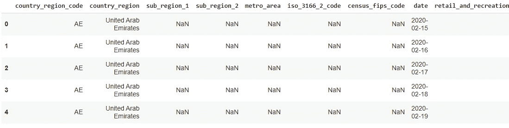
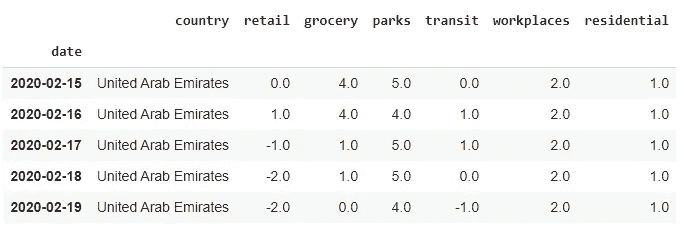
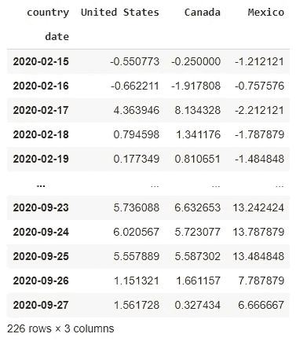
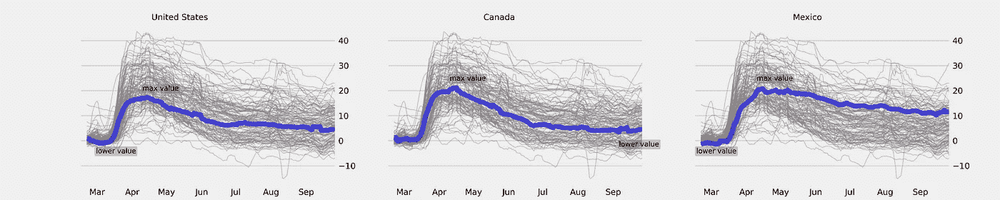
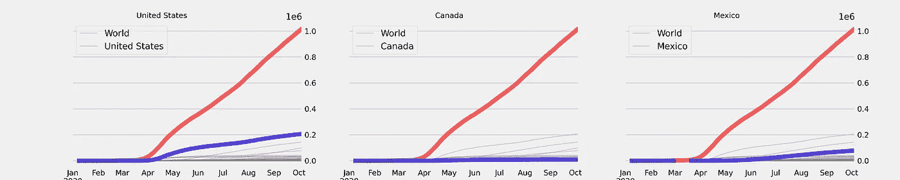

# 数据可视化:北美自由贸易区国家在疫情的表现

> 原文：<https://towardsdatascience.com/data-visualization-how-nafta-countries-are-doing-in-the-pandemic-a5ef8216e418?source=collection_archive---------48----------------------->

## **在家的时间和疫情期间的总病例数**


由[邦妮·凯特](https://unsplash.com/@bonniekdesign?utm_source=medium&utm_medium=referral)在 [Unsplash](https://unsplash.com?utm_source=medium&utm_medium=referral) 上拍摄

# 介绍

北美自由贸易协定是由美国、加拿大和墨西哥组成的经济集团。该组织成立于 1994 年 1 月 1 日，旨在加强这些国家之间的贸易关系。其目标之一是与欧洲和中国市场展开正面竞争，这两个市场近年来发展迅猛。

北美自由贸易区本质上是经济区，与其他经济区相比，没有机构或政府来管理该区。由于欧盟以其社会和经济差异而闻名，分析其社会孤立图和疫情期间 Covid19 的总病例以更好地了解每个国家及其在这种新情况下的差异是很有趣的。

# 数据库ˌ资料库

所有的数据都来自谷歌移动报告网站，在那里你可以看到社区移动报告，这些报告是关于面对新冠肺炎的政策所带来的变化。这些图表显示了不同地区和不同类别的流离失所趋势。最后，病例总数的数据被从网站[我们的世界的数据](https://ourworldindata.org/coronavirus)中删除。

# 预处理和清洗

**程序的重要库**

```
import pandas as pd
import matplotlib.pyplot as plt
```

**读取数据**

```
link='https://www.gstatic.com/covid19/mobility/Global_Mobility_Report.csv'data = pd.read_csv(link)
data.head()
```



列太多了

**分隔主列**

```
data_country = data.iloc[:,[1,7,8,9,10,11,12,13]].copy()data_country.columns = ['country','date', 'retail', 'grocery', 'parks', 'transit', 'workplaces', 'residential']data_country.date = pd.to_datetime(data_country.date)data_country.index = data_country.datedata_country.drop(labels = 'date', axis=1, inplace=True)data_country.head()
```



所有国家

**使用“groupby”方法，对“住宅”列的经济集团国家进行分组。**

```
data_country.groupby(by[data_country.index,"country"])
.mean().unstack()["residential"][['United States','Canada','Mexico']]
```



仅限北美自由贸易区国家

# 数据可视化

```
fig, ax = plt.subplots(nrows=1,ncols=3,figsize=(20,4))item = "residential" #grocery, parks, transit, workplaces, retailcountrys = ['United States','Canada','Mexico']for i,country in enumerate(countrys):data_country.groupby(by=[data_country.index,"country"]).mean().unstack()[item].rolling(window=7).mean().plot(legend=False,color="grey",linewidth=1, alpha=0.4, ax=ax[i])data_country.groupby(by=[data_country.index,"country"]).mean().unstack()[item][country].rolling(window=7).mean().plot(legend=False,color="blue",linewidth=7, alpha=0.6, ax=ax[i])ax[i].set_title(country,fontsize=12,ha='right')ax[i].xaxis.grid(False)ax[i].set_xlabel("")ax[i].set_xticklabels(["","Mar","Apr","May","Jun","Jul","Aug","Sep"])ax[i].xaxis.set_tick_params(labelsize=12)ax[i].yaxis.set_tick_params(labelsize=12)if (i==0) or (i==2):ax[i].yaxis.tick_right()else:ax[i].set_yticklabels([])#plt.savefig("nafta.png",dpi=300)plt.show()
```



整个疫情的社会隔离图

在这个图表中，我们用蓝色和灰色突出显示了国家的值，我们有世界上其他国家的值。



每个国家相对于世界的病例总数图表

在第二张图中，我们可以看到，尽管美国有一个指数，并且倾向于拥有与加拿大相似的病例数，但 Covid 的病例数比加拿大和墨西哥多许多倍，这向我们揭示了与加拿大相比，该病毒尚未得到控制，加拿大有类似的隔离图。

# 结论

值得注意的是，这两个图表是不同的，例如，加拿大像墨西哥一样有很高的社会隔离水平，今天它已经有一个低得多的数字，这可能意味着政府和疾病人口有更大的控制。所以，即使美国和加拿大有相似的社会隔离图表，案例数量的图表显示了美国非常大的差异，在集团的所有国家都有非常高价值的参与。

为了更好地理解这里观察到的代码和数据，可以链接到 [GitHub](https://github.com/thyall/Nafta-Pandemic) 上的知识库，以及更深入的北美自由贸易协定[内容](https://www.infoescola.com/geografia/nafta/)。