# 数据可视化:如何选择正确的图表[第 1 部分]

> 原文：<https://towardsdatascience.com/data-visualization-how-to-choose-the-right-chart-part-1-d4c550085ea7?source=collection_archive---------8----------------------->

## 为您希望受众完成的任务选择正确的图形或图表样式


摩根·豪斯尔在 [Unsplash](https://unsplash.com?utm_source=medium&utm_medium=referral) 上的照片

根据[世界经济论坛](https://www.weforum.org/agenda/2017/09/the-value-of-data/)的数据，世界每天产生 2.5 万亿字节的数据。面对如此多的数据，管理和理解它们变得越来越困难。任何人都不可能一行一行地查阅数据，看到不同的模式并进行观察。

数据可视化是数据科学过程之一；也就是说，一个处理数据科学任务的框架。在数据被收集、处理和建模之后，需要为结论可视化关系。

我们使用数据可视化作为一种技术，通过可视化表示来传达数据的洞察力。我们的主要目标是将大型数据集提取到可视化图形中，以便直观地理解数据中的复杂关系。

所以现在，我们知道数据可视化可以提供传统描述性统计无法提供的洞察力。我们的大问题是如何为数据选择正确的图表？

本说明将为我们提供不同图表类型的概述。对于每种类型的图表，我们将介绍一个简短的描述。然后我们讨论什么时候使用它，什么时候应该避免使用它。接下来，我们将查看一些用于实现的 Python 代码。我只提出首要原则；完整版本将在本文末尾提供。

我希望这篇笔记足够有趣，可以弥补这个不足。让我们开始吧。

# 你想让你讲什么故事？

在制作图表之前，理解我们为什么需要图表是很重要的。图表、绘图、地图和图解帮助人们理解复杂的数据、发现模式、识别趋势和讲述故事。思考我们想与观众分享的信息。在这里，我根据图表的数据可视化功能对其进行分组，也就是说，我们希望我们的图表与我们的受众进行交流。虽然每个图表在特定功能中的分配并不是一个完美的系统，但它仍然可以作为一个有用的指南，用于根据我们的分析或交流需求选择图表。

本说明的第一部分将向我们介绍不同的图表，以显示变量之间的联系、随时间变化的趋势以及变量在类别中的相对顺序

## 关系

1.使用 Matplotlib
2 的散点图。边缘直方图
3。使用 Seaborn
4 的散点图。在 Seaborn
5 的结对情节。热图

## 数据随时间变化

6.线图
7。面积图
8。叠加面积图
9。未堆叠的面积图

## 等级

10.垂直条形图
11。横道图
12。多组条形图
13。堆栈条形图
14。棒棒糖图表

本笔记第二部分将向我们介绍用于比较变量及其分布的不同图表类型。

## 分配

15.直方图
16。带直方图的密度曲线
17。密度图
18。箱线图
19。带状图
20。小提琴剧情
21。人口金字塔

## 比较

22.气泡图
23。项目符号图
24。饼状图
25。网饼状图
26。圆环图
27。树形图
28。分叉杆
29。Choropleth 地图
30。气泡图

# 关系

我们使用关系方法来显示两个或多个变量之间的联系或相关性。

当评估数据集之间的关系时，我们试图理解两个或多个数据集是如何组合和相互作用的。

这种关系被称为相关性，它可以是正的，也可以是负的，这意味着所考虑的变量可能相互支持，也可能相互矛盾。

# 1.使用 Matplotlib 绘制散点图

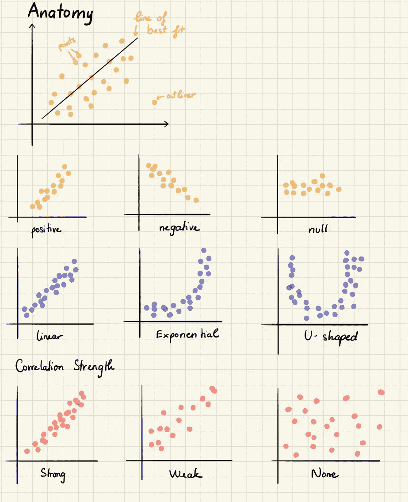

图片由[作者](https://medium.com/@nothingaholic)

散点图是一种常用于统计和数据科学的图表。它由跨两个轴绘制的多个数据点组成。散点图中描绘的每个变量都有不同的观察值。每当我们看到两个数据集之间的任何关系时，它都是一种有利的图表类型。

我们使用散点图来确定数据与每个变量的关系(即相关性或趋势模式。)它还有助于检测图中的异常值。

在机器学习中，散点图常用于回归，其中 x 和 y 是连续变量。它们也用于聚类分散点或离群点检测。

如果我们对观察时间模式感兴趣，散点图是不合适的。

散点图用于数字数据或数字。因此，如果我们有三个部门、五种产品等类别。散点图不会揭示太多。

## Python 实现

我们使用虹膜数据集进行可视化。

```
plt.scatter(iris_df['sepal length (cm)'], iris_df['sepal width (cm)'])
plt.title('Scatterplot of Distribution of Sepal Length and Sepal Width', fontsize=15)
plt.xlabel('sepal length (cm)')
plt.ylabel('sepal width (cm)')
```

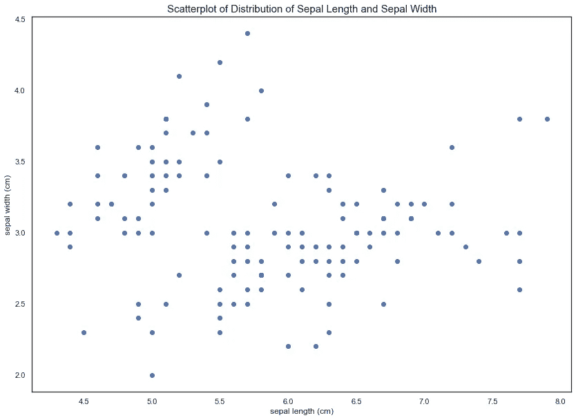

图片由[作者](https://medium.com/@nothingaholic)

# 2.边缘直方图

边缘直方图是添加到散点图的每个轴的边缘的直方图，用于分析每个测量的分布。

我们使用边际直方图来评估两个变量之间的关系，并检查它们的分布。将边缘直方图放在散点图中，或者在突出显示的表格上添加边缘条，可以使可视化具有交互性、信息量大且令人印象深刻。

## Python 实现

```
# A seaborn jointplot shows bivariate scatterplots and univariate histograms in the same figure
p = sns.jointplot(iris_df['sepal length (cm)'], iris_df['sepal width (cm)'], height=10)
```

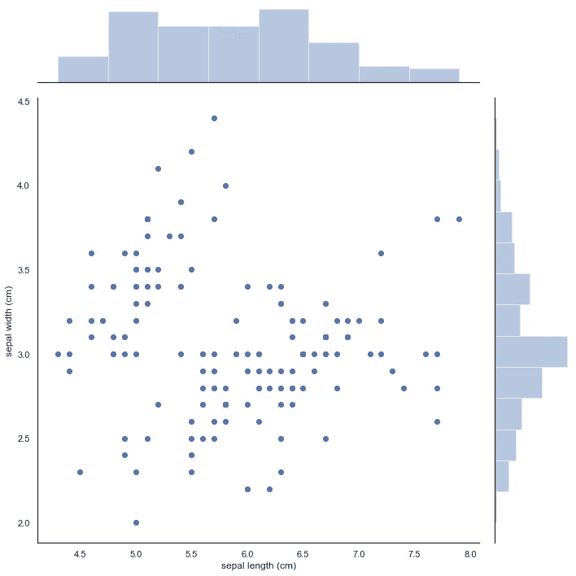

图片由[作者](https://medium.com/@nothingaholic)

# 3.使用 Seaborn 的散点图

我们的目标是创造一个传奇来理解不同群体之间的差异。我们将使用 seaborn 的 FacetGrid 按物种给散点图着色。

```
sns.FacetGrid(iris_df, hue=’species’, size=10) \
 .map(plt.scatter, ‘sepal length (cm)’, ‘sepal width (cm)’) \
 .add_legend()
plt.title(‘Scatterplot with Seaborn’, fontsize=15)
```

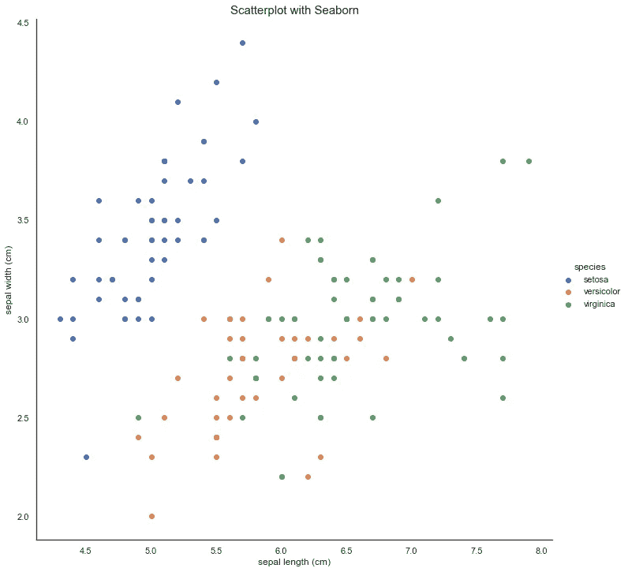

图片由[作者](https://medium.com/@nothingaholic)

# 4.Seaborn 的配对图

另一个有用的 seaborn 图是`pairplot`，它显示了每对特征之间的二元关系。从配对图中，我们将看到鸢尾物种在所有特征组合中都与其他两个物种分开。

```
sns.pairplot(iris_df.drop(“target”, axis=1), hue=”species”, height=3)
```

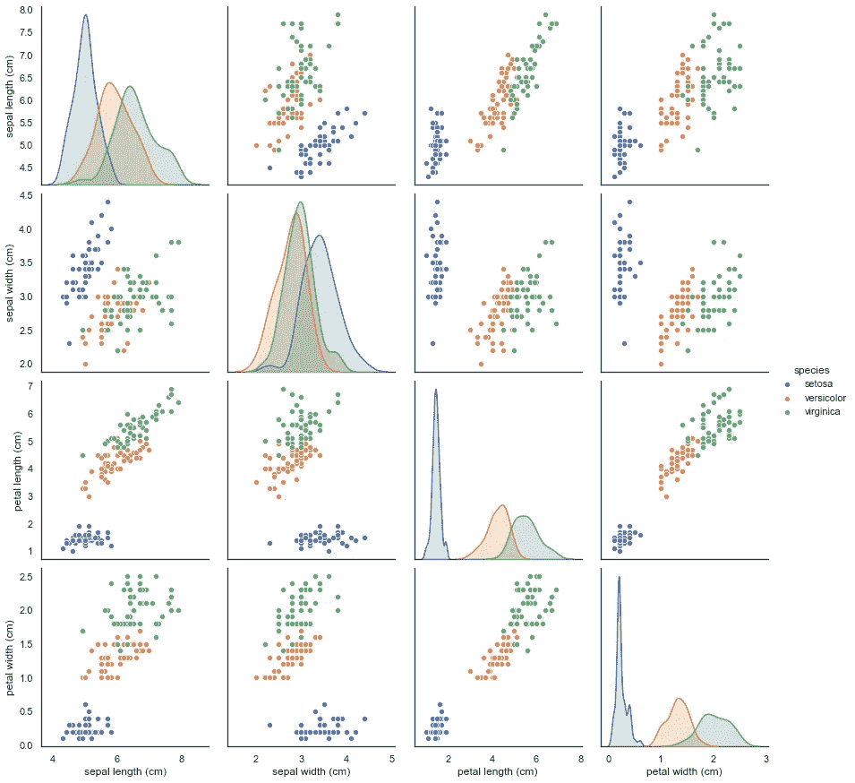

图片由[作者](https://medium.com/@nothingaholic)

# 5.热图

热图是数据的图形表示，使用颜色编码系统来表示不同的值。热图通过在行和列中放置变量并对表中的单元格进行着色，对于交叉检查多变量数据非常有用。

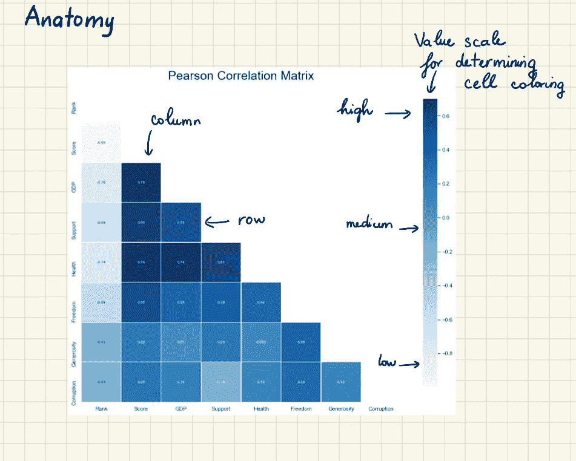

图片作者[作者](https://medium.com/@nothingaholic)

所有的行是一个类别(标签显示在左侧)，所有的列是另一个类别(标签显示在底部)。单独的行和列被分成子类别，这些子类别在矩阵中相互匹配。表格中的单元格包含颜色编码的分类数据或基于色标的数值数据。单元格中的数据展示了连接行和列中两个变量之间的关系。

热图对于显示多个变量之间的差异、揭示任何模式、显示任何变量是否相似以及检测它们之间的任何相关性非常有用。

当我们想要查看分类值的哪些交叉点比其他交叉点具有更高的数据集中度时，热图会非常有用。

热图更适合显示数字数据的更一般化视图。很难准确区分颜色深浅的差异，也很难提取特定的数据点(除非我们包括细胞的原始数据)。

如果其中一行或一列设置为时间间隔，热图还可以显示数据随时间的变化。例如，使用热图来比较城市全年的温度变化，以查看最热或最冷的地方。因此，行包含每个月，列表示小时，单元格包含温度值。

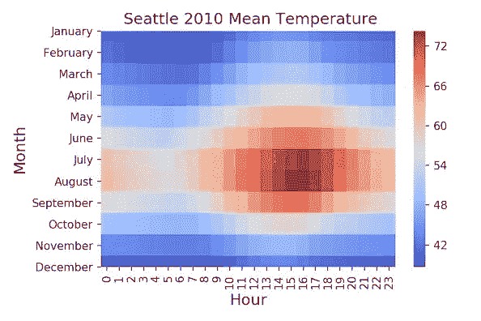

来源:[数据即用 Python 和 R](https://datavizpyr.com/heatmaps-with-seaborn-in-python/)

## Python 实现

我们使用来自 [Kaggle](https://www.kaggle.com/unsdsn/world-happiness) 的[世界幸福报告](https://worldhappiness.report/)数据集。我清理了数据，将所有文件合并到`happiness_rank.csv`文件中。你可以下载并清理数据或者在这里下载最终结果[。我推荐你在](https://github.com/Nothingaholic/Python-Cheat-Sheet/blob/master/matplotlib/happiness_rank.csv) [Github](https://github.com/Nothingaholic/The-World-of-Happiness/blob/master/MLR.ipynb) 上查看我的数据清理代码。

```
sns.heatmap(happy[usecols].corr(),linewidths=0.25,
            vmax=0.7,square=True,cmap="Blues", 
            linecolor='w',annot=True,annot_kws={"size":8}, 
             mask=mask, cbar_kws={"shrink": .9})
```

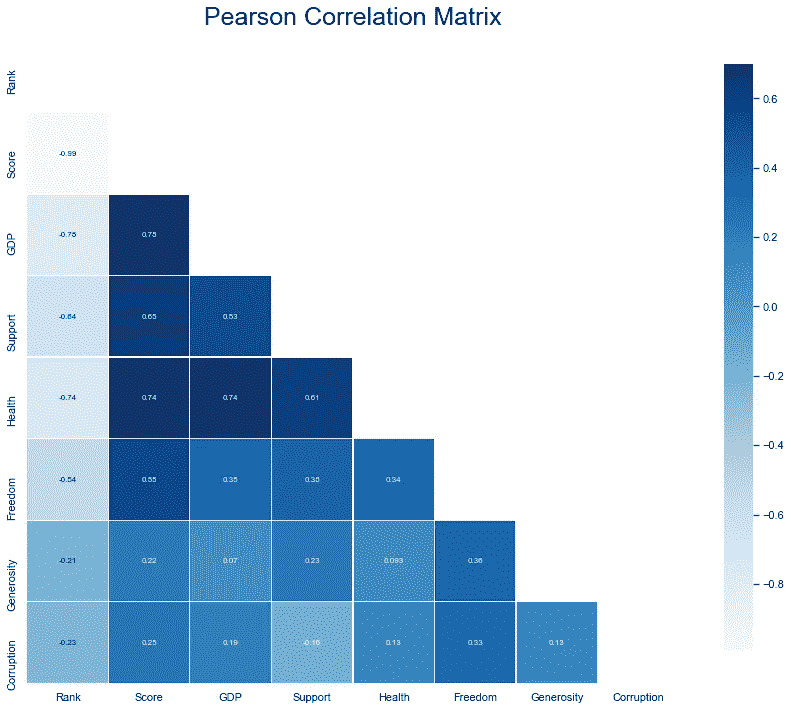

图片作者[作者](https://medium.com/@nothingaholic)

# 数据随时间变化

有时，仅仅知道变量之间存在关系是不够的；在某些情况下，如果我们也能想象这段关系发生的时间，更好的分析是可能的。因为关系是用变量之间的链接来表示的，所以日期/时间显示为链接属性。这种可视化方法显示一段时间内的数据，以发现一段时间内的趋势或变化。

# 6.折线图

折线图用于显示连续时间间隔或期间的量化值。

绘制折线图时，首先在笛卡尔坐标网格上绘制数据点，然后将它们连接起来。通常，y 轴有一个数量值，而 x 轴是一个时间刻度或一系列间隔。图表上线条的方向是对数据的一个很好的比喻:向上的斜率表示值在增加，向下的斜率表示值在减少。线条在图表中的移动可以创建揭示数据集中趋势的模式。

折线图最常用于显示趋势和分析数据随时间的变化。

折线图最适合连续数据，因为它连接了许多属于同一类别的变量。

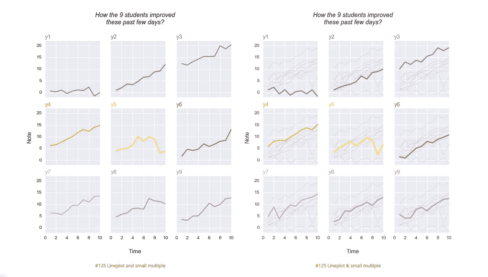

来源:[Python 图表库](https://python-graph-gallery.com/125-small-multiples-for-line-chart/)

当与其他线条或其他数据系列组合在一起时，可以对单独的线条进行比较。然而，我们应该避免在每张图中使用超过四行的线条，因为这会使图表更加混乱和难以阅读。解决这个问题的方法是将我们的图表分成多个支线剧情。

## Python 实现

假设我们有一个包含中等成员信息的数据集。我们想看看 2019 年读过的文章的趋势。

```
plt.plot(data['Month'], data['All Views'], color='#4870a0', marker='o')
```


图片作者[作者](https://medium.com/@nothingaholic)

# 7.对比图

面积图的概念基于折线图。彩色区域向我们展示了一个变量随时间的发展。

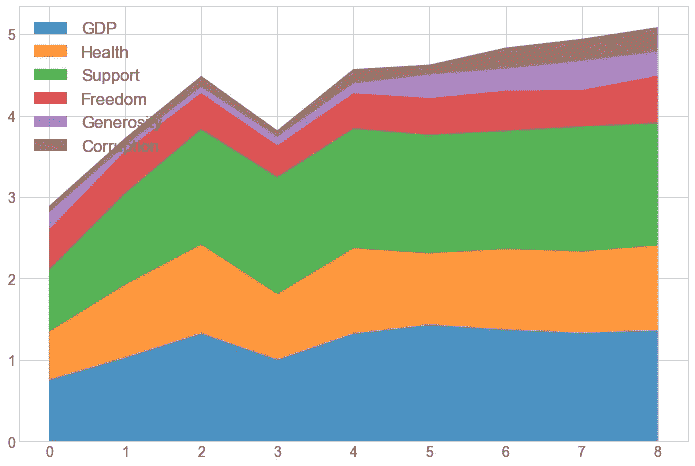

来源: [Matplotlib 备忘单](/matplotlib-cheat-sheet-f441c43971c4)

面积图非常适合清楚地说明两个或更多数据点之间的变化幅度。例如，幸福分数有六个生成分区；我们希望看到每个分部的贡献。


来源: [Matplotlib 备忘单](/matplotlib-cheat-sheet-f441c43971c4)

此外，如果我们感兴趣的是每个分部产生的部分，而不是分部本身的总量，我们可以使用 100%堆积面积图。这将显示一段时间内每个部门的百分比贡献。

如果我们想要呈现波动的值，如股票市场或价格变化，面积图不是最佳选择。

## Python 实现

在这里，我们希望展示一段时间内外部视图的累计数量。

```
plt.stackplot(data['Month'], data['External Views'], colors='#7289da', alpha=0.8)
```

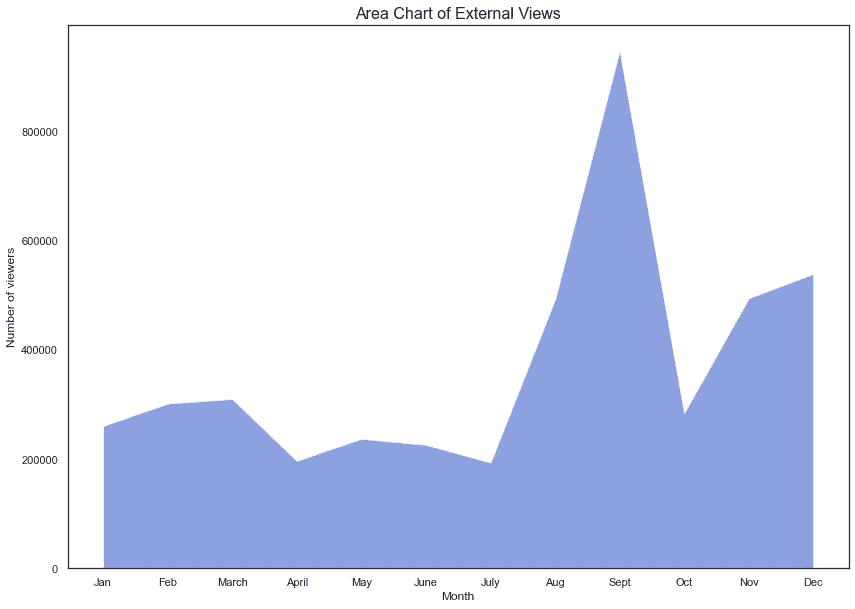

图片由[作者](https://medium.com/@nothingaholic)

# 7.堆叠面积图

堆叠面积图的概念是基于简单的面积图。它在同一个图形上显示几个组的值。每组的值显示在彼此的顶部。整个图表代表所有数据随时间变化的总和。

堆积面积图类型是一种功能强大的图表，因为它允许对数据进行分组并查看选定日期范围内的趋势。

堆积面积图使用面积来表示整数，因此它们不适用于负值。

堆积面积图丰富多彩且有趣，但我们应该谨慎使用，因为它们很快就会变得一团糟。我们不应将超过五个类别放在一起。

## Python 实现

```
plt.stackplot(data['Month'], data['Internal Views'], data['External Views'],
              alpha=0.75,
              colors=['#7289da','#f29fa9'],
            labels=['Internal Views', 'External Views'])
```

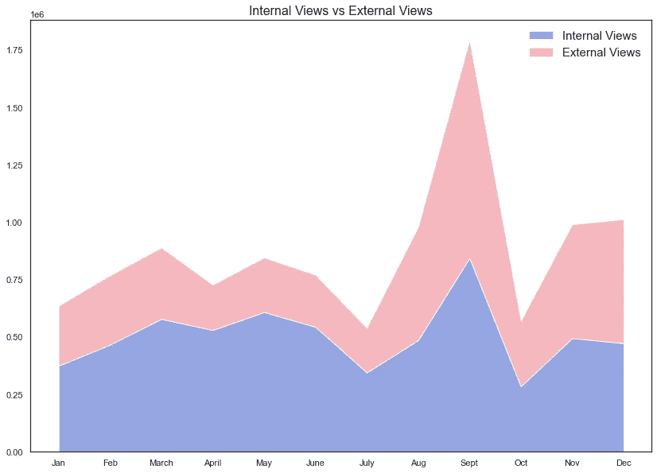

图片作者[作者](https://medium.com/@nothingaholic)

# 9.未堆叠的面积图

与堆叠面积图不同，未堆叠面积图在同一图形上显示几个组的重叠。

```
x = data['Internal Views']
y = data['External Views']# plot the data
ax.plot(x, color='#49a7c3', alpha=0.3, label='Internal Views')
ax.plot(y, color='#f04747', alpha=0.3, label='External Views')# fill the areas between the plots and the x axis
# this can create overlapping areas between lines
ax.fill_between(x.index, 0, x, color='blue', alpha=0.2)
ax.fill_between(x.index, 0, y, color='red', alpha=0.2)
```

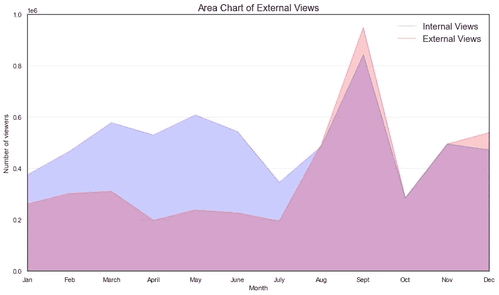

图片作者[作者](https://medium.com/@nothingaholic)

# 等级

可视化方法显示数据值的相对顺序。

# 条形图

条形图是最常用的图表类型之一。顾名思义，条形图是由一系列显示变量发展的条形组成的。

条形图有四种类型:水平条形图、垂直条形图、组条形图和堆积条形图。

当我们想要跟踪一个或两个变量随时间的发展时，条形图非常有用。图表的一个轴显示正在比较的特定类别，另一个轴代表测量值。

当我们有一个变量的单周期分解时，简单的条形图是不合适的。例如，如果我想描绘对公司收入有贡献的主要业务线，我不会使用条形图。相反，我会创建一个饼图或其变体。

# 10.垂直条形图

垂直条形图(柱形图)不同于直方图，因为它们不显示一段时间内的连续发展。垂直条形图的离散数据是分类的，因此回答了“有多少？”在每个类别中。

垂直条形图通常用于比较特定数值范围内的几个项目。因此，它非常适合于比较单个子项目之间的单个数据类别，例如，地区之间的相应收入。

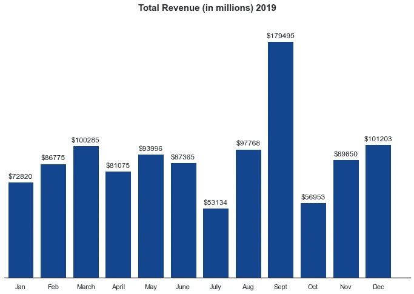

图片由[作者](https://medium.com/@nothingaholic)

## Python 实现

我们使用 [mpg_ggplot2](https://ggplot2.tidyverse.org/reference/mpg.html) 数据帧。它是变量(在列中)和观察值(在行中)的矩形集合。`mpg`包含美国环境保护署对 38 种受欢迎车型的观察结果。

## Python 实现

在这里，我们要对比一下车模。

```
plt.bar(value_count.index, value_count.values, color='#49a7c3')
```

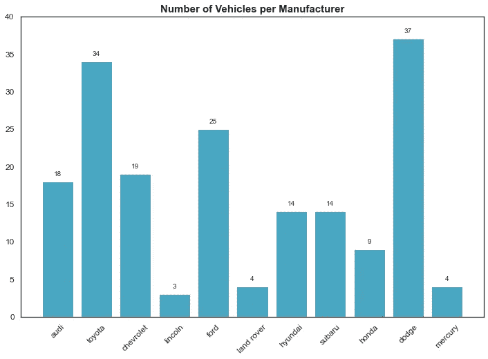

图片作者[作者](https://medium.com/@nothingaholic)

# 11.水平条形图

水平条形图水平表示数据。数据类别显示在 y 轴上，数据值显示在 x 轴上。每个条形的长度等于对应于数据类别的值，所有条形都从左到右穿过。

## `Python Implementation`

```
plt.barh(value_count.index, value_count.values, color='#b28eb2')
```

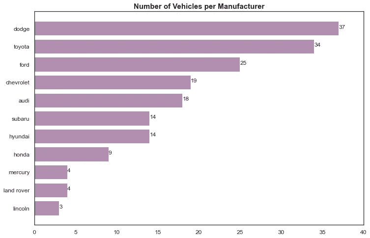

图片作者[作者](https://medium.com/@nothingaholic)

# 13.多组条形图

也称为分组条形图或簇状条形图。

当两个或多个数据系列并排绘制并按类别分组时，使用这种变化的条形图，所有数据系列都在同一坐标轴上。

我们使用多组条形图将分组变量或类别与具有相同变量或类别类型的其他组进行比较。

组条形图的缺点是，一个组中的条形图越多，阅读起来就越困难。

## Python 实现

```
ax = views.plot.bar(rot=0,color='#E6E9ED',width=1, figsize=(14,8))
ax = df.plot.bar(rot=0, ax=ax, color=['#7289da', '#dd546e', '#99aab5', '#f3c366'], 
                 width=0.8, figsize=(14,8))
```

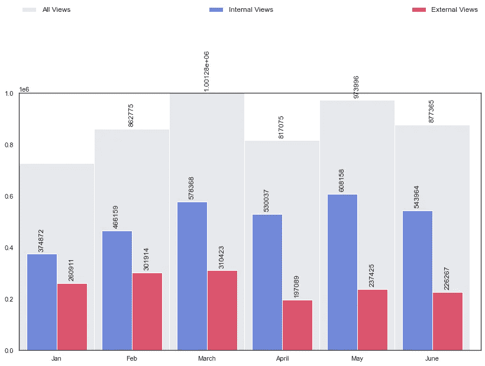

图片由[作者](https://medium.com/@nothingaholic)

# 13.堆叠条形图

与并排显示条形的多集条形图不同，堆积条形图将条形分段。堆积条形图用于显示如何将一个较大的类别划分为较小的类别，以及每个部分与总额之间的关系。

堆积条形图将该段的每个值放在前一个值之后。条形的总值是所有段值的总和。这是比较每组/分段条形图总额的理想方法。

堆积条形图的一个主要缺陷是，每个条形图的分段越多，阅读起来就越困难。此外，将每个组件相互比较也很困难，因为它们不在一个共同的基线上。

## Python 实现

```
rect1 = plt.bar(data['Month'] ,data['Internal Views'],
                width=0.5, color='lightblue')
rect2 = plt.bar(data['Month'], data['External Views'],
                width=0.5, color='#1f77b4')
```

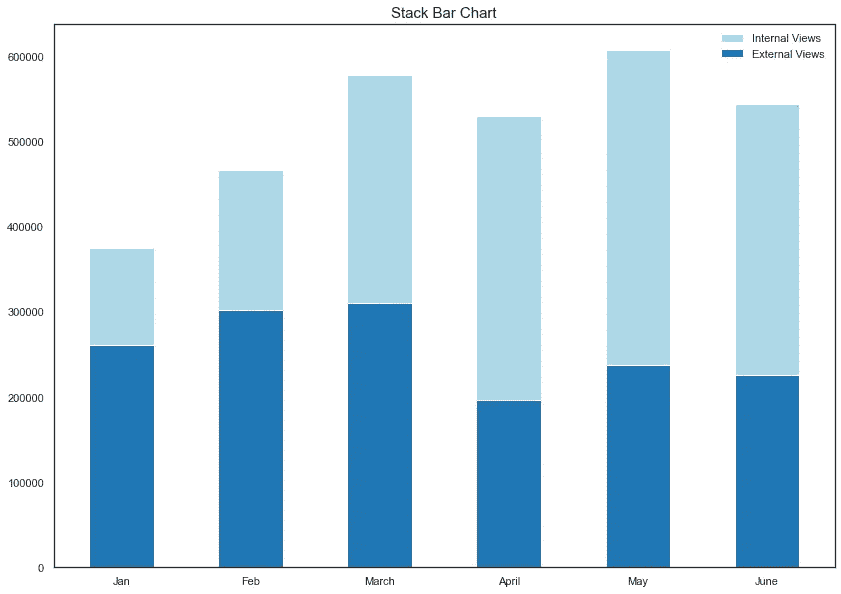

图片作者[作者](https://medium.com/@nothingaholic)

# 14.棒棒糖图表

棒棒糖图以一种视觉愉悦的方式提供了与有序条形图相似的用途。我们使用棒棒糖图来显示一个数值变量和另一个数值变量或分类变量之间的关系。

如果我们处理大量的值，并且当值都很高时，例如在 80–90%范围内(100%之外)，棒棒糖图通常被认为比标准条形图有用。那么一系列高大的柱子会在视觉上具有侵略性。

如果我们的数据中有长度非常相似的未分类棒棒糖，那么比较两个非常相似的棒棒糖的大小就比比较标准棒棒糖更困难。

**Python 实现**

```
(markerline, stemlines, baseline) = plt.stem(value_count.index, value_count.values)
```


图片由[作者](https://medium.com/@nothingaholic)

第一部分到此为止。该代码可在 [Github](https://github.com/Nothingaholic/Python-Cheat-Sheet/blob/master/matplotlib/visualization/visualization.ipynb) 上获得。我们将在第二部分继续讨论分布和比较。

到目前为止，我们知道数据可视化是一种快速、简单的普遍表达概念的方式——我们可以通过稍作调整来试验不同的场景。

有几十种用于数据可视化和数据分析的工具[——从简单的需要零编码(](http://bigdata-madesimple.com/review-of-20-best-big-data-visualization-tools/) [Tableau](https://www.tableau.com/) )到复杂的需要编码( [JaveScript](https://www.javascript.com/) )。不是每个工具都适合每个想学习可视化技术的人，也不是每个工具都可以扩展到行业或企业目的。

我最喜欢的教授告诉我，“好的数据可视化理论和技能会超越具体的工具和产品。”当我们学习这项技能时，关注最佳实践，并探索我们在可视化和仪表板方面的风格。数据可视化不会很快消失，所以无论您最终使用什么工具或软件，都必须建立一个可以随身携带的分析、讲故事和探索的基础。

如果你想更深入地研究这个特定的主题，这里有一些很好的起点。

1.  [信息是美好的](https://informationisbeautiful.net/)
2.  [可视化数据](https://www.visualisingdata.com/)
3.  [数据可视化目录](https://datavizcatalogue.com/)
4.  [颜色十六进制](https://www.color-hex.com/)
5.  [Matplotlib 备忘单](/matplotlib-cheat-sheet-f441c43971c4)
6.  [如何用 Python 制作 Seaborn 的热图？](https://datavizpyr.com/heatmaps-with-seaborn-in-python/)