# bubble.io 中的数据可视化

> 原文：<https://towardsdatascience.com/data-visualization-in-bubble-io-9f83d54ef599?source=collection_archive---------12----------------------->

## 如何在不编码的情况下生成用户友好的数据可视化？

卢克·切瑟在 [Unsplash](https://unsplash.com?utm_source=medium&utm_medium=referral) 上的照片

[**Bubble.io**](https://bubble.io/home) 对于初创公司和中型公司来说，这是一个非常好的平台，可以以非常低的成本，有时甚至是零成本来开发他们的网站。

它使非技术人员(是的，像我一样)和那些时间紧迫的团队能够从一开始就不用自学 Python Flask 来构建网站。相反，它允许用户将元素拖放到画布上，并定义工作流来控制逻辑。[【1】](https://techcrunch.com/2014/03/10/the-secret-bubble/)

> 据说，Bubble 的愿景是让手工编码在很大程度上过时。[【2】](https://www.ft.com/content/6c6ccace-521d-11e5-b029-b9d50a74fd14?_i_location=http%3A%2F%2Fwww.ft.com%2Fcms%2Fs%2F0%2F6c6ccace-521d-11e5-b029-b9d50a74fd14.html%3Fsiteedition%3Dintl&_i_referer=&classification=conditional_standard&iab=barrier-app&siteedition=intl)

在我最近的实习期间，我有机会用 bubble.io 从零开始开发一个公司网站，只花了 120 美元购买了 2 个插件。很神奇，对吧？

今天，我想带你浏览网站的一个重要部分:数据可视化，以及如何做。

首先，bubble 的 marketplace 中有相当多的数据可视化插件。但经过仔细选择，我选择了 ApexCharts.js，因为它的不同图表和图形范围相对较广，如面积图(堆栈图)、条形图、圆环图、饼图、散点图、热图等。您可以点击此页面查看更多详情:[https://pluginpreview.bubbleapps.io/chart](https://pluginpreview.bubbleapps.io/chart)

要将这个插件与页面集成，有几个步骤:

1.  通过 SQL 数据库连接器(bubble 内置**免费**插件，万岁！)
2.  添加新的查询以生成相应的系列类别(列)和数据(行)
3.  选择可视化类型，在页面上添加新的视觉元素，并填充“外观”部分的空白
4.  享受你美丽的想象🎉

接下来，我将一步一步地向您介绍，并使用一些简单的示例。

## 步骤 1:连接您的数据库

单击工具栏部分的“插件”并选择“SQL 数据库连接器”

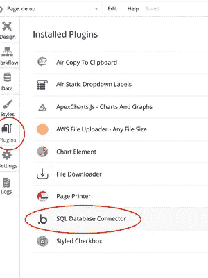

插件页面

如果你在“已安装插件”列表中看不到它，你需要从插件市场下载，不需要额外付费。

接下来，选择数据库类型，并按照指示输入连接字符串:

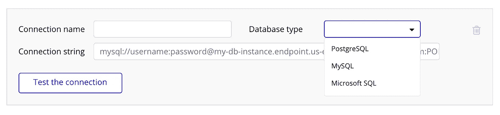

与您的数据库连接

建议使用 AWS RDS 服务，根据您的存储情况，免费层在相当长一段时间内可能就足够了。(另一种节省一些的方法💲！)

## 步骤 2:添加新的查询以相应地生成系列类别(列)和数据(行)

在此之前，我需要演示我的三个演示表。

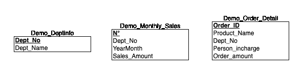

关系模式

如您所见，这只是为了演示，您实际的关系表应该比这复杂得多。

我的第一个查询是根据年/月为不同的部门选择 Sales_Amount。我在这里将“年/月”格式化为文本(varchar ),这是为了演示，也是因为 bubble.io 只启用“日期”格式，如“2020–01–01 ”,而不是我在这里想要的格式。

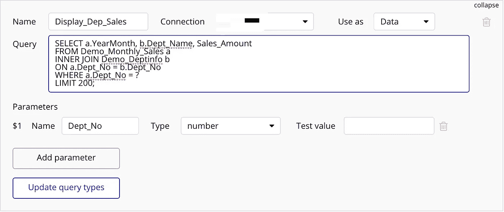

简单的 SQL 查询

⚠️There're 在这里要注意几件事:

1.  问号“？”对应于您稍后要在界面上输入的参数值，请确保正确设置类型；
2.  总是以**‘LIMIT 200’**结束你的查询，这是 bubble.io 内置的设置，以防查询返回太多值；

通过单击“更新查询类型”按钮，您将看到此界面，并确保将数据类型设置为您想要的⬇️

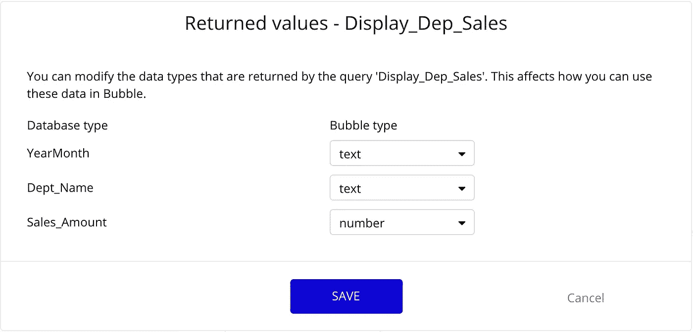

接下来，我将展示一个简单的折线图:

当“出发编号”等于 1 时，部门名称=“家庭”

## 步骤 3:选择可视化类型，在页面上添加新的可视化元素，并填充外观部分的空白

为了获得定制的输出，在填充“外观”部分的空白时，您需要选择“从外部 API 获取数据”,然后从 SQL 连接查询列表中进行选择。

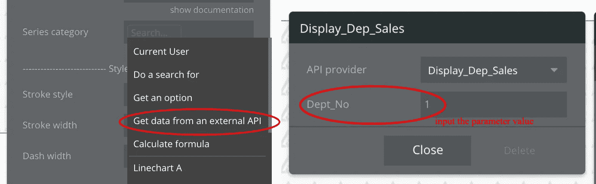

现在这是魔术棒部分，通过设置你的返回值(列和行):

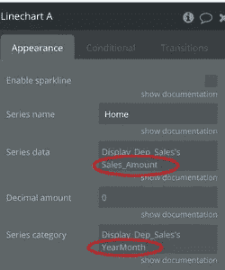

请记住，通常系列类别需要是“文本”条目，而系列数据是“数字”。您也可以通过输入数字来选择小数金额。

瞧啊。现在你得到了这个漂亮的交互折线图。

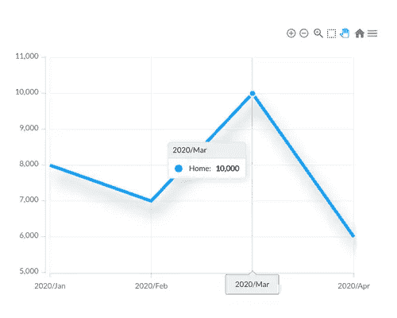

当'部门编号' = 1 时，销售金额的简单折线图

在这篇文章变得太长之前，我只想演示一些其他的可视化的可能性，比如多条形图和堆栈图。

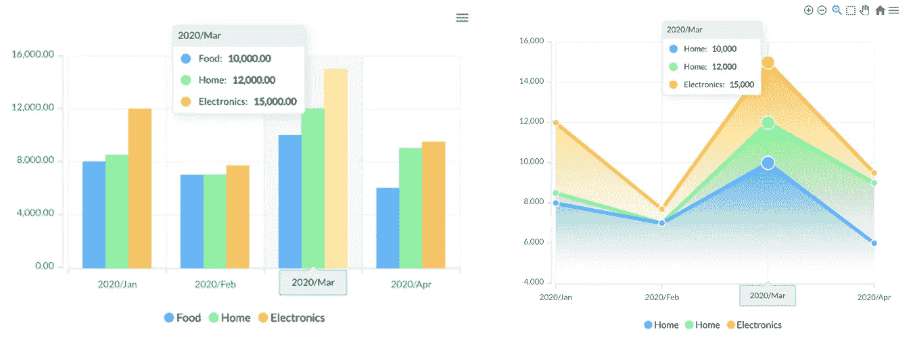

条形图与堆栈图

至于第二个查询，我选择显示所有订单中部门的比例。

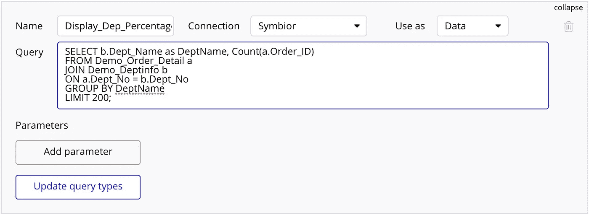

我建议用圆环图或饼图来展示这些数据。

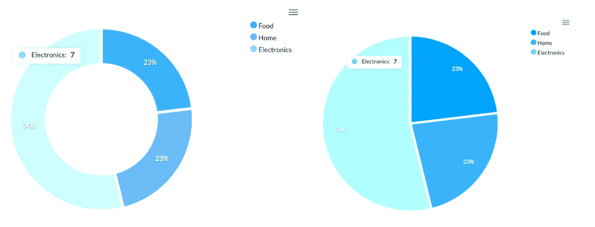

甜甜圈 vs 馅饼

在这个插件中你仍然可以做很多事情，比如改变颜色、大小、字体等等。我认为这个插件是一个不错的选择，可以在 bubble.io 基础设施下实现数据可视化，而不是花一大笔钱从 Tableau 或 PowerBI 购买许可证。(但是如果你预算充足💰，那就另当别论了……)

无论如何，我会回来分享更多关于如何最大限度地利用 bubble.io 的内容。😝

谢谢大家！