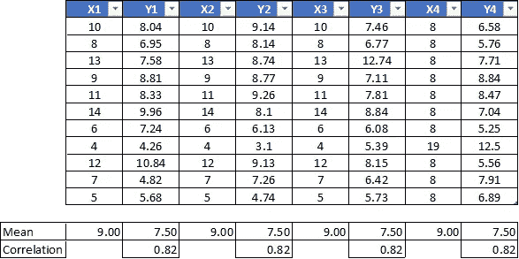
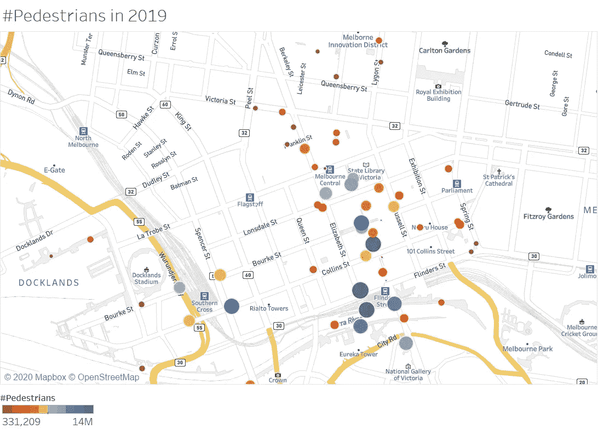
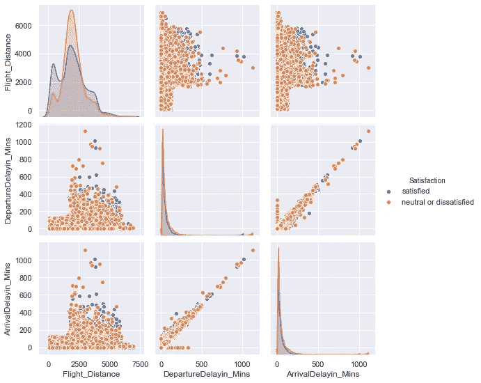
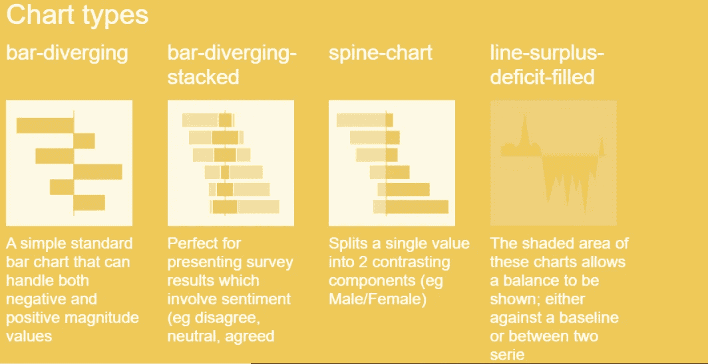
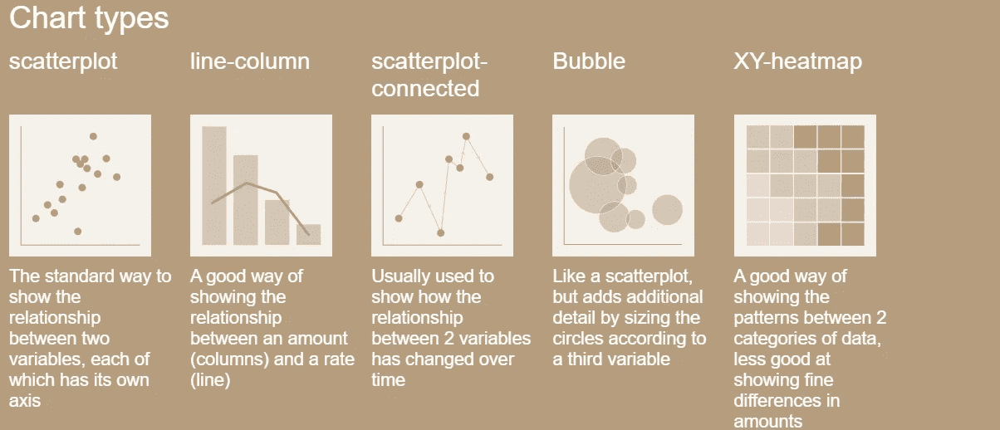
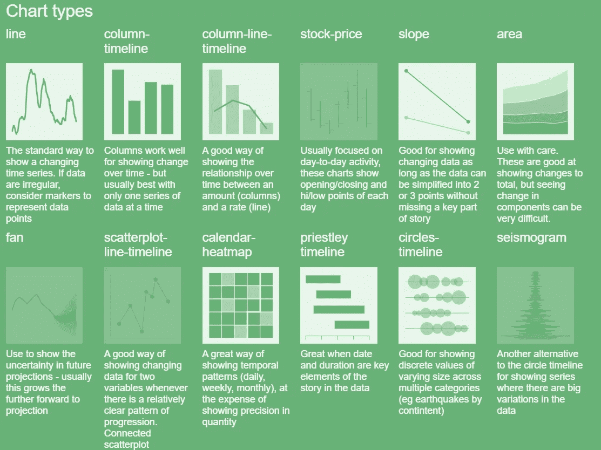
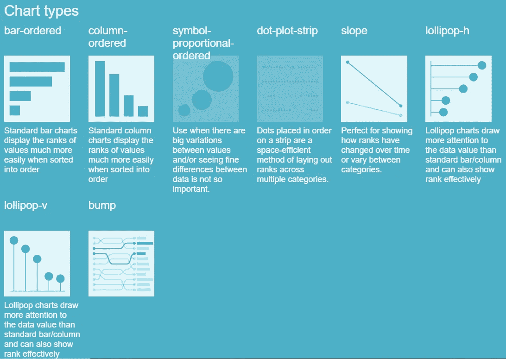
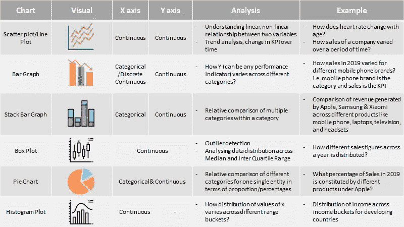
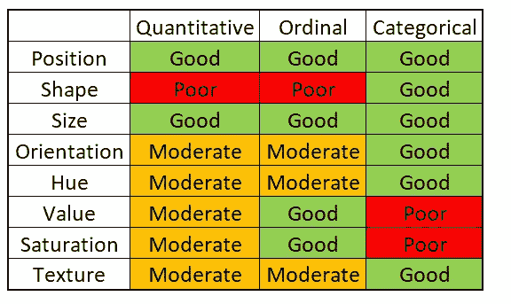

# 数据科学中的数据可视化

> 原文：<https://towardsdatascience.com/data-visualization-in-data-science-5681cbdde5bf?source=collection_archive---------8----------------------->

## 解决分析问题时如何有效地使用图表

[粘土银行](https://unsplash.com/@claybanks?utm_source=medium&utm_medium=referral)在 [Unsplash](https://unsplash.com?utm_source=medium&utm_medium=referral) 拍摄的照片

# 数据可视化简介

数据可视化是创建交互式视觉效果以了解趋势、变化并从数据中获得有意义的见解的过程。数据可视化主要用于数据检查和清理、探索和发现，以及向业务涉众传达结果。大多数数据科学家很少关注图表，只关注数字计算，这有时会产生误导。为了理解可视化的重要性，让我们看看下面图 1 和图 2 中 Anscombe 的数据四重奏。

图一。Anscombe 的数据四重奏显示了一对 X 和 Y 可以具有不同的值，但却具有不同的中心趋势和相关值。数据来源——弗朗西斯·j·安斯科姆(1973 年)

当使用下图 2 中的可视化表示时，相同的数据点描绘了完全不同的趋势。

图二。展示了使用简单汇总统计数据检查时，四个相同的数据集看起来相似，但绘制成图表时差异很大。图像鸣谢——弗朗西斯·j·安斯科姆(1973)

在进行任何计算之前，将数据可视化是很重要的。与描述性统计相比，可视化表示可以传达更多的信息。

# 数据可视化的作用

多种商业智能工具(BI)目前统治着市场，各有利弊。自助式仪表盘的概念旨在让对数据科学知之甚少或一无所知的利益相关者独立处理数据，并得出一些可能有助于其日常业务决策的发现。在下面的例子中，我们将看看使用 Tableau 或 Python 的数据可视化的一些应用。

## 数据检查和清理

数据可视化可用于查找数据集中的明显错误，包括空值、随机值、不同记录、日期格式、空间数据的敏感性以及字符串和字符编码。

图 3。展示了位于中央商务区及其周围的不同传感器捕捉到的墨尔本行人流量的分布。其思想是分析纬度和经度信息对于给定的数据集是否有效。该图像是作者使用 Tableau 开发的。

## 数据分布

数据可视化可用于了解数据的分布，寻找集中趋势(平均值、中值和众数)，使用箱线图了解异常值的存在，检查偏斜度，以及了解 winsorization 对数据分布的影响。下面的图 4 说明了如何开发箱线图来了解异常值的存在。

图 4。显示安装在墨尔本不同地区的不同传感器的异常值(行人流量中的异常值)。用于此分析的数据集可在此处找到。该图像是作者使用 Jupyter 笔记本开发的。

## **模型假设**

线性回归和其他分类模型遵循某些基本假设，如数据必须呈正态分布、不同自变量之间不应存在相关性、误差项的同方差性等等。因此，可视化也是验证这些假设的关键。

图 5。使用热图说明数字变量的相关图。关联图用于删除高度相关的变量，同时构建分类模型，以使用航班和设施数据预测客户满意度。该图像是作者使用 Jupyter 笔记本开发的。

## 人在回路分析

数据科学家通常使用人在循环分析来获得数据的外观和感觉，做出假设，运行适当的分析来验证假设，并重复该过程，直到确定确凿的证据。例如，在 Python 中，一个非常流行的包 Seaborn 有一个叫做 pair plot 的函数。配对图在确定因变量和自变量之间的关系时非常有用。可视化的想法是更好地理解一些独立变量是否影响模型结果的方向感。

图 6。说明了因变量(比如航空公司乘客的客户满意度)与独立变量(如飞行距离、到达延迟和出发延迟)的配对图表示。该图像是作者使用 Jupyter 笔记本开发的。

## 降维

在处理多个变量时，很难在 n 维空间中可视化数据。例如，在具有不同客户属性(比如数字)的数据集中，很难考虑所有属性来绘制客户。在这种情况下，主成分分析(PCA)或因子分析等降维技术有助于将属性降维。主成分分析找出能最好地解释观察结果的变量的线性组合，而因子分析找出能最好地解释变量之间关系的变量的线性组合。然后，可以绘制降低的维度，以便在 2D 空间中分析客户。

关于如何用 Python 重新创建这些图表的更多信息可以在这里找到。

 [## 数据可视化:用 Python 中的图表说出来

### 使用 matplotlib、pyplot 和…的 python 可视化最佳实践和概念的完整实践指南

towardsdatascience.com](/data-visualization-say-it-with-charts-in-python-138c77973a56) 

# 分析问题中的数据集类型

了解数据集的类型对于确定可以应用的可视化类型非常重要。例如，当处理表格数据时，与空间数据相比，条形图和折线图的组合可能会很有用，在空间数据中，带有密度图的地图可能会有效地传达结果。在我们深入了解可视化的类型之前，让我们先了解一些常用的关键数据类型。

## 表列数据

以表格形式组织的数据，每个数据项占一行，每个属性占一列。例如，Excel 格式的数据集、CSV 文件、Pandas 数据框等。

## 网络数据

网络中的节点是数据项，节点之间的链接是关系。例如社交网络。

## 空间数据:

根据其空间位置或范围自然组织和理解的数据。例如位置的纬度和经度、地理信息、郊区、街道等。

## 文本数据:

这种数据集由单词和标点符号序列组成。例如 twitter feed 或客户投诉。

# 视觉词汇

下图展示了如何使用不同的可视化来描述数据中的不同场景。

图 7。展示了一些有助于可视化趋势与参考点偏差的图表。图片致谢— Github.io

图 8。展示了一些有助于可视化多个数据点之间相关性的图表。图片致谢— Github.io

图 9。说明如何使用可视化来理解与时间相关的属性变化。图片致谢— Github.io

图 10。说明如何使用不同的可视化来理解不同组件的等级或顺序。图片致谢— Github.io

你可以在这里找到其他可视化的例子[。](https://ft-interactive.github.io/visual-vocabulary/)

# 跨数据类型的可视化效果

下表显示了不同数据类型的不同视觉效果。为了更好地理解这个表，我们需要更好地理解变量(来自数据的属性)是如何被分类到不同的数据类型中的。**分类变量**是没有任何顺序的变量，如性别、等级、婚姻状况、工作职位等。**数值变量**被分割成**序数变量**和**数量变量。序数变量**是可以排序的类别。例如满意度(好、差和一般)、潜力(高、中和低)等。**数量变量**是可以取-无穷大到+无穷大之间任何数值范围的变量。例如年龄、工资、收入、销售额等。

图 11。说明了在考虑变量的数据类型的情况下，如何使用不同的图形来可视化数据中的模式。图片致谢——由作者使用 PowerPoint 制作。

图 12。阐释了可用于不同数据类型的可视化类型。图片来源——由作者使用 Excel 开发。

# 结论

数据可视化是所有分析项目的基础。它不仅有助于深入了解数据，还可以用作数据预处理的工具。对于不同的数据类型和业务场景，拥有正确的可视化集合是有效交流结果的关键。

# 参考

1.  Github(未标明)。*视觉词汇*。[在线] ft-interactive.github.io .可在:[https://ft-interactive.github.io/visual-vocabulary/](https://ft-interactive.github.io/visual-vocabulary/)【2020 年 8 月 23 日访问】。
2.  ‌Anscombe，弗朗西斯 J. (1973)统计分析中的图表。美国统计学家，27 岁，17-21 岁。

*关于作者:高级分析专家和管理顾问，帮助公司通过对组织数据的商业、技术和数学的组合找到各种问题的解决方案。一个数据科学爱好者，在这里分享、学习、贡献；可以和我在* [*上联系*](https://www.linkedin.com/in/angel-das-9532bb12a/) *和* [*上推特*](https://twitter.com/dasangel07_andy)*；*