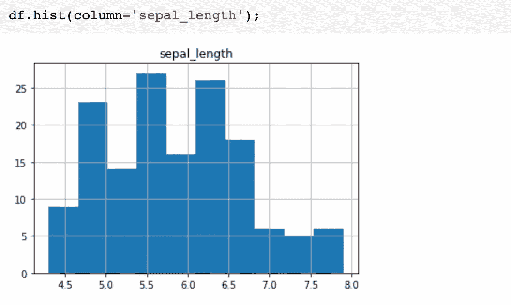

# 熊猫中的数据可视化

> 原文：<https://towardsdatascience.com/data-visualization-in-pandas-2a7898e65114?source=collection_archive---------47----------------------->

## 仅使用熊猫进行快速数据可视化


由 [Max Duzij](https://unsplash.com/@max_duz?utm_source=medium&utm_medium=referral) 在 [Unsplash](https://unsplash.com?utm_source=medium&utm_medium=referral) 上拍摄的照片

# 介绍

在本文中，我将演示如何只用熊猫来可视化数据。它不像 Matplotlib 或 Seaborn 那样灵活，但对于快速数据探索来说非常方便。

首先，让我们以导入 pandas 和加载 Iris 数据集为例。

```
import pandas as pdimport seaborn
df=seaborn.load_dataset('iris')
```

检查数据帧


它包含 4 个数字列和一个分类列。

## 线形图

让我们从简单的线条图开始。


它用不同的颜色绘制数字列。这里的 x 轴是索引。您也可以自定义绘图，例如，如果您只想查看 sepal_length 和 sepal_width，您可以这样做:


您也可以更改轴。例如，绘制 sepal_length 与 petal_length 的关系(这里使用线图没有意义)


## 散点图

显示萼片长度和花瓣长度之间关系的合适的图应该是散点图。


您可以通过替换 x 和 y 来绘制不同的列。

检查所有数字列相关性的一个技巧是绘制散点图矩阵。您可以通过以下方式做到这一点:


它显示了不同列相对于其他列的散点图矩阵和列的直方图。

## **直方图**

直方图是查看数据分布的有用图表，在 Pandas 中，您可以使用`hist()`快速绘制它


它显示了数值变量的直方图。您也可以绘制所需的列。



## 箱形图

观察数据分布的另一个有用的图是箱线图。你可以使用`df.plot.box()`简单地绘制它


## 条形图

你可能还想比较不同的物种，你可以通过组合熊猫`groupby()`和`plot.bar()`来做到这一点


它显示了各列相对于物种的`mean`值。

## 圆形分格统计图表

也可以绘制条形图。简单的叫`plot.pie()`。


请注意，熊猫中的`plot()`函数是建立在 matplotlib 之上的，所以你可以随时使用 Matplotlib 来修改剧情。

例如，您可以更改图例的位置并隐藏 ylabel。


就是这样。Pandas 中的这些绘图技术可能不像 matplotlib 或 seaborn 那样灵活和易于生成报告，但它们在早期数据探索中仍然非常方便。

感谢阅读。

你可以看看我其他关于熊猫，Numpy，Python 的文章。

[](/10-pandas-tricks-to-make-my-data-analyzing-process-more-efficient-part-2-b72ea43a0bb5) [## 让我的数据分析过程更高效的 10 个熊猫窍门:第二部分

### 我希望我早点知道的技巧

towardsdatascience.com](/10-pandas-tricks-to-make-my-data-analyzing-process-more-efficient-part-2-b72ea43a0bb5) [](/10-pandas-tricks-to-make-my-data-analyzing-process-more-efficient-part-1-78a0cc1636f3) [## 让我的数据分析过程更高效的 10 个熊猫窍门:第 1 部分

### 我希望我早点知道的技巧

towardsdatascience.com](/10-pandas-tricks-to-make-my-data-analyzing-process-more-efficient-part-1-78a0cc1636f3) [](/7-numpy-tricks-to-make-my-code-better-and-smarter-9e8a4ccf43d1) [## 让我的代码更好更聪明的 7 个小技巧

### 我希望我早点知道的技巧

towardsdatascience.com](/7-numpy-tricks-to-make-my-code-better-and-smarter-9e8a4ccf43d1) [](/7-python-tricks-to-make-my-code-better-and-smarter-60dfde0b6c49) [## 让我的代码更好更聪明的 7 个 Python 技巧。

### 我希望我能早点知道的技巧。

towardsdatascience.com](/7-python-tricks-to-make-my-code-better-and-smarter-60dfde0b6c49)